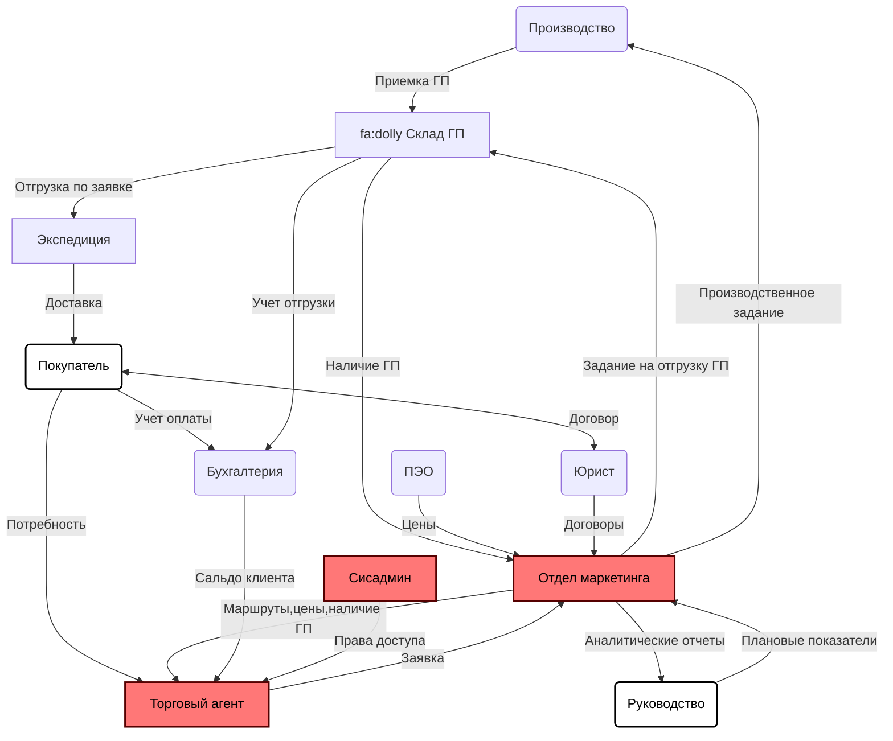

Комплексная система **GDMN: Торговый агент** предназначена для увеличения продаж предприятия за счет оптимизации работы торговых агентов и состоит из следующих модулей:

1. Мобильного приложения для торгового агента (Android, iOS)
2. Веб-приложения для администрирования учетных записей и устройств 
3. Веб-приложения для получения аналитических отчетов, администрирования справочников и настроек системы
4. Облачного сервера для обмена данными между мобильными устройствами и базой данных предприятия

**GDMN: Торговый агент** интегрируется с различными учетными и ERP системами предприятия (например, [Гедымин](https://gsbelarus.com/pw/#solutions), SAP, 1C).

Схематически, взаимодействие системы **GDMN: Торговый агент** с модулями информационной системы предприятия выглядит следующим образом:

