# Инструкция для мобильного приложения Trade-agents

## 1. Подключение

После выполнения установки приложения необходимо на рабочем столе кликнуть по иконке:

​

В стартовом экране есть возможность выбрать режим подключения.

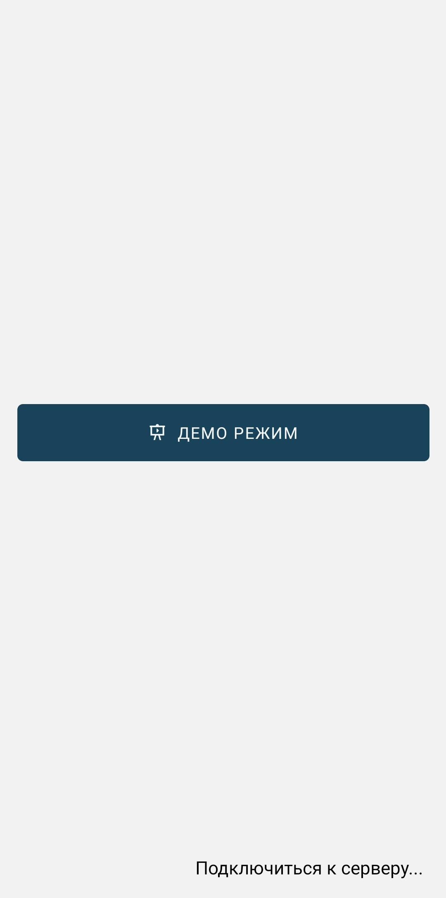

При нажатии на кнопку **Подключиться в демо режиме** выполняется автоматический вход в приложение с предварительно загруженными данными пользователя и устройства.

Загрузка данных и работа в приложении пояснена далее в пунктах 1.2 - 1.5.

Выйти из демо режима можно двуия способами.

Первый способ - закрытие приложения. После нового открытия приложения стартовый экран не изменится.

Во втором способе необходимо открыть боковую панель нажатием на иконку меню, находящуюся в верхнем углу слева, либо же сделать свайп вправо. Затем перейти на экран **Профиль** и нажать на кнопку **Выйти из демо режима**.

По нажатию на **Подключиться к серверу** переходим на экран подключения к серверу. После этого стартовый экран изменится на **Подключиться к серверу**, и войти в демо режим можно будет из настроек подключения.

В правом нижнем углу находится иконка, по нажатию на которую можно перейти на экран **Настройка подключения**.

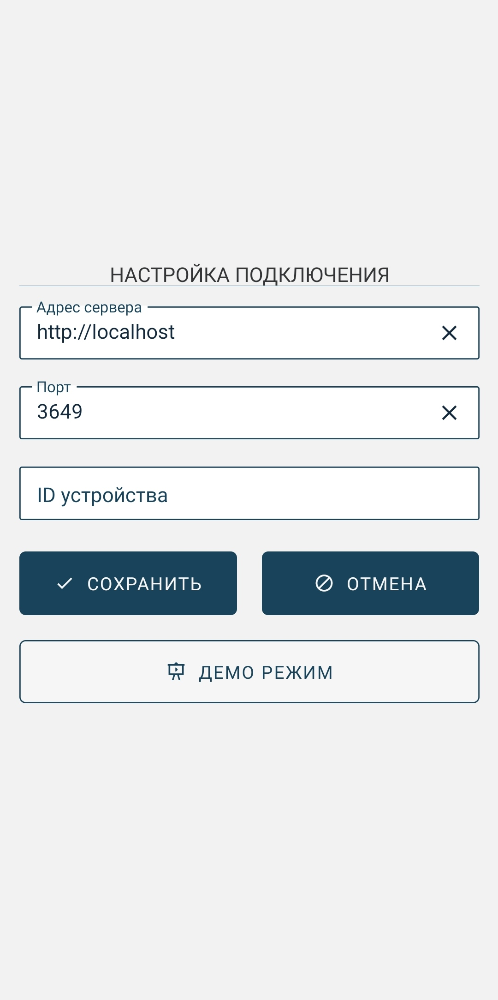

Если поля **Адрес сервера** и **Порт** являются пустыми, их необходимо заполнить. Поле **ID устройства** будет заполнено автоматически после активации кода. Также данный экран позволяет повторно подключиться в демо режиме.

Вернемся в предыдущий экран и нажмем кнопку **Подключиться**.

Если подключение прошло успешно, то появляется экран **Активация устройства**, предназначенный для ввода кода активации (при повторном запуске в будет происходить автоматический вход в учетную запись пользователя). Здесь нужно ввести код, ранее полученный в web-admin, и нажать **Отправить**. По нажатию на иконку в правом нижнем углу можно перейти в предыдущий экран.

 

Если активация устройства прошла успешно, появляется экран для входа пользователя. В соответствующие поля необходимо ввести **Имя пользователя** и **Пароль** и нажать на кнопку **Войти**. По нажатию на иконку в правом нижнем углу можно перейти в предыдущий экран.

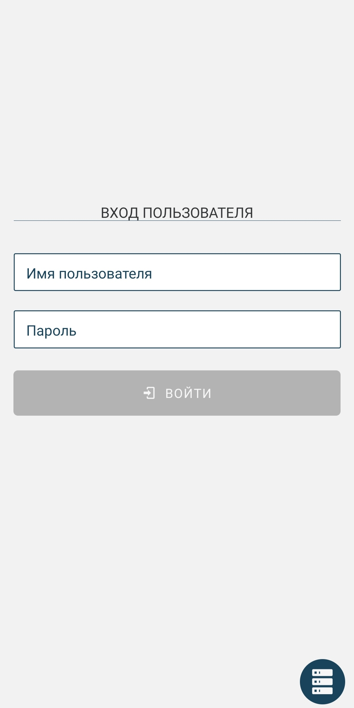 

При успешном выполнении входа попадаем на главный экран -- **Маршруты**.

Так как это первый вход, данные не загружены. Необходимо загрузить данные - справочники и маршруты. Для этого необходимо нажать на иконку вызова меню **≡**, находящуюся в верхнем углу слева:

Далее нажать на иконку загрузки данных слева в нижнем углу меню:

​

После загрузки данных в разделе **Справочники** отобразятся все актуальные справочники, а в экране **Маршруты** появятся маршруты для текущего пользователя. В разделе **Карты** можно просмотреть информацию по текущему маршруту на карте или списком.

На экранах **Маршруты**, **Заявки**, **Возвраты** есть 3 вида документов.

| Виды документов | Описание                                                                                                                                                                    |
| --------------- | --------------------------------------------------------------------------------------------------------------------------------------------------------------------------- |
| Активные        | Данные документы являются необработанными, либо же обработанными, но не синхронизированными с Гедымином.                                                                    |
| Архив           | Данные документы являются обработанными и отправленными в Гедымин, на них получено обратное сообщение о синхронизации. Не подлежат редактированию, возможен только просмотр |
| Все             | Активные документы и документы из архива                                                                                                                                    |

## 2. Справочники

Для начала рассмотрим экран **Справочники**, чтобы посмотреть имеющиеся данные. Для этого перейдем в соответствующий пункт бокового меню.

Экран **Справочники** содержит информацию о справочниках устройства.

При нажатии на иконку поиска в правом верхнем углу появляется окно для поиска.

При нажатии на конкретный справочник переходим на экран просмотра.

По нажатию на товар можно перейти в окно просмотра позиций.

Рассмотрим еще один справочник.

 

## 3. Заявки

Перейдем на экран заявок.

По нажатию на иконку **+** в верхнем правом углу переходим в окно добавления заявки. Каждое поле является обязательным для заполнения.

При выборе **Организации** и **Магазина** попадаем в экран выбора организаций и магазина. Поле **Магазин** следует заполнять только после выбора организации. Поле **Склад магазин** при наличии настроек пользователя заполняется автоматически (данные настройки будут рассмотрены в экране **Профиль**). Если данное поле не заполнено, следует выбрать необходимый склад.

  

Для добавления заявки необходимо нажать на иконку **✓** в правом верхнем углу.

После добавления сразу попадаем в экран просмотра заявки. По нажатию на кнопку меню, расположенную в правом верхнем углу становятся доступны следующие функции: **Добавить товар**, **Редактировать данные**, **Удалить заявку**. Добавить товар также можно по иконке **+**. Редактировать данные заявки можно нажав на саму заявку, доступную для редактирования (розовый или зеленый цвет).

 

У каждой заявки (и далее у возвратов) есть свой цвет иконки или боковой полосы, который отображает состояние заявки. При смене состояния заявки меняется и цвет.

| Цвет    | Описание состояния                         |
| ------- | ------------------------------------------ |
| Розовый | Заявка существует                          |
| Зеленый | Заявка обрабатывается                      |
| Желтый  | Заявка отправлена, ожидается подтверждение |
| Синий   | Заявка архивирована                        |

В заявку есть возможность добавить товар.

По нажатию на иконку **+** в верхнем правом углу переходим в экран добавления товаров. На экране отображены **Группы ТМЦ**.

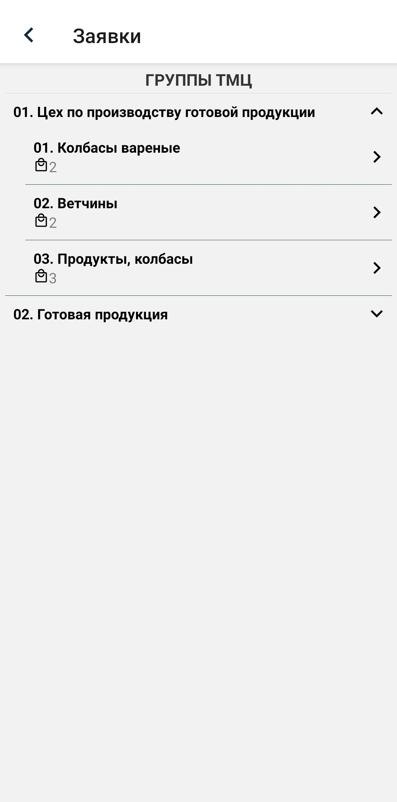 

По выбору нужной категории переходим в **Товары**, нажимаем на необходимый товар и попадаем на экран с позициями. **Наименование** и **Цена** заполнены автоматически и изменению не подлежат. **Количество мест** обязательно для заполнения, **Упаковка** заполняется только при наличии предложенных вариантов.

  

Добавим еще один товар.

  

Вернемся на экран просмотра заявки.

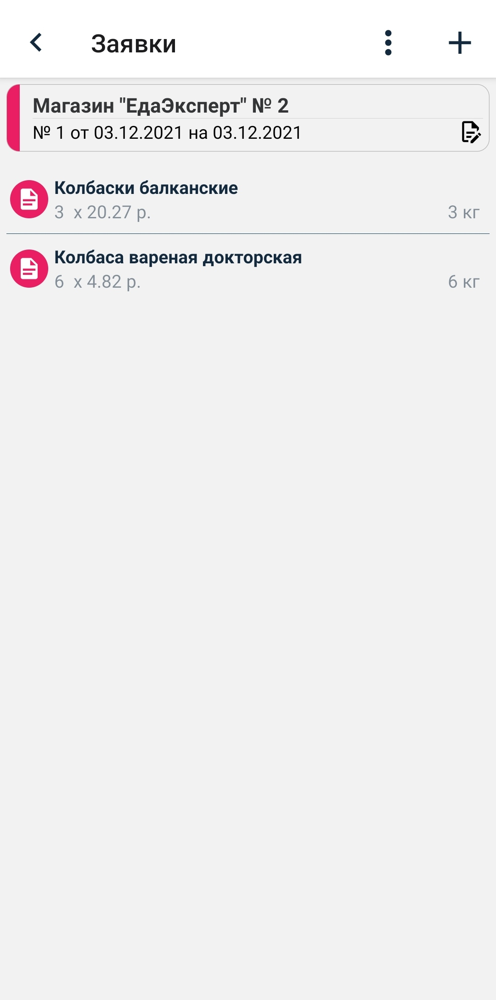

По умолчанию у заявки статус **Черновик**. Изменить статус можно в экране редактирования. Для этого нужно нажать на заявку, перетянуть \_\_ и сохранить заявку. При изменении статуса завка переходит в состояние **Обрабатывается**, цвет становится зеленым.

 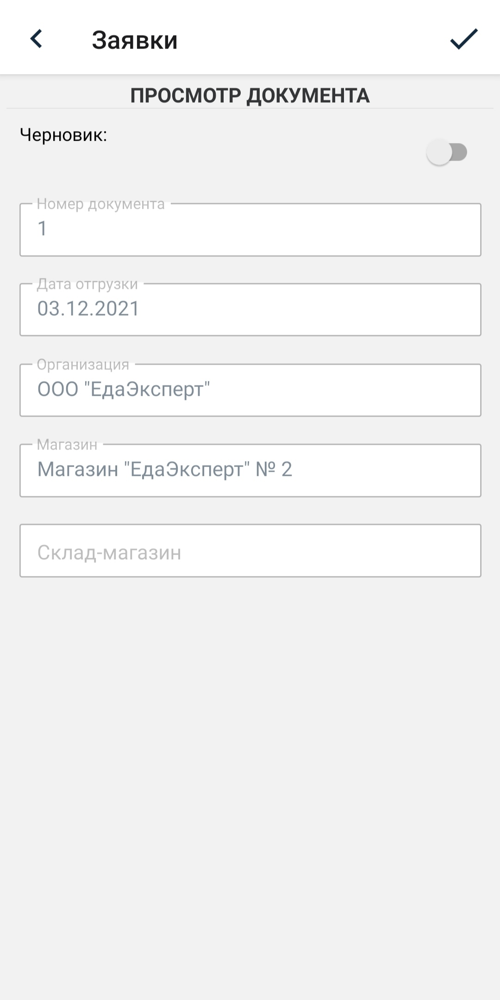 

Пока заявка не отправлена, она доступна для редактирования. Для этого нужно зайти в нее и временно вернуть статус **Черновик**. После отправления заявки редактирование невозможно, цвет становится желтым.

Вернемся на экран просмотра всех заявок.

Для отправления заявки необходимо нажать на кнопку синхронизации, расположенную в боковом меню.

При получении подтверждения заявка переходит в архив, цвет становится синим. При наличии ошибки в заявке появится надпись **Отказано** и вид ошибки.

Если смахнуть заявку влево, то появится меню в дополнительными иконками.

Данное меню позволяет редактировать заявку (если она является доступной для редактирования), копировать заявку и удалить.

## 4. Возвраты

Перейдем на экран возвратов.

По нажатию на иконку **+** в верхнем правом углу переходим в окно добавления возврата. Каждое поле является обязательным для заполнения.

При выборе **Организации** и **Магазина** попадаем в экран выбора организаций и магазина. Поле **Магазин** следует заполнять только после выбора организации.

 

Для добавления заявки необходимо нажать на иконку **✓** в правом верхнем углу.

После добавления сразу попадаем в экран просмотра возврата. По нажатию на кнопку меню, расположенную в правом верхнем углу становятся доступны следующие функции: **Добавить товар из накладной**, **Редактировать данные**, **Удалить возврат**. Редактировать данные возврата можно нажав на сам возврат, доступный для редактирования (полоса розового или зеленого цвета), открывается экран редактирования.

 

В отличии от заявок, в возврат есть возможность добавить товар только из накладной.

По нажатию на иконку **+** в верхнем правом углу переходим в экран поиска товаров из накладной. Указываем даты начала и окончания, и выбираем нужный товар.

 

После завершения поиска отобразится список накладных.

Если накладные не были найдены, на экран выведется надпись **Накладные не найдены**.

Если произошла ошибка подключения к серверу с данными, в нижней части экрана отобразится ошибка.

​

Заходим в нужную накладную и попадаем на экран со списком позиций. Для редактирования доступно поле **Количество**. Нельзя укзатаь количество, больше чем из накладной. Указываем нужное количество и добавляем.

  

После добавления попадаем в экран просмотра накладной.

По умолчанию у возврата статус **Черновик**. Изменить статус можно в экране редактирования. Для этого нужно нажать на возврат. При изменении статуса возврат переходит в состояние **Обрабатывается**, цвет полосы становится зеленым.

  

Пока возврат не отправлен, он доступен для редактирования. Для этого нужно зайти в него и временно вернуть статус **Черновик**. После отправления возврата редактирование невозможно, цвет полосы становится желтым.

Вернемся на экран просмотра всех заявок.

Для отправления заявки необходимо нажать на кнопку синхронизации, расположенную в боковом меню.

При получении подтверждения возврат переходит в архив, цвет полосы становится синим. При наличии ошибки в возврате появится надпись **Отказано** и вид ошибки.

Если смахнуть возврат влево, то появится меню в дополнительными иконками.

Данное меню позволяет редактировать возврат (если он является доступным для редактирования), копировать возврат и удалить.

## 5. Маршруты

Перейдем на экран маршруты.

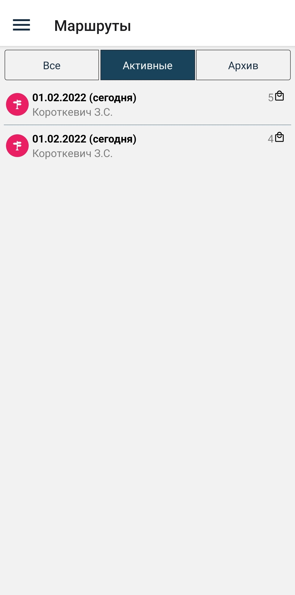

При выборе (нажатием на строку) необходимого маршрута откроется экран с торговыми точками, запланированными для посещения.

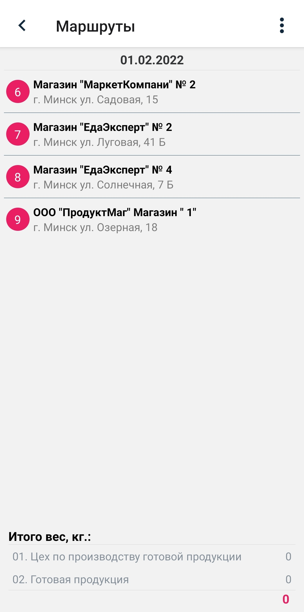

После нажатия на торговую точку откроется экран с визитом выбранного объекта.

Нажимаем на кнопку **Начать визит** (в этот момент один раз телефон попросит разрешение на получение геокоординаты, которая будет записана в визит данной точки).

Из экрана визита пользователь имеет возможность создать доступные в визите документы - заявку и возврат). Для создания заявки нажимаем на кнопку **Добавить документ** и выбираем тип документа **Заявка**.

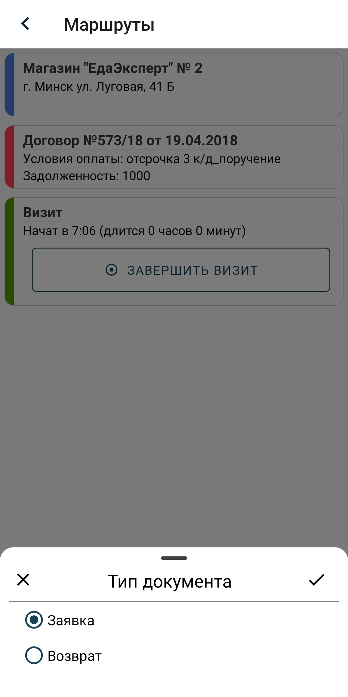

После выбора добавления заявки откроется экран с информацией об объекте и списком товаров (если уже были добавлены). Нажав на информацию о точке можно изменить доступное поле - дата отгрузки заявки.

 

Добавим товар.

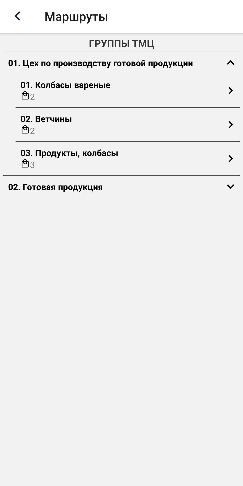  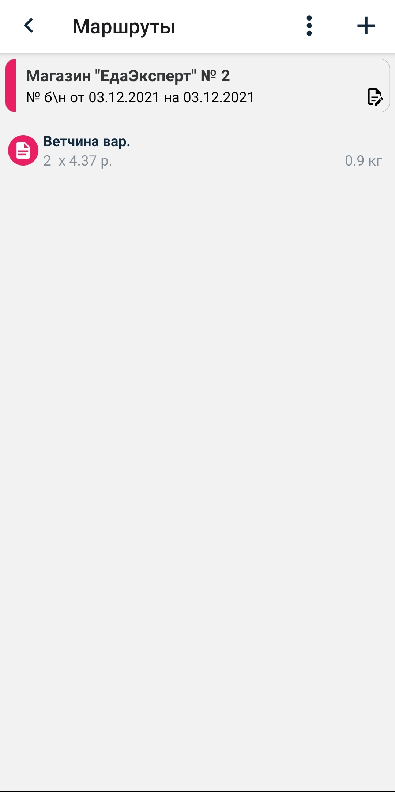

Аналогично создаем документ возврата. Для создания нажимаем на кнопку **Добавить документ** и выбираем тип документа **Возврат**.

После выбора добавления возврата откроется экран с информацией об объекте и списком товаров из накладных (если уже были добавлены). Нажав на информацию о точке можно зайти в окно просмотра документа возврата, изменение документ не подлежит.

 

Добавим товар из накладной.

 

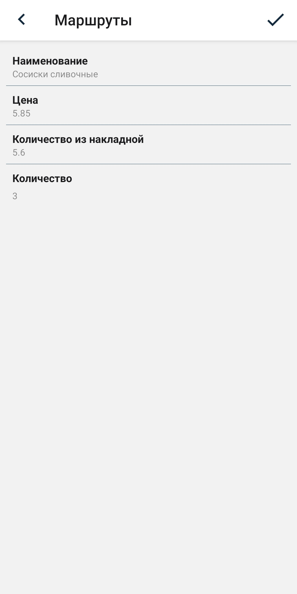 

После создания необходимых документов завершаем визит нажатием на кнопку **Завершить визит**.

 

Отправим данные визита нажатием на кнопку **Отправить**.

Данный визит в списке всех визитов отобразится как завершенный (кружок с галочкой). Активный визит обозначается кружком с треугольником.

Заявки и возвраты из визитов отображаются в окнах **Заявки** и **Возвраты**.

 

## 6. Карта

На экране **Карта** представлены две вкладки, содержащие информацию по выбранному маршруту.

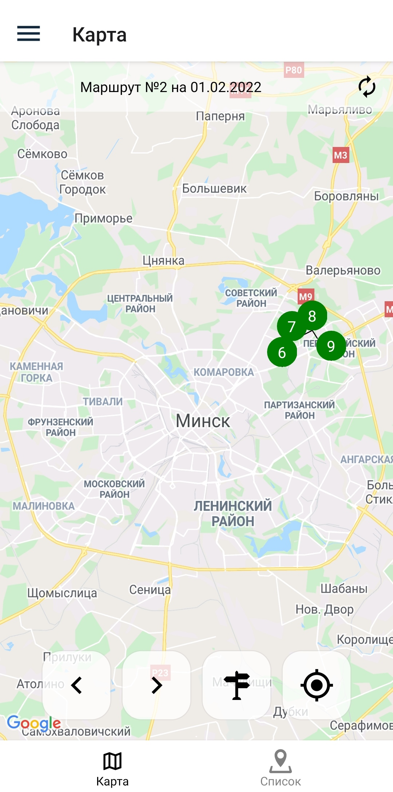 

Во кладке **Список** показаны все точки маршрута в виде списка.

Во кладке **Карта** полностью отображены все точки маршрута на карте. Кнопками < и > можно приближаясь к точкам перемещаться между объектами. Так же кнопками можно получить свою текущую координату и отобразить все объекты на экране.

В верхней части экрана указано название маршрута, который в данный момент отображается на карте. Для смены маршрута необходимо нажать на название, после чего в нижней части экрана появится окно с выбором маршрута. Выберем второй маршрут.

 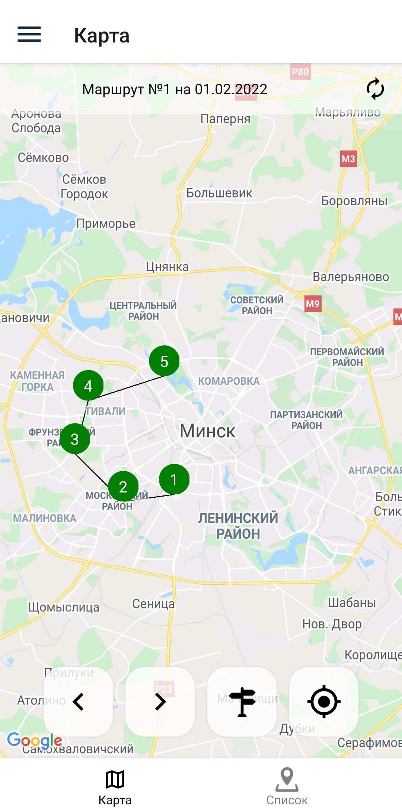

При нажатии на точку маршрута изменится цвет данной точки, появится название возле точки и в верхней части экрана. Также во вкладке **Список** отбразится, что данная точка выбрана.

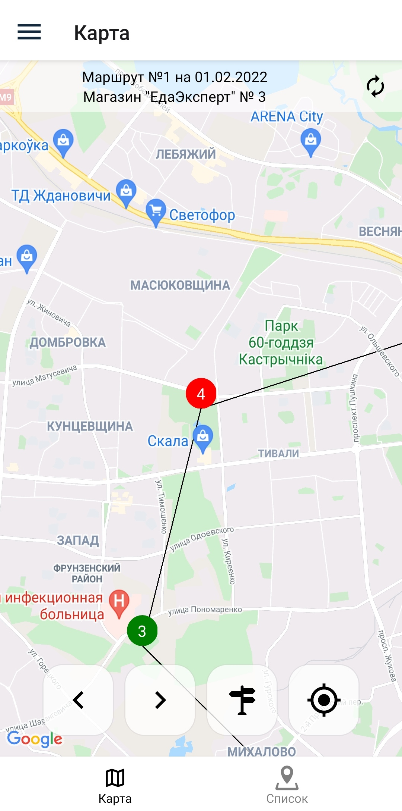 

Выберем во вкладке **Список** другую точку и посмотрим ее отображение на карте.

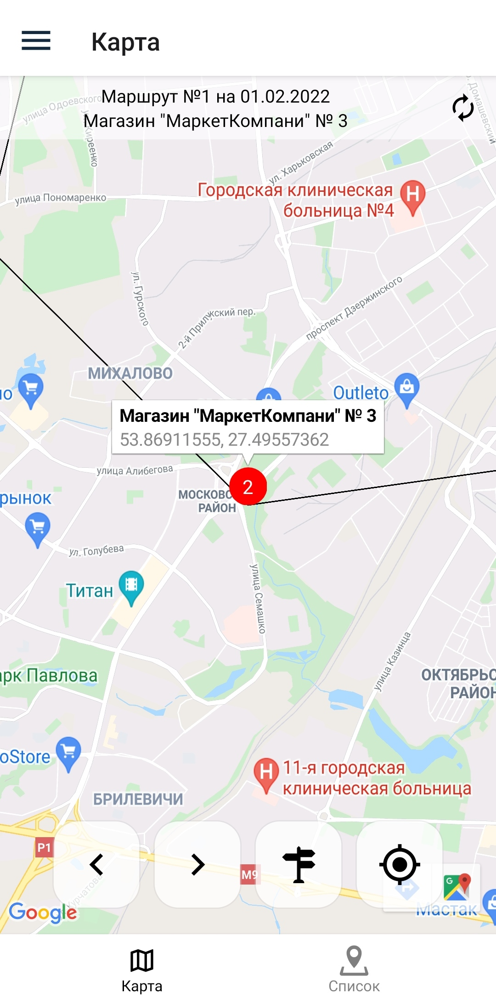 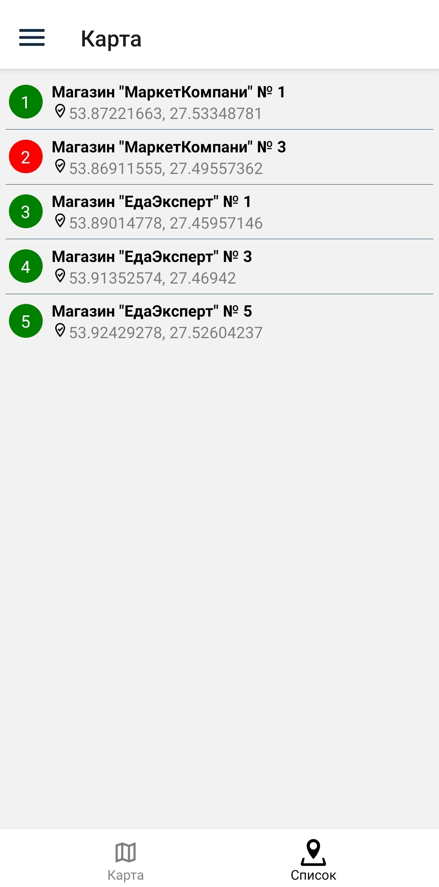

## 7. Настройки

Экран **Настройки** содержит информацию о настройках устройства: о параметрах связи с сервером и о настройках приложения. Настройки приложения доступны для изменения пользователем. По умолчанию в Настройках приложения есть следующие поля: **Перезаписывать справочники**, **Время хранения документов в архиве**. При наличии частных настроек добавляются поля **Использовать матрицы**, **Бэк-Офис. Адрес сервера**, **Бэк-Офис. Порт сервера**, **Время ожидания**, **Время поиска накладных возврата**. По нажатию на иконку меню, расположенную в правом верхнем углу, можно вернуться к начальным настройка, выбрав пункт **Установить настройки по умолчанию**.

  

## 8. Профиль

Экран **Профиль** содержит информацию о пользователе и об устройстве. Также здесь можно выйти из учетной записи пользователя. При наличии настроек пользователя, они также будут отображены в данном экране.

 

Если вход был произведен в демо режиме, кнопка **Сменить пользователя** меняется на **Выйти из демо режима**

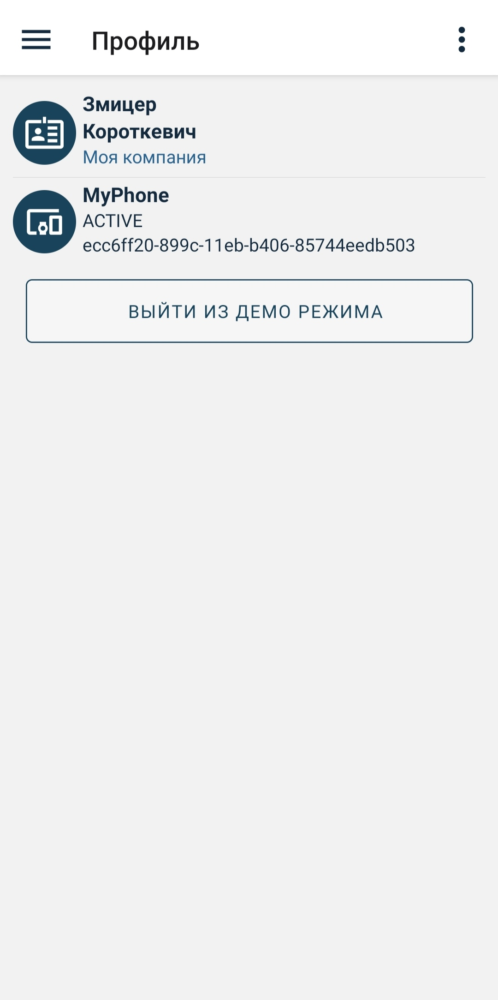

Также этот экран позволяет очистить данные пользователя. Для этого необходимо нажать на иконку меню, расположенную в правом верхнем углу, и выбрать пункт **Очистить данные**.

