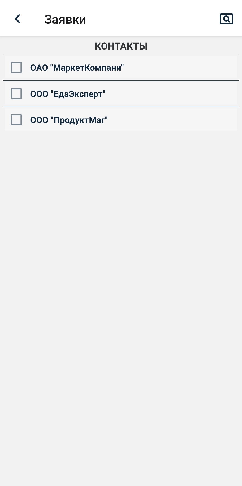
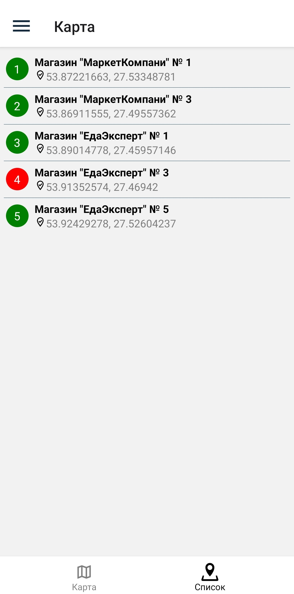

# Инструкция для мобильного приложения Trade-agents

## 1. Подключение

После выполнения установки приложения необходимо на рабочем столе кликнуть по иконке:

​

Стартовым экраном является **Подключение к серверу**.

По нажатию на иконку в правом нижнем углу перейдем на экран **Настройки подключения**.

Здесь можем посмотреть на настройки сервера и при необходимости сменить их.

Так как это первое поключение, то поле **ID устройства** является пустым. Далее после активации устройства оно будет заполнено автоматически.

Вернемся на экран подключения.

По нажатию на кнопку **Подключиться** попадаем на экран **Активация устройства** (при повторном запуске в рабочей версии программы будет происходить автоподключение). В поле **Введите под** вводим код активации, раннее полученный в модуле **Web-admin**, и нажимаем **Отправить**.

 

Если подключение прошло успешно, появится экран **Вход пользователя**. Здесь необходимо ввести **Имя пользователя** и **Пароль** и нажать на кнопку **Войти**.

 

При успешном выполнении входа попадаем на главный экран -- **Маршруты**.

Так как это первый вход, данные не загружены. Необходимо загрузить данные - справочники и маршруты. Для этого необходимо нажать на иконку вызова меню **≡**, находящуюся в верхнем углу слева:

Далее нажать на иконку загрузки данных слева в нижнем углу меню:

После загрузки данных в разделе **Справочники** отобразятся все актуальные справочники, а в экране **Маршруты** появятся маршруты для текущего пользователя. В разделе **Карты** можно просмотреть информацию по текущему маршруту на карте или списком.

На экранах **Маршруты**, **Заявки**, **Возвраты** есть 3 вида документов.

| Виды документов | Описание                                                                                                                                                                    |
| --------------- | --------------------------------------------------------------------------------------------------------------------------------------------------------------------------- |
| Активные        | Данные документы являются необработанными, либо же обработанными, но не синхронизированными с Гедемином.                                                                    |
| Архив           | Данные документы являются обработанными и отправленными в Гедемин, на них получено обратное сообщение о синхронизации. Не подлежат редактированию, возможен только просмотр |
| Все             | Активные документы и документы из архива                                                                                                                                    |

## 2. Справочники

Для начала рассмотрим экран **Справочники**, чтобы посмотреть имеющиеся данные. Для этого перейдем в соответствующий пункт бокового меню.

Экран **Справочники** содержит информацию о справочниках устройства.

При нажатии на иконку поиска в правом верхнем углу появляется окно для поиска.

При нажатии на конкретный справочник переходим на экран просмотра.

По нажатию на товар можно перейти в окно просмотра позиций.

Рассмотрим еще один справочник.

 

## 2. Маршруты

При выборе (нажатием на строку) необходимого маршрута откроется экран с торговыми точками, запланированными для посещения. Нажимаем на торговую точку - откроется экран с визитом выбранного объекта . Нажимаем на кнопку “Начать визит” (в этот момент один раз телефон попросит разрешение на получение геокоординаты, которая будет записана в визит данной точки):

Из экрана визита пользователь имеет возможность создать доступные в визите документы (на данный момент - заявку и возврат). Для создания заявки нажимаем на кнопку “Заявка”: Откроется экран информацией об объекте и списком товаров (если уже были добавлены). Нажав на информацию о точке можно изменить доступные поля (на данный момент - дата отгрузки заявки).

Для добавления товарной позиции нажимаем на кнопку **плюс** (расположенной в верхнем правом углу экрана). Переходим в экран выбора группы. После выбора группы переходим к списку товаров по выбранной группе. А далее, после выбора товара, в экран позиции для ввода количества и упаковки:

После сохранения товарной позиции возвращаемся (автоматически) в экран заявки:

Аналогично создаем документ возврата, нажав из экрана визита на кнопку Возврат:

В экране добавления товаров как в документе заявки так и в возврате можно воспользоваться поиском, нажав на иконку с лупой в верхнем правом углу:

После создания необходимых документов завершаем визит нажатием на кнопку “Завершить визит”. Данный визит в списке всех визитов отобразится как завершенный (кружок с галочкой). Активный визит обозначается кружком с треугольником.

## 3. Заявки

По нажатию на иконку **+** в верхнем правом углу переходим в окно добавления заявки. Каждое поле является обязательным для заполнения.

При выборе **Организации** и **Магазина** попадаем в экран выбора организаций и магазина. Поле **Магазин** следует заполнять только после выбора организации.

 

Поле **Склад магазин** при наличии настроек пользователя заполняется автоматически (данные настройки будут рассмотрены в экране **Профиль**).

Для добавления необходимо нажать на иконку **✓** в правом верхнем углу.

После добавления сразу попадаем в экран просмотра заявки. Здесь доступны следующие функции: **Добавить товар**, **Редактировать данные**, **Удалить заявку**.

У каждой заявки (и далее у возвратов) есть свой цвет иконки или боковой полосы, который отображает состояние заявки. При смене состояния заявки меняется и цвет.

| Цвет    | Описание состояния                         |
| ------- | ------------------------------------------ |
| Розовый | Заявка существует                          |
| Зеленый | Заявка обрабатывается                      |
| Желтый  | Заявка отправлена, ожидается подтверждение |
| Синий   | Заявка архивирована                        |

При нажатии на заявку, доступную для редактирования (розовый или зеленый цвет), открывается экран редактирования.

В заявку есть возможность добавить товар.

По нажатию на иконку **+** в верхнем правом углу переходим в экран добавления товаров. На экране отображены **Группы ТМЦ**. По выбору нужной категории переходим в **Товары**, нажимаем на необходимый товар и попадаем на экран с позициями. **Наименование** и **Цена** заполнены автоматически и изменению не подлежат. **Количество мест** обязательно для заполнения, **Упаковка** заполняется только при наличии предложенных вариантов.

По умолчанию у заявки статус **Черновик**. Изменить статус можно в экране редактирования. Для этого нужно нажать на заявку. При изменении статуса завка переходит в состояние **Обрабатывается**, цвет становится зеленым. Пока заявка не отправлена, она доступна для редактирования. Для этого нужно зайти в нее и временно вернуть статус **Черновик**. После отправления заявки редактирование невозможно, цвет становится зеленым.

Для отправления заявки необходимо нажать на кнопку синхронизации, расположенную в боковом меню.

При получении подтверждения заявка переходит в архив, цвет становится синим. При наличии ошибки в заявке появится надпись **Отказано** и вид ошибки.

## 4. Возвраты

По нажатию на иконку **+** в верхнем правом углу переходим в окно добавления возврата. Каждое поле является обязательным для заполнения. Для добавления необходимо нажать на иконку **✓** в правом верхнем углу.

После добавления сразу попадаем в окно просмотра возврата. Здесь доступны следующие функции: **Добавить товар из накладной**, **Редактировать данные**, **Удалить заявку**.

При нажатии на возврат, доступный для редактирования (полоса розового или зеленого цвета), открывается экран редактирования.

В отличии от заявок, в возврат есть возможность добавить товар только из накладной.

По нажатию на иконку **+** в верхнем правом углу переходим в экран поиска товаров из накладной. Указываем даты начала и окончания, и выбираем нружный товар.
 

После завершения поиска отобразится список накладных. Заходим в нужную и попадаем на экран со списком позиций. Для редактирования доступно поле **Количество**. Указываем нужное количество и добавляем.

 

По умолчанию у возврата статус **Черновик**. Изменить статус можно в экране редактирования. Для этого нужно нажать на возврат. При изменении статуса возврат переходит в состояние **Обрабатывается**, цвет полосы становится зеленым. Пока возврат не отправлен, он доступен для редактирования. Для этого нужно зайти в него и временно вернуть статус **Черновик**. После отправления возврата редактирование невозможно, цвет полосы становится зеленым.

При получении подтверждения возврат переходит в архив, цвет полосы становится синим. При наличии ошибки в возврате появится надпись **Отказано** и вид ошибки.

## 6. Карта

На экране **Карта** представлены две вкладки, содержащие информацию по выбранному маршруту.

 

Во кладке **Список** показаны все точки маршрута в виде списка.

Во кладке **Карта** полностью отображены все точки маршрута на карте. Кнопками < и > можно приближаясь к точкам перемещаться между объектами. Так же кнопками можно получить свою текущую координату и отобразить все объекты на экране.

В верхней части экрана указано название маршрута, который в данный момент отображается на карте. Для смены маршрута необходимо нажать на название, после чего в нижней части экрана появится окно с выбором маршрута. Выберем второй маршрут.

 

При нажатии на точку маршрута изменится цвет данной точки, появится название возле точки и в верхней части экрана. Также во вкладке **Список** отбразится, что данная точка выбрана.

 

Выберем во вкладке **Список** другую точку и посмотрим ее отображение на карте.

 

## 7. Настройки

Экран **Настройки** содержит информацию о настройках устройства: о параметрах связи с сервером и о настройках приложения. Настройки приложения доступны для изменения пользователем. По умолчанию в Настройках приложения есть следующие поля: **Перезаписывать справочники**, **Время хранения документов в архиве**. При наличии частных настроек добавляются поля **Адрес сервера**, **Порт**, **Время ожидания**, **Время поиска накладных возврата**.

 

## 8. Профиль

Экран **Профиль** содержит информацию о пользователе и об устройстве. Также здесь можно выйти из учетной записи пользователя.

