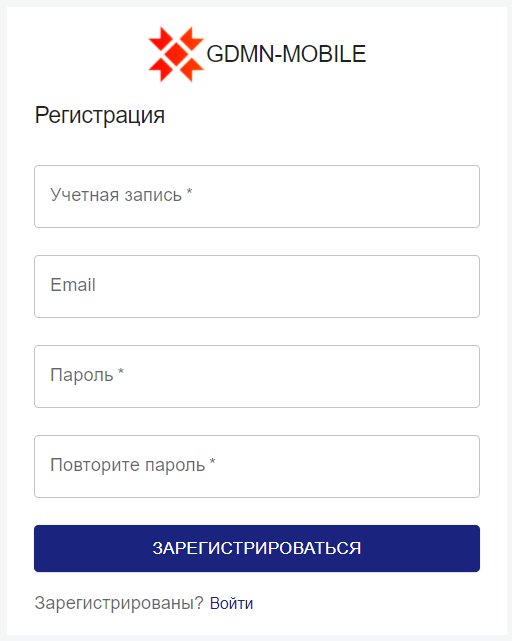
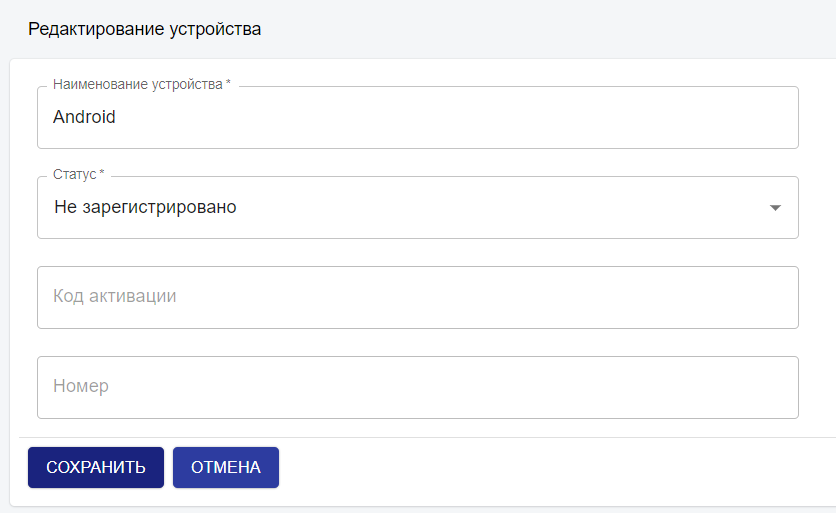

# Инструкция по системе web-admin

Система web-admin разработана для администрирования пользователей мобильных решений от компании “Амперсант”.

Первоначально для работы в системе web-admin необходимо создать **Суперадминистратора**. Эта учетная запись, которая имеет более высокие административные привилегии: создание/просмотр/редактирование/удаление всех пользователей, компаний и устройств.

Для управления пользователями определенной компании необходимо создать учетную запись для администратора. **Администратор** – пользователь, у которого есть полный доступ только к своей компании. Он может создать только одну компанию и выполнять все действия с пользователями и устройствами данной компании.

## 1. Регистрация пользователя

​

При первом подключении необходимо пройти регистрацию. Для этого необходимо нажать на ​.

По нажатию переходим в окно регистрации.

​

Для регистрации необходимо заполнить поля «Учетная запись» и «Пароль» и нажать на кнопку «Зарегистрироваться».

​

Так как это первая регистрация, то пользователь автоматически становится суперадминистратором.

Далее регистрируем администратора компании.

​

## 2. Вход в учетную запись

Для входа в систему администрирования вводим имя пользователя и пароль администратора.

​

После нажатия на кнопку «Войти» попадаем в главное окно.

​

В центральной части окна представлена информация о количестве компаний, пользователей и устройств.

​

### 2.1. Панель навигации

В верхней части окна расположена панель навигации.

​

В левом углу расположен логотип ​, по нажатию на который можно вернуться в главное окно из любого другого.
В правом углу расположены две кнопки: ​. По нажатию на первую кнопку можно посмотреть оповещения. Нажатие на вторую кнопку обеспечивает выход из учетной записи пользователя и возвращение в окно входа в учетную запись.

### 2.2. Боковая панель

В левой части окна расположена боковая панель.

​

По нажатию на кнопку ​ можно скрыть боковую панель.

При уменьшении окна браузера боковая панель автоматически скрывается. Открыть ее можно по кнопке , которая автоматически появится на панели навигации.

Каждый пункт данной панели ведет в одно из окон:

| Сводка   | является главным окном и содержит краткую информацию |
| Компании | содержит информацию о текущей компании (если вход был произведен администратором) или обо всех компаниях (если вход был произведен суперадминистратором) |
| Пользователи | содержит информацию о пользователях текущей компании (если вход был произведен администратором) или о пользователях всех компаниях (если вход был произведен суперадминистратором) |
| Устройства | содержит информацию о пользователях текущей компании (если вход был произведен администратором) или о пользователях всех компаниях (если вход был произведен суперадминистратором) |
| Профиль | содержит информацию о пользователе данной учетной записи |

## 3. Компании

Рассмотрим подробно каждый пункт бокового меню. Начнем с пункта «Компании»

В первую очередь администратору необходимо создать компанию, в которую будут входить пользователи мобильных устройств.

Так как компания еще не добавлена, таблица является пустой.

В правом верхнем углу расположены две кнопки, предназначенные для добавления и обновления информации.

При небольшом уменьшении окна браузера с кнопок исчезает текст и остаются только иконки . При уменьшении окна до маленького размера кнопки исчезают полностью, на их месте появляется иконка ​. При нажатии на нее появляются обе кнопки.

### 3.1. Добавление компании

Нажмем на кнопку «Добавить» для добавления компании.

Поле «Наименование компании» является обязательным для заполнения.

При нажатии на кнопку «Сохранить» данные сохраняются, и компания отображается в таблице.

При нажатии на кнопку «Отмена» происходит возврат в предыдущее окно без сохранения данных.

После сохранения попадаем в окно со списком компаний.

Теперь в таблице отображаются данные по компании Company – Наименование, Администратор, Дата создания и Дата редактирования.

При повторной попытке создания компании в левом нижнем углу отобразится сообщение об ошибке, так как у администратора может быть только одна компания.

В таблицах предусмотрена сортировка. Подробно она будет рассмотрена в окне «Пользователи».

Также можно выбрать, сколько строк будет отображено в таблице на странице.

По умолчанию отображается 10 строк.

### 3.2. Просмотр информации о выбранной компании

Перейдем в окно просмотра данных по компании, щелкнув мышью по наименованию компании.

На странице представлена Общая информация о компании, а также информация о пользователях данной компании.

В левом верхнем углу расположена кнопка ​ для возвращения в предыдущее окно. Возвращение происходит при нажатии на стрелку.

В правом верхнем углу расположены три кнопки, предназначенные для обновления, редактирования и удаления информации.

При небольшом уменьшении окна браузера с кнопок исчезает текст и остаются только иконки ​. При уменьшении окна до маленького размера кнопки исчезают полностью, на их месте появляется иконка . При нажатии на нее появляются все кнопки.

### 3.3. Редактирование компании

Для изменения данных компании нажмем на кнопку «Редактировать».

Так как при добавлении компании мы не указывали город, то поле «Город» является пустым.

Добавим город и сохраним.

Новые данные уже отображены в Общей информации.

В окне компании также можно просмотреть всех пользователей данной компании.

На данный момент существует только один пользователь – администратор. При нажатии на имя пользователя попадем в окно просмотра информации по выбранному пользователю. Данное окно будет подробно рассмотрено при работе с пользователями. Вернуться в окно компании можно, нажав на стрелку ​ в левом верхнем углу.

В таблице также предусмотрена сортировка.

### 3.4. Удаление компании

При удалении компании удаляются также все устройства и пользователи компании, кроме администратора.
При нажатии на кнопку «Удалить» появится диалоговое окно с подтверждением удаления.

При нажатии на кнопку «Удалить» в данном диалоговом окне компания, а также все ее пользователи и устройства будут удалены.

## 4. Пользователи

Рассмотрим пункт меню «Пользователи».

Теперь администратору необходимо создать пользователя, к которому будет привязано мобильное устройство. Число пользователей не ограничено.

### 4.1. Добавление пользователя

Перейдем к добавлению пользователя по нажатию на кнопку «Добавить».

Поля «Пользователь» и «Пароль» являются обязательными для заполнения, поля «Имя», «Фамилия», «Телефон», «Email» и «Пользователь ERP» необязательны.

Заполним поля и сохраним.

Новый пользователь отобразиться в таблице.

### 4.2. Просмотр информации о пользователе

Перейдем в окно просмотра информации о пользователе. Для этого нажмем на имя пользователя.

Верхняя панель такая же, как и в окне просмотр компаний.

На странице представлена Общая информация о пользователе, а также информация о привязанных устройствах. Так как в данный момент привязанных устройств не существует, то таблица «Устройства пользователя» пуста.

### 4.3. Редактирование информации

Зайдем в окно редактирования пользователя.

Для смены пароля необходимо нажать на кнопку . По нажатию появляется поле для ввода пароля. Так как оно является обязательным, то нужно либо ввести новый пароль, либо нажать кнопку отмена и вернуться в окно просмотра информации о пользователе.

Заполним поля «Имя» и «Фамилия» нажмем «Сохранить».

Новые изменения отображены в Общей информации.

Вернемся в окно «Пользователи».

### 4.4. Удаление пользователя

Зайдем снова в пользователя User. При нажатии на кнопку «Удалить» появится диалоговое окно с подтверждением удаления.

При нажатии на кнопку «Удалить» пользователь и привязанные к нему устройства будут удалены.

У администратора нет возможности удалить свою собственную учетную запись, правом на ее удаление обладает Суперадминистратор.

### 4.5. Поиск по пользователям

Рассмотрим поиск по пользователям.

В поле поиска  введем текст и нажмем клавишу Enter. В таблице отобразятся записи, если хоть в каком-нибудь из полей найдется совпадение по искомому тексту:

Для очищения поля необходимо нажать на крестик либо клавишу Backspace и подтвердить нажатием клавиши Enter.

### 4.6. Сортировка в таблице

Рассмотрим сортировку в таблицах. По умолчанию производится сортировка по дате добавления – новый пользователь отправляется в конец списка.

Чтобы отсортировать в необходимом порядке, нужно нажать на название колонки, по которой будет происходит сортировка.

Произведем сортировку по колонке «Пользователь».

При сортировке в алфавитном порядке (по возрастанию) в выбранной колонке появляется ↑, в обратном алфавитном порядке (по убыванию) – ↓.

## 5. Устройства

Переходим в пункт меню Устройства.

Теперь администратору необходимо создать мобильное устройство, которое далее будет привязано к пользователю. Число устройств не ограничено.

### 5.1. Добавление устройства

Создадим устройство.

Поля «Наименование устройства» и «Статус» являются обязательными для заполнения. Поля «Код активации» и «Номер» будут заполнятся далее.

«Статус» может быть выбран один из четырех предложенных.

- «Не зарегистрировано» – статус, который устройство получает при создании.

- «Не активно» – статус, который устройство получает после создания кода активации.

- «Активно» – статус, который устройство получает после активации кода в мобильном приложении.

- «Заблокировано» – статус, который используется администратором для блокировки устройства.

Добавим устройство.

Новое устройство отобразилось в таблице.

### 5.2. Просмотр и редактирование информации об устройстве

В окне просмотра устройства представлена Общая информация об устройстве, а также информация о пользователях, к которым привязано данное устройство.

В окне редактирования устройства можно изменить наименование устройства и его статус.

### 5.3. Удаление устройства

При нажатии на кнопку «Удалить» появится диалоговое окно с подтверждением удаления.

При нажатии на кнопку «Удалить» в данном диалоговом окне устройство и связь данного устройства с пользователями (будет рассмотрено ниже) будут удалены.

### 5.4. Привязанное устройство

#### 5.4.1. Создание привязанного устройства

Создадим привязанное устройство к пользователю.

Для этого вернемся в раздел Пользователи и зайдем в окно просмотра пользователя User. В Устройствах пользователя нажмем на кнопку 

Поле Пользователь заполняется автоматически, его изменить нельзя. В поле Устройство выберем нужное.

По умолчанию статус устройства - «Не зарегистрировано».

Нажимаем на сохранить.

Таким образом создается привязанное устройство.

В данной таблице сортировка возможна по всем полям.

#### 5.4.2. Просмотр привязанного устройства

Зайдем в окно просмотра данного устройства.

В данном окне отображена общая информация по привязанному устройству.

#### 5.4.3. Редактирование привязанного устройства

Если устройство активируют в мобильном приложении, то статус изменится на «Активно». Статус можно изменить на «Заблокировано», в этом случае оно становится заблокированным для привязанного пользователя, и пользователь не имеет доступ к устройству до тех пор, пока не сменится статус.

Зайдем в окно «Устройства» и выберем устройство Android. В таблице «Пользователи устройства» появился пользователь данного устройства User.

#### 5.4.4. Удаление привязанного устройства

Вернемся в окно «Пользователи» и зайдем в пользователя User и в его привязанное устройство Android. При нажатии на кнопку «Удалить» появится диалоговое окно с подтверждением удаления.

При нажатии на кнопку «Удалить» в данном диалоговом окне привязанное устройство будет удалено.

#### 5.5. Код активации

Для регистрации мобильного устройства пользователя Администратору необходимо сгенерировать код активации.
Чтобы создать его перейдем в окно «Устройства». В таблице в колонке «Код активации» нажмем на иконку .

При нажатия генерируется код, а состояние автоматически поменяется с «Не зарегистрировано» на «Не активно».

Уникальный номер присваивается устройству во время активации кода в мобильном приложении.

Также есть возможность сгенерировать уникальный номер вручную из web-admin для тестового режима.

Для создания нажмем на иконку  в колонке номер.

После нажатия состояние автоматически меняется с «Не активно» на «Активно».

Номер также отображается в общей информации.

При получении нового кода состояние снова меняется на «Не активно».

## 6. Профиль

Теперь рассмотрим последний пункт – Профиль.

Данное окно содержит информацию по текущей учетной записи. Здесь можно просмотреть и отредактировать данные Администратора.
