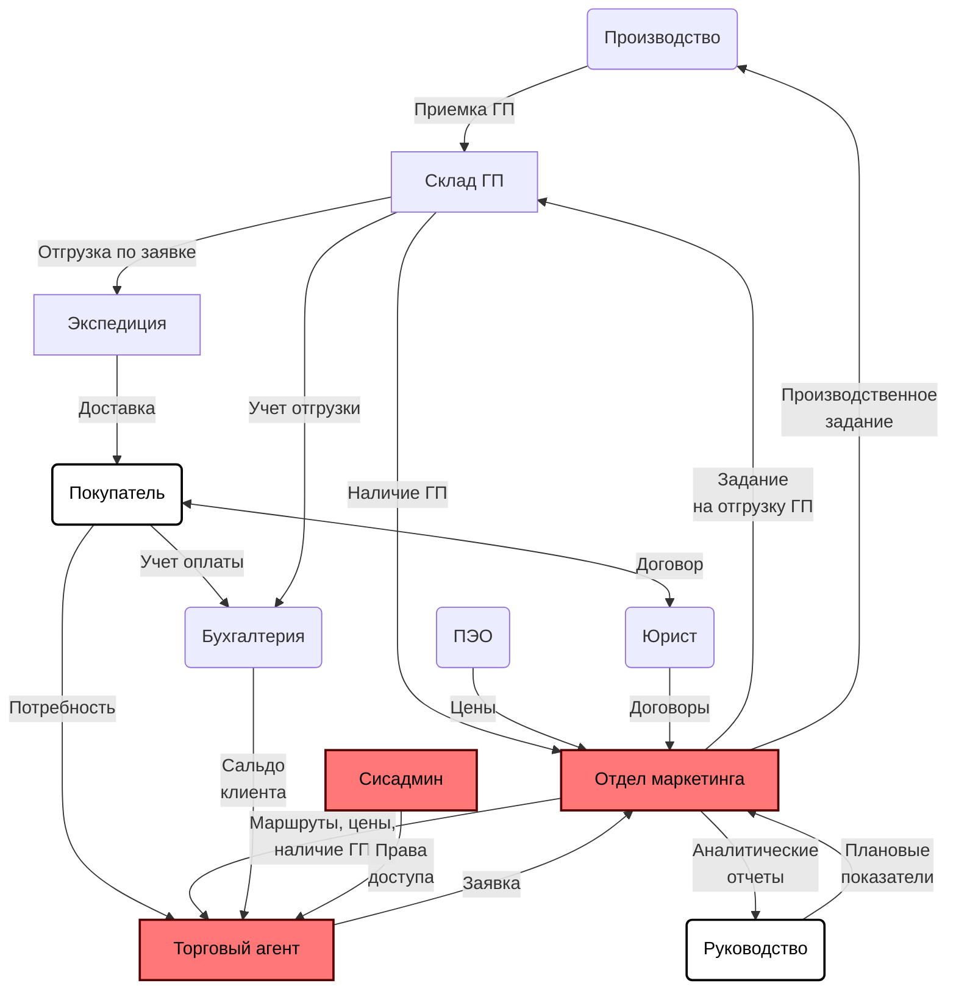

```mermaid

flowchart TD;
    A(Производство)--Приемка ГП-->B[Склад ГП];
    B--Наличие ГП-->M;
    B--Отгрузка по заявке-->D[Экспедиция];
    D--Доставка-->E(Покупатель);
    E--Потребность-->T[Торговый агент];
    E--Учет оплаты-->Acc(Бухгалтерия);
    M[Отдел маркетинга]--Маршруты, цены,<br>наличие ГП-->T;
    M--Задание<br> на отгрузку ГП-->B;
    Acc--Сальдо<br> клиента-->T;
    T--Заявка-->M;
    P(ПЭО)--Цены-->M;
    M--Производственное<br> задание-->A;
    B--Учет отгрузки-->Acc;
    M--Аналитические<br> отчеты-->Mngmt(Руководство);
    Mngmt(Руководство)--Плановые<br> показатели-->M;
    U(Юрист)--Договоры-->M;
    E<--Договор-->U;
    S[Сисадмин]--Права<br> доступа-->T;

    classDef core fill:#ff7777,color:#000,stroke:#550000,stroke-width:2px;
    classDef outlier fill:#ffffff,color:#000,stroke:#000000,stroke-width:2px,stroke-daskarray: 5, 5;
    class T,S,M core;
    class E,Mngmt outlier;
```
