# Инструкция для мобильного приложения "GDMN. Агент"

## 1. Подключение

Чтобы запустить приложение, находим иконку  на рабочем экране мобильного устройства и нажимаем на нее.

При первом запуске приложения откроется стартовый экран, в котором будет предложено выбрать режим подключения:
- Начать работу (Демо режим)
- Подключение к серверу

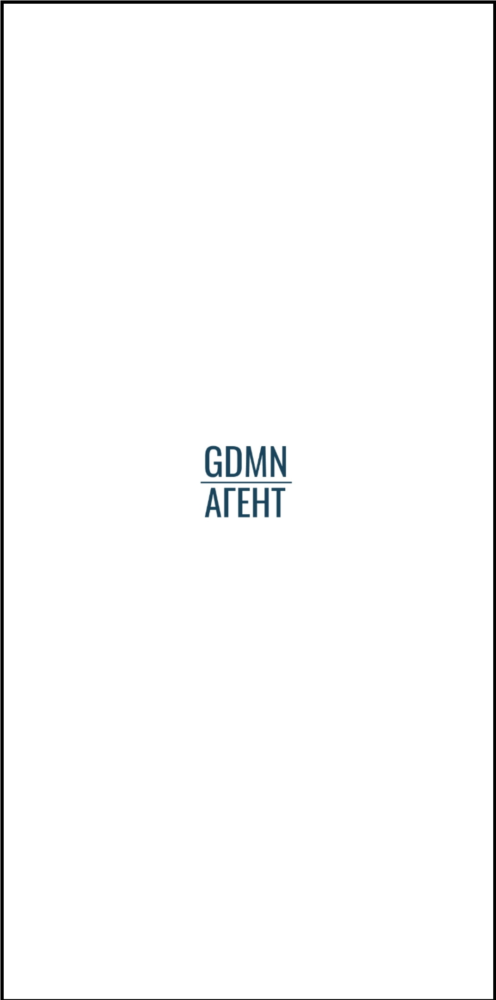 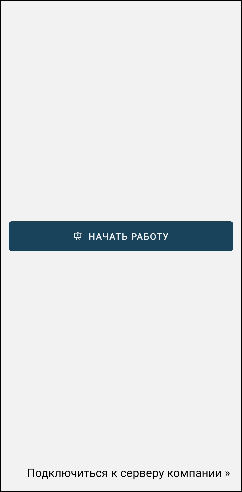

### Демо режим
При нажатии на кнопку **Начать работу** выполняется автоматический вход в приложение под тестовым пользователем.

В данном режиме можно ознакомиться с функционалом приложения offline (без подключения к базе данных) на демо данных.

Загрузка данных и работа в приложении пояснена далее.

Выйти из демо режима можно, открыв боковую панель нажатием на иконку меню " **≡** ", находящуюся в верхнем углу приложения слева (или смахнув пальцем вправо с левого края устройства).

Затем перейти на экран **Профиль** и нажать на кнопку **Выйти из демо режима**. Далее выбрать **Подключиться к серверу компании**.

 

### Подключение к серверу (экран **Настройка подключения**)

Чтобы подключиться к рабочей базе данных необходимо выбрать **Подключиться к серверу** для перехода на экран **Настройка подключения** (с помощью иконки  ):

  

В экране **Настройки подключения** следует указать параметры подключения к серверу, которые пользователь должен получить от администратора системы.

| Параметр | Описание |
| --------------------- | ------------------------------------------ |
|Адрес сервера | Включает в себя протокол и доменное имя (IP-адрес) сервера. Пример: http://localhost |
| Порт         | Порт сервера. Пример: 3654 |

При нажатии на кнопку **Сохранить** переходим к окну для подключения к серверу:

Нажимаем кнопку **Подключиться**.

После успешного подключения к серверу появится экран **Активация устройства**.

В данном экране необходимо ввести код активации, который пользователь должен получить от администратора системы, и нажать **Отправить**.

При последующих запусках приложения будет происходить автоматический вход в учетную запись пользователя, если в разделе **Профиль** бокового меню " **≡** " будет выставлен параметр **"Не выходить из профиля"**.

 

По нажатию на иконку в правом нижнем углу  можно вернуться на экран подключения к серверу.

Если активация устройства прошла успешно, появится экран для входа пользователя.

В соответствующие поля необходимо ввести **Имя пользователя** и **Пароль** и нажать на кнопку **Войти**.

 

При успешной аутентификации пользователя откроется экран -- **Маршруты**.

Далее необходимо:
- зайти в **Настройки** и установить необходимые для работы параметры. Например, установить параметр **Запрашивать справочники**;
- загрузить данные, необходимые для работы пользователя с приложением, через нажатие кнопки **Синхронизировать** ;
- получить справочники и матрицы.

Всю информацию по этим действиям можно найти в нижеследующих разделах.

Также в окне "Настройка подключения" есть кнопка "Сбросить настройки", по нажатию на которую вызовется диалоговое окно, где можно указать следующие действия:

- Установить настройки по умолчанию. Подставятся данные нашего сервера, например,адрес='https://server.gdmn.app' и порт='3654'.
- Удалить данные об устройстве. Очиститься номер устройства, который необходим для аутентификации. Повторно номер устройства можно получить по новому коду активации от администратора системы.

 

## 2. Настройки

Экран **Настройки** содержит информацию о параметрах связи с сервером и настройки приложения.

 

Синхронизация идет параллельно работе в приложении. Процесс можно просматривать в специальном окне, которое появляется по нажатию на кнопку синхронизации. Если же необходимо продолжить работу в приложении, не дожидаясь окончания синхронизации, можно выбрать кнопку "Продолжить работу в приложении". Окно закроется, но в правом нижнем углу будет отрисован компонент, напоминающий, что процесс синхронизации еще идет. Если на на него нажать, окно синхронизации появится снова.

Настройки приложения:

| Параметр | Описание |
| ------------ | -------- |
|Синхронизация   | Параметр **Автоматическая синхронизация**, по умолчанию, не установлен.  Если установить, то синхронизация будет выполняться автоматически каждые N минут, указанные в признаке "Автосинхронизации, мин". И **Автоматическая синхронизация** по протяжённости периода должна быть больше периода синхронизации на сервере  |
|Запрашивать справочники|_Если указан_, то при при каждой синхронизации на сервер будет отправляться запрос на справочники, который будет обрабатываться сервером и возвращаться в ответ c запрашиваемыми справочниками.   _Если не указан_, то запрос генерироваться не будет. Справочники будут выгружаться из сервера автоматически при каких-либо очередных изменениях на нём.|
|Использовать матрицы|_Если указан_, то при добавлении товаров в заявки, цены будут вытягиваться из матриц по конкретным организациям (при условии,что такая матрица существует).   _Если не указан_, или матрицы у данной организации нет, то будут использоваться справочники ТМЦ. |
|Время хранения документов в архиве| Сколько дней будет хранится документ в приложении от даты документа |

По нажатию на иконку меню " **⁝** ", расположенную в правом верхнем углу, можно вернуться к начальным настройкам, выбрав пункт **Установить настройки по умолчанию**.

 

## 3. Загрузка данных

Чтобы загрузить данные, предназначенные для пользователя, сперва, в Настройках необходимо  указать параметр **Запрашивать справочники**, а далее следует нажать на кнопку   **Синхронизировать** в нижней части бокового меню.

Открыть боковое меню можно нажатием на иконку меню " **≡** ", находящуюся в верхнем углу приложения слева (или смахнув пальцем вправо с левого края устройства).

 

Впоследствии, параметр **"Запрашивать таблицы"** можно отключить, при отсутствии необходимости.

Через некоторое время в приложении должны появится справочники и все необходимые документы. Их наличие можно увидеть, пройдя в боковое меню "**≡**", во вкладки **Справочники, Матрицы**.

Если синхронизация прошла, но данных не появилось, то необходимо повторить синхронизацию через некоторое время.

Рядом с иконкой   отобразится дата и время последней синхронизации.

## 4. Справочники

На экране **Справочники** можно просмотреть данные, загруженные в приложение для работы.

  

Пример справочника магазинов:

 

Найти справочник по наименованию можно воспользовавшись строкой поиска, нажав на иконку , в правом верхнем углу экрана.

Можно как отказаться от получения справочников (через установление параметра в Настройках), так и отправить запрос на получение справочников в любой необходимый момент (через нажатие на иконку меню " **⁝** ", расположенную в правом верхнем углу, выбрав пункт **Отправить запрос на получение справочников**

 

## 5. Матрицы

На экране **Матрицы** можно просмотреть информацию о матрицах организаций.

Матрица представляет собой справочник, ежедневно на текущую дату выгружающийся с сервера и содержащий в себе информацию о списке товаров с ценами для конкретной организации.

  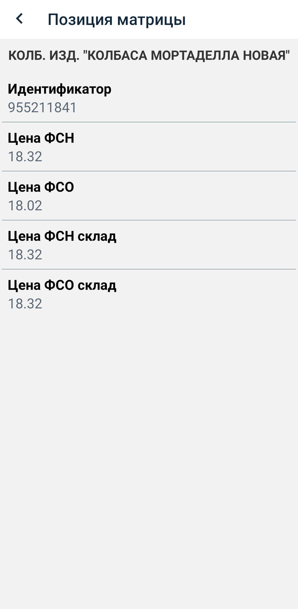

Если в настройках приложения установлен признак **Использовать матрицы**, то при добавлении товаров в документ заявки цены будут вытягиваться из матриц по конкретной организации.

Найти необходимую информацию по наименованию можно воспользовавшись строкой поиска, нажав на иконку , в правом верхнем углу экрана.

## 6. Заявки

### Cоздание документа

По нажатию на иконку " **✚** " в верхнем правом углу экрана **Заявки** переходим на экран добавления документа **Заявка**.

 

Обязательные поля для заполнения:
- **Номер**
- **Дата отгрузки**
- **Организация**
- **Магазин**

Поле **Магазин** следует заполнять только после выбора организации.

Поле **Склад магазин** необязательное для заполнения. Оно автоматически заполняется, если значение склада передается из ERP системы в настройки пользователя (можно просмотреть в окне **Профиль**).

 

Выбираем значения из справочников, нажав на иконку " **>** " соответствуещего поля:

  

После заполнения всех необходимых полей документ сохраняем, нажав на иконку " **✓** " в правом верхнем углу.

После сохранения сразу попадаем на экран просмотра заявки **Заявка**.

Отредактировать введённые данные можно, нажав на иконку  в шапке документа или используя пункт меню " **⁝** " **Редактировать данные**.

 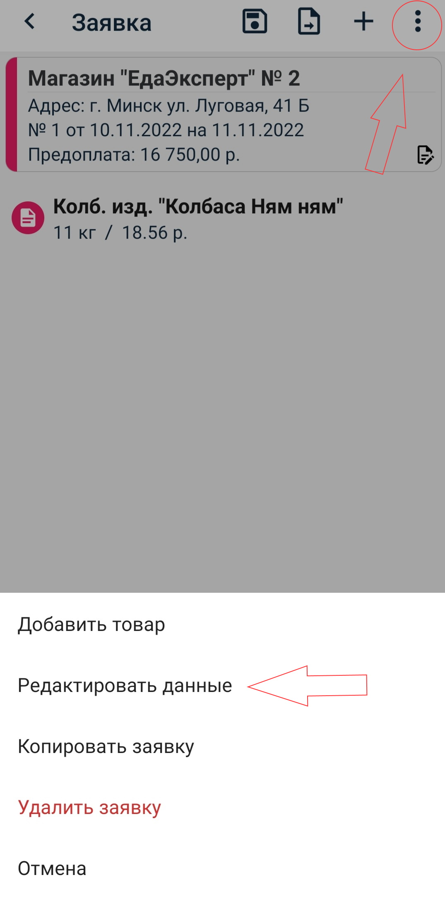

### Добавление товара

Добавление новой позиции в документ **заявки** можно сделать двумя способами.

- через меню " **⁝** " в правом верхнем углу, выбрав пункт **Добавить товар**.

- нажатием на иконку **✚**, после чего переходим на экран **Выбор товара**:

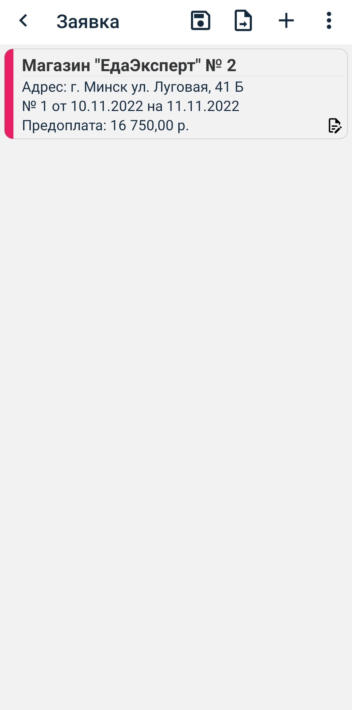 

В окне для выбора групп и товара группы отображаются в виде блоков:
- голубого цвета - группы цехов
- розового цвета - группы товаров (в зависимости от выбранного цеха)

Под блоками идет список товаров по выделенной группе.

После того, как выберем необходимый товар, откроется экран **Позиция заявки** для ввода количества мест товара и выбора упаковки.

**Наименование** и **Цена** заполнены автоматически и не могут быть изменены.

**Количество мест** обязательно для заполнения.

 **Упаковка** заполняется только при наличии предложенных вариантов.

  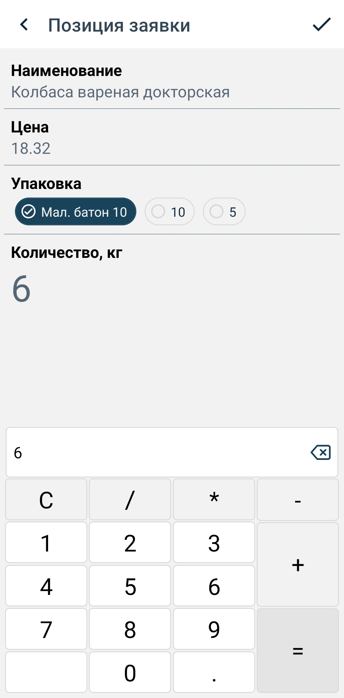

 После выбора товара и заполнения форм **Количество** и **Упаковка**, выбранный товар будет отображаться в списках товаров.

Позиции списка выглядят следующим образом:
- если товар еще не добавлен в заявку, то элемент будет отображен с красной иконкой
- если товар уже добавлен, то элемент будет с синей иконкой, а также будет отображена позиция товара с информацией о количестве и упаковке в элементе овальной формы.

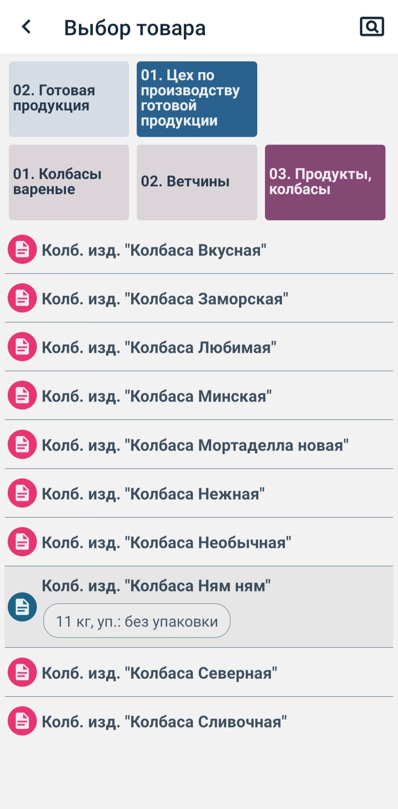

По нажатию на иконку " **✓** " позиция сохранится.

При возвращении назад по кнопке  **" < "** (в верхней части экрана) приложение переходит на экран просмотра документа  **Заявка**.

  

Чтобы найти товар по наименованию, можно воспользоваться строкой поиска, нажав на иконку   **Поиск** в правом верхнем углу экрана.

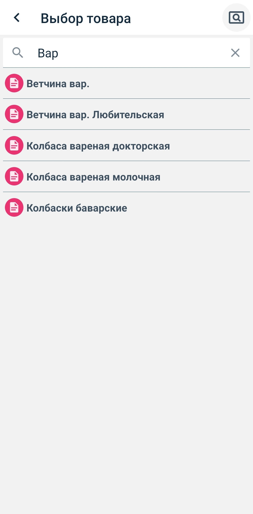

#### Добавление одинакового товара

Так как вид упаковки бывает разных вариантов, то возникает ситуация, когда нужно добавить один и тот же товар, но с разной тарой.

  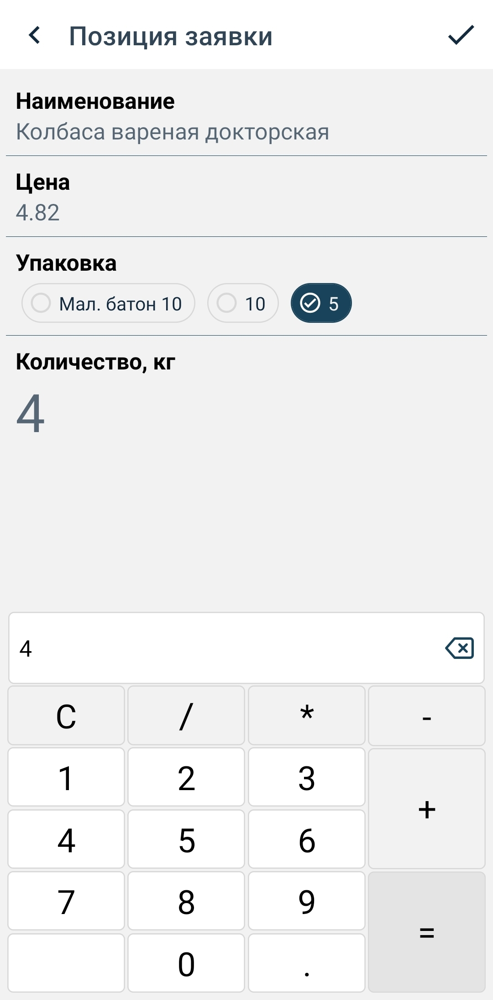

Для этого нужно из экрана **Заявка** нажать " **✚** ",

 перейдя к экрану **Выбор товара**, повторно выбрать из списка необходимую позицию нажатием, далее выбрать из дополнительного меню - пункт **Добавить позицию**.

  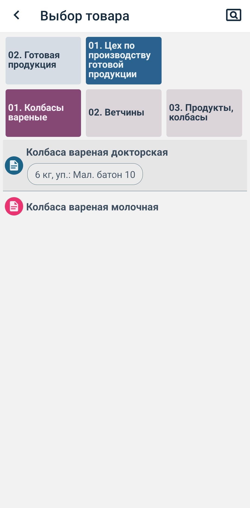 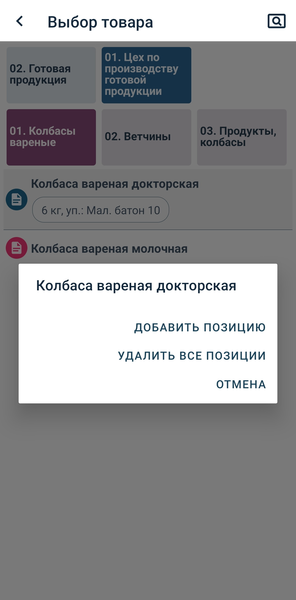

 И далее действовать по уже знакомой схеме - ввести количество товара, необходимый вид упаковки и нажать на иконку " **✓** ". Выбранный повторно товар отразится в списках товаров, а так же будет виден в самой заявке.

  

### Редактирование позиции товара

Необходимо подчеркнуть, что редакция позиции возможна только в том случае, когда сам документ находится в статусе **Черновик** (значок   или боковая полоса шапки документа красного цвета).

Если во **во время заполнения заявки** необходимо добавить, изменить уже заявленное количество товара или его тару, то можно сделать это повторным нажатием на необходимую позицию в списках товаров, далее выбрать из появившегося дополнительного меню пункт **Редактировать**.

 

А если щелкнуть по овальному элементу, то откроется диалоговое окно, по которому можно выполнить следующие действия:
- редактировать позицию
- удалить позицию
- отмена

 

Если же **заявка уже заполнена**, находится в статусе **Черновик**  или **Готов к отправке**  (перевести в статус Черновик), следует открыть заново документ, нажать на товар, который необходимо откорректировать, ввести нужные данные и снова нажать на иконку " **✓** ".

 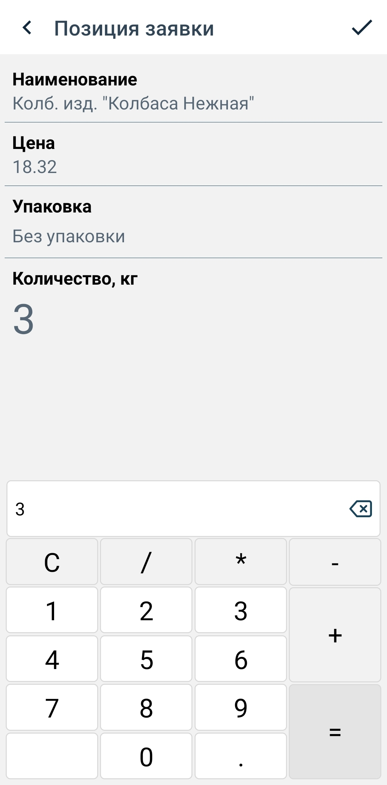

### Удаление позиции товара

Необходимо подчеркнуть, что редакция позиции возможна только в том случае, когда сам документ находится в статусе **Черновик** (значок   или боковая полоса шапки документа красного цвета).

Если в экране просмотра заявки нажать и удерживать позицию товара, то появится зеленая галочка. Далее необходимо нажать на иконку   **Мусорная корзина**, и подтвердить желание удалить данную позицию в заявке.

  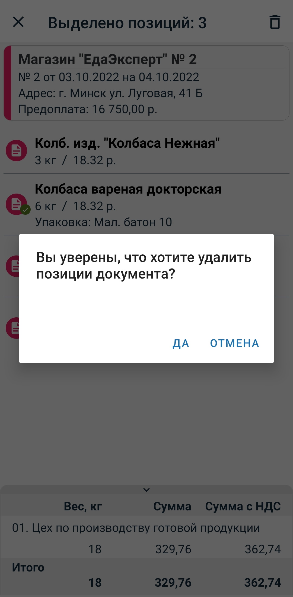 

Позиция или позиции будут удалены.

Отменить удаление позиций документа можно:
- нажав на иконку " **×** ", в левом верхнем углу. При этом способе счезнут все зеленые галочки с выбранных позиций, экран вернется к изначальному состоянию.

- нажав иконку  **Мусорная корзина** и выбрав кнопку **Отмена** в появившемся окне "Уверены, что хотите удалить позиции документа?". При этом способе все зеленые галочки на выбранных позициях останутся на месте, можно продолжить редактировать удаление позиций документа.

 

### Статус документа

Цвет иконки, боковой полосы шапки или значка документа означает его статус.

При смене статуса заявки изменяется цвет иконки, боковой полосы шапки или значка.

Имеется 4 основных статуса:

| Статус | Цвет    | Значок |Описание                          |
|------------| ------- | :---:|------------------------------------------ |
|Черновик| Красный |  | Новый документ, который можно редактировать|
|Готов к отправке| Зеленый |  | Документ, который будет автоматически отправлен на сервер на обработку, при очередной синхронизации. Нельзя отредактировать, но можно вернуть статус Черновик |
|Отправлен| Желтый  | | Документ отправлен, ожидается подтверждение (после синхронизации документы со статусом **Готов к отправке** меняют статус на **Отправлен**) |
|Обработан успешно| Синий   |  |Документ получил подтверждение об успешной обработке на сервере (в случае, если документ обработан с ошибкой, статус меняется на **Черновик** и описывается вид ошибки)  |

### Отправка документа

Если считаете, что заявка (или заявки) готова к отправке, то отправить документ можно несколькими способами:

- Из экрана **Заявка**

    - нажать на иконку дискетки   , чтобы перевести документ в статус **Готов к отправке**. Такой документ надо еще отправить, но можно позже.
    Этим способом можно воспользоваться при отсутствии интернета. Когда связь восстановится, документ автоматически будет отправлен на сервер, на обработку, при очередной автосинхронизации (или при ручной синхронизации).

    - нажать на иконку **Отправка документа** . Этот шаг сразу отправит документ на сервер.

- Из Маршрута, из экрана **Визит**

    - нажав на иконку **Отправка документа**  можно отправить сразу все заявки, в стадии **Черновик**  или **Готов к отправке** .

  

### Синхронизация

Совмещение работы программы и работы сервера происходит с помощью синхронизации. Кнопка синхронизации находится в нижней части бокового меню.

Открыть боковое меню можно нажатием на иконку меню " ≡ ", находящуюся в верхнем углу приложения слева (или смахнув пальцем вправо с левого края устройства)

#### Синхронизация при начале работы

Ежедневно, в начале работы с приложением, необходимо производить ручную синхронизацию для получения  справочников с актуальными даннными, матриц, дебеторских задолженностей и для получения новых маршрутов.

#### Автосинхронизация

Пераметр **Автоматическая синхронизация** по умолчанию не установлен.

 Если его установить, то синхронизация будет выполняться автоматически каждые N минут, указанные в строке "Автосинхронизация, мин", например, через 12 минут.

  

### Порядок работы

Вернемся на экран просмотра заявки:

По умолчанию, при создании, документ имеет статус **Черновик**  (красный цвет).

После ввода всех необходимых данных, чтобы отправить документ на сервер для обработки, необходимо снять признак **Черновик** на экране редактирования документа. Это можно сделать несколькими способами:

   - или вручную, через нажатие на шапку документа , документ переходит в статус **Готов к отправке** 

   - или через нажатие иконки , над шапкой документа, которая переведёт документ в статус **Готов к отправке** .

   - или отправить документ на сервер для обработки сразу, нажав на иконку , над шапкой документа. Документ будет иметь статус **Отправлен** 

После отправления на сервер заявка будет иметь статус **Отправлен** 

После того, как документ попадет на сервер и будет там обработан, программа вернет документ и цвет боковой полоски, значка или иконки станет синим .

### Редактирование документa на разных этапах

По умолчанию у заявки статус **Черновик**. После ввода всех необходимых данных, чтобы отправить документ на обработку, необходимо снять признак Черновик. При изменении статуса завка переходит в состояние **Готов к отправке**.

Пока заявка не отправлена, она доступна для редактирования. Для этого нужно зайти в нее и временно вернуть статус **Черновик**. После отправления заявки на сервер редактирование невозможно.

На экране **Заявки** документы сгруппированы следующим образом:

| Группа | Описание                                                                                                                                                                    |
| --------------- | --------------------------------------------------------------------------------------------------------------------------------------------------------------------------- |
| Все             | Все документы                                                                                                                                     |
| Активные        | Все документы, кроме тех, которые уже обработаны на сервере (со статусом Черновик, Готов к отправке, Отправлен   ).                                                                |
| Архив           | Документы, которые были отправлены и успешно обработаны на сервере (со статусом Обработан успешно  )  |

Вернемся на экран просмотра всех заявок:

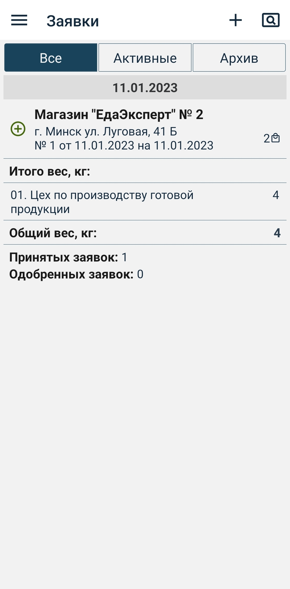

При получении подтверждения заявка  (цвет боковой полосы шапки документа становится синим) переходит в **Архив**, .

При наличии ошибки в заявке появится надпись **Отказано:** и вид ошибки. Например: "Отказано: задолженность больше 30 дней". Такая заявка остаётся в группе **Активные**

### Удаление документа

Для удаления документа нужно нажать на необходимый документ и удерживать его, на выбранной позиции появится зеленая галочка, которая выделит данный документ среди прочих. Далее необходимо нажать иконку  Мусорная корзина и подтвердить намерение удалить документ. Документ удаляется.

Используя пункты меню " **⁝** ", в правом верхнем углу, можно:

- перейти на редактирование шапки документа (если статус **Черновик**)
- копировать документ
- удалить документ (если статус **Черновик**)

## 7. Задолженности

На экране **Задолженности** можно просмотреть данные об организациях, у которых есть задолженности. Воспользовавшись фильтром, можно выделить компании:
- с задолженностью
- с просрочкой
- с предоплатой
- все вместе

 

Найти организацию по наименованию можно, воспользовавшись строкой поиска, нажав на иконку , в правом верхнем углу экрана.

Так же можно запросить новые данные по организации.

Для этого необходимо выделить интересующую организацию, подтвердить отправку запроса. После выполнения запроса необходимо выполнить ручную синхронизацию , чтобы получить новые данные.

## 8. Отчёты

Для увеличения области окна с данными отчета, можно скрывать форму параметров, нажатием на иконку фильтрации .

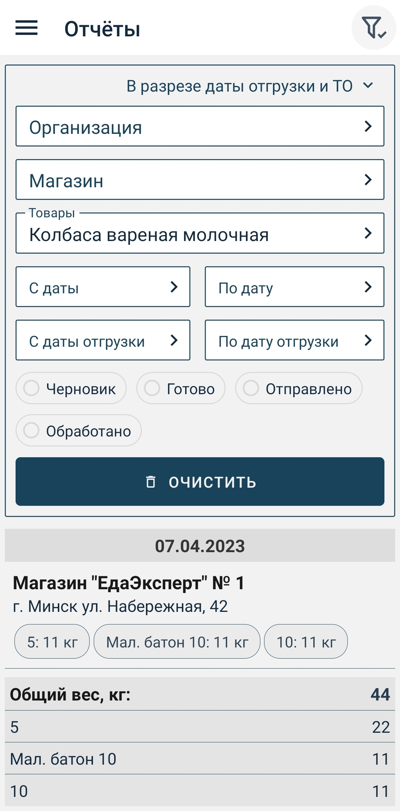 

На экране **Отчёты** можно ПРОСМОТРЕТЬ ДАННЫЕ о сделанных заявках:
  - по названию организации
  - по названию магазина
  - по названию товара
  - по статусу заявки
  - в определённый период (по дате отгрузки или по дате создания документа)

А в правом верхнем углу отображен компонент с выпадающим списком отчетов:

- **"В разрезе даты отгрузки и ТО"** отображает список ТО по дням. А также если указать параметр "Товар", то по каждому ТО отобразится вес данного товара в разрезе упаковок.

- **"В разрезе групп"** отображает вес по группам, которые можно выбирать в параметре "Группы". Например, выбрав все группы по полуфабрикатам, можно узнать их вес.

- **"В разрезе товаров"** отображает вес товаров в разрезе цехов, групп и товаров.

 Если есть необходимость просмотреть не только саму заявку, а, например, и ещё отгруженные позиции, то надо перейти в пункт меню **Заявки** и воспользоваться фильтром.

 

## 9. Маршруты

Ежедневно, в начале работы с приложением, необходимо делать ручную синхронизацию  для получения  справочников с актуальными даннными, матриц, дебеторских задолженностей и для получения новых маршрутов.

 

Перейдем на экран **Маршруты**, открыв боковую панель нажатием на иконку меню " **≡** ", находящуюся в левом верхнем углу приложения (или смахнув пальцем вправо с левого края устройства) и выбрав пункт **Маршруты**.

Документы на экране **Маршруты** сгруппированы следующим образом:

| Группа | Описание                                                                                                                                                                    |
| --------------- | --------------------------------------------------------------------------------------------------------------------------------------------------------------------------- |
| Все             | Все маршруты|
| Активные        | Маршруты, дата которых не менее текущей даты |
| Архив           | Маршруты, дата которых меньше текущей даты |

### Начало визита

При выборе (нажатием на строку) необходимого маршрута откроется экран с торговыми точками, запланированными для посещения, то есть переходим на экран **Точки маршрута**.

  

После нажатия на торговую точку откроется экран с визитом выбранного объекта.

Программа сама зафиксирует геокоординаты мобильного устройства и начало работы на торговой точке.

При самом первом сеансе программа запросит разрешение на доступ к данным о месте расположения мобильного устройства, если ответ будет *"Всегда разрешать"* или *"При использовании приложения"*, то в дальнейшем фиксация местоположения будет проходить автоматически.

Если ответ будет *"Только в этот раз"*, то при следующем открытии приложения программа снова запросит разрешение на доступ к данным .

Началом визита считается момент создания первой заявки, т.е. при создании первой заявки происходит определение местоположения, фиксирование даты и времени.

Из экрана **Визит** пользователь имеет возможность:
- создать заявку
- просмотреть текущие и предыдущие заявки, сделанные ранее
- просмотреть условия оплаты, задолженности и сроки
- удалить заявки со статусом **Черновик** и **Готов к отправке**
- отправить ВСЕ заявки со статусом **Готов к отправке** на сервер с помощью кнопки 
- скопировать заявку, сделанную ранее

 ### Создание заявки в маршруте

 Для создания заявки из экрана **Визит** нажимаем на верхнюю правую кнопку " **✚** " **Добавить документ**, после чего откроется экран заявки.

   

Из экрана **Визит** добавим в заявку необходимый товар: нажав иконку **✚**, выбрав необходимое количество мест товара и нажав иконку **✓**.

 

 Выбранный товар будет выделен в списках товаров серым цветом с указанием количества и вида упаковки, а иконка товара поменяет цвет с красного на синий.

 

### Отправка заявки

 По нажатии на иконку " **✓** " позиция сохранится и приложение перейдет на экран **Выбор товара**. После того, как будут выбраны все необходимые позиции товаров, необходимо вернуться на экран **Заявка** и

 - либо перевести документ в состояние "Готов к отправке" с помощью кнопки  (или вручную, нажав на шапку документа) и отослать заявку попозже.

 - либо сразу отправить заявку с помощью иконки 

  

 Когда у всех документов будет статус **Готов к отправке**   из экрана **Визит** можно отправить все готовые заявки сразу с помощью иконки .

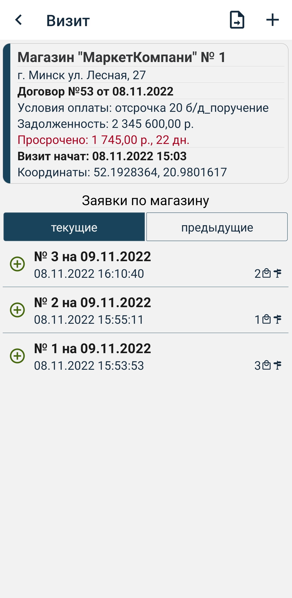  

### Синхронизация в маршруте

После ввода всех заявок торговой точки и отправления их на сервер далее следует проверить получен ли ответ от сервера: успешно ли созданы заявки в Гедымине или отклонены по разным причинам.

Данный визит в окне просмотра визитов обозначится кружком с треугольником.

Заявки из визитов также можно просмотреть в пунктах бокового меню **Заявки**.

 

Далее, из окна просмотра **Точки маршрута** можно переходить к следующему визиту.

 

### Копирование заявок в маршруте

В окне визита отображены 2 списка заявок:
- слева - текущие заявки по точке маршрута
- справа - предыдущие - все заявки по магазину (кроме текущих).

 Предыдущие можно просматривать и копировать в текущий визит.

  Для этого нужно выбрать необходимую заявку из списка предыдущих заявок, открыть её и выбрать пункт из меню " **⁝** " *"Копировать заявку"*. После чего произойдет переход на новую скопированную заявку (понять, что это копия можно по вновь появившимся инструментам в верхней части экрана).

   

Новую заявку можно редактировать:
- изменить дату (через нажатие на шапку документа или используя меню " **≡** " *Редактировать данные*)

- изменить количество и вид тары.

 

 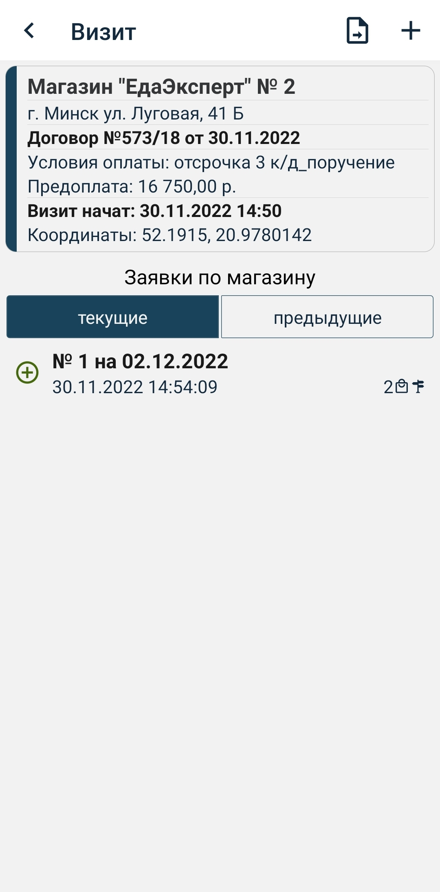

Переводим в статус **Готов к отправке** и продолжаем работать дальше подобным образом. После редакции всех нужных заявок отсылаем их на сервер .

После ввода  и отправления на сервер всех заявок, нужно проверить получен ли ответ от Гедымина, узнать, успешно созданы заявки в Гедымине или отклонены.

## 10. Карта

На экране **Карта** представлены сама карта и две вкладки **"Карта"** и **"Список"**, содержащие информацию по выбранному маршруту.

 

Во кладке **Карта** отображены все точки маршрута на карте.

Во вкладке **Список** показаны все точки маршрута в виде списка.

 Кнопками **"<"** и **">"** можно, приближаясь к точкам, перемещаться между объектами. Так же кнопками можно получить свою текущую координату и отобразить все объекты на экране.

В верхней части экрана указано название маршрута, который в данный момент отображается на карте. Для того, чтобы изменить один маршрут на последующий, необходимо нажать на иконку смены маршрута  (вверху, справа от названия маршрута), после чего в нижней части экрана появится экран с выбором маршрута. Выберем второй маршрут.

 

При нажатии на точку маршрута изменится цвет данной точки, появится название возле точки и в верхней части экрана. Также во вкладке **Список** отбразится, что данная точка выбрана.

 

Выберем во вкладке **Список** другую точку и посмотрим ее отображение на карте.

 

При отключенной функции **Геолокация**  на мобильном устройстве, программа предложит её включить.

## 11. Профиль

Экран **Профиль** содержит информацию о пользователе и устройстве. При наличии настроек пользователя, они также будут отображены в данном экране.

Для выхода из учетной записи необходимо нажать на кнопку **Сменить пользователя**.

 

Если вход был произведен в демо режиме, кнопка **Сменить пользователя** меняется на **Выйти из демо режима**

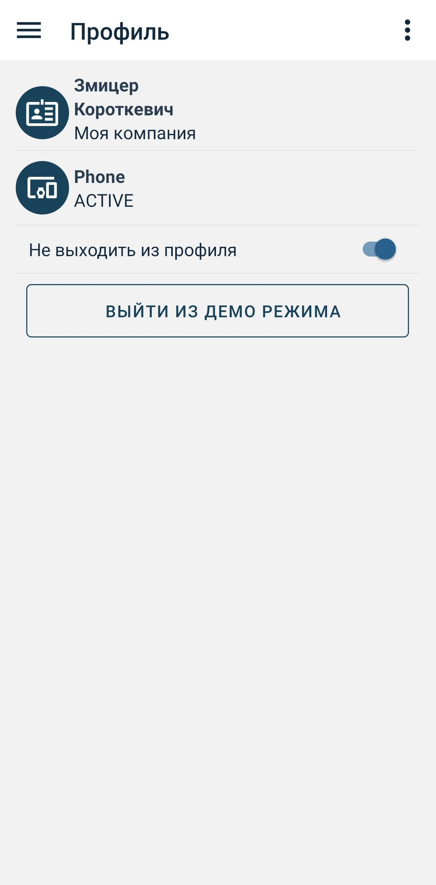

Если параметр **Не выходить из профиля** отключить, то при каждом новом открытии приложения нужно будет вводить данные пользователя.

Присутствует пункт меню **"Выйти и удалить все данные"**. Вызывает удаление всех данных на мобильном устройстве и выход из профиля.

Также этот экран позволяет удалить все справочники и документы, . Для этого необходимо нажать на иконку меню, расположенную в правом верхнем углу, и выбрать пункт **Удалить все справочники и документы**.

Также позволяет удалить настройки пользователя. Необходимо нажать на иконку меню " **≡** ", расположенную в правом верхнем углу, и выбрать пункт **Удалить настройки пользователя**.

Поле **Склад магазин** необязательное для заполнения. Оно автоматически заполняется, если значение склада передается из ERP системы в настройки пользователя (можно просмотреть в окне **Профиль**).

## 12. О программе
На данном экране можно узнать информацию о приложении и контактных данных разработчика, перейдя по ссылке **Документация** ознакомиться с полным функционалом приложения.

**Журнал ошибок**

Если во время синхронизации программы и сервера произошли ошибки, то программа отобразит окно с надписью "Закончено с ошибками". Чтобы их просмотреть, необходимо нажать на кнопку "Просмотреть ошибки". Чтобы вернуться обратно в список выполненных действий нажать на кнопку "Просмотреть операции". Все ошибки будут сохраняться в "Журнале ошибок" и переданы на сервер для анализа.

  

## 13. Значение иконок

| Значок         | Значение         |
|:----------------------:|----------------------------------|
|| _статус **Черновик**_, новый документ, который можно редактировать|
|   | _статус **Готов к отправке**_, документ нельзя редактировать, но можно вернуть в статус **Черновик**   |
|    | _статус **Отправлен**_, документ отправлен, ожидается подтверждение     |
|    | _статус **Обработан успешно**_, документ получил подтверждение об успешной обработке на сервере   |
|  | удаление документа |
|   | переход на экран настроек  |
|   | поиск  |
|   | редактирование документа  |
|     | синхронизация  |
|  | перевод документа из статуса **Черновик** в статус **Готов к отправке** |
|   | отправка документа |
|| смена маршрута
|      | фильтр |
| " **≡** "   | меню документа |
|" **✓** "  | сохранить  |
|" **✚** "| добавление нового документа |

