# Инструкция для мобильного приложения "GDMN. Агент"

## 1. Подключение

Чтобы запустить приложение находим иконку  на рабочем экране мобильного устройства и нажимаем на нее.

При первом запуске приложения откроется стартовый экран, в котором будет предложено выбрать режим подключения:
- Демо режим
- Подключение к серверу

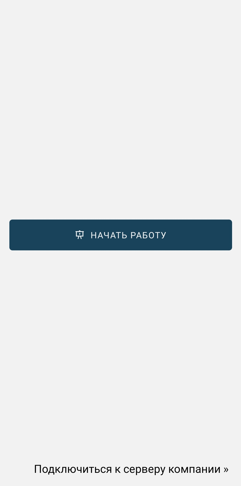

### Демо режим
При нажатии на кнопку **Демо режим** выполняется автоматический вход в приложение под тестовым пользователем.

В данном режиме можно ознакомиться с функционалом приложения offline (без подключения к базе данных) на демо данных.

Загрузка данных и работа в приложении пояснена далее в пунктах 3-9.

Выйти из демо режима можно, открыв боковую панель нажатием на иконку меню **≡**, находящуюся в верхнем углу приложения слева, или смахнув пальцем вправо с левого края устройства.

Затем перейти на экран **Профиль** и нажать на кнопку **Выйти из демо режима**.

### Подключение к серверу
Чтобы подключиться к рабочей базе данных необходимо выбрать **Подключиться к серверу** для перехода на экран настройки подключения:

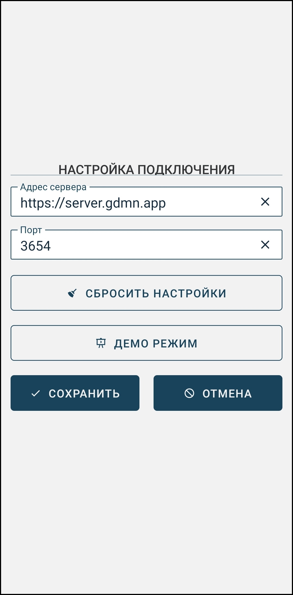

В этом экране следует указать параметры подключения к серверу.

| Параметр | Описание |
| --------------------- | ------------------------------------------ |
|Адрес сервера | Включает в себя протокол и доменное имя (IP-адрес) сервера. Пример: http://localhost |
| Порт         | Порт сервера. Пример: 3649 |
| ID устройства| ID устройства будет заполнено автоматически после завершения аутентификации |

При нажатии на кнопку **Сохранить** переходим к окну для подключения к серверу:

Нажимаем кнопку **Подключиться**.

После успешного подключения к серверу появится экран **Активация устройства**.

В данном экране необходимо ввести код активации, который пользователь должен получить от администратора системы, и нажать **Отправить**.

При последующих запусках приложения будет происходить автоматический вход в учетную запись пользователя.

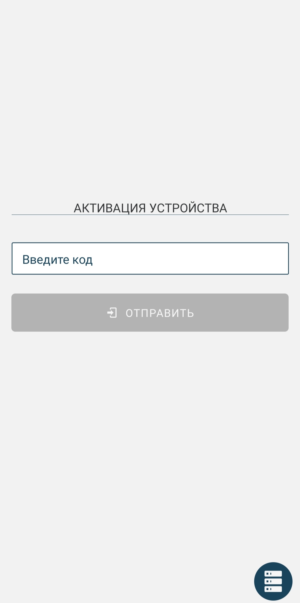 

По нажатию на иконку в правом нижнем углу  можно перейти на экран подключения к серверу.

Если активация устройства прошла успешно, появится экран для входа пользователя.

В соответствующие поля необходимо ввести **Имя пользователя** и **Пароль** и нажать на кнопку **Войти**.

 

При успешной аутентификации пользователя откроется экран -- **Маршруты**.

## 2. Настройки

Экран **Настройки** содержит информацию о параметрах связи с сервером и настройки приложения.

Настройки приложения:

| Параметр | Описание |
| ------------ | -------- |
|Запрашивать справочники|Если указан, то при синхронизации будет отправляться запрос на справочники. Если не указан, то запрос генерироваться не будет, а справочники должны будут выгружаться из сервера автоматически|
|Использовать матрицы|Если указан, то при добавлении товаров в заявки цены будут вытягиваться из матриц по конкретным организациям|
|Время хранения документов в архиве| Сколько дней будет хранится документ в приложении от даты документа |

Настройки бэк-офиса (для поиска накладных возврата):

| Параметр | Описание |
| ------------ | -------- |
|Адрес сервера | Включает в себя протокол и доменное имя (IP-адрес) бэк-офиса для поиска накладных. Пример: http://localhost |
| Порт         | Порт бэк-офиса. Пример: 8000 |
|Время поиска накладных возврата| Сколько дней назад от текущей даты брать для даты начала поиска накладных|

По нажатию на иконку меню, расположенную в правом верхнем углу, можно вернуться к начальным настройкам, выбрав пункт **Установить настройки по умолчанию**.

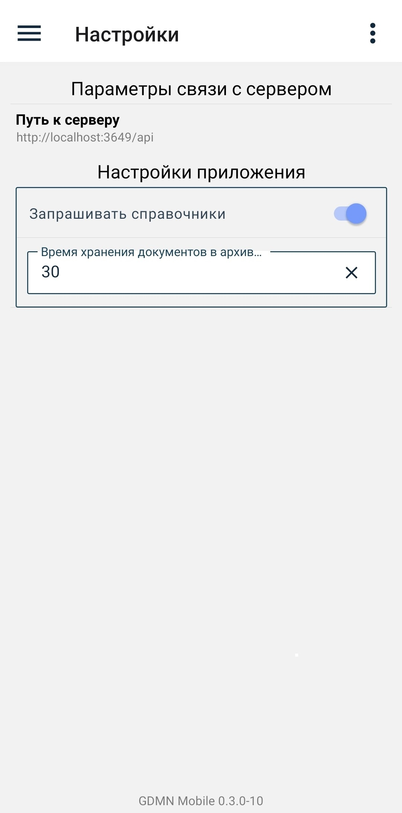 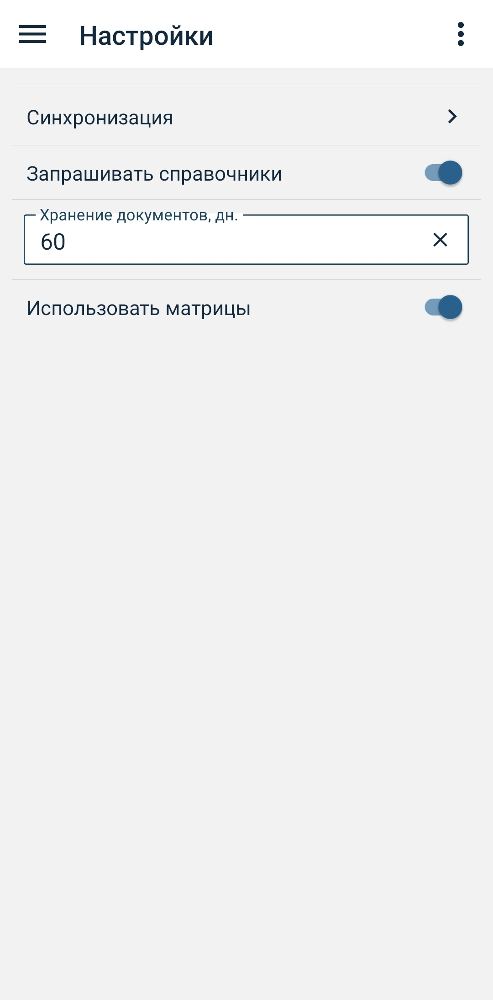 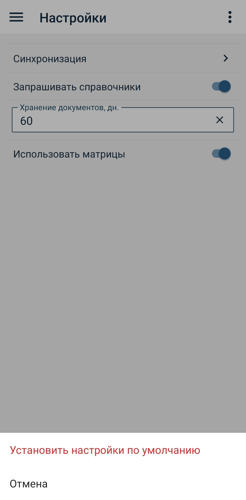

## 3. Загрузка данных

Чтобы загрузить данные, предназначенные для пользователя, следует нажать на иконку загрузки данных  в нижнем углу бокового меню.

Открыть боковое меню можно нажатием на иконку меню **≡**, находящуюся в верхнем углу приложения слева, или смахнув пальцем вправо с левого края устройства.

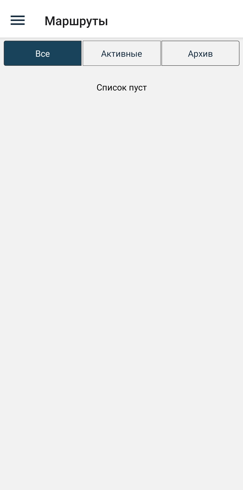 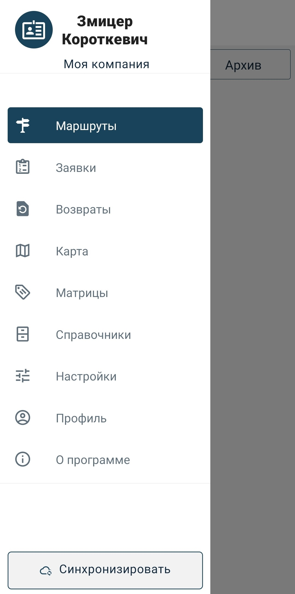

После загрузки данных в приложении должны появится справочники и все необходимые документы.

Если синхронизация прошла, но данных не появилось, то необходимо повторить синхронизацию через некоторое время.

Рядом с иконкой отобразится дата и время последней синхронизации.

## 4. Справочники

На экране **Справочники** можно просмотреть данные, загруженные в приложение для работы.

 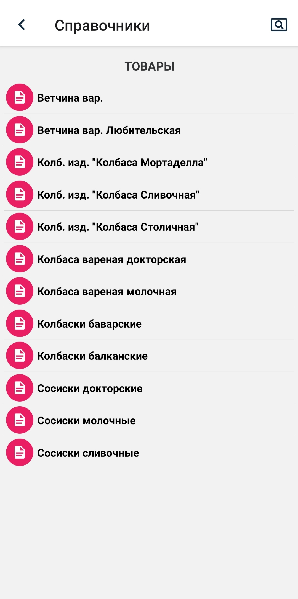 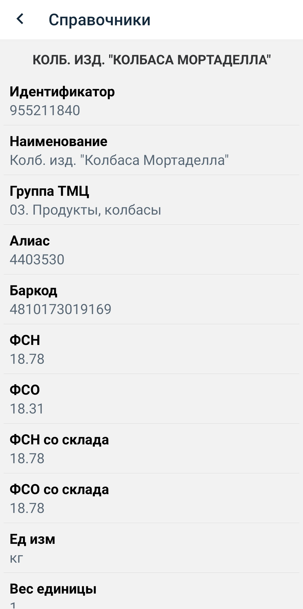

Пример справочника магазинов:

 

Чтобы найти справочник по наименованию можно воспользоваться окном для поиска в правом верхнем углу экрана.

## 5. Матрицы

На экране **Матрицы** можно просмотреть информацию о матрицах организаций.

Матрица представляет собой справочник, выгружающийся с сервера ежедневно на текущую дату и содержащий в себе информацию о списке товаров с ценами для конкретной организации. Если в настройках приложения установлен признак **Использовать матрицы**, то при добавлении товаров в документ заявки цены будут вытягиваться из матриц по конкретной организации.

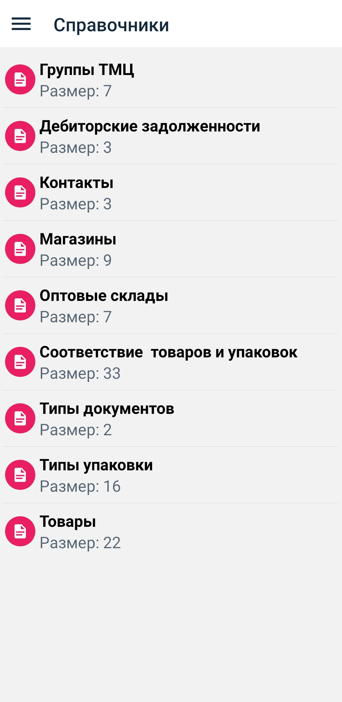 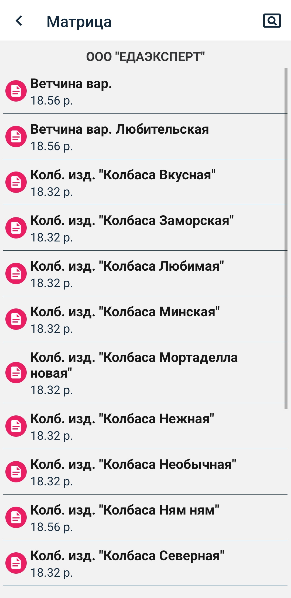 

## 6. Заявки

### Cоздание документа

По нажатию на иконку **+** в верхнем правом углу переходим на экран добавления документа.

Обязательные поля для заполнения: **Номер**, **Дата отгрузки**, **Организация**, **Магазин**.

Поле **Магазин** следует заполнять только после выбора организации.

Поле **Склад магазин** необязательное для заполнения. Автоматически заполняется, если значение склада передается из ERP системы в настройки пользователя (можно просмотреть в окне **Профиль**).

 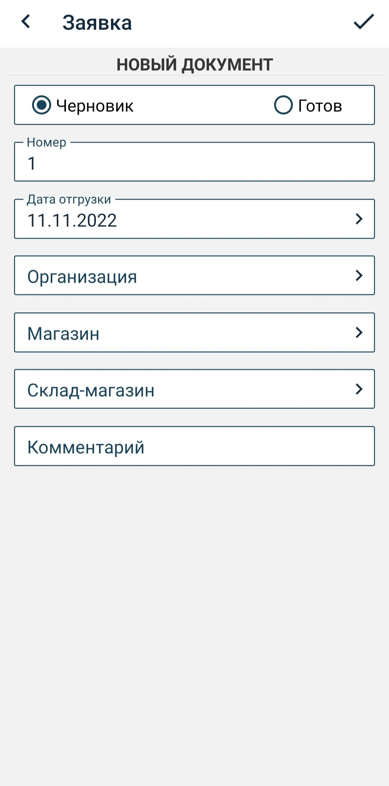

Выбираем значения из справочников, нажав на иконку **>** соответствуещего поля:

 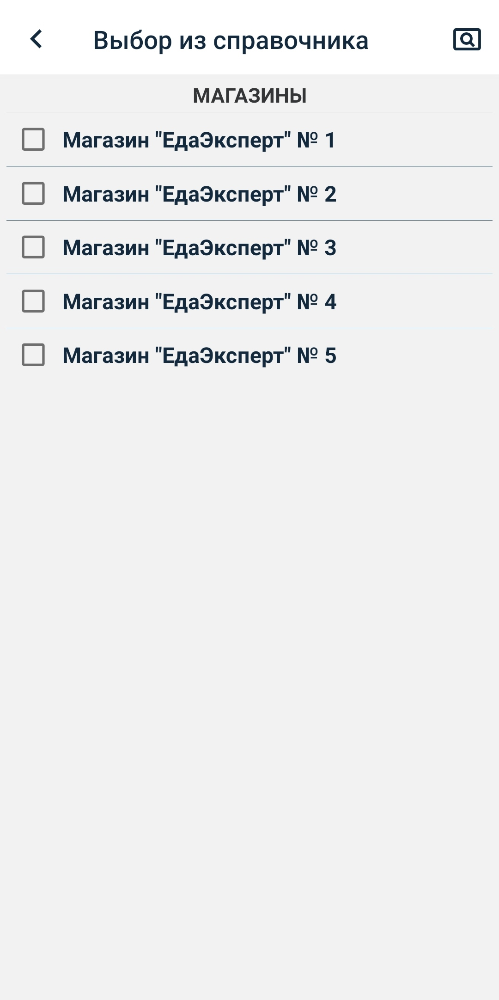 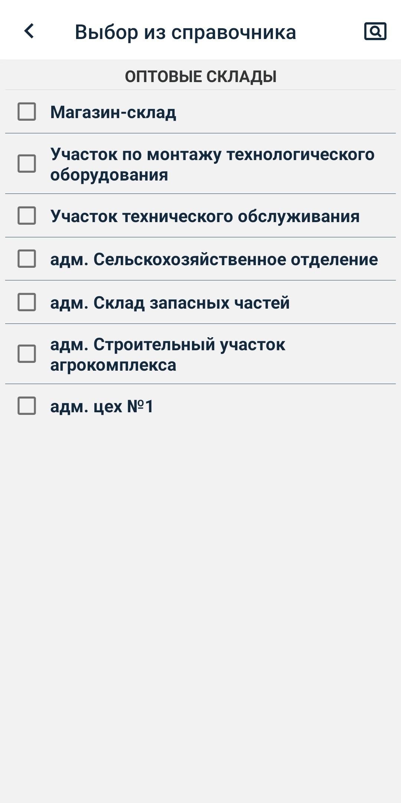

После заполнения всех необходимых полей документ сохраняем, нажав на иконку **✓** в правом верхнем углу.

После сохранения сразу попадаем на экран просмотра заявки. Отредактировать введенные данные можно, нажав на шапку документа.

### Добавление товара

Чтобы добавить новую позицию в документ заявки нажимаем на иконку **+** и переходим на экран выбора группы и товара:

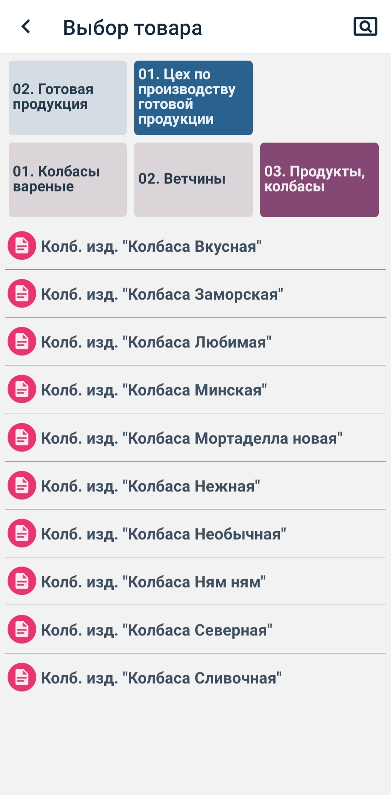 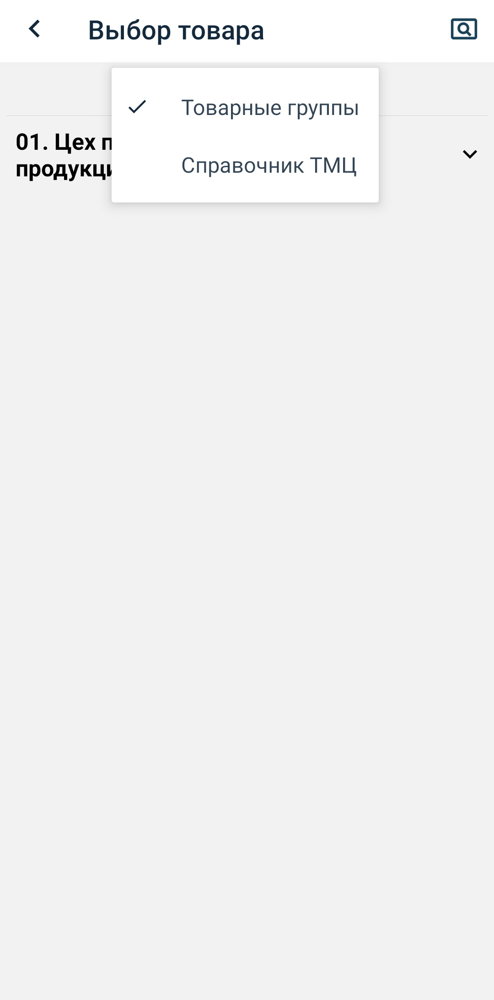

Также можно добавить позицию через меню в правом верхнем углу, выбрав пункт **Добавить товар**.

После того, как выберем необходимый товар откроется экран позиции документа для ввода количества мест товара и выбора упаковки. **Наименование** и **Цена** заполнены автоматически и не могут быть изменены. **Количество мест** обязательно для заполнения, **Упаковка** заполняется только при наличии предложенных вариантов.
По нажатию на иконку **✓** позиция сохранится и приложение перейдет на экран просмотра документа.

 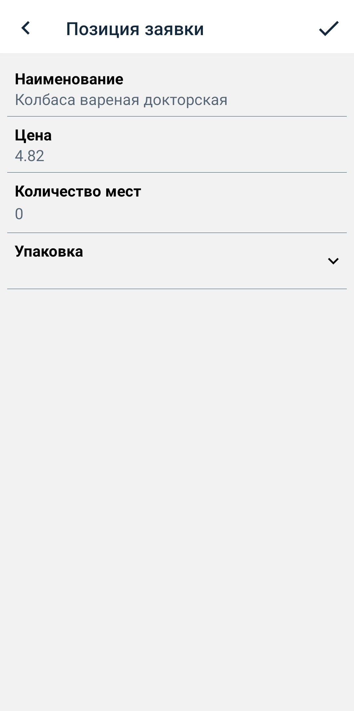 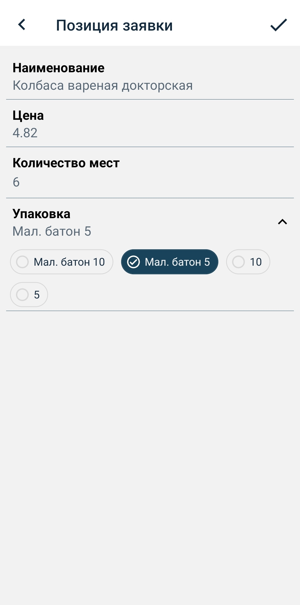 

#### Удаление позиции

Если в экране просмотра документа смахнуть влево по позиции, то появится дополнительное меню.

Нажав на иконку удаления, позиция будет удалена.

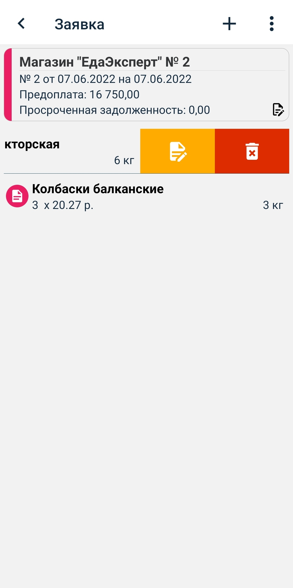 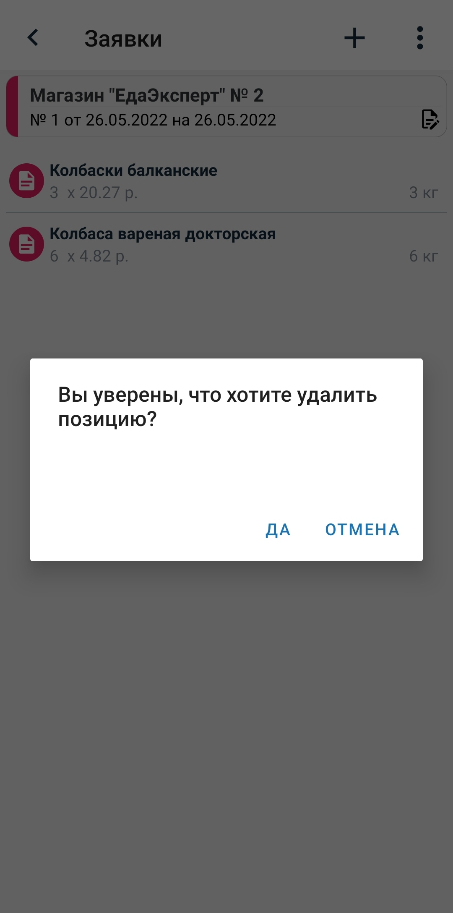

### Статус документа

Цвет иконки или боковой полосы шапки документа означает его статус. При смене статуса меняется и цвет.
Имеется 4 основных статуса:

| Статус | Цвет    | Описание                          |
|------------| ------- | ------------------------------------------ |
|Черновик| Красный | Новый документ, который можно редактировать|
|Готов к отправке| Зеленый | Документ, который можно отправлять на обработку (снят признак **Черновик**). Нельзя редактировать. |
|Отправлен| Желтый  | Документ отправлен, ожидается подтверждение (после нажатия кнопки синхронизации документы со статусом **Готов к отправке** меняют статус на **Отправлен**) |
|Обработан успешно| Синий   | Документ получил подтверждение об успешной обработке на сервере (в случае, если документ обработан с ошибкой, статус меняется на **Черновик**)  |

### Порядок работы

Вернемся на экран просмотра заявки:

При создании документ имеет статус **Черновик** (красный цвет).

После ввода необходимых данных, чтобы отправить документ на обработку, необходимо снять признак **Черновик** на экране шапки документа.

Документ перейдет в состояние **Готов к отправке** (зеленый цвет) - редактировать данные нельзя.

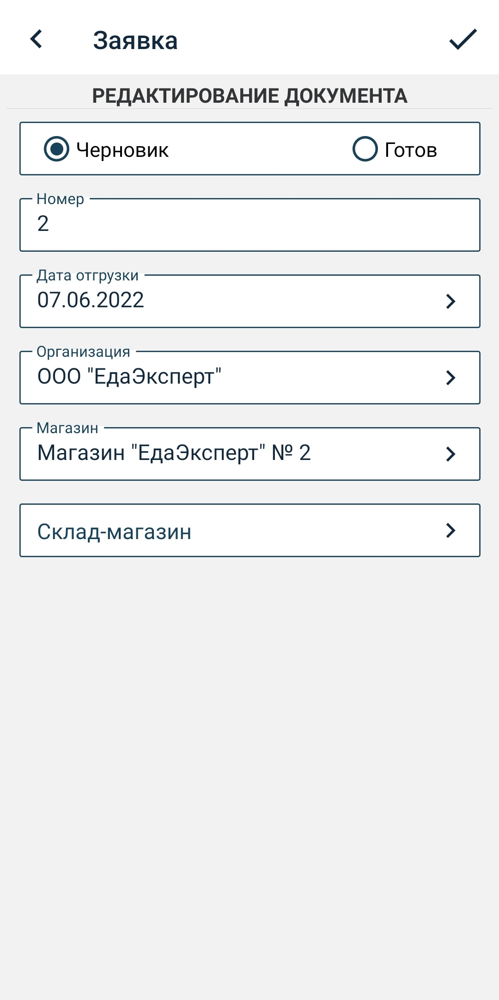 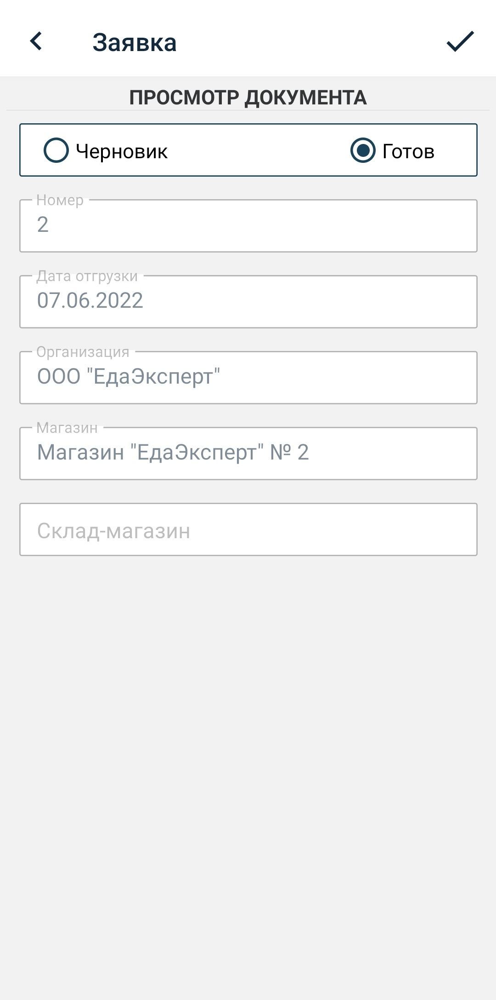 

Пока документ не отправлен, его можно вернуть из статуса **Готов к отправке** в статус **Черновик** и отредактировать данные.

Чтобы отправить документы со статусом **Готов к отправке** на сервер, необходимо нажать на иконку синхронизации.

После отправки документ перейдет в статус **Отправлен** (желтый цвет) - редактирование невозможно.

 

Далее необходимо подождать 1-2 минуту и синхронизировать данные снова для получения ответа обработки, цвет станет синим.

### Удаление документа

Если пальцем смахнуть по документу влево, то появится дополнительное меню.

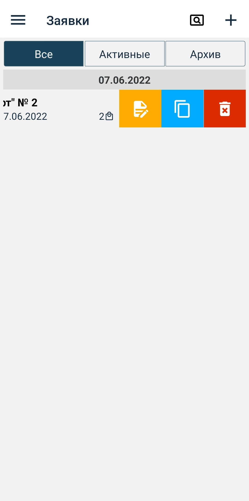

Используя пункты меню можно:
- перейти на редактирование шапки документа (если статус **Черновик**)
- копировать документ
- удалить документ (если статус **Черновик**)

Документы сгруппированы следующим образом:

| Группа | Описание                                                                                                                                                                    |
| --------------- | --------------------------------------------------------------------------------------------------------------------------------------------------------------------------- |
| Все             | Все документы                                                                                                                                    |
| Активные        | Все документы, кроме тех, которые уже обработаны на сервере (со статусом Черновик, Готов к отправке, Отправлен).                                                                |
| Архив           | Документы, которые были отправлены и успешно обработаны на сервере (со статусом Обработан успешно)|

По умолчанию у заявки статус **Черновик**. После ввода всех необходимых данных, чтобы отправить документ на обработку, необходимо снять признак Черновик на экране редактирования документа. При изменении статуса завка переходит в состояние **Готов к отправке**, цвет становится зеленым.

  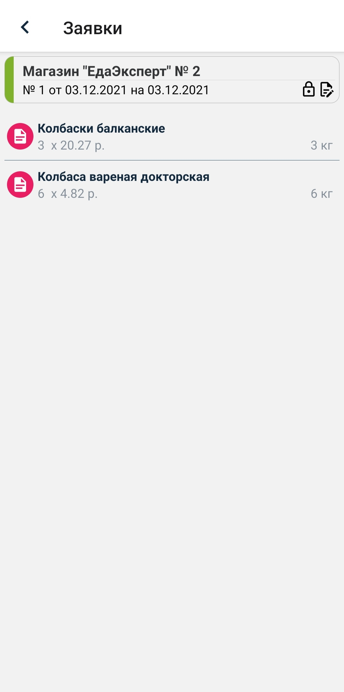

Пока заявка не отправлена, она доступна для редактирования. Для этого нужно зайти в нее и временно вернуть статус **Черновик**. После отправления заявки редактирование невозможно, цвет становится желтым.

Вернемся на экран просмотра всех заявок:

Для отправления заявки необходимо нажать на кнопку синхронизации, расположенную в боковом меню.

При получении подтверждения заявка переходит в архив, цвет становится синим. При наличии ошибки в заявке появится надпись **Отказано** и вид ошибки.

Если смахнуть заявку влево, то появится меню с дополнительными иконками.

Данное меню позволяет редактировать заявку (если она является доступной для редактирования), копировать заявку или удалить.

## 7. Возвраты

Перейдем на экран возвратов:

По нажатию на иконку **+** в верхнем правом углу переходим на экран добавления возврата. Обязательные поля для заполнения: Номер документа, Организация и Магазин.

При выборе **Организации** и **Магазина** попадаем в экран выбора организаций и магазина. Поле **Магазин** следует заполнять только после выбора организации.

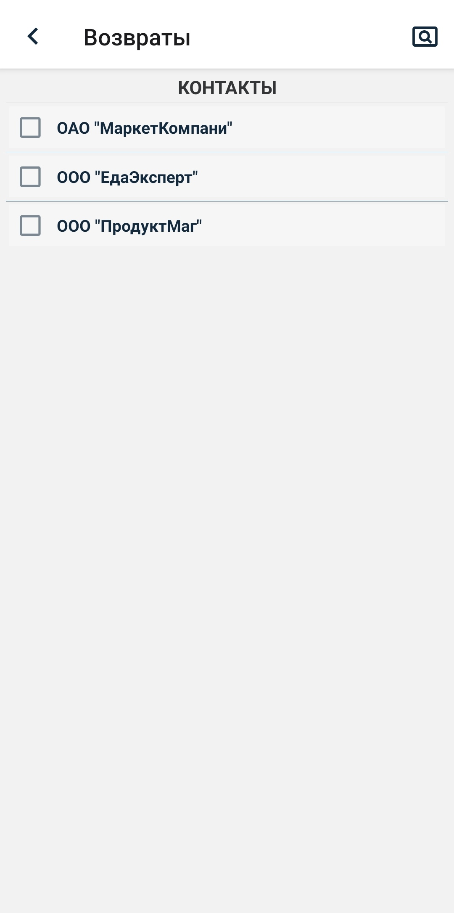 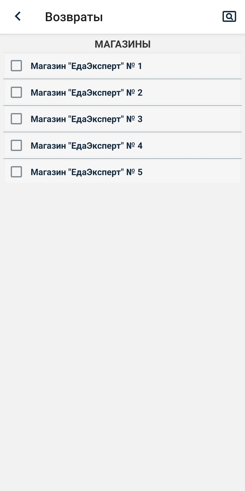

Для сохранения документа возврата необходимо нажать на иконку **✓** в правом верхнем углу.

После сохранения сразу попадаем в экран просмотра возврата. По нажатию на кнопку меню, расположенную в правом верхнем углу становятся доступны следующие функции: **Добавить товар из накладной**, **Редактировать данные**, **Удалить возврат**. Редактировать данные возврата можно нажав на сам возврат, доступный для редактирования (полоса малинового или зеленого цвета), открывается экран редактирования.

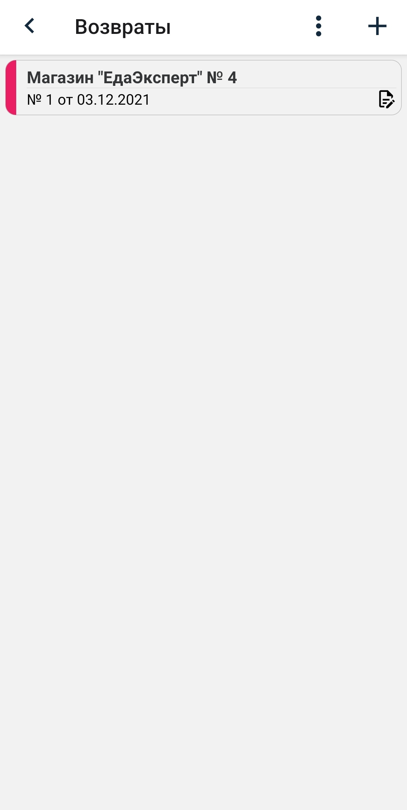 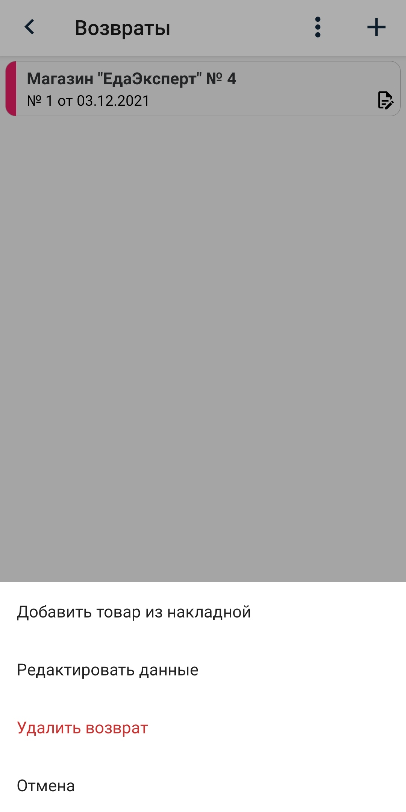

В отличии от заявок, в возврат есть возможность добавить товар только из накладной.

По нажатию на иконку **+** в верхнем правом углу переходим в экран поиска товаров из накладной. Указываем даты начала и окончания, и выбираем необходимый товар. По умолчанию период поиска берется за 30 дней до текущей даты, количество дней поиска можно изменять через настройки бэк-офиса в пункте бокового меню **Настройки**.

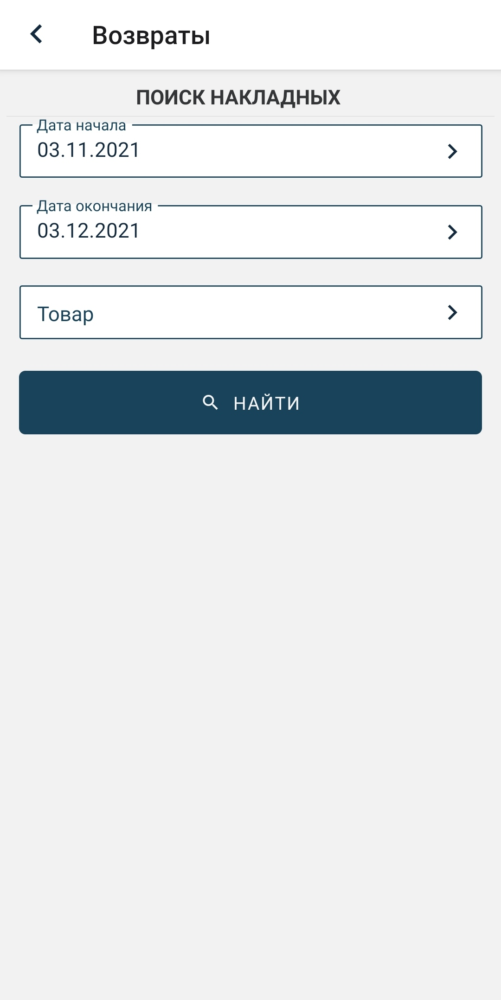 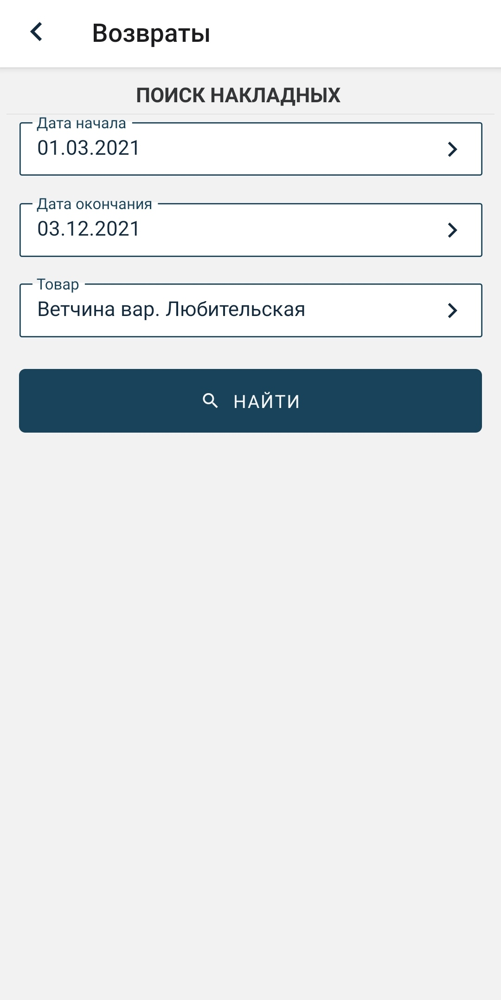

После завершения поиска отобразится список накладных.

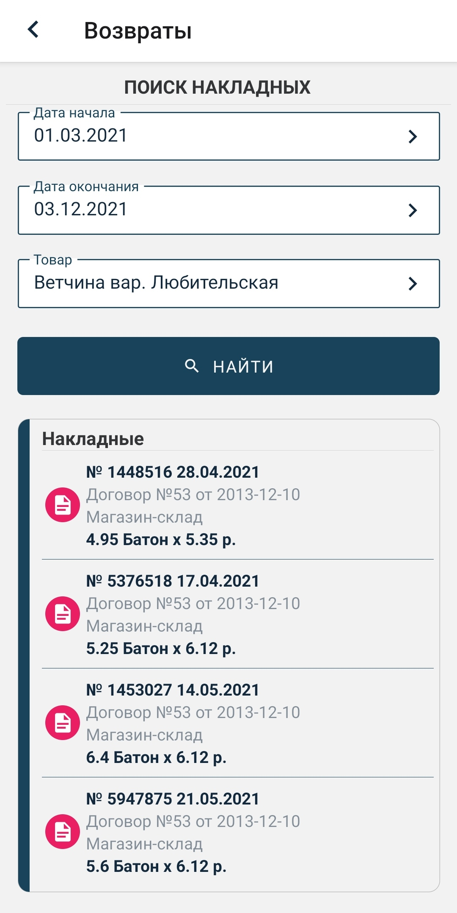

Если накладные не были найдены, на экран выведется надпись **Накладные не найдены**.

Если произошла ошибка подключения к серверу с данными, в нижней части экрана отобразится ошибка.

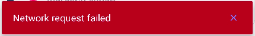

Выбраем необходимую накладную и попадаем на экран со списком позиций. Для редактирования доступно поле **Количество**. Нельзя указать количество, больше чем из накладной. Указываем нужное количество и добавляем.

 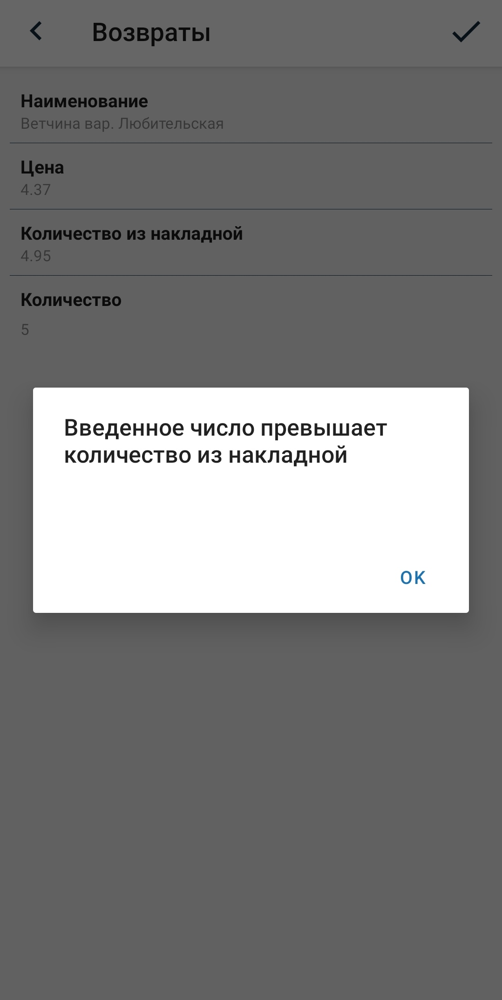 

После добавления попадаем в экран просмотра документа возврата.

По умолчанию у документа статус **Черновик**. Изменить статус можно в экране редактирования. Для этого нужно выбрать документ возврата. При изменении статуса возврат переходит в состояние **Готов к отправке**, цвет полосы становится зеленым.

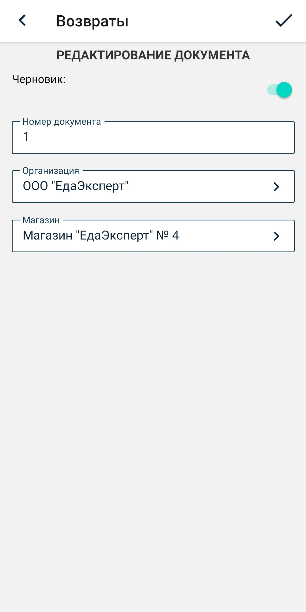  

Пока возврат не отправлен, он доступен для редактирования. Для этого нужно зайти в него и временно вернуть статус **Черновик**. После отправления возврата редактирование невозможно, цвет полосы становится желтым.

Для отправления заявки необходимо нажать на кнопку синхронизации, расположенную в боковом меню.

При получении подтверждения возврат переходит в архив, цвет полосы становится синим. При наличии ошибки в возврате появится надпись **Отказано** и вид ошибки.

Если смахнуть возврат влево, то появится меню в дополнительными иконками.

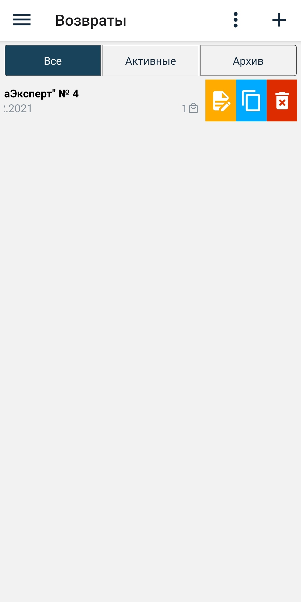

Данное меню позволяет редактировать возврат (если он является доступным для редактирования), копировать возврат и удалить.

## 8. Маршруты

Перейдем на экран **Маршруты**.

Документы сгруппированы следующим образом:

| Группа | Описание                                                                                                                                                                    |
| --------------- | --------------------------------------------------------------------------------------------------------------------------------------------------------------------------- |
| Все             | Все документы|
| Активные        | Документы, дата которых не менее текущей даты |
| Архив           | Документы, дата которых меньше текущей даты |

При выборе (нажатием на строку) необходимого маршрута откроется экран с торговыми точками, запланированными для посещения.

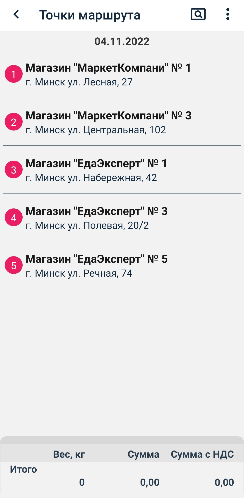 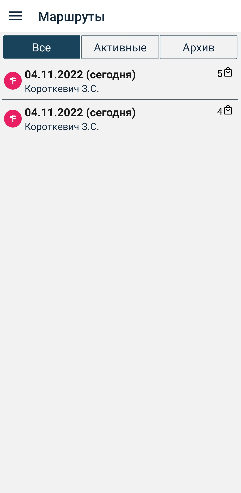

После нажатия на торговую точку откроется экран с визитом выбранного объекта.

Нажимаем на кнопку **Начать визит** (в этот момент один раз телефон попросит разрешение на получение геокоординаты, которая будет записана в визит данной точки).

 

Из экрана визита пользователь имеет возможность создать доступные в визите документы - заявку и возврат. Для создания заявки нажимаем на кнопку **Добавить документ** и выбираем тип документа **Заявка**.

После добавления заявки откроется экран просмотра документа.

   

Добавим товар, выбрав иконку **+**.

 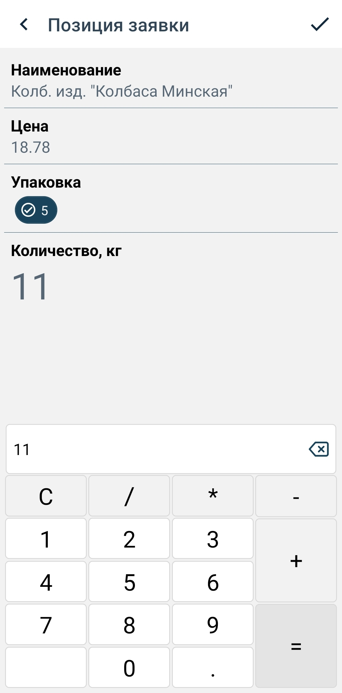 

Аналогично создаем документ возврата. Для создания нажимаем на кнопку **Добавить документ** и выбираем тип документа **Возврат**.

После добавления возврата откроется экран просмотра документа.

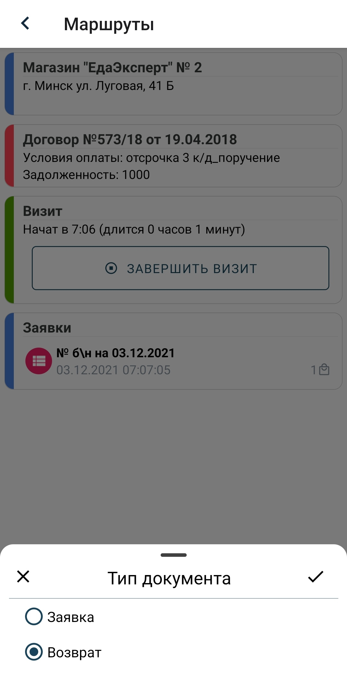  

Добавим товар из накладной.

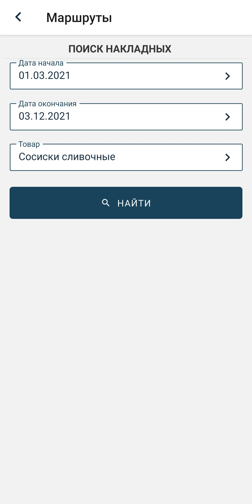 

 

После создания необходимых документов завершаем визит нажатием на кнопку **Завершить визит**. У всех документов будет изменен статус на **Готов к отправке** и отобразится кнопка **Отправить**.

Отправим данные визита нажатием на кнопку **Отправить**.

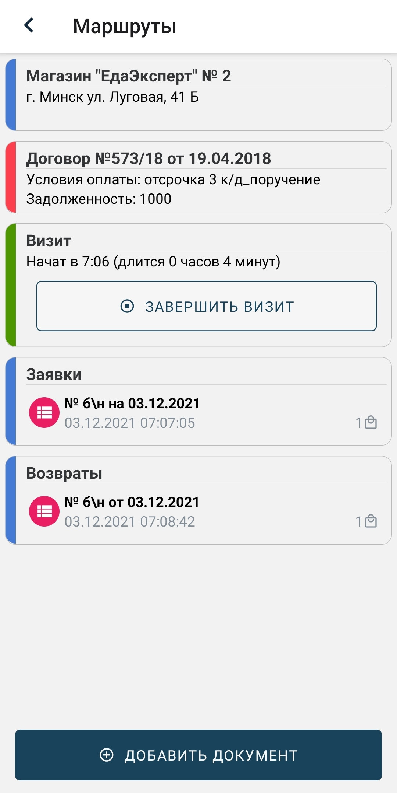  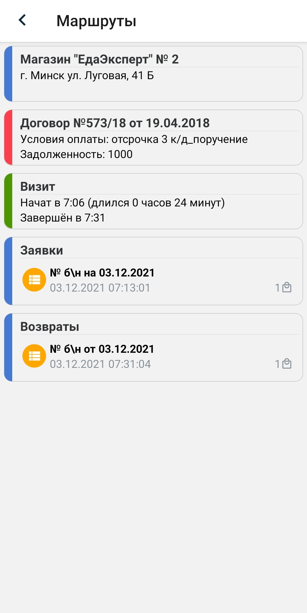

Данный визит в окне просмотра визитов отобразится как завершенный (кружок с галочкой). Активный визит обозначается кружком с треугольником.

Заявки и возвраты из визитов также можно просмотреть в пунктах бокового меню **Заявки** и **Возвраты**.

 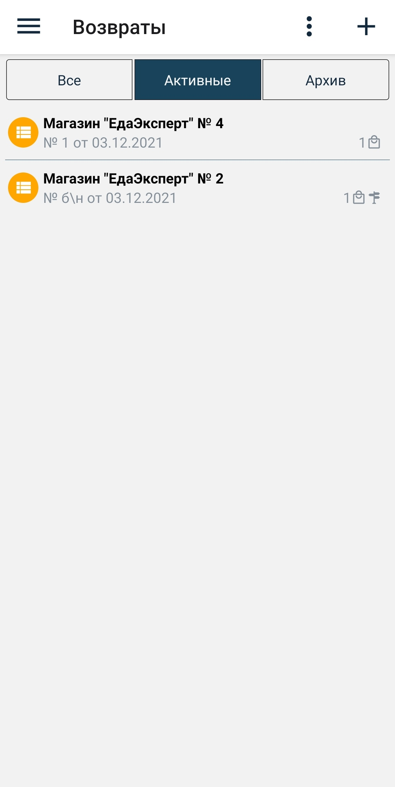

## 9. Карта

На экране **Карта** представлены две вкладки, содержащие информацию по выбранному маршруту.

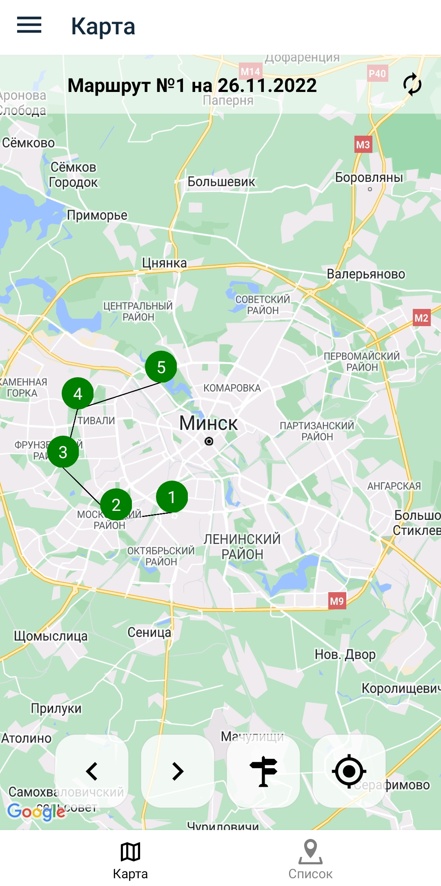 

Во вкладке **Список** показаны все точки маршрута в виде списка.

Во кладке **Карта** отображены все точки маршрута на карте. Кнопками < и > можно, приближаясь к точкам, перемещаться между объектами. Так же кнопками можно получить свою текущую координату и отобразить все объекты на экране.

В верхней части экрана указано название маршрута, который в данный момент отображается на карте. Для смены маршрута необходимо нажать на иконку смены маршрута (справа от названия маршрута), после чего в нижней части экрана появится экран с выбором маршрута. Выберем второй маршрут.

 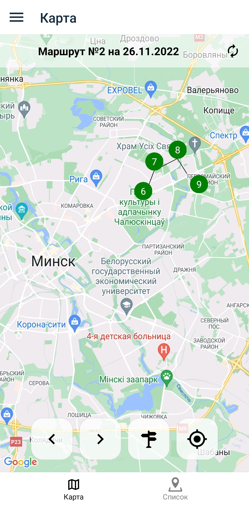

При нажатии на точку маршрута изменится цвет данной точки, появится название возле точки и в верхней части экрана. Также во вкладке **Список** отбразится, что данная точка выбрана.

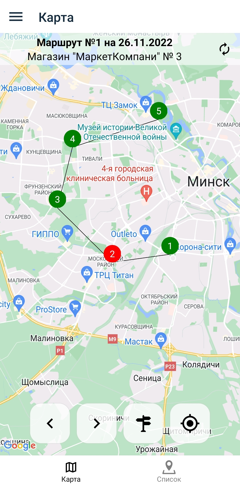 

Выберем во вкладке **Список** другую точку и посмотрим ее отображение на карте.

 

## 10. Профиль

Экран **Профиль** содержит информацию о пользователе и об устройстве. Также здесь можно выйти из учетной записи пользователя. При наличии настроек пользователя, они также будут отображены в данном экране.

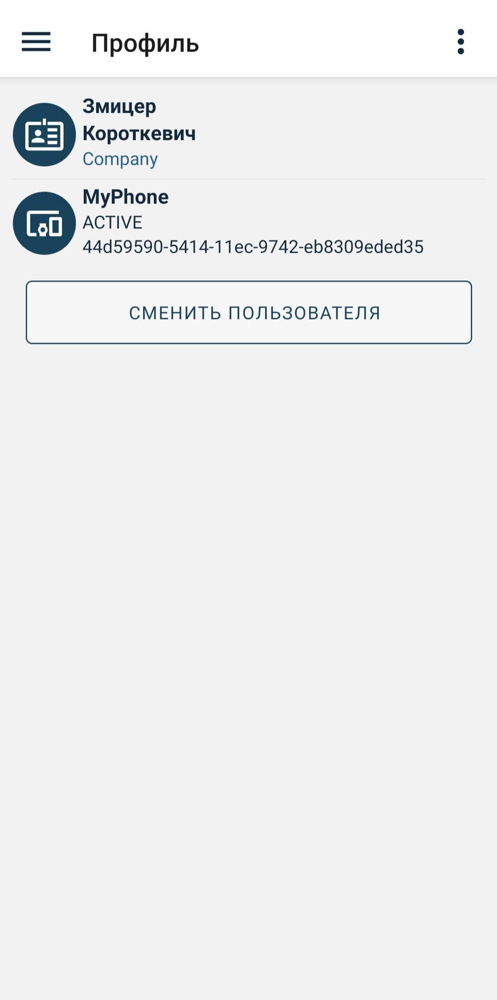 

Если вход был произведен в демо режиме, кнопка **Сменить пользователя** меняется на **Выйти из демо режима**

Также этот экран позволяет удалить все справочники и документы. Для этого необходимо нажать на иконку меню, расположенную в правом верхнем углу, и выбрать пункт **Удалить все справочники и документы**.

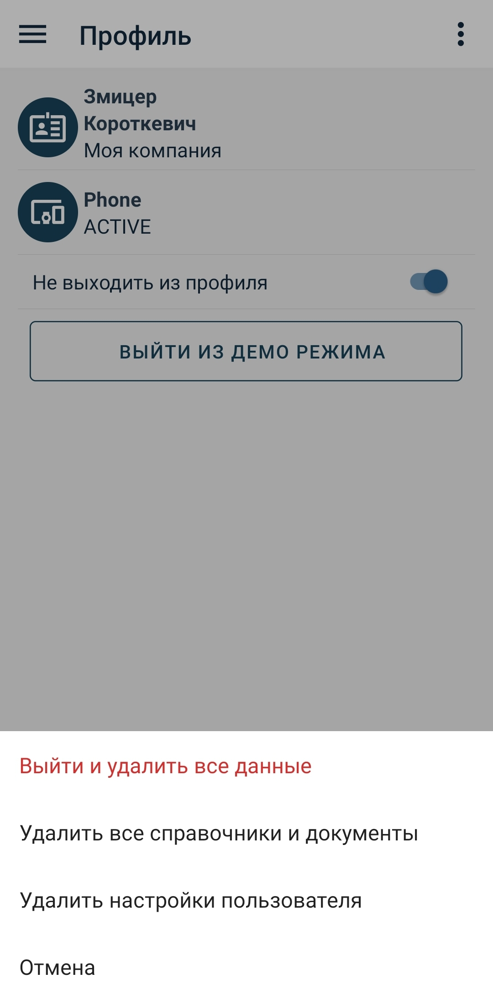

## 11. О программе
На данном экране можно узнать информацию о приложении и о контактных данных разработчика, перейдя по ссылке **Документация** ознакомиться с полным функционалом приложения.

