# Инструкция для мобильного приложения GDMN Отдел снабжения

## 1. Руководство пользователя мобильного приложения

### 1.1 Установка и подключение

Устанавливаем приложение на мобильный телефон. После выполнения установки приложения необходимо на рабочем столе кликнуть по иконке:

​

В стартовом экране есть возможность выбрать режим подключения.

При нажатии на кнопку **Подключиться в демо режиме** выполняется автоматический вход в приложение с предварительно загруженными данными пользователя и устройства.

Загрузка данных и работа в приложении пояснена далее в пунктах 1.2 - 1.5.

Выйти из демо режима можно двумя способами.

Первый способ - закрытие приложения. После нового открытия приложения стартовый экран не изменится.

Во втором способе необходимо открыть боковую панель нажатием на иконку меню, находящуюся в верхнем углу слева. Затем перейти на экран **Профиль** и нажать на кнопку **Выйти из демо режима**.

По нажатию на **Подключиться к серверу** переходим на экран подключения к серверу. После этого стартовый экран изменится на **Подключиться к серверу**, и войти в демо режим можно будет из настроек подключения.

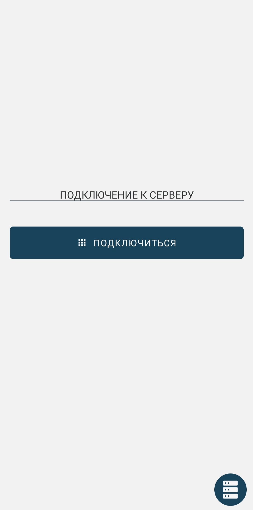

В правом нижнем углу находится иконка, по нажатию на которую можно перейти на экран **Настройка подключения**.

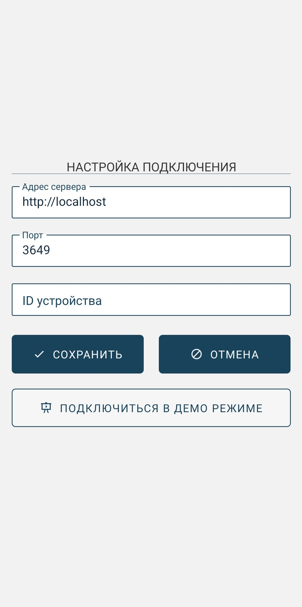

Если поля **Адрес сервера** и **Порт** являются пустыми, их необходимо заполнить. Поле **ID устройства** будет заполнено автоматически после активации кода. Также данный экран позволяет повторно подключиться в демо режиме.

Вернемся в предыдущий экран и нажмем кнопку **Подключиться**.

Если подключение прошло успешно, то появляется экран **Активация устройства**, предназначенный для ввода кода активации (при повторном запуске в будет происходить автоматический вход в учетную запись пользователя). Здесь нужно ввести код, ранее полученный в web-admin, и нажать **Отправить**. По нажатию на иконку в правом нижнем углу можно перейти в предыдущий экран.

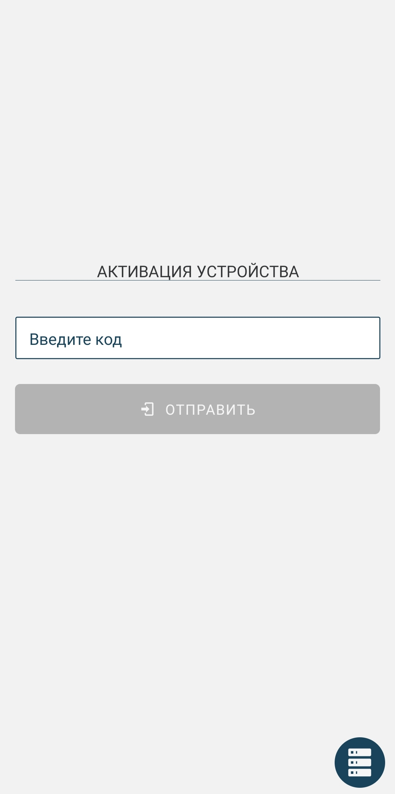 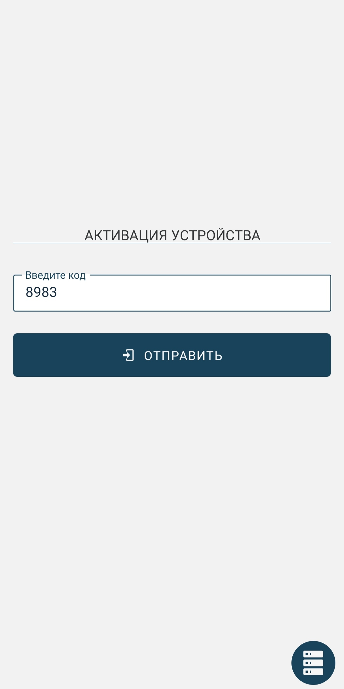

Если активация устройства прошла успешно, появляется экран для входа пользователя. В соответствующие поля необходимо ввести **Имя пользователя** и **Пароль** и нажать на кнопку **Войти**. По нажатию на иконку в правом нижнем углу можно перейти в предыдущий экран.

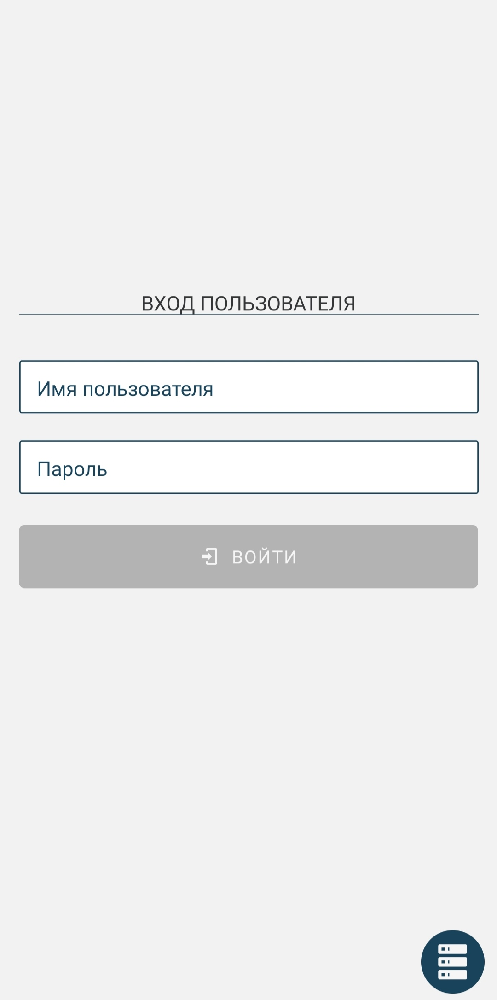 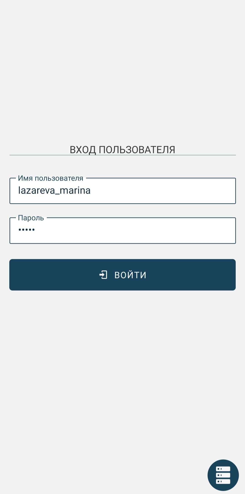

При успешном выполнении входа попадаем в экран **Заявки**.

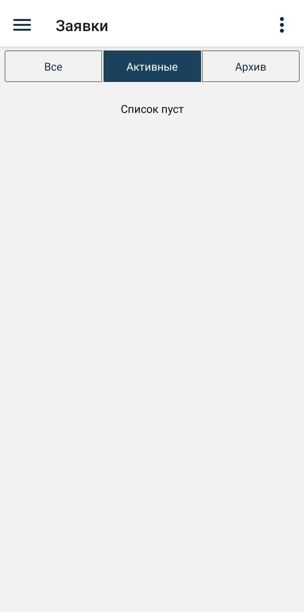

Так как это первый вход, данные не загружены. Необходимо загрузить данные - справочники и заявки. Для этого необходимо вызвать боковое меню по нажатию на иконку меню, находящуюся в верхнем углу слева.

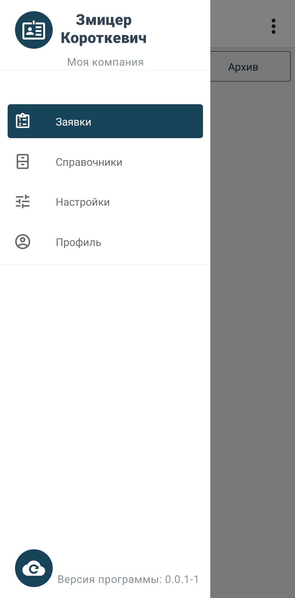

Далее нажать на иконку синхронизации данных слева в нижнем углу меню.

​

После обработки запроса в **Гедымине** необходимо через пару минут нажать на иконку загрузки данных слева в нижнем углу. Это обеспечит загрузку справочников и заявок.

### 1.2. Заявки

| Заявки   | Описание                                                                                                                                                                 |
| -------- | ------------------------------------------------------------------------------------------------------------------------------------------------------------------------ |
| Активные | Данные заявки являются необработанными, либо же обработанными, но не синхронизированными с Гедымином.                                                                    |
| Архив    | Данные заявки являются обработанными и отправленными в Гедымин, на них получено обратное сообщение о синхронизации. Не подлежат редактированию, возможен только просмотр |
| Все      | Активные заявки и заявки из архива                                                                                                                                       |

У каждой заявки есть боковая полоса, которая отображает состояние заявки. При смене состояния заявки меняется и цвет полоски.

| Цвет полосы | Описание состояния                        |
| ----------- | ----------------------------------------- |
| Розовый     | Заявка существует                         |
| Зеленый     | Заявка обрабатывается                     |
| Желтый      | Заявка оправлена, ожидается подтверждение |
| Синий       | Заявка архивирована                       |

После создания заявки цвет боковой полосы становится розовым.

При нажатии на заявку, доступную к редактированию, открывается окно редактирования.

Заявку можно **Разрешить** или **Отклонить**. Нажмем на **Разрешить** и вернемся на экран просмотра всех заявок.

После обработки заявка переходит в состояние **Обработано** и боковая полоса становится зеленой.

Зайдем в другую заявку и отклоним ее. При отказе необходимо внести причину отказа в появившемся окне.

 

Вернемся в экран просмотра всех заявок. У двух заявок цвет полосы зеленый, они в состоянии **Обработано**.

**До нажатия кнопки Синхронизации с Гедымином можно заходить в заявку и менять решение неограниченное количество раз. После отправки заявки вход в нее запрещен**
Нажмем на кнопкц синхронизации, расположенной на боковой панели. Заявки приобрели статус **Отправлено**, боковая полоска становится желтой.

После повторного нажатия кнопки синхронизации от Гедымина приходит подтверждение, что заявка в базе синхронизирована с мобильным, и заявка переносится в архив (полоса становится синей). Если по какой-то причине синхронизация в Гедымине не прошла, в строке заявки в в списке заявок будет указано, что произошла ошибка синхронизации и заявку можно будет еще раз отредактировать и отправить.

Иконка **⋮** в правом верхнем углу вызывает нижнее меню, позволяющее удалить все заявки с мобильного устройства. В случае необходимости их можно загрузить из базы Гедымина нажатием кнопки синхронизации.

### 1.3.Справочники

Экран **Справочники** содержит информацию о справочниках устройства.

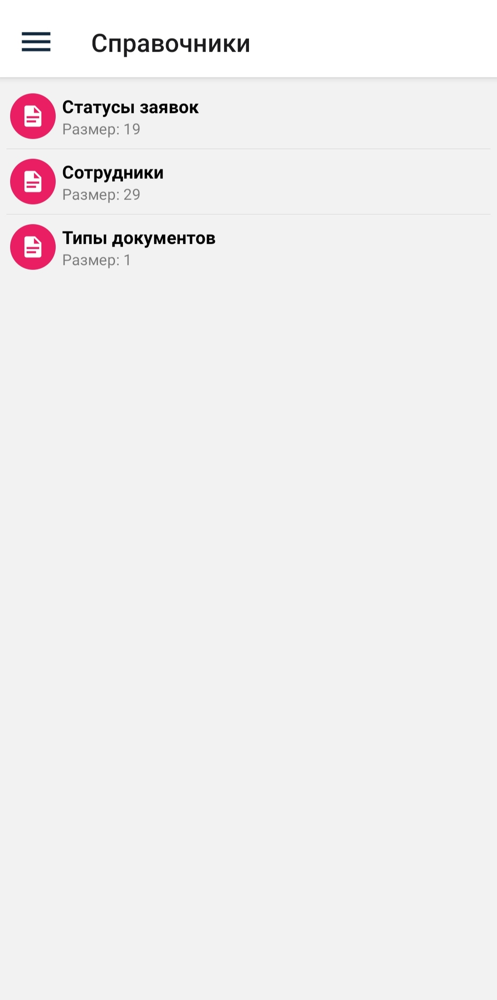

При нажатии на конкретный справочник переходим на экран просмотра.

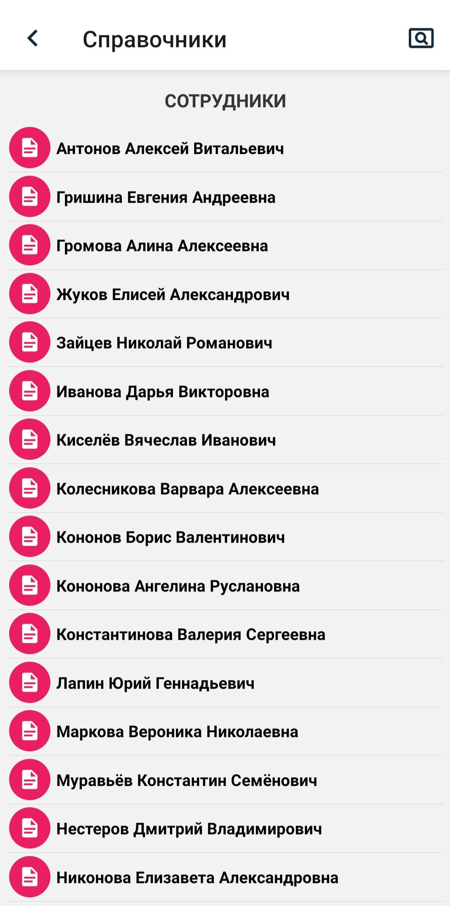

При нажатии на иконку поиска в правом верхнем углу появляется окно для поиска.

По нажатию на товар можно перейти в окно просмотра позиций.

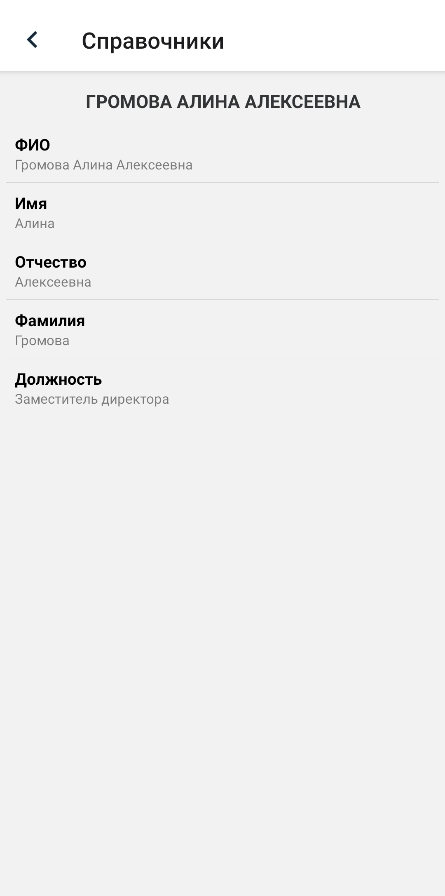

Рассмотрим еще один справочник.

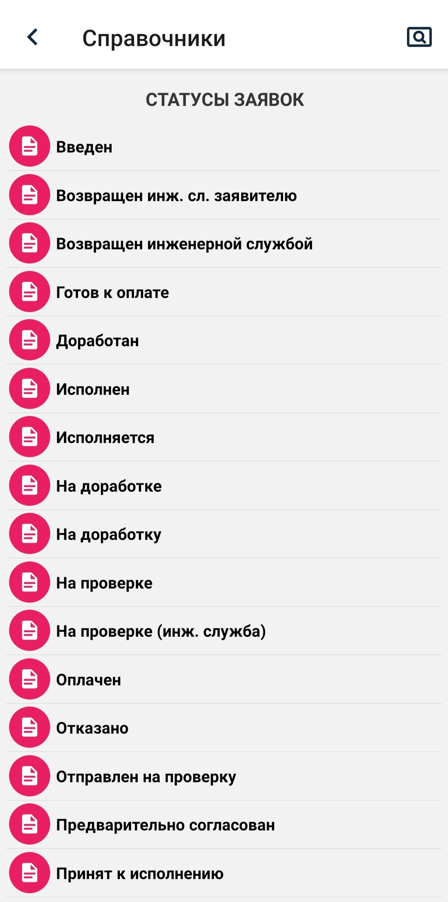 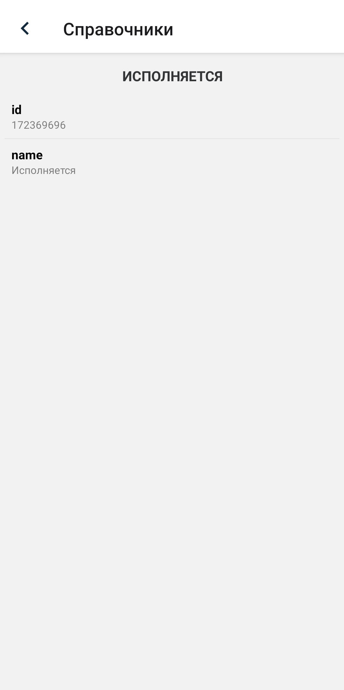

### 1.4. Настройки

Экран **Настройки** содержит информацию о настройках устройства: о параметрах связи с сервером и о настройках приложения. Настройки приложения доступны для изменения пользователем. По нажатию на иконку меню, расположенную в правом верхнем углу, можно вернуться к начальным настройка, выбрав пункт **Установить настройки по умолчанию**.

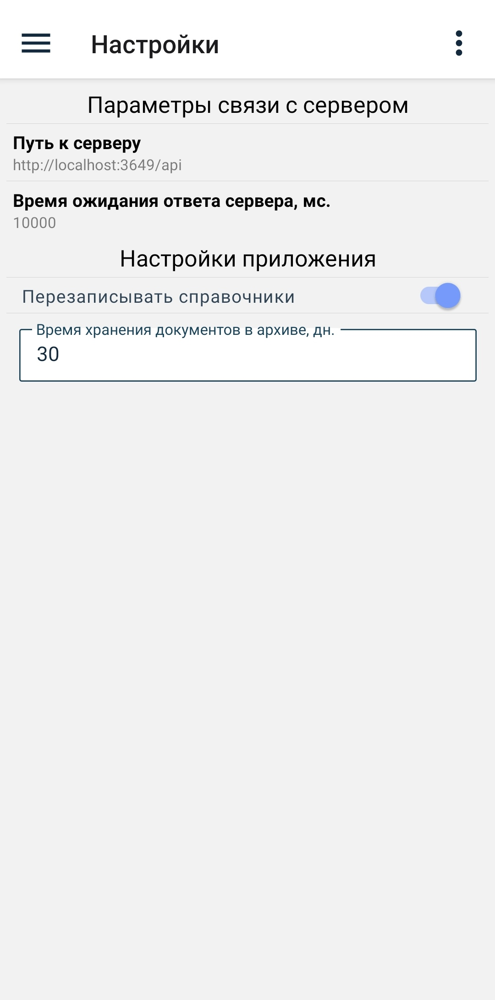 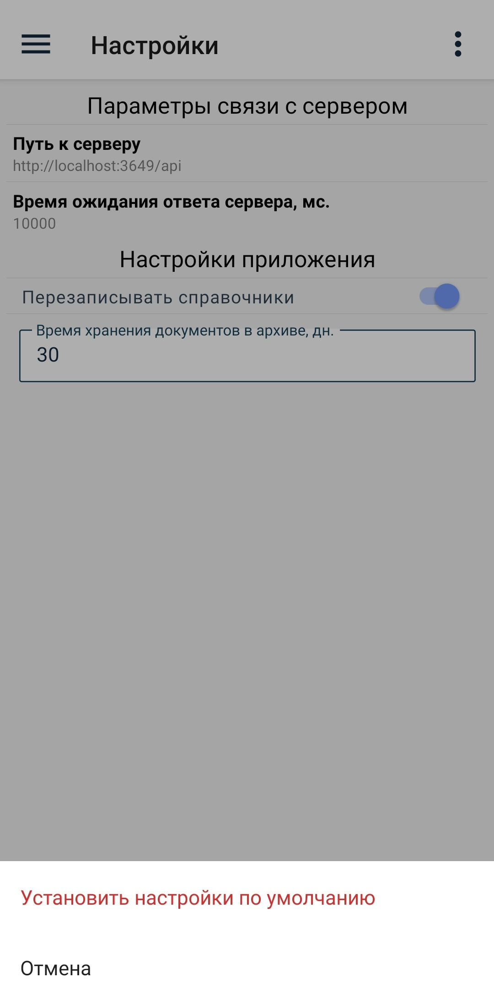

### 1.5. Профиль

Экран **Профиль** содержит информацию о пользователе и об устройстве. Также здесь можно выйти из учетной записи пользователя.

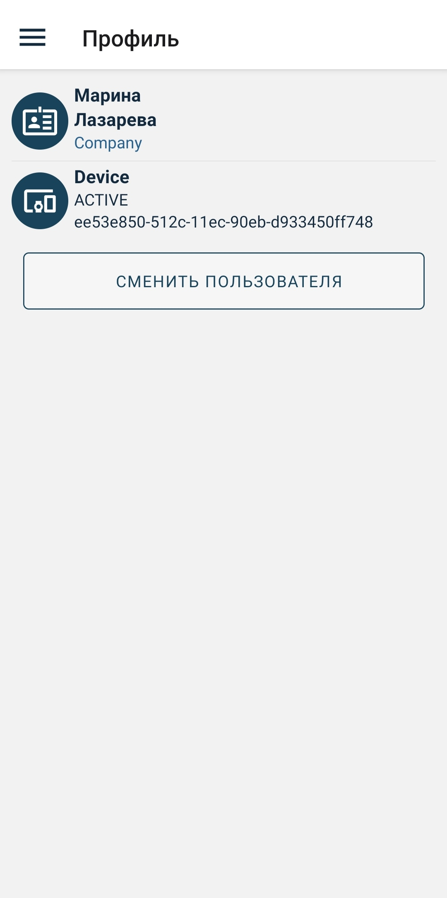

## 2. Руководство пользователя мобильного приложения в системе ГЕДЫМИН

В исследователе подсистема **Мобильное приложение** состоит из следующих пунктов:

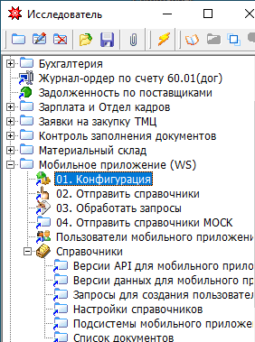​

### 01.Конфигурация

Пункт **Конфигурация** содержит параметры подключения и логины и пароли служебных пользователей, а также кнопки для проверки корректности внесенных данных.

URL содержит полный URL компьютера, где запущен сервер приложения.

Кнопка **Проверить** позволяет проверить наличие соединения с сервером. При правильной отработке получаем сообщение **_Подключение к серверу прошло успешно!_**. Кнопка **Получить код** заполняет код компании по названию из системы администрирования.

**Важно! Не изменяйте имена и пароли служебных пользователей и версии API!**

Проверить, что служебные пользователи правильно настроены в системе администрирования, можно с помощью соответствующих кнопок. При наличии ошибок в результате данной проверки система будет функционировать неправильно.

**Активная база** содержит путь к той базе, на которой возможна обработка запросов. Если путь не совпадает с путем текущей базы, запросы обрабатываться не будут, будет выдана соответствующая ошибка. **Необходимо оставить это поле пустым на рабочей базе, пока идет отладка на тестовой, чтобы даже случайно не загрузить данные с мобильного устройства на рабочую базу. После завершения периода отладки очистите это поле на тестовых базах, чтобы отправленные из мобильного данные нельзя было выгрузить на тест.**

​

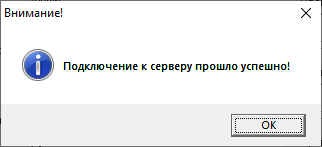​

### 03.Обработать запросы

В данном пункте производится обработка запросов с мобильного приложения. При подключенной автозадаче обработки ручная обработка запросов по кнопке не требуется.

### Пользователи мобильного приложения

Данный пункт содержит список пользователей с настройками.

**Важно! Не удаляйте и не редактируйте служебных пользователей gdmn и system!**

Если пользователи не настроены или в системе администрирования добавились новые, их надо импортировать из системы администрирования макросом **GDMN**. Получить пользователей из **WEB_ADMIN** в пункте Пользователи мобильного приложения. Существующие пользователи будут отредактированы, новые пользователи будут добавлены. После добавления новых пользователей их необходимо отредактировать. Для этого выберите в пункте **Пользователь** нужного пользователя из выпадающего списка, подсказка будет в поле **Логин** из мобильной системы. В пункте **Пароль** ввести тот же пароль, который присвоили в WEB_ADMIN.

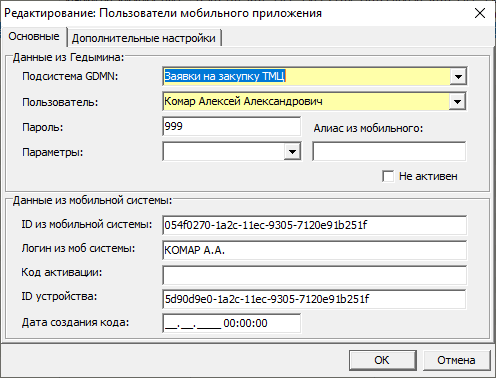​
