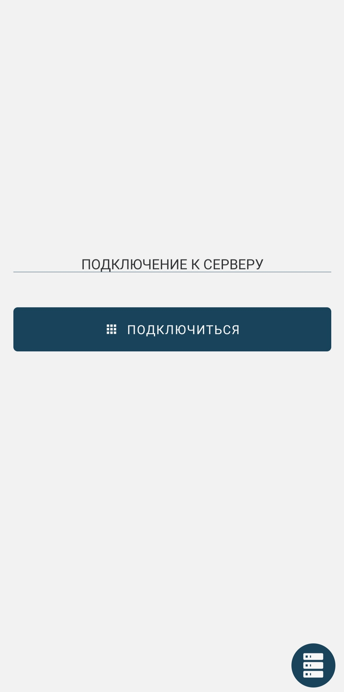
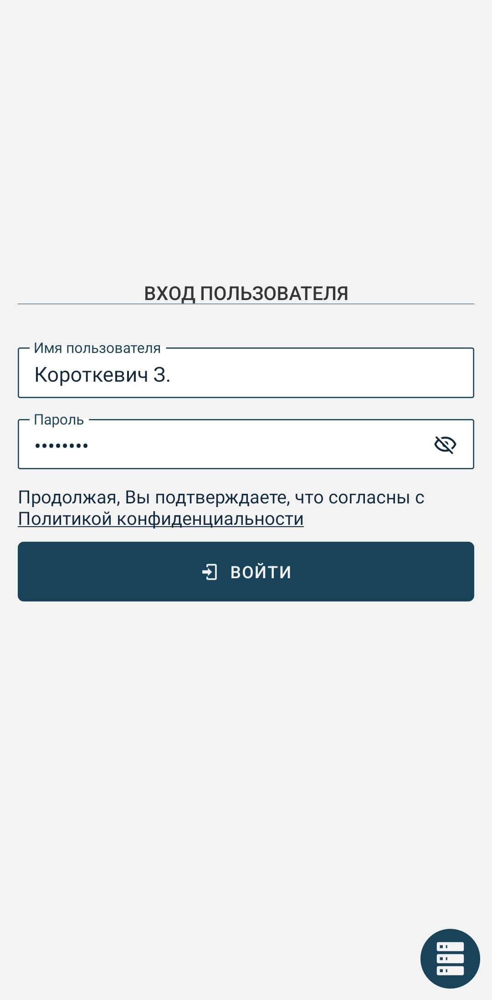
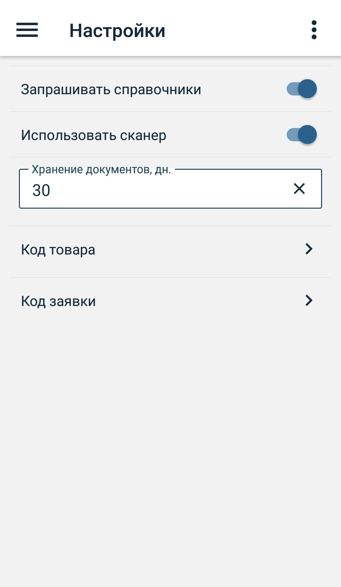
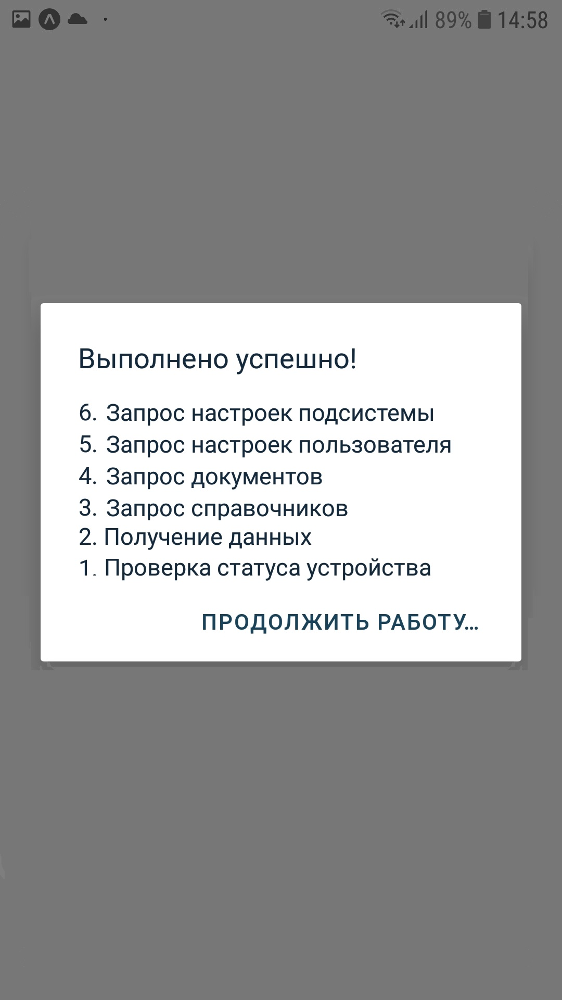
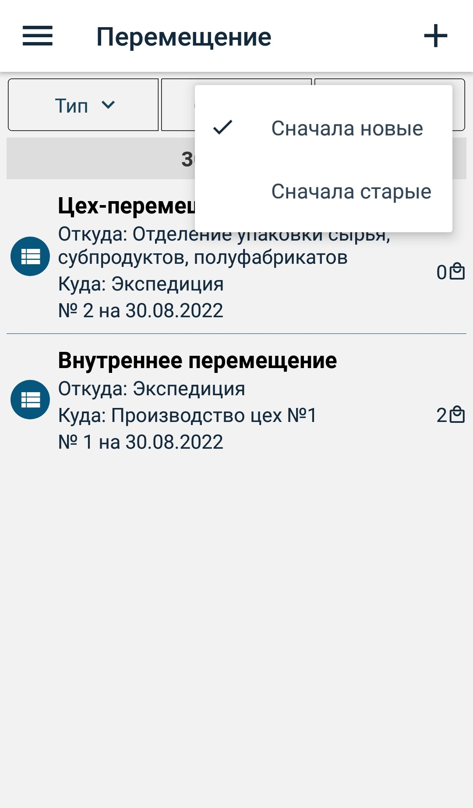
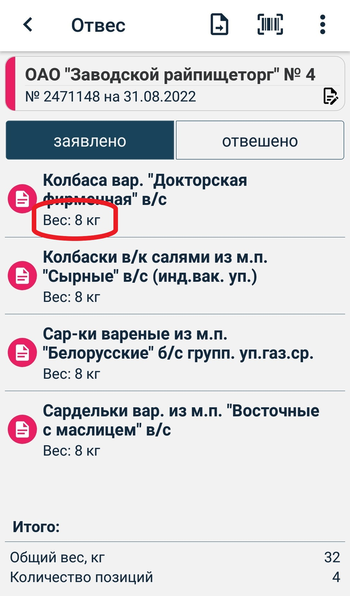
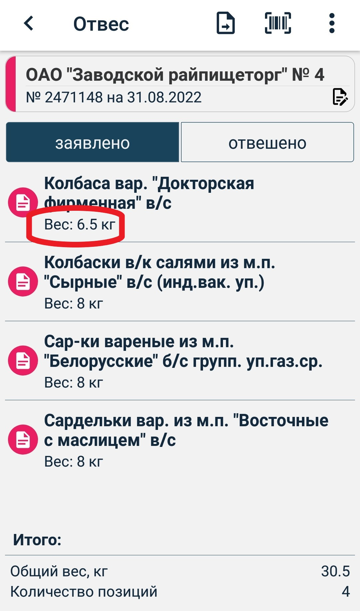

# Инструкция для мобильного приложения "GDMN. Отгрузка"

## 1. Подключение

Чтобы запустить приложение, находим его иконку    на рабочем экране мобильного устройства и нажимаем на нее.

При первом запуске приложения откроется стартовый экран, в котором будет предложено выбрать режим подключения:
- Демо режим ( НАЧАТЬ РАБОТУ )
- Подключение к серверу

### Демо режим
При нажатии на кнопку демо режима **Начать работу** выполняется автоматический вход в приложение под тестовым пользователем.

В данном режиме можно ознакомиться с функционалом приложения offline (без подключения к базе данных) на демо данных.

Загрузка данных и работа в приложении пояснена далее в пунктах 3-9.

Выйти из демо режима можно, открыв боковую панель нажатием на иконку меню **≡**, находящуюся в верхнем углу приложения слева, или смахнув пальцем вправо с левого края устройства.

Затем перейти на экран **Профиль** и нажать на кнопку **Выйти из демо режима**.

### Подключение к серверу
Чтобы подключиться к рабочей базе данных, необходимо выбрать **Подключиться к серверу** для перехода на экран настройки подключения (с помощью иконки  ):

Системный администратор вашего предприятия должен сообщить вам адрес сервера и номер порта для подключения. Введите его в нижеуказанные поля. Обращаем ваше внимание, что поле ID устройства заполнять не надо. Оно будет заполнено автоматически после успешного подключения к серверу и ввода имени пользователя и пароля.

| Параметр | Описание |
| --------------------- | ------------------------------------------ |
| Адрес сервера | Точно введите адрес, переданный вам системным администратором. Адрес должен включать протокол и доменное имя или цифровой IP адрес сервера. Пример: http://localhost |
| Порт          | Порт сервера. Пример: 3649 |
| ID устройства | Сюда вводить ничего не надо. ID устройства будет заполнено автоматически после подключения к серверу |

При нажатии на кнопку **Сохранить** переходим к экрану для подключения к серверу:

Нажимаем кнопку **Подключиться**.

После успешного подключения к серверу появится экран **Активация устройства**.

В данном экране необходимо ввести код активации, который пользователь должен получить от администратора системы, и нажать **Отправить**.

При последующих запусках приложения будет происходить автоматический вход в учетную запись пользователя.

 

По нажатию на иконку в правом нижнем углу  можно снова перейти на экран подключения к серверу.

Если активация устройства прошла успешно, появится экран для входа пользователя.

В соответствующие поля необходимо ввести **Имя пользователя** и **Пароль** и нажать на кнопку **Войти**.

 

При успешной аутентификации пользователя откроется экран **Документы**.

## 2. Настройки

Экран **Настройки** содержит информацию о параметрах связи с сервером и настройки приложения.

Настройки приложения:

| Параметр | Описание |
| ------------ | -------- |
|Запрашивать справочники|_Если указан_, то при при каждой синхронизации на сервер будет отправляться запрос за справочниками. После обработки данного запроса сервер вернет приложению в ответ файл, содержащий данные запрашиваемых справочников.   _Если не указан_, то запрос за справочниками генерироваться не будет. В этом случае в системе ERP должна будет настроена автоматическая выгрузка справочников. Если признак не указан, а справочники при синхронизации не появляются в приложении, то необходимо повторить синхронизацию через некоторое время, или обратиться к администратору.|
|Использовать сканер|_Если указан_, то для сканирования штрихкода будет использован сканер терминала сбора данных.  _Если не указан_, то для сканирования штрихкода будет использована камеры устройства|
|Время хранения документов в архиве| Количество дней хранения обработанных документов в приложении, отсчитываемое от даты документа|

Код товара:

| Параметр | Описание |
| ------------ | -------- |
Мин. длина штрихкода| Число, которое означает минимальное количество символов для того, чтобы код опознавался как корректный |
|Вес товара, гр| Число, задающее количество символов в штрихкоде для определения веса товара в гр.|
|Дата (число)| Число, задающее количество символов в штрихкоде для определения числа в дате производства|
|Дата (месяц)| Число, задающее количество символов в штрихкоде для определения месяца в дате производства|
|Дата (год)| Число, задающее количество символов в штрихкоде для определения года в дате производства|
|Время (часы минуты)| Число, задающее количество символов в штрихкоде для определения времени производства|
|Код товара| Число, задающее количество символов в штрихкоде для определения кода товара в справочнике|
|Номер взешивания| Число, задающее количество символов в штрихкоде для определения порядка взвешивания в ящике(необходимо для подсчета количества тары в поддоне либо для однозначной идентификации штрихкода)|
|Тип взвешивания| Число, задающее количество символов в штрихкоде для определения типа взывешивания(поддон, ящик, штука)|
|Номер партии| Число, задающее количество символов в штрихкоде для определения партии товара|

Код заявки:

| Параметр | Описание |
| ------------ | -------- |
Мин. длина штрихкода| Число, которое означает минимальное количество символов для того, чтобы код опознавался как корректный |
|Код подразделения| Число, задающее количество символов в штрихкоде для определения кода подразделения, на которое делается заявка|
|Дата (число)| Число, задающее количество символов в штрихкоде для определения числа в дате производства|
|Дата (месяц)| Число, задающее количество символов в штрихкоде для определения месяца в дате производства|
|Дата (год)| Число, задающее количество символов в штрихкоде для определения года в дате производства|
|Идентификатор заявки| Число, задающее количество символов в штрихкоде для определения идентификатора заявки в ERP системе|

Пример:

По нажатию на иконку меню **≡**, расположенную в правом верхнем углу, можно вернуться к начальным настройкам, выбрав пункт **Установить настройки по умолчанию**.

 

## 3. Загрузка данных

Чтобы загрузить данные, предназначенные для пользователя, следует нажать на кнопку синхронизации данных  в нижней части бокового меню.

Открыть боковое меню можно нажатием на иконку меню **≡**, находящуюся в верхнем углу приложения слева, или смахнув пальцем вправо с левого края устройства.

  

После загрузки данных в приложении должны появится справочники и все необходимые документы.

Если синхронизация прошла, но данных не появилось, то необходимо повторить синхронизацию через некоторое время.

Рядом с иконкой отобразится дата и время последней синхронизации.

## 4. Справочники

На экране **Справочники** можно просмотреть данные, загруженные в приложение для работы.

  

Пример справочника подразделения:

 

Чтобы найти справочник по наименованию можно воспользоваться строкой поиска в правом верхнем углу экрана.

## 5. Перемещение

### Cоздание документа

Документ перемещения позволяет оформлять перемещение товара между подразделениями.

Документ можно создать:
- из окна дашборда, нажав на кнопку "Перемещение",
- из бокового меню, выбрав пункт "Перемещение" и нажав на иконку **+** в верхнем правом углу.

Обязательные поля для заполнения: **Номер**, **Дата**, **Тип** и поля в зависимости от типа документа.

В зависимости от типа документа поля "Откуда" и "Куда" заполняются автоматически значениями параметров, которые можно просмотреть в пункте меню "Профиль -> Настройки пользователя", но при необходимости можно выбрать и другие значения из списка.
Например, для склада адресного хранения - подразделение отгрузки и подразделение хранения.

Типы перемещений для адресного хранения:

| Тип | Описание |
| ------------ | -------- |
| На хранение | По умолчанию заполнится поле "Откуда" значением подразделения отгрузки, "Куда" - подразделением хранения. Также необходимо выбрать ячейку, в которую будет помещен данный товар в окне выбора ячеек. В Гедымине будет создан документ перемещения, в позициях которых будут заполнены признаки СТАРЫХ карточек - дата поступления, номер партии, номер ячейки и код поддона нулевые, а НОВЫХ - дата поступления, номер партии, номер ячейки и код поддона. |
| С хранения | По умолчанию заполнится поле "Откуда" значением подразделения хранения, "Куда" - подразделением отгрузки. Также необходимо выбрать ячейку, из которой перемещается данный товар. В Гедымине будет создан документ перемещения, в позициях которых будут заполнены признаки СТАРЫХ карточек - дата поступления, номер партии, номер ячейки и код поддона, в НОВЫХ - дата поступления, номер партии, а номер ячейки и код поддона нулевые.|
| Внутреннее | Поля "Откуда" и "Куда" необходимо заполнить вручную. Если тип подразделения - адресное хранение, то будет отрисовано окно выбора номера ячейки, как для подразделения "Откуда", так и "Куда". В Гедымине будет создан документ перемещения, в позициях которых будут заполнены признаки СТАРЫХ карточек - дата поступления, номер партии. Соответственно будут заполнены или обнулены признаки номера ячейки и поддона.|
| Смена ячеек | Вручную необходимо заполнить поле "Откуда". Также необходимо выбрать ячейки, откуда и куда перемещается товар. В Гедымине будет создан документ перемещения, в позициях которых будут заполнены признаки СТАРЫХ карточек - дата поступления, номер партии, код поддона и номер ячейки, из которой перемещение, а в НОВЫХ карточках - дата поступления, номер партии, номер новой ячейки и код поддона.|

  

Типы перемещений без адресного хранения:

Добавить после

После заполнения данных документ сохраняем, нажав на иконку **✓** в правом верхнем углу.

Отредактировать введенные данные можно, нажав на шапку документа, или используя пункт меню Редактировать данные.

### Добавление товара

Добавить новую позицию можно 2 способами:
- путем сканирования штрихкода товара
- путем ввода штрихкода вручную

Сам товар ищется в справочнике товаров (либо в остатках по подразделению, если в настройках приложения установлен признак "Использовать остатки") по коду товара из штрихкода. Его можно определить по настройкам в пункте меню "Настройки => Код товара". По умолчанию штрихкод состоит из 28-30 символов, а 4 символа (с 17-го по 20-ый) - это код товара:
- c 1 по 6 (6 символов)  - вес товара в гр.,
- с 7 по 16 (10 символов) - дата и время производства (ддммггччсс),
- с 17 по 20 (4 символа) - код товара,
- с 21 по 24 (4 символа) - номер взвешивания,
- с 25 по 30 (от 4 до 6 символов, в зависимости от минимальной длины штрихкода) - номер партии.

Остальные значения из штрихкода сохраняются в позиции для дальнейшего использования при формировании документа перемещения в Гедымине.

#### _Сканирование штрихкода_

Уточнение: если вы производите сканирование штрихкодов исключительно с помощью камеры устройства, то в настройках приложения необходимо отключить признак **Использовать сканер**.

**Сканирование товара на ТСД** осуществляется нажатием кнопки сканирования на устройстве, находясь на экране просмотра документа. Если товар по считанному штрихкоду будет найден в справочнике товаров, то будет создана новая позиция товара с данными из штрихкода.

Позиция не будет добавлена, если:
- штрихкод некорректный
- товар по считанному штрихкоду не найден в справочнике товаров
- товар с данным штрихкодом уже существует в текущем документе

В этих случаях будет выведено соответствуещее сообщение.

**Сканирование камерой устройства**

Нажимаем на иконку штрихкода  в верхнем правом углу и переходим на экран сканирования товара.

Экран сканирования на мобильном устройстве:

При удачном сканировании штрихкода на экране отобразится информация о товаре.

Подтверждаем добавление товара в документ нажатием на синюю кнопку с данными o товаре.

Далее экран вернется в режим сканирования. И так добавляем все необходимые позиции.

После добавления всех товаров выходим из режима сканирования, нажав иконку Стрелка влево в меню сверху.

Если отсканированный штрихкод не найден в справочнике, то на экране появится сообщение, что отсканированный товар не найден в справочнике и будет предложено пересканировать:

В случае, если штрихкод по каким-то причинам поврежден и не считывется, его можно ввести вручную, нажав иконку
 в верхнем правом углу экрана сканирования. На экране появится диалоговое окно для ввода штрихкода вручную.

#### _Добавление товара вручную_

Нажимаем на иконку меню **≡**, расположенную в правом верхнем углу, выбираем пункт **Ввести штрихкод**, как изображено на картинке ниже.

На экране появится диалоговое окно для ввода штрихкода. Добавление позиции будет аналогично сканированию.

 

#### Отмена последнего сканирования

Нажимаем на иконку меню **≡**, расположенную в правом верхнем углу, выбираем пункт **Отменить последнее сканирование**.

Последняя позиция в документе будет удалена.

### Редактирование позиции

На ТСД по нажатию на **F3** можно изменить данные последней позиции:

Вставить блок-схему по тексту:

Нажимаем на позицию, отрисовывается окошко со вводом количества коробок, вводим его

Далее, смотрим на вес
Если меньше 25, то это не поддон
Тогда с новым количеством коробок меняется и вес

Если есть признак Использовать остатки,  смотрим, есть в остатках или нет

Если есть, то смотрим на новый вес - меньше тонны или нет
Если меньше, то просто обновляем позицию - новый вес, новой кол-во коробок, новый шк, старый в ней записан
Если больше тонны - то высчитываем, на сколько позиций надо разбить, чтобы вес позиции не превышал тонну, и добавляем эти позиции с новыми весом, шк, количеством (его тоже в зависимости от веса пересчитать)

Если Использовать остатки не стоит, то см. абзац выше

Если вес 25 и больше, то просто вводим новое кол-во коробок и меняем шк
Вес не меняется, от остатков не зависит
В случае, если это На хранение или С хранения, шк не меняется

### Статус документа

Цвет иконки или боковой полосы шапки документа означает его статус. При смене статуса меняется и цвет.
Имеется 4 статуса:

| Статус | Цвет    | Описание                          |
|------------| ------- | ------------------------------------------ |
|Черновик| Красный | Новый документ, который можно редактировать|
|Готов| Зеленый | Документ, который можно отправлять на обработку (снят признак **Черновик**). Нельзя редактировать. |
|Отправлен| Желтый  | Документ отправлен, ожидается подтверждение (после нажатия кнопки синхронизации документы со статусом **Готов** меняют статус на **Отправлен**) |
|Обработан успешно| Синий   | Документ получил подтверждение об успешной обработке на сервере (в случае, если документ обработан с ошибкой, статус меняется на **Черновик**)  |

В документах перемещения используется только 3 статуса: **Черновик**, **Отправлен** и **Обработан успешно**.

### Порядок работы

Вернемся на экран просмотра списка документов, выбрав пункт бокового меню **Перемещение**:

При создании документ имеет статус **Черновик** (красный цвет).

После ввода необходимых данных, чтобы отправить документ на обработку. Для этого есть два способа:

**1 способ**.  В экране документа нажать иконку отправки документа , расположенную справа от заголовка **Перемещение**. При утвердительном ответе на вопрос "Вы уверены, что хотите отправить документ?" документ перемещения буден переведен в статус **Отправлен** и его уже нельзя будет редактировать.

**2 способ**. Для всех документов кроме документов перемещения можно сменить статус документа **Черновик** на **Готов** в экране шапки документа.

Документ со статусом **Готов** редактировать нельзя. Чтобы отправить его на обработку, можно нажать на иконку отправки в окне просмотра документа.

  

Пока документ не отправлен, можно сменить статус **Готов** на статус **Черновик** и отредактировать данные.

Чтобы отправить все документы со статусом **Готов** на сервер, необходимо нажать на кнопку синхронизации в боковом меню.

После отправки документ перейдет в статус **Отправлен** (желтый цвет) - редактирование невозможно.

 

ВАЖНО! Далее необходимо подождать несколько минуту (зависит от периода времени обработки запросов в Гедымине) и синхронизировать данные снова для получения ответа.

При успешной обработке документа в ERP системе (Гедымине), статус изменится на **Обработан**, цвет иконки документа установится синим.

### Удаление документа

Удалять можно документы только со статусом **Черновик** и **Обработан**.

Множество документов или только один можно удалить из экрана списка документов.

Для этого необходимо нажать и удержать удаляемый документ до появления зеленой галочки и контекстного меню. Далее нажать на иконку Корзина и подтвердить действие.

Можно выбирать несколько документов для удаления.

Также документ можно удалить из окна просмотра документа, выбрав пункт меню "Удалить документ".

### Фильтры

Для удобства просмотра на экране документов можно использовать фильтры и сортировку:
- фильтр по типу документа
- фильтр по статусу документа
- сортировка по дате

  

| Фильтр по статусу | Описание |
| -- | -- |
| Все                  | Все|
| Активные             | Все документы, кроме тех, которые уже обработаны на сервере (со статусом **Черновик**, **Готов**, **Отправлен**).|
| Черновик             | Документы со статусом **Черновик**|
| Готово               | Документы со статусом **Готов**|
| Отправлено           | Документы со статусом **Отправлен**|
| Обработано           | Документы со статусом **Обработан успешно**|
| Черновик и Готов     | Документы со статусом **Черновик** и **Готов**|

## 6. Приход (только для адресного хранения)

Документ можно создать:
- из окна дашборда, нажав на кнопку "Приход",
- из бокового меню, выбрав пункт "Приход" и нажав на иконку **+** в верхнем правом углу.

Обязательные поля для заполнения: **Номер**, **Дата**, **Откуда** и **Куда**.

Если в профиле пользователя указано подразделение отгрузки по умолчанию, то поле **Куда** будет заполнено по умолчанию.
В полях **Откуда** и **Куда** можно выбрать только подразделения не для адресного хранения.

После заполнения данных документ сохраняем, нажав на иконку **✓** в правом верхнем углу.

### Добавление товара

Смотрите раздел "Перемещение -> Добавление товара".

### Редактирование позиции

Смотрите раздел "Перемещение -> Редактирование позиции".

### Фильтры

Для удобства просмотра на экране документов можно использовать фильтр по статусу документа:

  

| Фильтр по статусу | Описание |
| -- | -- |
| Все               | Все|
| Активные          | Все документы, кроме тех, которые уже обработаны на сервере (со статусом **Черновик**, **Готов**, **Отправлен**).|
| Архив             | Документы со статусом **Обработан успешно**|

## 7. Отвес

Данная опция предназаначена для создания отвес-накладных при отгрузке товаров в магазины фирменной торговли либо сторонним клиентам без предварительной заявки.

### Cоздание документа

Документ можно создать:
- из окна дашборда, нажав на кнопку "Отвес" для рублевой накладной или "Отвес $" для валютной,
- из бокового меню, выбрав пункт "Отвес" для рублевой накладной или "Отвес $" для валютной и нажав на иконку **+** в верхнем правом углу.

Обязательные поля для заполнения: **Номер**, **Дата** и **Подразделение**.

Если в профиле пользователя указано подразделение отгрузки по умолчанию, то поле **Подразделение** будет заполнено по умолчанию.

После заполнения данных документ сохраняем, нажав на иконку **✓** в правом верхнем углу.

### Добавление товара

Смотрите раздел "Перемещение -> Добавление товара".

### Редактирование позиции

Смотрите раздел "Перемещение -> Редактирование позиции".

## 7. Отвес по заявке

Данная опция предназаначена для создания отвес-накладных при отгрузке товаров в магазины фирменной торговли либо сторонним клиентам по предварительным заявкам.

### Cоздание документа

Документ можно создать:
- из окна дашборда, нажав на кнопку "Отвес по заявке" для рублевого документа или "Отвес по заявке $" для валютного,
- из бокового меню, выбрав пункт "Отвес по заявке" для рублевой документа или "Отвес по заявке $" для валютного, и нажав на иконку **+** в верхнем правом углу.

В Гедымине на основе отвеса по заявке будет создан документ "Накладная на реализацию ГП" либо "Накладная на реализацию ГП (валюта)".

Далее необходимо отсканировать штрихкод заявки, по которой будет создан отвес.

Для этого на ТСД нужно нажать клавишу сканирования, а при использовании камеры устройства на иконку штрихкода .

Программа переходит на экран **Сканер заявки**. При успешном сканировании предлагается подтвердить выбор заявки, при неуспешном - пересканировать.

Если код по каким-то причинам не считывается, его можно ввести вручную, нажав иконку
 в верхнем правом углу экрана сканирования.

Отвес готов для сканирования товаров. Он содержит шапку с данными о клиенте и дате отгрузки и две вкладки для позиций: **Заявлено** и **Отвешено**.

Данные в шапку подставляются автоматически из заявки и доступны только для просмотра. Для этого надо кликнуть по шапке.

Изначально во вкладке **Заявлено** находятся все позиции с заявленным количеством. В процессе сканирования заявленное количество уменьшается на отсканированное количество. Во вкладке **Отвешено** добавляются отсканированнные позиции. Если отканировано количество большее, чем заявлено или отсканирован товар, которого не было в изначальной заявке, программа запросит подтверждения данного действия либо отклонения.

Когда добавлено все количество товара по заявке, позиция из закладки "Заявлено" удаляется.

При выборе опции **Отменить предыдущее сканирование** значения количества во вкладке **Заявлено** и **Отвешено** возвращается к предыдущим значениям соответственно.

### Добавление товара

Смотрите раздел "Перемещение -> Добавление товара".

### Редактирование позиции

Смотрите раздел "Перемещение -> Редактирование позиции".

## 8. Профиль

Экран **Профиль** содержит информацию о пользователе и об устройстве.

Для выхода из учетной записи необходимо нажать на кнопку **Сменить пользователя**.
Если вход был произведен в демо режиме, кнопка **Сменить пользователя** меняется на **Выйти из демо режима**.

В данном экране можно настраивать следующие параметры профиля:

| Параметр | Описание |
| ------------ | -------- |
|Не выходить из профиля|_Если указан_, то при каждом входе в приложение необходимо будет вводить логин и пароль пользователя.   _Если не указан_, то проверка данных пользователя будет запрашиваться каждые 7 дней - срок действия сессии (необходимо для защиты в случае передачи устройства другим пользователям, потери устройства и т.д.).|

Также этот экран позволяет удалить все справочники и документы. Для этого необходимо нажать на иконку меню, расположенную в правом верхнем углу, и выбрать пункт **Удалить все справочники и документы**.

  

## 9. Сканирование

Уточнение: если вы производите сканирование штрихкодов исключительно с помощью камеры устройства, то в настройках приложения необходимо отключить признак **Использовать сканер**.
