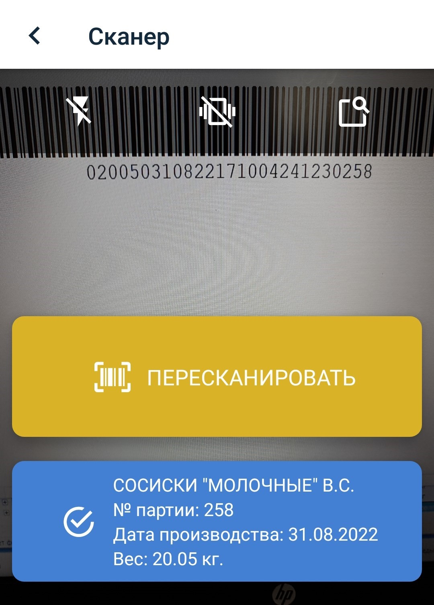
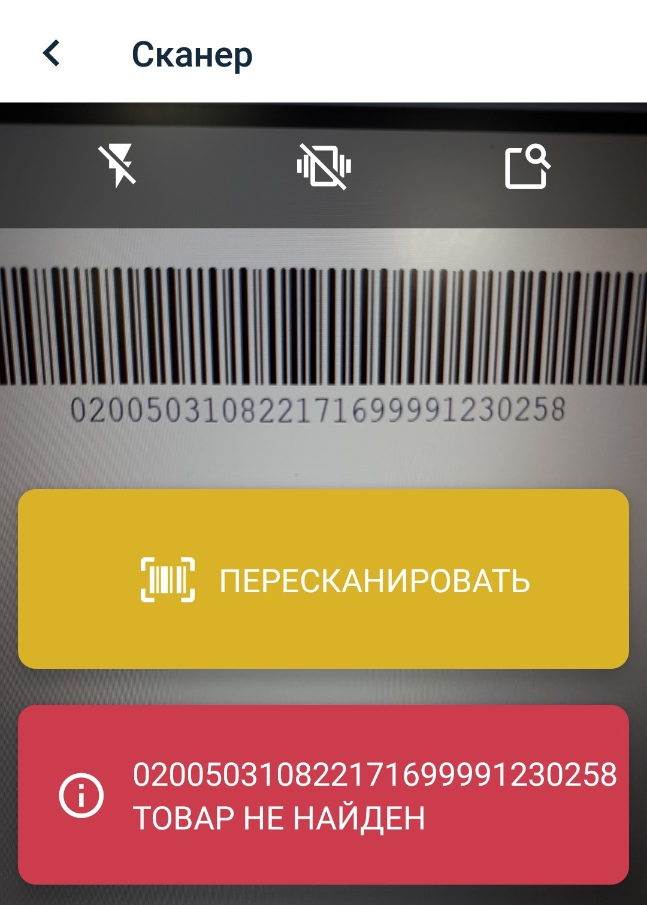
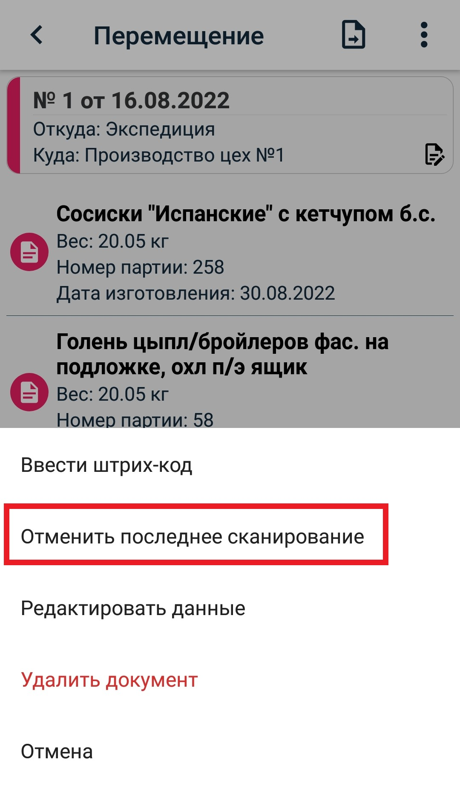
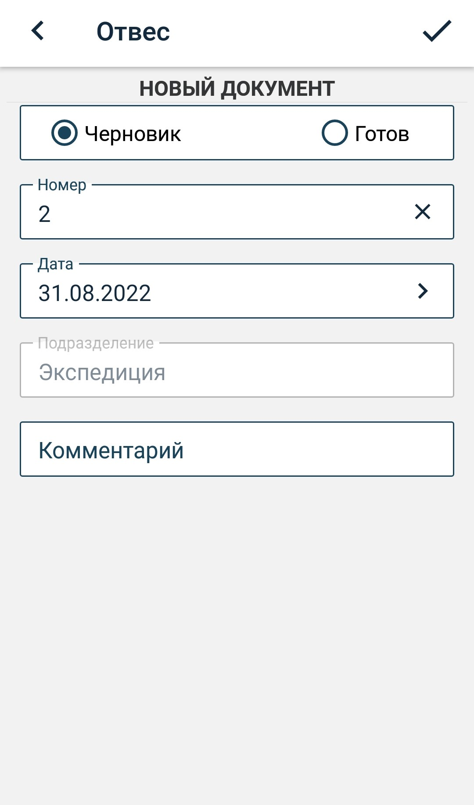
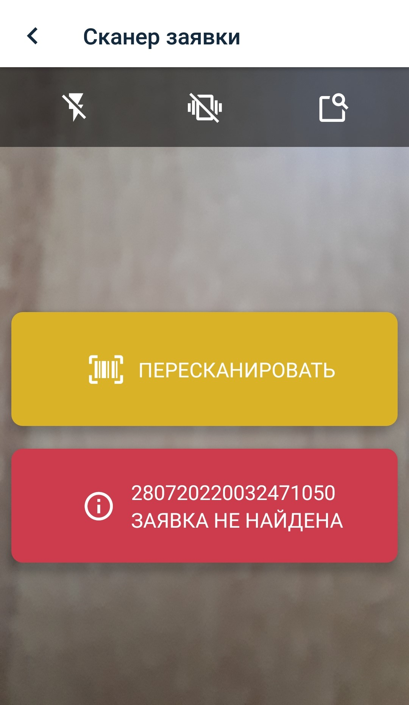
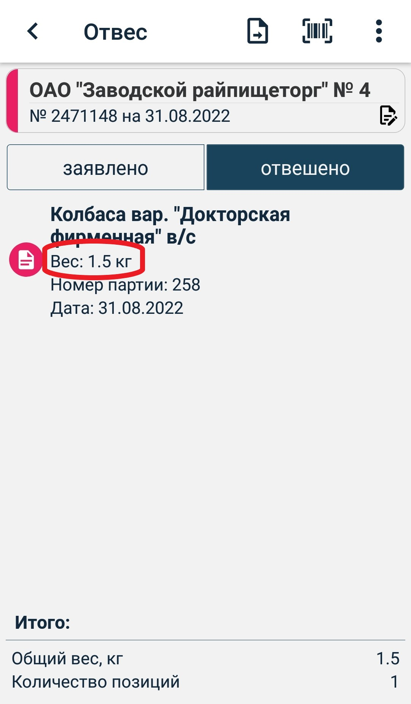

# Инструкция для мобильного приложения "GDMN. Отгрузка"

## 1. Подключение

Чтобы запустить приложение, находим его иконку    на рабочем экране мобильного устройства и нажимаем на нее.

При первом запуске приложения откроется стартовый экран, в котором будет предложено выбрать режим подключения:
- Демо режим ( НАЧАТЬ РАБОТУ )
- Подключение к серверу

### Демо режим
При нажатии на кнопку демо режима **Начать работу** выполняется автоматический вход в приложение под тестовым пользователем.

В данном режиме можно ознакомиться с функционалом приложения offline (без подключения к базе данных) на демо данных.

Загрузка данных и работа в приложении пояснена далее в пунктах 3-9.

Выйти из демо режима можно, открыв боковую панель нажатием на иконку меню **≡**, находящуюся в верхнем углу приложения слева, или смахнув пальцем вправо с левого края устройства.

Затем перейти на экран **Профиль** и нажать на кнопку **Выйти из демо режима**.

### Подключение к серверу 
Чтобы подключиться к рабочей базе данных, необходимо выбрать **Подключиться к серверу** для перехода на экран настройки подключения (с помощью иконки  ):

Системный администратор вашего предприятия должен сообщить вам адрес сервера и номер порта для подключения. Введите его в нижеуказанные поля. Обращаем ваше внимание, что поле ID устройства заполнять не надо. Оно будет заполнено автоматически после успешного подключения к серверу и ввода имени пользователя и пароля. В дальнейшем ID устройства может понадобиться вам для того-то и того-то.

| Параметр | Описание |
| --------------------- | ------------------------------------------ |
| Адрес сервера | Точно введите адрес, переданный вам системным администратором. Адрес должен включать протокол и доменное имя или цифровой IP адрес сервера. Пример: http://localhost |
| Порт          | Порт сервера. Пример: 3649 |
| ID устройства | Сюда вводить ничего не надо. ID устройства будет заполнено автоматически после подключения к серверу |

При нажатии на кнопку **Сохранить** переходим к окну для подключения к серверу:

Нажимаем кнопку **Подключиться**.

После успешного подключения к серверу появится экран **Активация устройства**.

В данном экране необходимо ввести код активации, который пользователь должен получить от администратора системы, и нажать **Отправить**.

При последующих запусках приложения будет происходить автоматический вход в учетную запись пользователя.

 

По нажатию на иконку в правом нижнем углу  можно снова перейти на экран подключения к серверу.

Если активация устройства прошла успешно, появится экран для входа пользователя.

В соответствующие поля необходимо ввести **Имя пользователя** и **Пароль** и нажать на кнопку **Войти**.

 

При успешной аутентификации пользователя откроется экран **Документы**.

## 2. Настройки

Экран **Настройки** содержит информацию о параметрах связи с сервером и настройки приложения.

Настройки приложения:

| Параметр | Описание |
| ------------ | -------- |
|Запрашивать справочники|_Если указан_, то при при каждой синхронизации на сервер будет отправляться запрос на справочники, который будет обрабатываться сервером и возвращаться в ответ c запрашиваемыми справочниками.   _Если не указан_, то запрос генерироваться не будет. Справочники будут выгружаться из сервера автоматически при каких-либо очередных изменениях на сервере.|
|Использовать сканер|_Если указан_, то для сканирования штрихкода будет использован сканер терминала сбора данных.  _Если не указан_, то сканировать штрихкоды необходимо при помощи камеры устройства|
|Время хранения документов в архиве| Количество дней хранения обработанных документов в приложении, отсчитываемое от даты документа|

Код товара:

| Параметр | Описание |
| ------------ | -------- |
Мин. длина штрихкода| Число, которое означает минимальное количество символов для того, чтобы код опознавался как корректный |
|Вес товара, гр| Число, задающее количество символов в штрихкоде для определения веса товара в гр.|
|Дата (число)| Число, задающее количество символов в штрихкоде для определения числа в дате производства|
|Дата (месяц)| Число, задающее количество символов в штрихкоде для определения месяца в дате производства|
|Дата (год)| Число, задающее количество символов в штрихкоде для определения года в дате производства|
|Время (часы минуты)| Число, задающее количество символов в штрихкоде для определения времени производства|
|Код товара| Число, задающее количество символов в штрихкоде для определения кода товара в справочнике|
|Номер взешивания| Число, задающее количество символов в штрихкоде для определения порядка взыешивания в ящике(необходимо для подсчета количества тары в поддоне либо для однозначной идентификации штрихкода)|
|Тип взвешивания| Число, задающее количество символов в штрихкоде для определения типа взывешивания(поддон, ящик, штука)|
|Номер партии| Число, задающее количество символов в штрихкоде для определения партии товара|

Код заявки:

| Параметр | Описание |
| ------------ | -------- |
Мин. длина штрихкода| Число, которое означает минимальное количество символов для того, чтобы код опознавался как корректный |
|Код подразделения| Число, задающее количество символов в штрихкоде для определения кода подразделения, на которое делается заявка|
|Дата (число)| Число, задающее количество символов в штрихкоде для определения числа в дате производства|
|Дата (месяц)| Число, задающее количество символов в штрихкоде для определения месяца в дате производства|
|Дата (год)| Число, задающее количество символов в штрихкоде для определения года в дате производства|
|Идентификатор заявки| Число, задающее количество символов в штрихкоде для определения идентификатора заявки в ERP системе|

По нажатию на иконку меню **≡**, расположенную в правом верхнем углу, можно вернуться к начальным настройкам, выбрав пункт **Установить настройки по умолчанию**.

  

## 3. Загрузка данных

Чтобы загрузить данные, предназначенные для пользователя, следует нажать на кнопку синхронизации данных  в нижней части бокового меню.

Открыть боковое меню можно нажатием на иконку меню **≡**, находящуюся в верхнем углу приложения слева, или смахнув пальцем вправо с левого края устройства.

  

После загрузки данных в приложении должны появится справочники и все необходимые документы.

Если синхронизация прошла, но данных не появилось, то необходимо повторить синхронизацию через некоторое время.

Рядом с иконкой отобразится дата и время последней синхронизации.

## 4. Справочники

На экране **Справочники** можно просмотреть данные, загруженные в приложение для работы.

  

Пример справочника подразделения:

 

Чтобы найти справочник по наименованию можно воспользоваться строкой поиска в правом верхнем углу экрана.

## 5. Перемещение

### Cоздание документа

По нажатию на иконку **+** в верхнем правом углу переходим на экран добавления документа.

Обязательные поля для заполнения: **Номер**, **Дата**, **Тип** и поля в зависимости от типа документа.

Для документа перемещения это поля **Откуда**, **Куда**. 

В зависимости от типа документа некоторые из этих полей могут быть заполнены по умолчанию. Для типа **Внутреннее перемещение** заполнено поле **Откуда**, для документа **Цех-перемещение** заполнено поле **Куда**.

  

После заполнения данных документ сохраняем, нажав на иконку **✓** в правом верхнем углу.

Отредактировать введенные данные можно, нажав на шапку документа.

 

### Добавление товара

Добавить новую позицию можно 2 способами:
- сканирование по штрихкоду
- добавление штрихкода вручную

#### _Сканирование штрихкода_

Уточнение: если вы производите сканирование штрихкодов исключительно с помощью камеры устройства, то в настройках приложения необходимо перевести параметр **Использовать сканер** в отрицательное положение.

**Сканирование на ТСД** осуществляется нажатием кнопки сканирования на устройстве. По считанному штрихкоду товар добавляется в позицию, если товар из шрихкода найден в справочнике товаров. Если штрихкод некорректный или такой товар не найден в справочнике товаров, выводятся соотвестствующие сообщения. Если товар с таким штрихкодом уже есть в данном документе, выведется соответствующее сообщение и товар добавлен не будет.

**Сканирование с камеры устройства** Нажимаем на иконку штрихкода  в верхнем правом углу и переходим на экран сканирования товара.

Экран сканирования на мобильном устройстве:

 

Сканируем штрихкод, на экране в синем прямоугольнике показывается информация об отсканированном товаре. Подтверждаем добавление товара в позицию нажатием на синий прямоугольник с данными o товаре. По окончании создания документа выходим из режима сканирования.

Если отсканированный штрихкод не найден в справочнике, то на экране появится сообщение, что отсканированный товар не найден в справочнике и будет предложено пересканировать:

В случае, если штрихкод по каким-то причинам поврежден и не считывется, его можно ввести вручную, нажав иконку 
 в верхнем правом углу экрана сканирования. На экране появится диалоговое окно для ввода штрихкода вручную.

#### _Добавление товара вручную_

Нажимаем на иконку меню **≡**, расположенную в правом верхнем углу, выбираем пункт **Ввести штрихкод**, как изображено на картинке ниже. На экране появляется диалоговое окно для ввода штрихкода. Если штрихкод неверного формата (не соответствует количество символов) выводится сообщение **Штрихкод неверного формата**. Если такой товар не найден в справочнике товаров, выводится соотвестствующее сообщение. Если товар с таким штрихкодом уже есть в данном документе, выведется соответствующее сообщение и товар добавлен не будет.

  

#### Отмена последнего сканирования

Нажимаем на иконку меню **≡**, расположенную в правом верхнем углу, выбираем пункт **Отменитиь последнее сканирование**. Последнее сканирование будет отменено.

### Статус документа

Цвет иконки или боковой полосы шапки документа означает его статус. При смене статуса меняется и цвет.
Имеется 4 основных статуса:

| Статус | Цвет    | Описание                          |
|------------| ------- | ------------------------------------------ |
|Черновик| Красный | Новый документ, который можно редактировать|
|Готов к отправке| Зеленый | Документ, который можно отправлять на обработку (снят признак **Черновик**). Нельзя редактировать. |
|Отправлен| Желтый  | Документ отправлен, ожидается подтверждение (после нажатия кнопки синхронизации документы со статусом **Готов к отправке** меняют статус на **Отправлен**) |
|Обработан успешно| Синий   | Документ получил подтверждение об успешной обработке на сервере (в случае, если документ обработан с ошибкой, статус меняется на **Черновик**)  |

### Порядок работы

Вернемся на экран просмотра списка документов, выбрав пункт бокового меню **Перемещение**:

При создании документ имеет статус **Черновик** (красный цвет).

После ввода необходимых данных, чтобы отправить документ на обработку. Для этого есть два способа:

**1 способ**.  В режиме редактирования документа нажать иконку отправки документа справа от заголовка **Перемещение**, как показано на картинке ниже. Программа спросит "Вы уверены, что хотите отправить документ?" При утвердительном ответе документ перемещения буден переведен в статус **Отправлен** и его уже нельзя будет редактировать.

**2 способ**. Необходимо снять признак **Черновик** на экране шапки документа.

Документ перейдет в состояние **Готов к отправке** (зеленый цвет) - редактировать данные нельзя.

  

Пока документ не отправлен, его можно вернуть из статуса **Готов к отправке** в статус **Черновик** и отредактировать данные.

Чтобы отправить документы со статусом **Готов к отправке** на сервер, необходимо нажать на иконку синхронизации.

После отправки документ перейдет в статус **Отправлен** (желтый цвет) - редактирование невозможно.

 

Далее необходимо подождать 1-2 минуту и синхронизировать данные снова для получения ответа обработки, цвет станет синим.

### Удаление документа

Для удаления нужно нажать на необходимый документ и удерживать его, после чего появится зеленая галочка, которая выделит данный документ среди прочих. Далее необходимо нажать иконку Мусорная корзина и подтвердить желание удалить документ, и документ удаляется. 

### Фильтры

Для удобства просмотра на экране документов можно использовать фильтры и сортировку:
- фильтр по типу документа
- фильтр по статусу документа
- сортировка по дате

  

| Фильтр по статусу | Описание                                                                                                                                                                    |
| --------------- | --------------------------------------------------------------------------------------------------------------------------------------------------------------------------- |
| Все             | Все документы                                                                                                                                    |
| Активные        | Все документы, кроме тех, которые уже обработаны на сервере (со статусом **Черновик**, **Готов к отправке**, **Отправлен**).                                                                |
| Черновик           | Документы со статусом **Черновик**|
| Готово           | Документы со статусом **Готов к отправке**|
| Отправлено           | Документы со статусом **Отправлен**|
| Обработано           | Документы со статусом **Обработан успешно**|

## 6. Отвес

Данная опция предназаначена для создания отвес-накладных при отгрузке товаров в магазины фирменной торговли либо сторонним клиентам без предварительной заявки.
### Cоздание документа

По нажатию на иконку **+** в верхнем правом углу переходим на экран добавления документа.

Обязательные поля для заполнения: **Номер**, **Дата** и **Подразделение**. 

Если в профиле пользователя указано подразделение по умолчанию, то поле **Подразделение** будет заполнено по умолчанию. 

 

После заполнения данных документ сохраняем, нажав на иконку **✓** в правом верхнем углу.

Во всем остальном работа с документом **Отвес** в мобильном приложении идентична работе с документом **Перемещение**, описанным выше.

## 7. Отвес по заявке

Данная опция предназаначена для создания отвес-накладных при отгрузке товаров в магазины фирменной торговли либо сторонним клиентам по предварительным заявкам.
### Cоздание документа

По нажатию на иконку **+** в верхнем правом углу программа предлагает меню для  выбора вида бухгалтерского документа, который будет создан в ERP на основе отвеса (Накладная на реализацию ГП либо Накладная на реализацию ГП (валюта)). 

Далее необходимо отсканировать штрихкод заявки, по которой будет создаваться отвес. 

Для этого на ТСД нужно нажать клавишу сканирования, а при использовании камеры устройства на иконку штрихкода . 

Программа переходит на экран **Сканер заявки**. При успешном сканировании предлагается подтвердить выбор заявки, при неуспешном - пересканировать.

Если код по каким-то причинам не считывается, его можно ввести вручную, нажав иконку 
 в верхнем правом углу экрана сканирования.

 
 
 

Отвес готов для сканирования товаров. Он содержит шапку с данными о клиенте и дате отгрузки и две вкладки для позиций: **Заявлено** и **Отвешено**.  

Данные в шапку подставляются автоматически из заявки и доступны только для просмотра. Для этого надо кликнуть по шапке.

 

Изначально во вкладке **Заявлено** находятся все позиции с заявленным количеством. В процессе сканирования заявленное количество уменьшается на отсканированное количество. Во вкладке **Отвешено** добавляются отсканированнные позиции. Если отканировано количество большее, чем заявлено или отсканирован товар, которого не было в изначальной заявке, программа запросит подтверждения данного действия либо отклонения.  

 
 

Когда заявленное количество полностью отсканировано, позиция с заявленным количеством исчезает, она содержится только во вкладке  **Отвешено**. 

При выборе опции **Отменить предыдущее сканирование** значения количества во вкладке **Заявлено** и **Отвешено** возвращается к предыдущим значениям соответственно.

Во всем остальном работа с документом **Отвес по заявке** в мобильном приложении идентична работе с документом **Перемещение**, описанным выше.

## 8. Профиль

Экран **Профиль** содержит информацию о пользователе и об устройстве. Также здесь можно выйти из учетной записи пользователя.

Если вход был произведен в демо режиме, кнопка **Сменить пользователя** меняется на **Выйти из демо режима**.

Также этот экран позволяет удалить все справочники и документы. Для этого необходимо нажать на иконку меню, расположенную в правом верхнем углу, и выбрать пункт **Удалить все справочники и документы**.

  

## 9. Сканирование

Уточнение: если вы производите сканирование штрихкодов исключительно с помощью камеры устройства, то в настройках приложения необходимо перевести параметр **Использовать сканер** в отрицательное положение.

