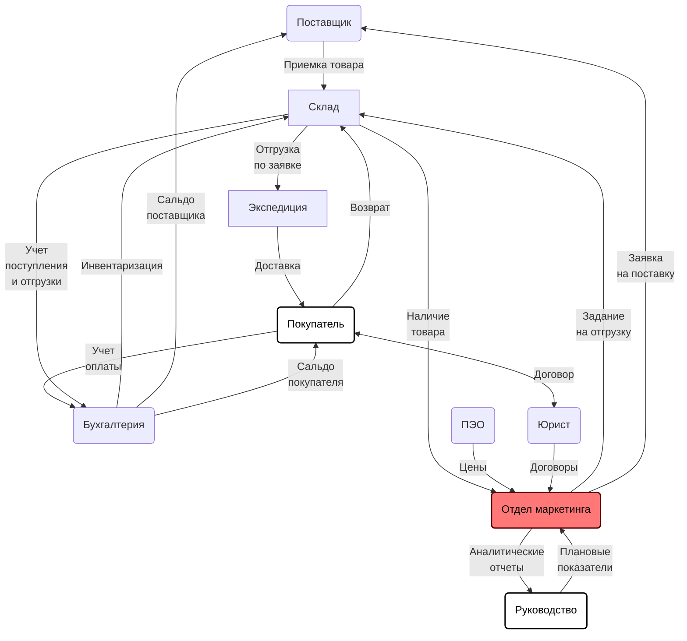

```mermaid

flowchart TD;
    A(Поставщик)--Приемка товара-->B[Склад];
    B--Наличие<br> товара-->M;
    B--Отгрузка<br> по заявке-->D[Экспедиция];
    D--Доставка-->E(Покупатель);
    E--Возврат-->B;
    Acc--Инвентаризация-->B;
    E--Учет<br> оплаты-->Acc(Бухгалтерия);
    M(Отдел маркетинга)--Задание<br> на отгрузку-->B;
    Acc--Сальдо <br>поставщика-->A;
    Acc--Сальдо<br> покупателя-->E;
    P(ПЭО)--Цены-->M;
    M--Заявка<br> на поставку-->A;
    B--Учет<br> поступления<br> и отгрузки-->Acc;
    M--Аналитические<br> отчеты-->Mngmt(Руководство);
    Mngmt(Руководство)--Плановые<br> показатели-->M;
    U(Юрист)--Договоры-->M;
    E<--Договор-->U;

    classDef core fill:#ff7777,color:#000,stroke:#550000,stroke-width:2px;
    classDef outlier fill:#ffffff,color:#000,stroke:#000000,stroke-width:2px,stroke-daskarray: 5, 5;
    class T,S,M core;
    class E,Mngmt outlier;
```
