# Инструкция для мобильного приложения "GDMN. Склад"

## 1. Подключение

Чтобы запустить приложение, находим его иконку  на рабочем экране мобильного устройства и нажимаем на нее.

При первом запуске приложения откроется стартовый экран, в котором будет предложено выбрать режим подключения:
- Демо режим ( НАЧАТЬ РАБОТУ )
- Подключение к серверу

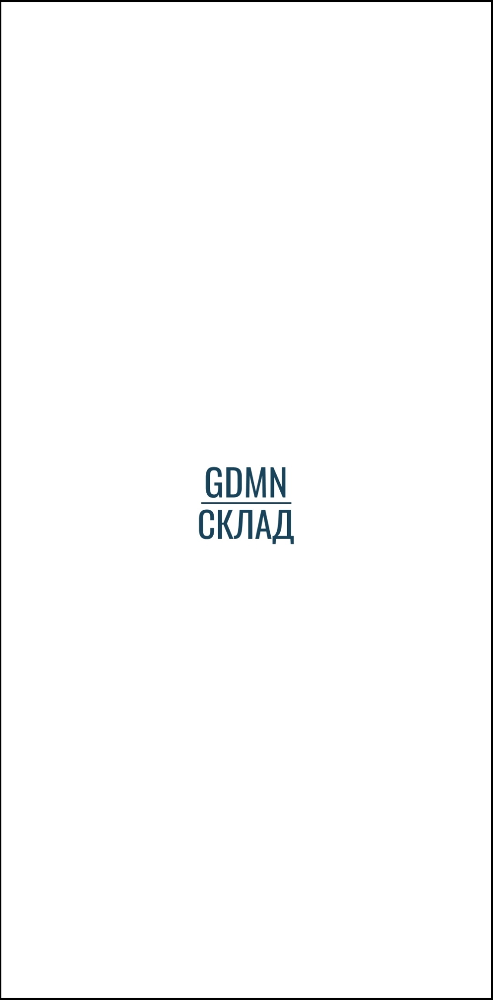 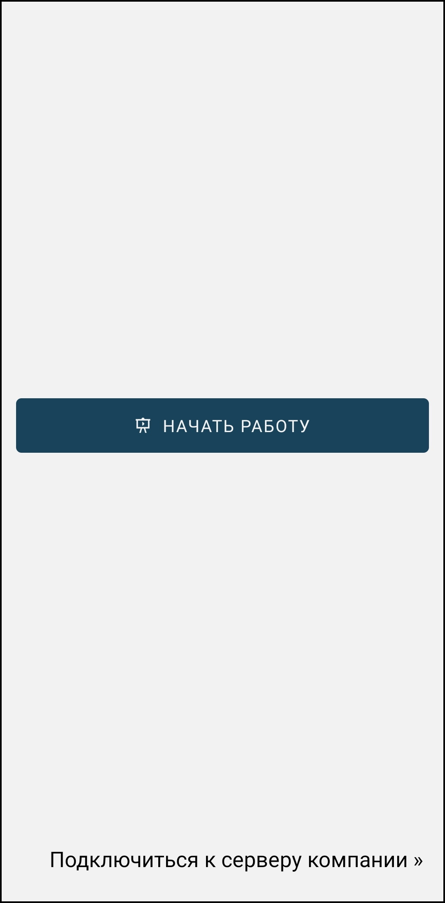

### Демо режим
При нажатии на кнопку демо режима **Начать работу** выполняется автоматический вход в приложение под тестовым пользователем.

В данном режиме можно ознакомиться с функционалом приложения offline (без подключения к базе данных) на демо данных.

Загрузка данных и работа в приложении пояснена далее в пунктах 3-9.

#### Выход из демо режима

Выйти из демо режима можно, открыв боковую панель нажатием на иконку меню " **≡** ", находящуюся в верхнем углу приложения слева, или смахнув пальцем вправо с левого края устройства. А затем перейти на экран **Профиль** и нажать на кнопку **Выйти из демо режима**.

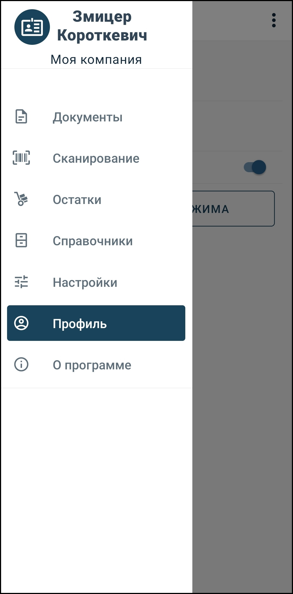 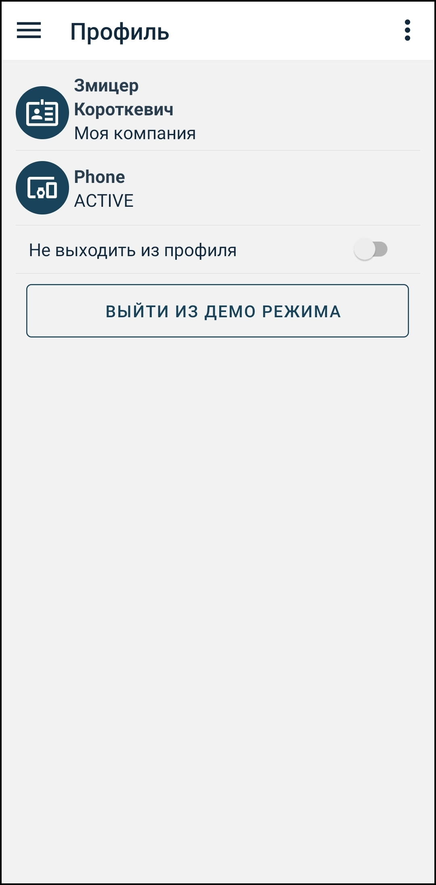

### Подключение к серверу компании

Чтобы подключиться к рабочей базе данных необходимо  выбрать **Подключиться к серверу** для перехода на экран **Настройка подключения** (с помощью иконки  ):

   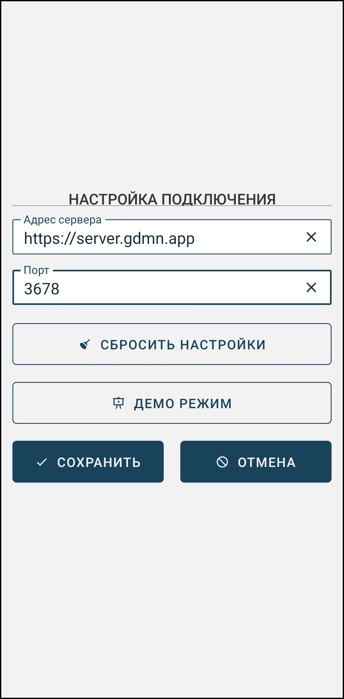

Системный администратор вашего предприятия должен сообщить Вам адрес сервера и номер порта для подключения. Введите его в экране **Настройки подключения** в нижеуказанные поля.

| Параметр | Описание |
| --------------------- | ------------------------------------------ |
| Адрес сервера | Точно введите адрес, переданный вам системным администратором. Адрес должен включать протокол и доменное имя или цифровой IP адрес сервера. Пример: http://localhost |
| Порт          | Порт сервера. Пример: 3678 |

При нажатии на кнопку **Сохранить** переходим к окну для подключения к серверу:

Нажимаем кнопку **Подключиться**.

После успешного подключения к серверу появится экран **Активация устройства**.

 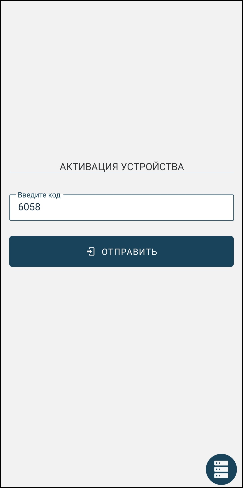

В данном экране необходимо ввести код активации, который пользователь должен получить от администратора системы, и нажать **Отправить**.

При последующих запусках приложения будет происходить автоматический вход в учетную запись пользователя, если в разделе **Профиль** бокового меню " **≡** " будет выставлен параметр **"Не выходить из профиля"**.

Если активация устройства прошла успешно, появится экран для входа пользователя.

В соответствующие поля необходимо ввести **Имя пользователя** и **Пароль** и нажать на кнопку **Войти**.

 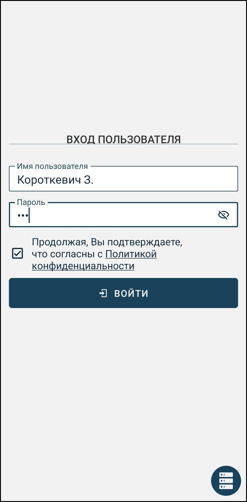

При успешной аутентификации пользователя откроется экран **Документы**. 

Далее необходимо: 
- зайти в **Настройки** и установить необходимые для работы параметры. Например, установить параметр **Запрашивать справочники**, выставить удобный для работы период синхронизации и так далее;
- загрузить данные, необходимые для работы пользователя с приложением, через ручную синхронизацию с помощью кнопки ;
- получить справочники. 

Всю информацию по этим действиям можно найти в нижеследующих разделах.

Также в окне "Настройка подключения" (в это окно можно попасть следуя инструкциям в разделе **Подключение к серверу компании**) есть кнопка "Сбросить настройки", по нажатию на которую вызовется диалоговое окно, где можно указать следующие действия:

- Установить настройки по умолчанию. Подставятся данные нашего сервера, например, адрес: https://server.gdmn.app, и порт: 3654.
- Удалить данные об устройстве. Номер устройства, который необходим для аутентификации, очистится. Повторно номер устройства можно получить по новому коду активации от администратора системы. 

 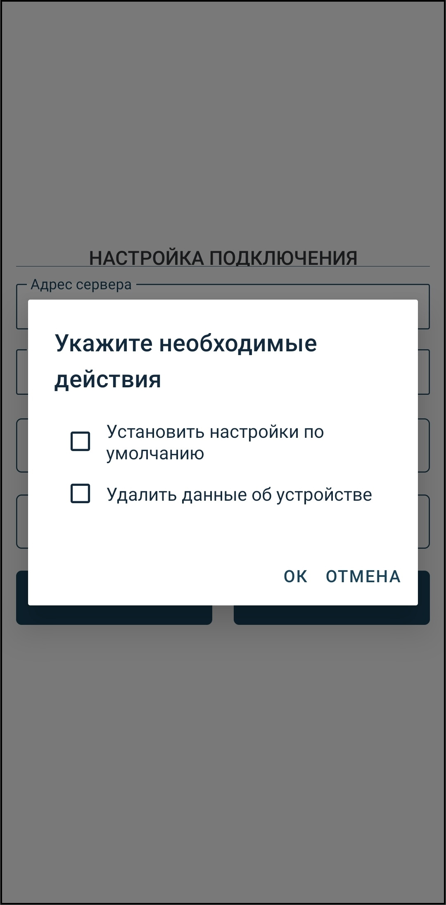

## 2. Настройки

Экран **Настройки** содержит информацию о параметрах связи с сервером и настройки приложения.

Синхронизация дает возможность работе с сервером идти параллельно работе в приложении. 

Процесс синхронизации можно просматривать в специальном окне, которое появляется по нажатию на кнопку **Синхронизировать** (нижняя левая кнопка  в боковом меню **" ≡ "**).

Если же необходимо продолжить работу в приложении, не дожидаясь окончания синхронизации, можно выбрать кнопку "Продолжить работу в приложении". Окно закроется, но в правом нижнем углу будет отрисован компонент, напоминающий, что процесс синхронизации еще идет. Если на на него нажать, окно синхронизации появится снова.

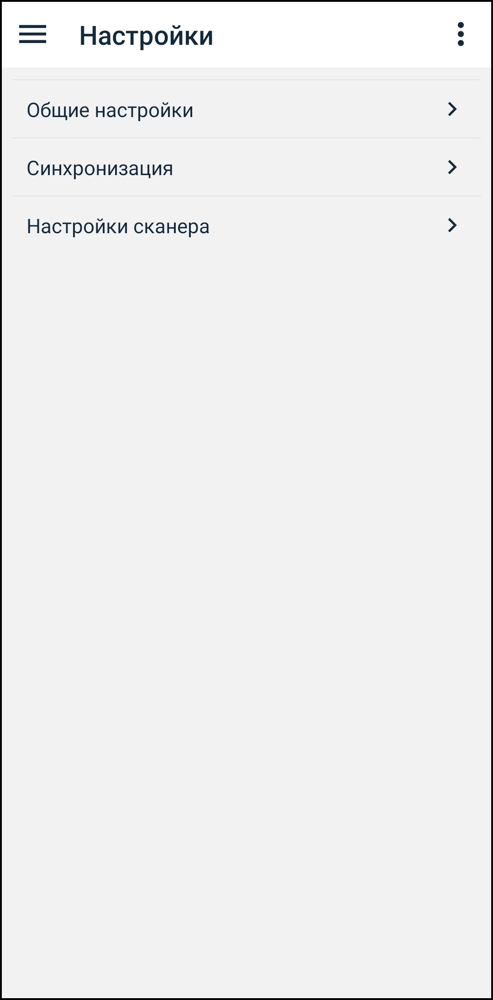 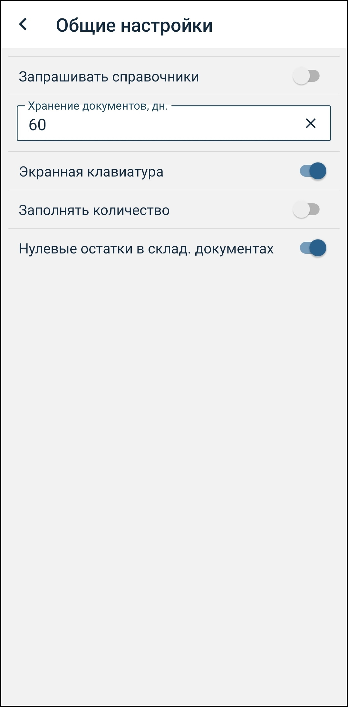 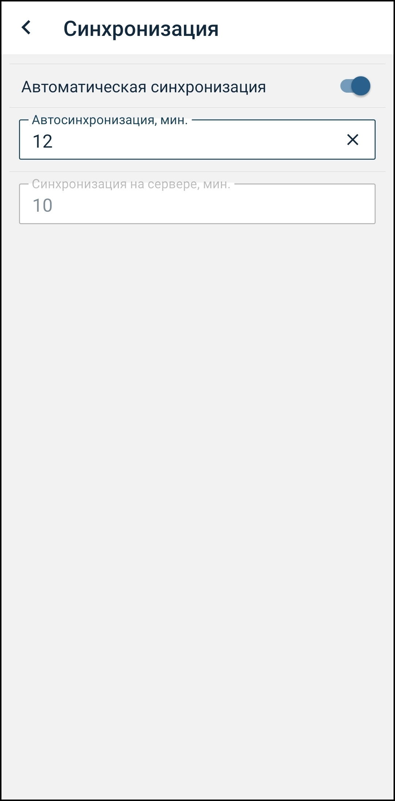 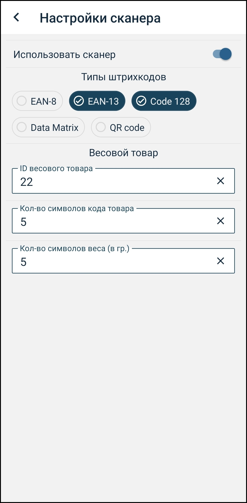

Настройки приложения:

| Параметр | Описание |
| ------------ | -------- |
|Синхронизация  | Параметр **Автоматическая синхронизация**, по умолчанию, не установлен.  _Если установить_, то синхронизация будет выполняться автоматически каждые N минут, указанные в признаке "Автосинхронизации, мин". И **Автоматическая синхронизация** по протяжённости периода должна быть больше периода синхронизации на сервере|
|Запрашивать справочники|_Если указан_, то при при каждой синхронизации, на сервер будет отправляться запрос на справочники, который будет обрабатываться сервером и возвращаться в ответ c запрашиваемыми справочниками.   _Если не указан_, то запрос генерироваться не будет. Справочники будут выгружаться из сервера автоматически при каких-либо очередных изменениях на сервере|
|Использовать сканер|_Если указан_, то для сканирования штрихкода будет использован сканер терминала сбора данных.  _Если не указан_, то сканировать штрихкоды необходимо при помощи камеры устройства|
|Время хранения документов в архиве| Количество дней хранения обработанных документов в приложении, отсчитываемое от даты документа|
|Экранная клавиатура | Включать или выключать экранную клавиатуру можно при условии,что используется именно терминал сбора данных, а не мобильное устройство.  _Если параметр указан_, то в окне позиции документа будет отображена экранная клавиатура-калькулятор.  _Если параметр не указан_, то экранной клавиатуры в окне не будет, а ввод количества будет возможен при помощи клавиатуры ТСД  |
|Заполнять количество   | *Если указан*, то во время создания документа, при сканировании штрихкода, программа автоматически подставит "**1**" в графу **Количество**.   _Если не указан_, то в графе **Количество** будет стоять "**0**", и нужные цифры необходимо будет подставить вручную |
|Нулевые остатки в склад. документах| *Если указан*, то будут отображаться позиции товаров с остатком равным нулю при выборе в окне "Выбор из остатков" и будут определяться товары по штрих-коду с нулевым остатком при сканировании |
|Типы штрихкодов| Можно ограничивать типы сканируемых штрих-кодов при работе в мобильном устройстве        |

Настройки весового товара:

| Параметр | Описание |
| ------------ | -------- |
Идентификатор весового товара| Число (обычно это 22 или 23), которое означает, что штрихкод, начинающийся на это число, относится к весовому товару |
|Количество символов для кода товара| Число, которое определяет идентификатор товара в штрихкоде для поиска в справочнике |
|Количество символов для веса (в гр.)| Число, задающее количество символов в штрихкоде для определения веса товара|

По нажатию на иконку меню " **⁝** ", расположенную в правом верхнем углу, можно вернуться к начальным настройкам, выбрав пункт **Установить настройки по умолчанию**.

## 3. Загрузка данных

Чтобы загрузить данные, предназначенные для пользователя, следует нажать на кнопку синхронизации данных  в нижней части бокового меню.

Открыть боковое меню можно нажатием на иконку меню " **≡** ", находящуюся в верхнем углу приложения слева, или смахнув пальцем вправо с левого края устройства.

  

После загрузки данных в приложении должны появится справочники и все необходимые документы.

Если синхронизация прошла, но данных не появилось, то необходимо повторить синхронизацию через некоторое время.

На кнопке **Синхронизировать** отобразится дата и время последней синхронизации.

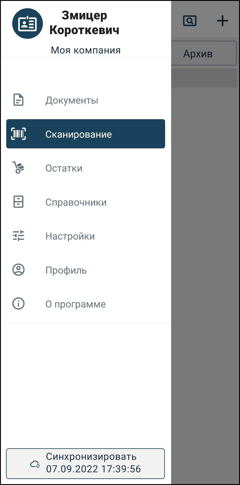

## 4. Справочники

На экране **Справочники** можно просмотреть данные, загруженные в приложение для работы.

  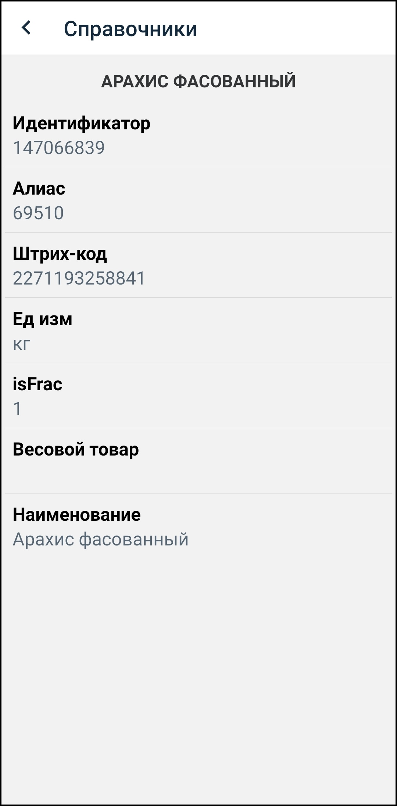

Пример справочника контактов:

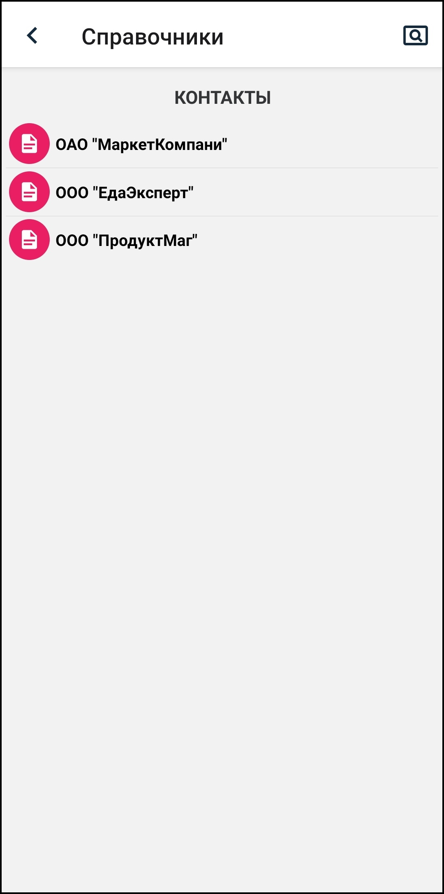 

Чтобы найти справочник по наименованию можно воспользоваться строкой поиска, нажав на иконку **Поиск**  в правом верхнем углу экрана.

От получения справочников можно отказаться - через установление параметра **"Запрашивать справочники"** в отрицательное положение, (Общие настройки в пункте бокового меню Настройки).

Или же, наоборот, в любой необходимый момент отправить запрос на получение справочников - через нажатие на иконку меню " ⁝ ", расположенную в правом верхнем углу, выбрав пункт **Отправить запрос на получение справочников**.

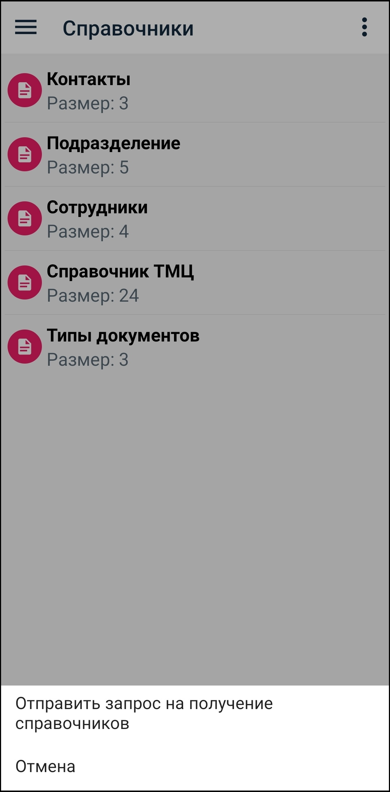 

## 5. Остатки

**Остатки** представляют собой список товаров с ценами и количеством остатка в разрезе подразделения/организации/сотрудника на текущую дату.

При добавлении позиции в документ, который работает с остатками, список товаров будет ограничен только теми товарами, по которым осуществлялось складское движение по конкретному подразделению/организации/сотруднику.

Выберем подразделение.
На экране отображены остатки товаров для данного подразделения. По нажатию на конкретный товар можно просмотреть его цены и остаток.

 

Чтобы найти найти необходимую информацию по наименованию можно воспользоваться строкой поиска, нажав на иконку **Поиск**  в правом верхнем углу экрана.

Так же можно воспользоваться фильтром , который сортирует товары по двум категриям "Все" и "Ненулевые".

 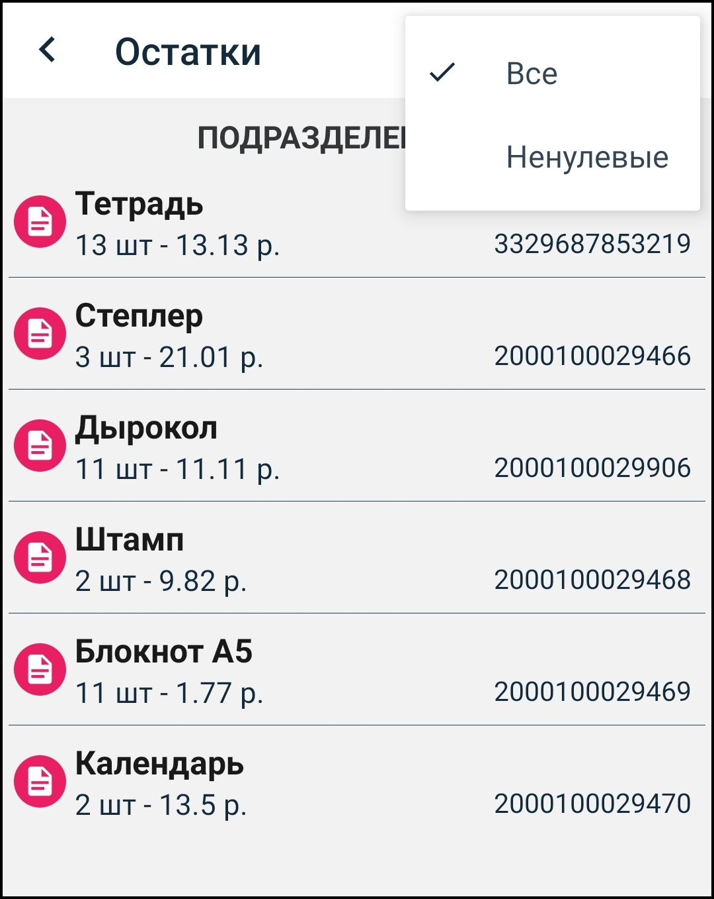

## 6. Документы

### Cоздание документа

Выбрав пункт бокового меню **Документы**, переходим на экран просмотра списка документов.

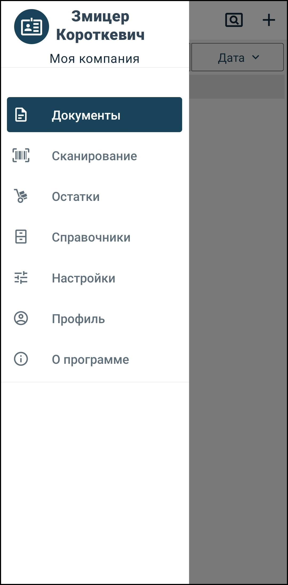 

По нажатию на иконку " ✚ ", в верхнем правом углу, переходим на экран добавления документа.

Обязательные поля для заполнения: **Номер**, **Дата**, **Тип** и поля в зависимости от типа документа.

Например, 
- для документа **прихода** это поля **Откуда**, **Куда**.

- для документа **инвентаризации** - поле **Место**.

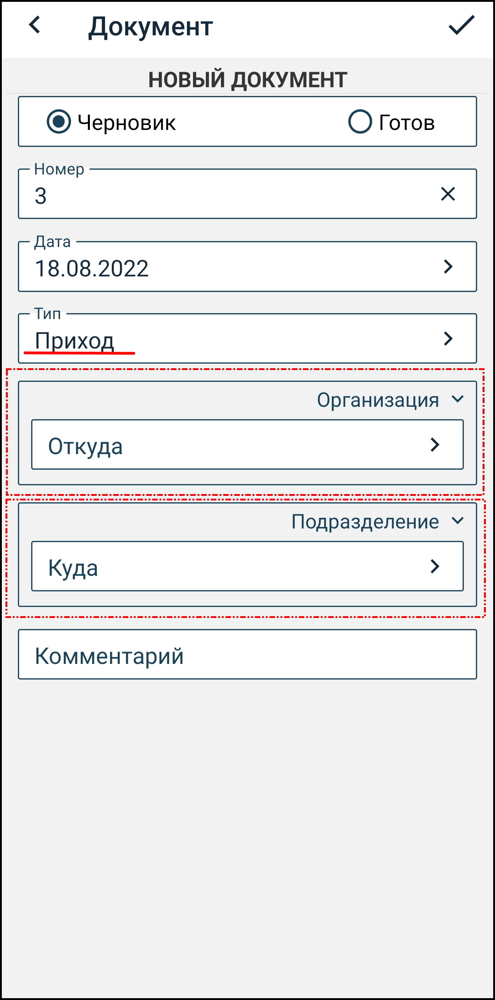  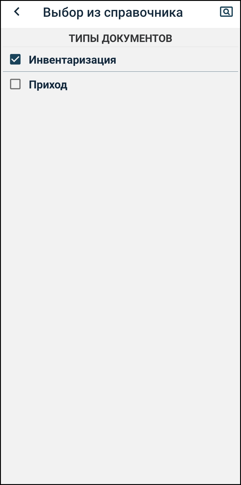  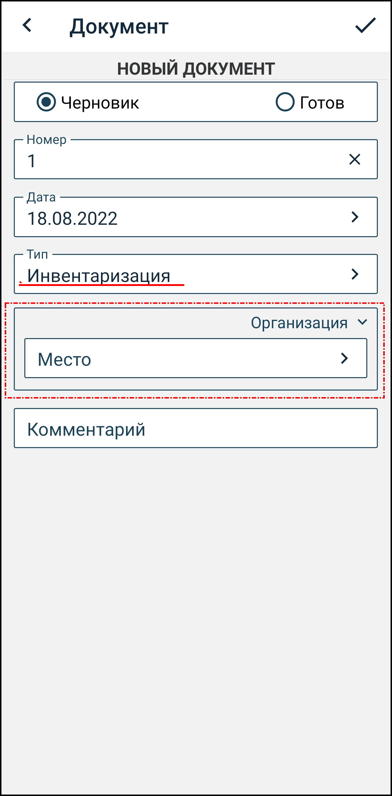

**Поля контактов** (Откуда и Куда) могут быть 3-х типов, которые при необходимости можно менять:
- Подразделение
- Организация
- Сотрудник

  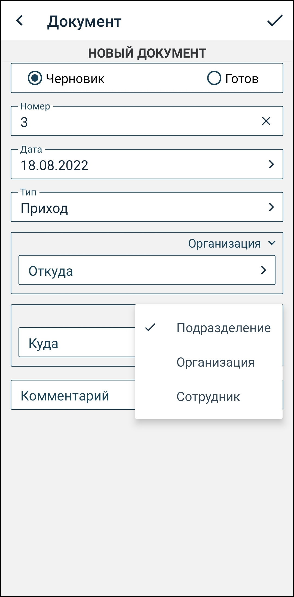  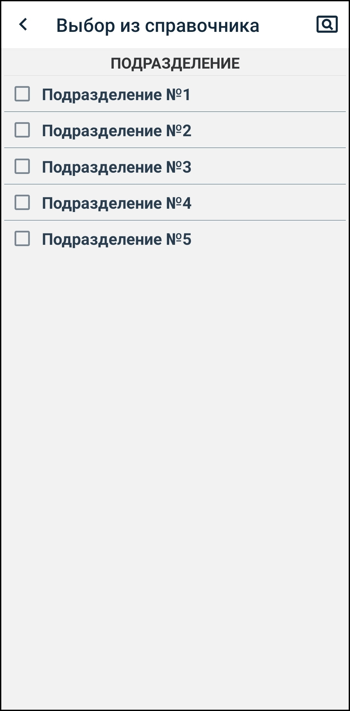

После заполнения данных документ сохраняем, нажав на иконку " **✓** " в правом верхнем углу.

### Редактирование документа

Отредактировать введенные данные можно двумя способами:
 - нажав на значок  **Редактирование документа** на шапке документа 

  

- или используя пункт меню " **⁝** " **Редактировать данные**.

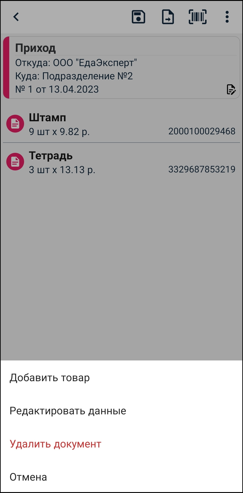 

Но есть исключения:
- Нельзя выбрать дату меньше текущей, если выбранный тип документа работает только с остатками (например, документ инвентаризации)
- Нельзя изменить тип документа, если в документ уже добавлены товары
- Нельзя изменить тип и значение контакта, по которому выбираются остатки, если в документ уже добавлены товары

 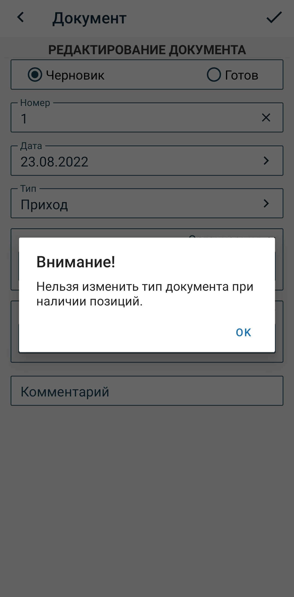 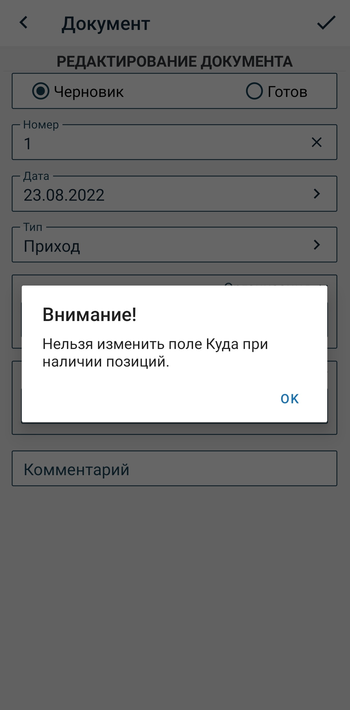

Также, необходимо подчеркнуть, что редакция документа двумя способами возможна, когда документ находится в статусе Черновик (значок  или боковая полоса шапки документа красного цвета).

При статусе **Готов к отправке** (значок  или боковая полоса шапки документа зелёного цвета) это можно сделать, только нажав на значок  **Редактирование документа** на шапке документа.

### Добавление товара

Добавить новую позицию можно двумя способами:
- сканирование штрихкода
- добавление вручную из списка товаров

#### _Сканирование штрихкода_

Уточнение: _если Вы производите сканирование штрихкодов исключительно с помощью камеры устройства, то в настройках приложения необходимо перевести параметр **Использовать сканер** в отрицательное положение._

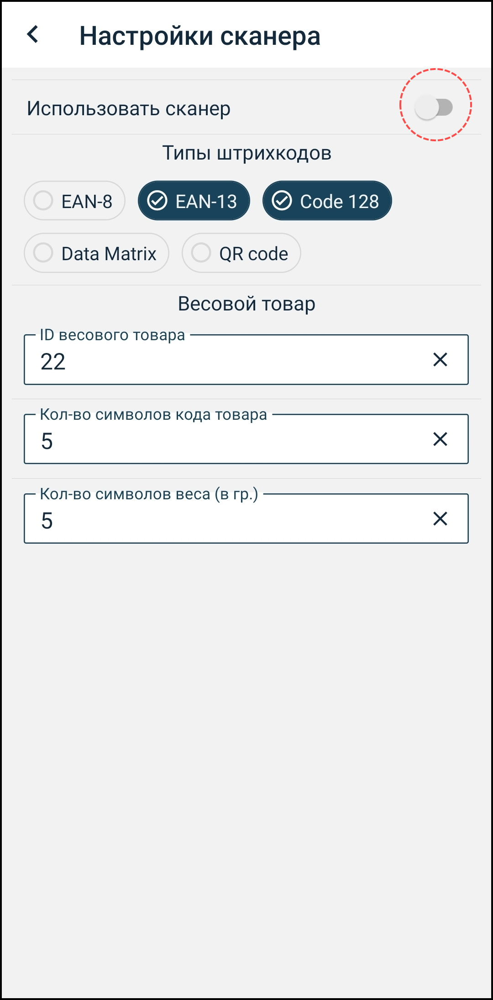

Нажимаем на иконку штрихкода   в верхнем правом углу и переходим на экран сканирования товара. 

Экран сканирования на ТСД:

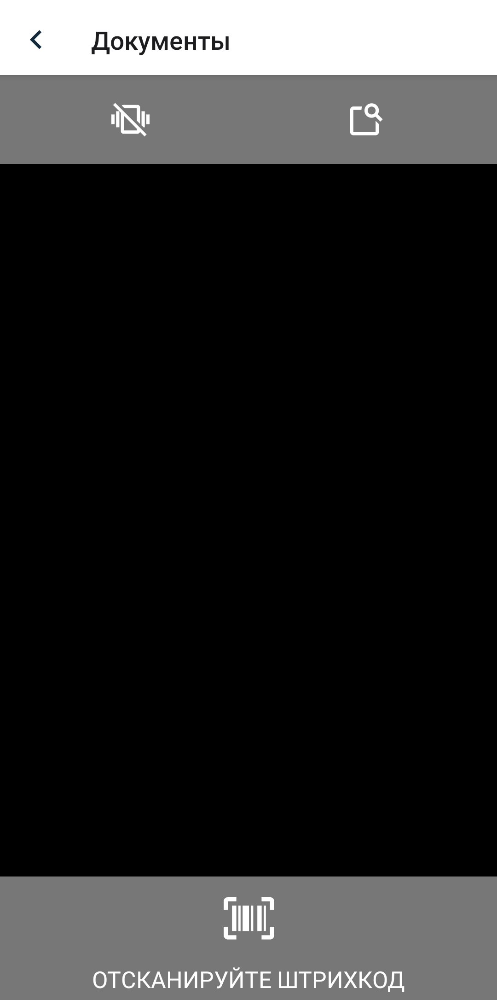 

Экран сканирования на мобильном устройстве:

Сканируем штрихкод и переходим на экран позиции документа для ввода количества товара:

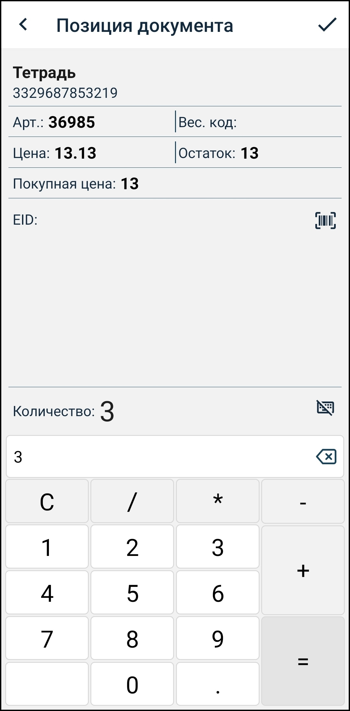

Кроме количества в позиции документа можно заполнить поле EID, которое используется для хранения DataMatrix кода прослеживаемого товара.

Для этого необходимо нажать на кнопку сканирования  напротив EID и просканировать сам ***DataMatrix код***. Поле заполнится автоматически.

После ввода всех необходимых данных, сохраняем позицию, нажав на иконку " **✓** ".

Если отсканированный штрихкод не найден в справочнике, и если документ работает не только с остатками товаров (например, документ прихода), то в позицию подставится "Неизвестный товар".
При первом добавлении возможно отредактировать его название. При нажатии на иконку  рядом с компонентом имени товара "Неизвестный товар" отрисуется диалоговое окно для ввода. После сохранения и отправки на сервер, этот товар будет приходить как обычный.

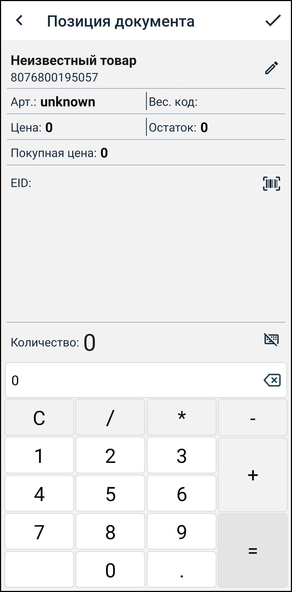 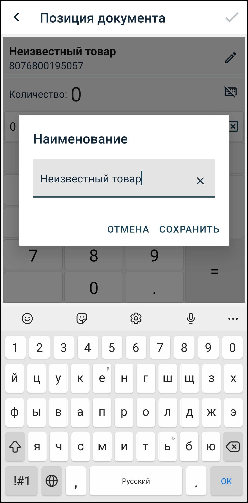 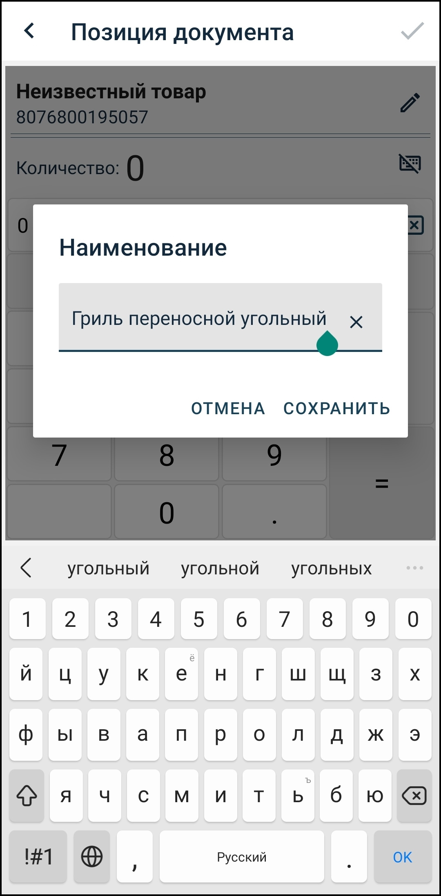 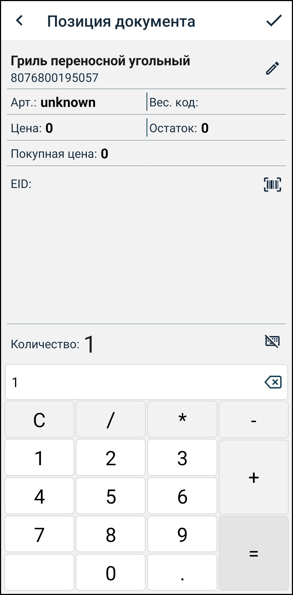

Так выглядит отредактированный "Неизвестный товар" в документе и в списках товаров:

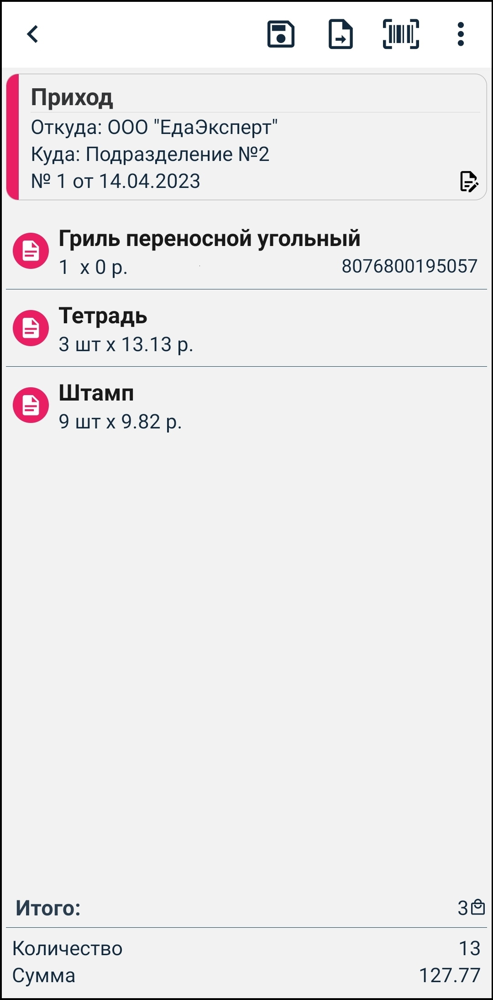 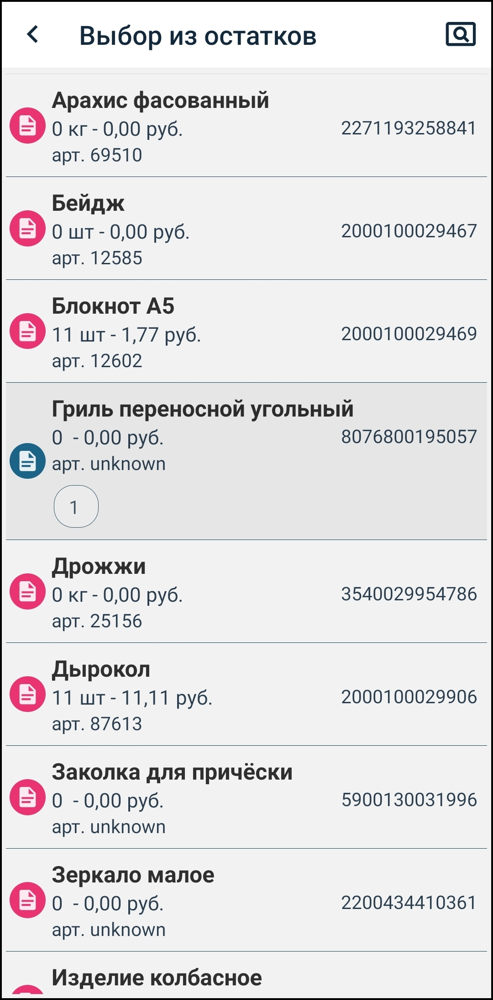

Но если документ работает только с остатками (например, документ инвентаризации), то товар с неизвестным штрихкодом добавить в документ нельзя.

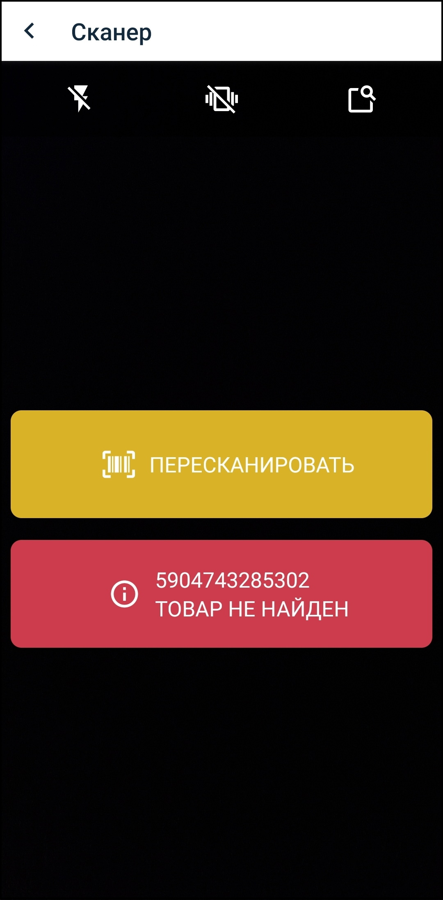

#### _Добавление товара вручную_

В меню документа " **⁝** ", расположенном в правом верхнем углу, нажимаем на пункт **Добавить товар**.
Выбираем товар из списка, воспользовавшись строкой поиска(по названию или штрихкоду) . Далее вводим количество и сохраняем позицию " **✓** ".

   

Кроме количества в позиции документа можно заполнить поле EID, которое используется для хранения DataMatrix кода прослеживаемого товара.

Для этого необходимо нажать на кнопку сканирования  напротив EID и просканировать ***DataMatrix код***.

  

#### Удаление позиции

Если в экране просмотра документа нажать и удерживать позицию товара, то появится зеленая галочка. Далее необходимо нажать на иконку   **Мусорная корзина**, и подтвердить желание удалить данную позицию или позиции документа. 

Позиция или позиции будут удалены.

 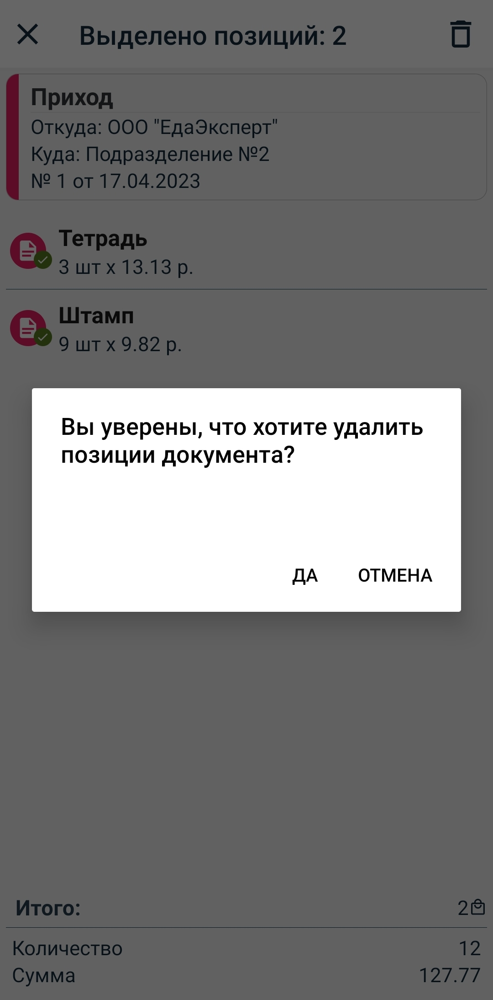

Отменить удаление позиций документа можно:
- нажав на иконку " **×** ", в левом верхнем углу. При этом способе исчезнут все зеленые галочки с выбранных позиций, экран вернется к изначальному состоянию.
- нажав иконку  **Мусорная корзина** и выбрав кнопку **Отмена** в появившемся окне "Уверены, что хотите удалить позиции документа?". При этом способе все зеленые галочки на выбранных позициях останутся на месте, можно продолжить редактировать удаление позиций документа.

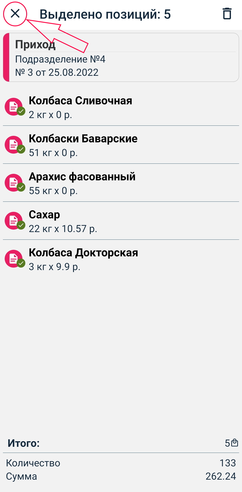 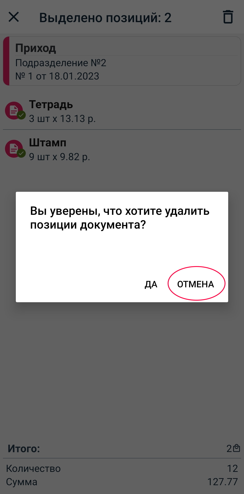

### Статус документа

Цвет иконки или боковой полосы шапки документа означает его статус. При смене статуса меняется и цвет.
Имеется 4 основных статуса:

| Статус | Цвет     | Значок| Описание     |
|:--------| -------- |:-------:|------------- |
|Черновик| Красный || Новый документ, который можно редактировать|
|Готов к отправке| Зеленый || Документ, который можно отправлять на обработку вручную или который, будет отправлен автоматически при включённой автосинхронизации. Нельзя редактировать, но можно вернуть в состояние **Черновик** и отредактировать |
|Отправлен| Желтый|| Документ отправлен, ожидается подтверждение от сервера |
|Обработан успешно| Синий|| Документ получил подтверждение об успешной обработке на сервере (в случае, если документ обработан с ошибкой, статус меняется вновь на **Черновик** с уточняющей фразой о причине ошибки)  |

### Порядок работы

Вернемся на экран просмотра списка документов, выбрав пункт бокового меню " **≡** " **Документы**.

Чтобы найти документ по наименованию можно воспользоваться строкой поиска, нажав на иконку  **Поиск** в правом верхнем углу экрана.

 

При создании документ имеет статус **Черновик**  (красный цвет иконки или боковой полосы шапки документа).

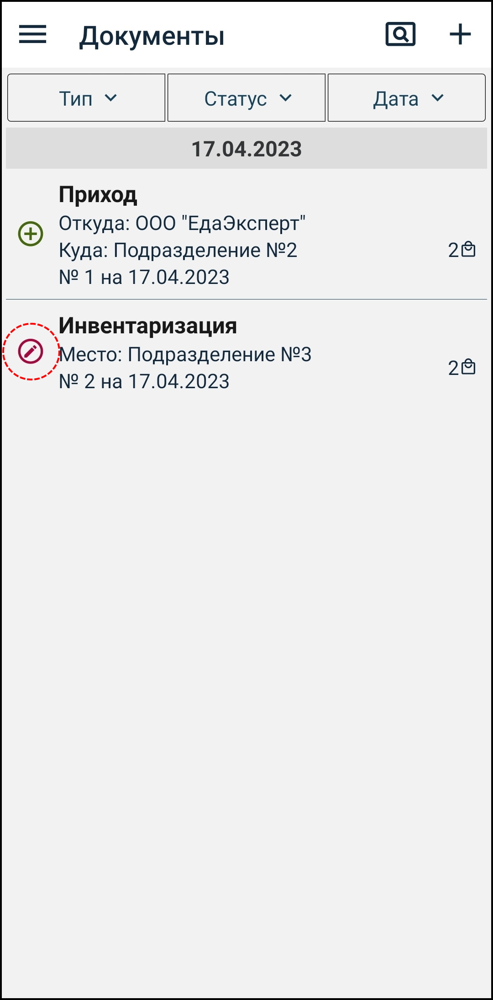 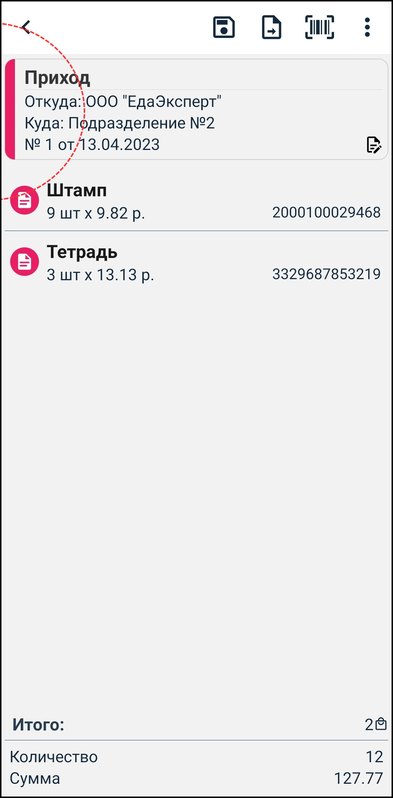

После ввода необходимых данных, чтобы отправить документ на обработку, необходимо поменять признак **Черновик** на признак **Готов к отправке**  (с помощью иконки  или вручную, нажав на значок  на шапке документа)

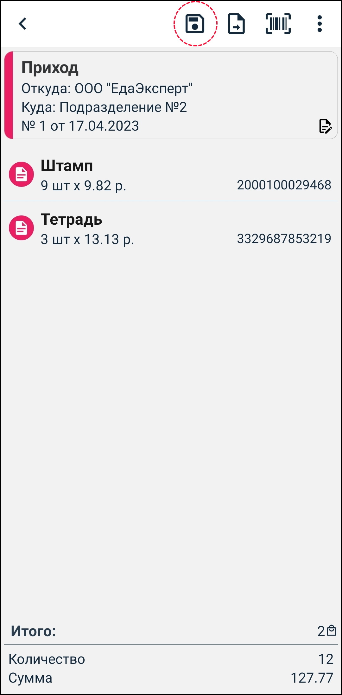 или 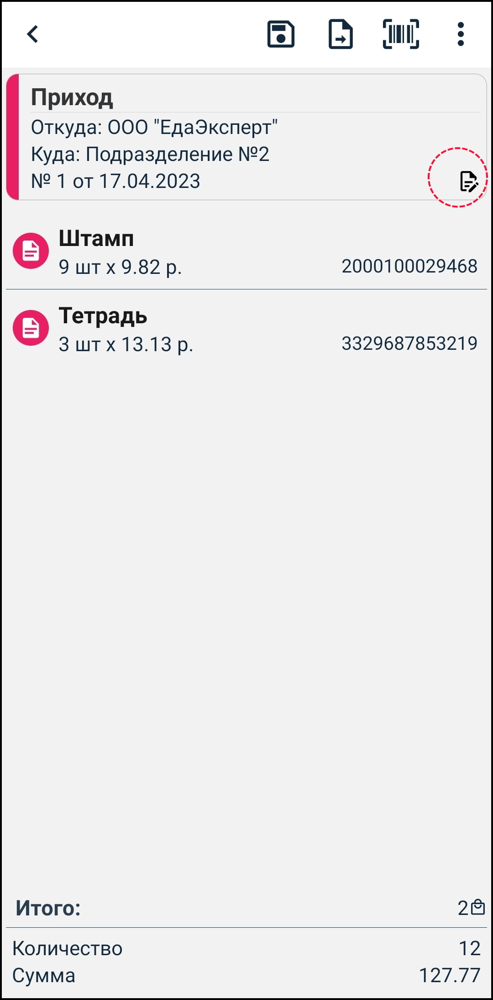 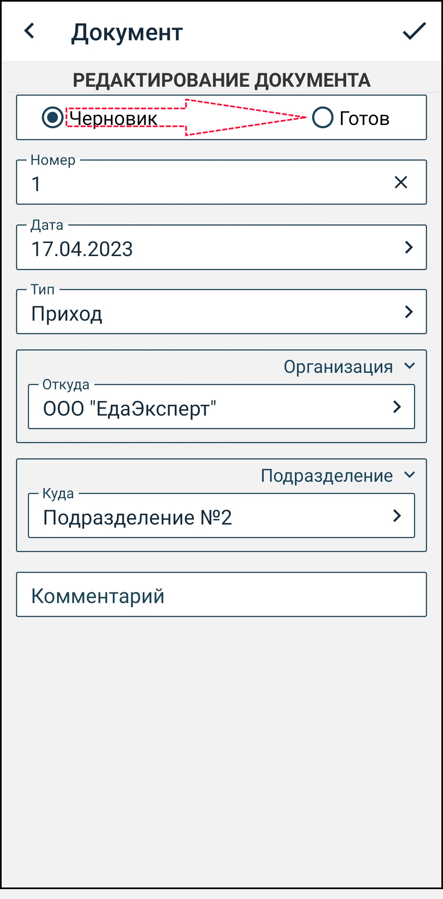 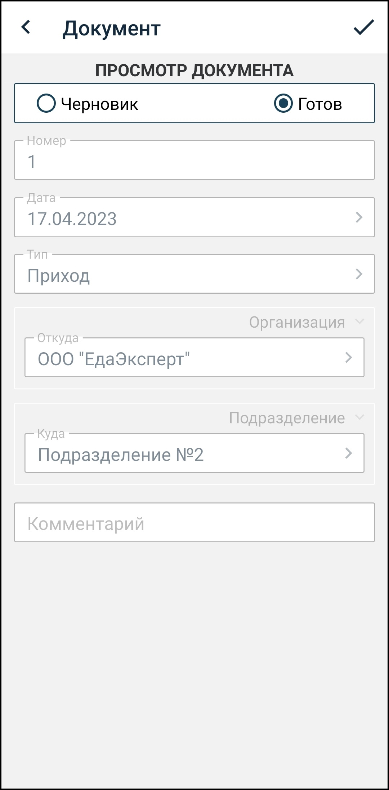

Есть два способа отправки документа на сервер:
- отправить на сервер ОДИН документ, для этого нажать на иконку  **Отправка документа**, находящуюся над шапкой документа.
- оставить документ в состоянии **Готов к отправке**  (переведенный в это состояние с помощью иконки  или вручную, с помощью  на шапке документа) и перейти к работе с другими документами, а данный будет отправлен на сервер при ручной или автоматической синхронизации.

Когда документ перейдет в состояние **Готов к отправке**  (зеленый цвет иконки или боковой полосы шапки документа) - его данные редактировать уже нельзя. Но, пока документ не отправлен, его можно вернуть из статуса **Готов к отправке** в статус **Черновик** и отредактировать данные.

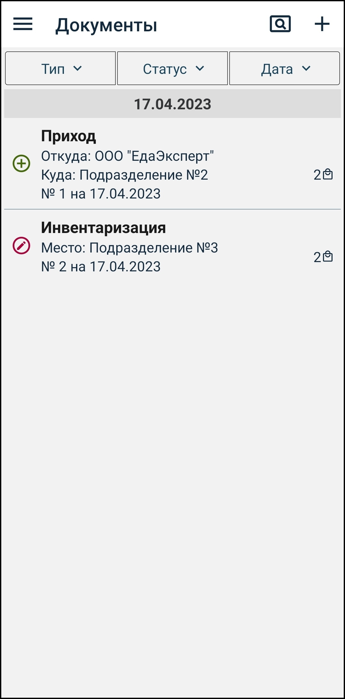   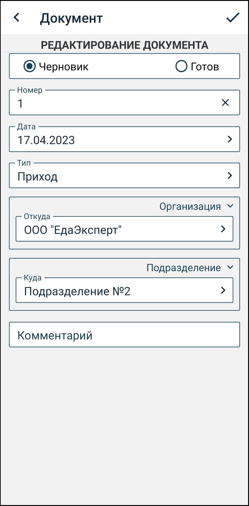 

Чтобы отправить ВСЕ документы со статусом **Готов к отправке** на сервер из экрана **Документы**, необходимо нажать на кнопку   **Синхронизировать** в боковом меню (открыть боковое меню можно нажатием на иконку меню " **≡** ", находящуюся в верхнем углу приложения слева, или смахнув пальцем вправо с левого края устройства). Или дождаться выполнения автосинхронизации и автоматической отправки всех документов со статусом **Готов к отправке**.

После отправки документ перейдет в статус **Отправлен** (желтый цвет иконки или боковой полосы шапки документа).

После автоматической или ручной синхронизации документ получит подтверждение об успешной обработке на сервере и вернётся, а цвет иконки станет синим  . В случае, если документ обработан с ошибкой, его статус возвращается в **Черновик** с уточняющей фразой о причине ошибки (например, у компании задолженность более 30 дней).

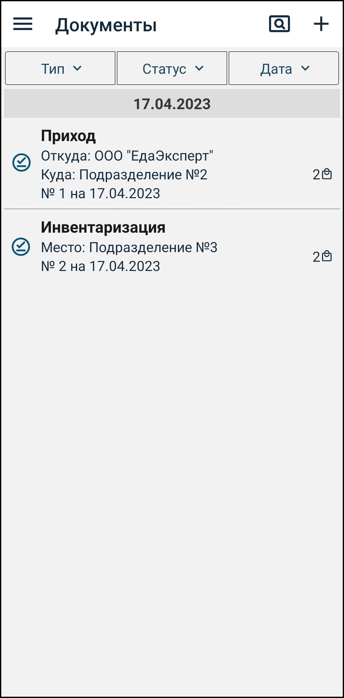

### Удаление документа

Для удаления нужно нажать на необходимый документ и удерживать его, на выбранной позиции появится зеленая галочка, которая выделит данный документ среди прочих. Далее необходимо нажать иконку **Мусорная корзина** и подтвердить намерение удалить документ. Документ удаляется. 

Так же, когда документ находится в статусе **Черновик**, его можно удалить используя пункты меню " **⁝** " .

Используя пункты меню " **⁝** ", расположенную в правом верхнем углу экрана **Документ** возможно: 
- перейти на редактирование шапки документа (если статус **Черновик**)
- удалить документ (если статус **Черновик**)
- добавить товар

Отменить удаление документа можно:
- нажав на иконку " **×** ", в левом верхнем углу. Исчезнут все зеленые галочки с выбранных позиций, экран **Документы** вернется к изначальному состоянию.
- нажав иконку **Мусорная корзина** выбрать кнопку **Отмена** в появившемся окне "Уверены, что хотите удалить позиции документа?". При этом все зеленые галочки на выбранных позициях останутся на месте, можно продолжить удаление необходимых документов.

### Фильтры

Для удобства просмотра на экране документов можно использовать фильтры и сортировку:
- фильтр по типу документа
- фильтр по статусу документа
- сортировка по дате

  

| Фильтр по статусу | Описание                                                                                                                                                                    |
| --------------- | --------------------------------------------------------------------------------------------------------------------------------------------------------------------------- |
| Все             | Все документы                                                                                                                                    |
| Активные        | Все документы, кроме тех, которые уже обработаны на сервере (со статусом **Черновик**, **Готов к отправке**, **Отправлен**).                                                                |
| Черновик           | Документы со статусом **Черновик**|
| Готово           | Документы со статусом **Готов к отправке**|
| Отправлено           | Документы со статусом **Отправлен**|
| Обработано           | Документы со статусом **Обработан успешно**|

## 7. Профиль

Экран **Профиль** содержит информацию о пользователе и об устройстве. 

При выходе из демо режима, кнопка **Выйти из демо режима** меняется на **Сменить пользователя**. 

Также здесь можно выйти из учетной записи пользователя, нажав на кнопку **Сменить пользователя**.

 

Этот экран позволяет: 

|  Параметр   |  Описание |
| :------- | :-------- |
| **Выйти и удалить все данные** | Удаление учетной записи пользователя, всех документов, справочников и настроек из мобильного устройства |
| **Удалить все справочники и документы**  | Удаление всех документов, справочников из мобильного устройства   |
| **Удалить настройки пользователя**   | Удаление настроек пользователя, которые могут приходить из ERP системы |

Для этого необходимо нажать на иконку меню " **⁝** ", расположенную в правом верхнем углу, и выбрать пункт, соответственно необходимости.

 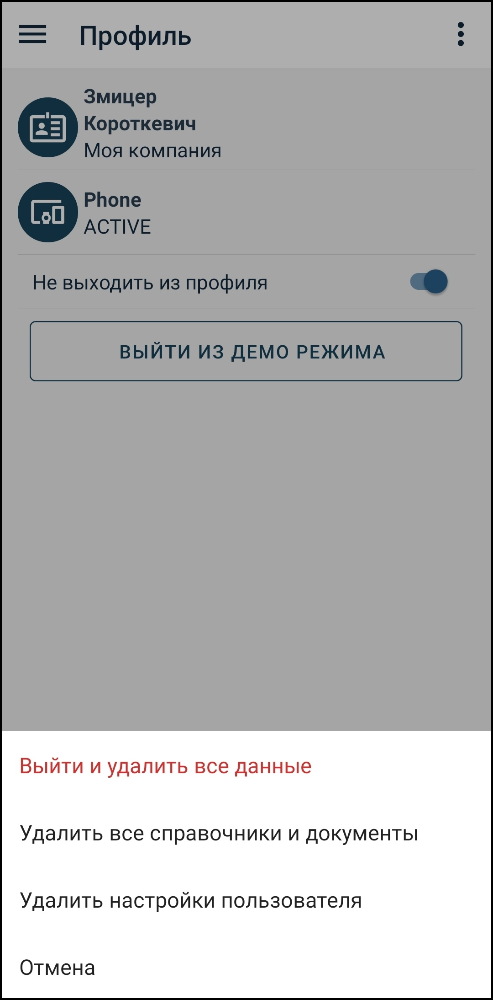 

Если параметр "Не выходить из профиля" отключен, то при каждом новом открытии приложения необходимо будет вновь вводить данные пользователя.

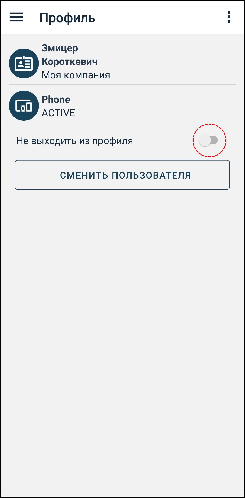 

## 8. Сканирование

Уточнение: **если вы производите сканирование штрихкодов исключительно с помощью камеры мобильного устройства, то в настройках приложения необходимо перевести параметр ***Использовать сканер*** в отрицательное положение.**

С помощью сканера можно распознавать и линейные штрихккоды, и двухмерные.

Вернемся на экран списка документов сканирования, выбрав пункт бокового меню **Сканирование** (открыть боковое меню можно нажатием на иконку меню " **≡** ", находящуюся в верхнем углу приложения слева, или смахнув пальцем вправо с левого края устройства).

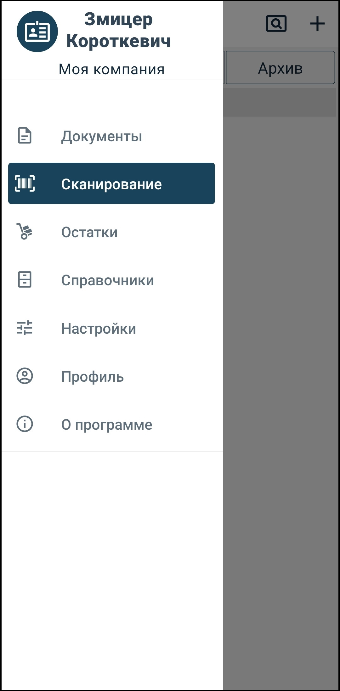 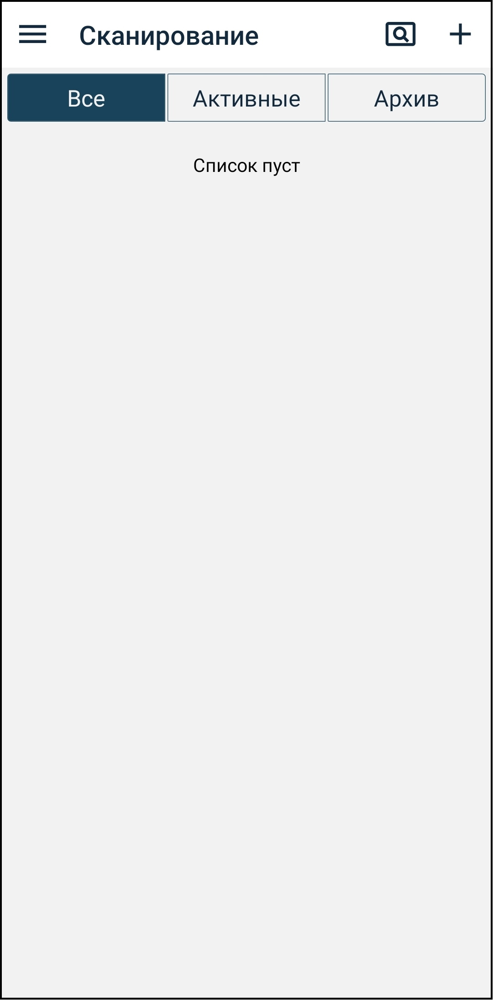

Чтобы найти документ по наименованию можно воспользоваться строкой поиска, нажав на иконку   **Поиск** в правом верхнем углу экрана.

По нажатию иконки " ✚ ", в верхнем правом углу, переходим на экран добавления документа. При создании документ имеет статус Черновик. Заполняем необходимые поля - **Номер, Дата, Подразделение** (Комментарий - поле, не обязательное для заполнения) и сохраняем документ, нажав на иконку 
**✓**.

Отредактировать введенные данные можно, нажав на шапку документа  или используя пункт меню " **⁝** " **Редактировать данные**.

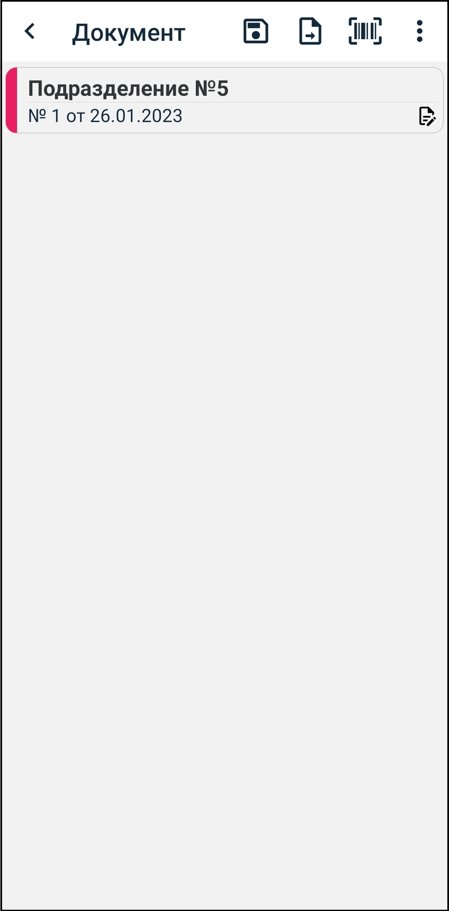 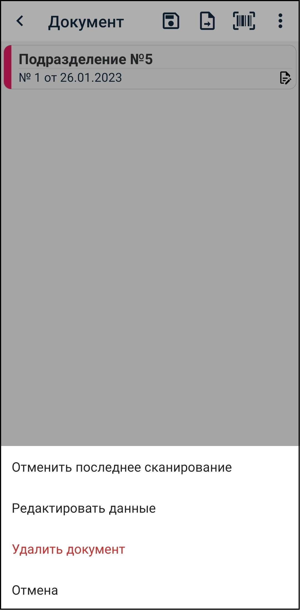

Нажимаем на иконку штрихкода  в верхнем правом углу и переходим на экран сканирования товара.

Для удобства работы во время сканирования можно использовать кнопки **Вспышка**   или **Вибрация**  .

 

Возможно ввести вручную штрихкод, нажав на иконку 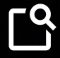 сверху справа.

 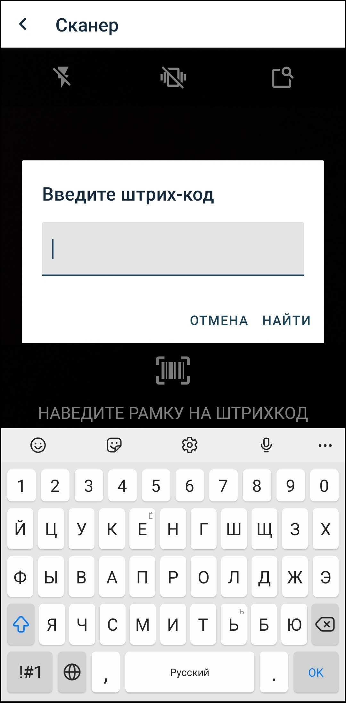
 
 Сканируем штрихкод, нажимаем на нужную кнопку (**Пересканировать** или **Штрихкод**) и продолжаем сканирование необходимое число раз. 

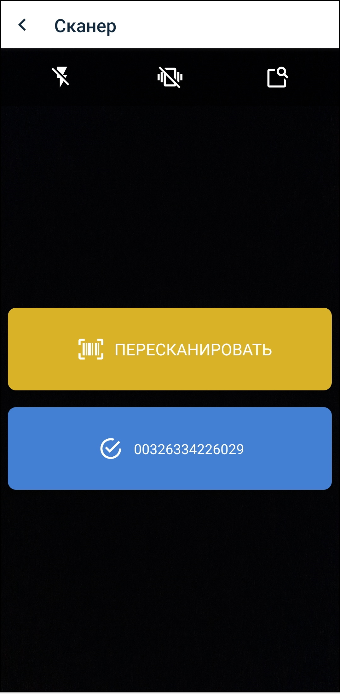  

Редактирование введенного штрихкода возможно только ввиде удаления, и только последнего скана. Сделать это можно через меню документа " **⁝** ", расположенном в правом верхнем углу, нажав на пункт **Отменить последнее сканирование**. 

После ввода необходимых данных, этот документ можно отправить на обработку тремя способами:

* в документе необходимо вручную поменять признак **Черновик**  на признак **Готов к отправке** с помощью значка  в шапке документа. Шапка документа изменит цвет с красного  на зелёный . Далее нажать на значок  и документ отправится на сервер. Шапка документа изменит цвет на жёлтый  (статус **Отправлен**).

* Нажать на значок . Иконка документа изменится с красной  на зелёную . Далее или дождаться выполнения автосинхронизации и автоматической отправки всех документов со статусом **Готов к отправке**, или нажать на значок  и документ отправится на сервер. Иконка документа изменит цвет на жёлтый .

* нажать на значок , находящийся над шапкой документа, который автоматически переведёт признак с **Черновик**  на **Готов к отправке** и отправит документ на обработку .

## 9. О программе
### Документация
На экране **О программе** можно узнать информацию о приложении и о контактных данных разработчика, а перейдя по ссылке **Документация** ознакомиться с полным функционалом приложения. 

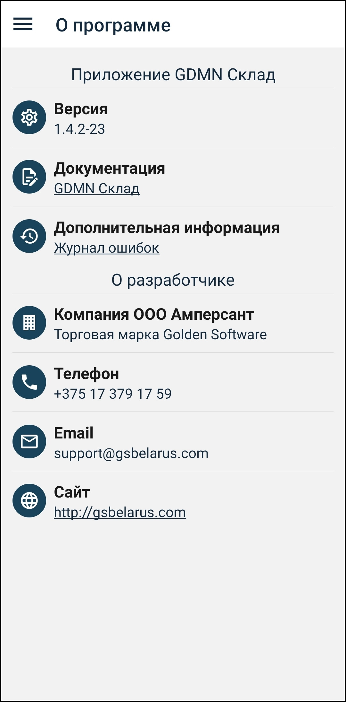 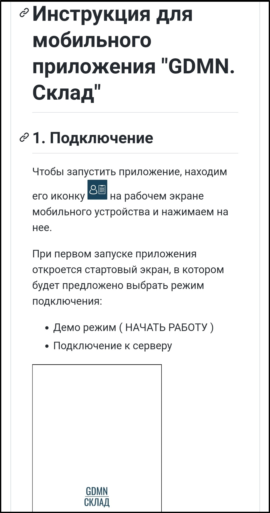

### Журнал ошибок

Если во время синхронизации программы и сервера произошли ошибки, то программа выдаст окно с надписью **"Закончено с ошибками"**. Чтобы их просмотреть, необходимо нажать на кнопку **Просмотреть ошибки**, а чтобы вернуться обратно в список выполненных действий, необходимо нажать на кнопку **Просмотреть операции**. Все ошибки будут сохраняться в **Журнале ошибок**, который можно просмотреть, и будут передаваться на сервер для анализа. 

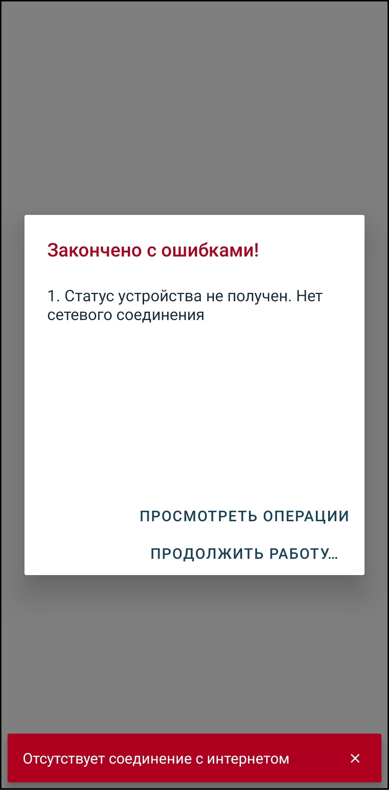  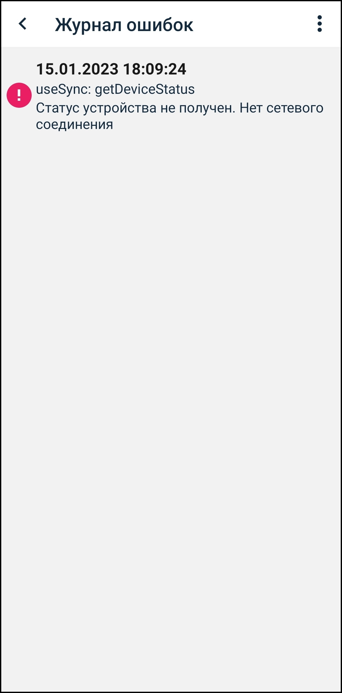 

Очистить **Журнал ошибок** можно через меню документа " **⁝** ", расположенное в правом верхнем углу, нажав на пункт **Удалить историю ошибок**.

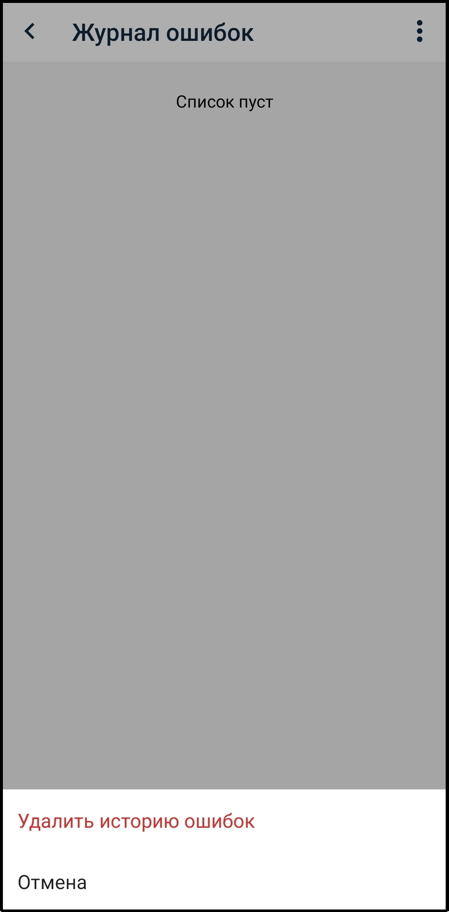

## 10. Значение иконок

| Иконка | Описание      |
| :---------------: | :--------------------------------------------------------------------------------------------------------------------------------------------------------------------------- |
|| _статус **Черновик**_, новый документ, который можно редактировать|
|   | _статус **Готов к отправке**_, документ нельзя редактировать, но можно вернуть в статус **Черновик**   |
|    | _статус **Отправлен**_, документ отправлен, ожидается подтверждение     |
|    | _статус **Обработан успешно**_, документ получил подтверждение об успешной обработке на сервере   |
| | перевод документа из статуса **Черновик** в статус **Готов к отправке** |
|             | отправка документа   |
|   | редактирование документа   |
|  | поиск|
|| поиск товара в остатках|
|   | сканирование штрихкода|
|        | синхронизация|
|  | переход на экран настроек|
|   | удаление документа|
|      | фильтр 
|    | вспышка выключена|
|    | вибрация выключена|
||pедактированиe названия неизвестного товара    |
| **✓**     | сохранить|
| **≡**     | меню документа |
| ✚         | добавление нового документа|
| **⁝**      | меню документа|

