# Инструкция для мобильного приложения "GDMN. Склад"

## 1. Подключение

Чтобы запустить приложение, находим его иконку  на рабочем экране мобильного устройства и нажимаем на нее.

При первом запуске приложения откроется стартовый экран, в котором будет предложено выбрать режим подключения:
- Демо режим ( НАЧАТЬ РАБОТУ )
- Подключение к серверу

### Демо режим
При нажатии на кнопку демо режима **Начать работу** выполняется автоматический вход в приложение под тестовым пользователем.

В данном режиме можно ознакомиться с функционалом приложения offline (без подключения к базе данных) на демо данных.

Загрузка данных и работа в приложении пояснена далее в пунктах 3-8.

Выйти из демо режима можно, открыв боковую панель нажатием на иконку меню **≡**, находящуюся в верхнем углу приложения слева, или смахнув пальцем вправо с левого края устройства.

Затем перейти на экран **Профиль** и нажать на кнопку **Выйти из демо режима**.

### Подключение к серверу 
Чтобы подключиться к рабочей базе данных, необходимо выбрать **Подключиться к серверу** для перехода на экран настройки подключения (с помощью иконки  ):

Системный администратор вашего предприятия должен сообщить вам адрес сервера и номер порта для подключения. Введите его в нижеуказанные поля. Обращаем ваше внимание, что поле ID устройства заполнять не надо. Оно будет заполнено автоматически после успешного подключения к серверу и ввода имени пользователя и пароля. В дальнейшем ID устройства может понадобиться вам для того-то и того-то.

| Параметр | Описание |
| --------------------- | ------------------------------------------ |
| Адрес сервера | Точно введите адрес, переданный вам системным администратором. Адрес должен включать протокол и доменное имя или цифровой IP адрес сервера. Пример: http://localhost |
| Порт          | Порт сервера. Пример: 3649 |
| ID устройства | Сюда вводить ничего не надо. ID устройства будет заполнено автоматически после подключения к серверу |

При нажатии на кнопку **Сохранить** переходим к окну для подключения к серверу:

Нажимаем кнопку **Подключиться**.

После успешного подключения к серверу появится экран **Активация устройства**.

В данном экране необходимо ввести код активации, который пользователь должен получить от администратора системы, и нажать **Отправить**.

При последующих запусках приложения будет происходить автоматический вход в учетную запись пользователя.

 

По нажатию на иконку в правом нижнем углу  можно снова перейти на экран подключения к серверу.

Если активация устройства прошла успешно, появится экран для входа пользователя.

В соответствующие поля необходимо ввести **Имя пользователя** и **Пароль** и нажать на кнопку **Войти**.

 

При успешной аутентификации пользователя откроется экран **Документы**.

## 2. Настройки

Экран **Настройки** содержит информацию о параметрах связи с сервером и настройки приложения.

Настройки приложения:

| Параметр | Описание |
| ------------ | -------- |
|Запрашивать справочники|_Если указан_, то при при каждой синхронизации на сервер будет отправляться запрос на справочники, который будет обрабатываться сервером и возвращаться в ответ c запрашиваемыми справочниками.   _Если не указан_, то запрос генерироваться не будет. Справочники будут выгружаться из сервера автоматически при каких-либо очередных изменениях на сервере.|
|Использовать сканер|_Если указан_, то для сканирования штрихкода будет использован сканер терминала сбора данных.  _Если не указан_, то сканировать штрихкоды необходимо при помощи камеры устройства|
|Время хранения документов в архиве| Количество дней хранения обработанных документов в приложении, отсчитываемое от даты документа|

Настройки весового товара:

| Параметр | Описание |
| ------------ | -------- |
Идентификатор весового товара| Число (обычно это 22 или 23), которое означает, что штрихкод, начинающийся на это число, относится к весовому товару |
|Количество символов для кода товара| Число, которое определяет идентификатор товара в штрихкоде для поиска в справочнике |
|Количество символов для веса (в гр.)| Число, задающее количество символов в штрихкоде для определения веса товара|

По нажатию на иконку меню **≡**, расположенную в правом верхнем углу, можно вернуться к начальным настройкам, выбрав пункт **Установить настройки по умолчанию**.

  

## 3. Загрузка данных

Чтобы загрузить данные, предназначенные для пользователя, следует нажать на иконку синхронизации данных  в нижнем углу бокового меню.

Открыть боковое меню можно нажатием на иконку меню **≡**, находящуюся в верхнем углу приложения слева, или смахнув пальцем вправо с левого края устройства.

  

После загрузки данных в приложении должны появится справочники и все необходимые документы.

Если синхронизация прошла, но данных не появилось, то необходимо повторить синхронизацию через некоторое время.

Рядом с иконкой отобразится дата и время последней синхронизации.

## 4. Справочники

На экране **Справочники** можно просмотреть данные, загруженные в приложение для работы.

  

Пример справочника контактов:

 

Чтобы найти справочник по наименованию можно воспользоваться строкой поиска в правом верхнем углу экрана.

## 5. Остатки

**Остатки** представляют собой список товаров с ценами и количеством остатка в разрезе подразделения/организации/сотрудника на текущую дату.

При добавлении позиции в документ, который работает с остатками, список товаров будет ограничен только теми товарами, по которым осуществлялось складское движение по конкретному подразделению/организации/сотруднику.

Выберем подразделение.
На экране отображены остатки товаров для данного подразделения. По нажатию на конкретный товар можно просмотреть его цены и остаток.

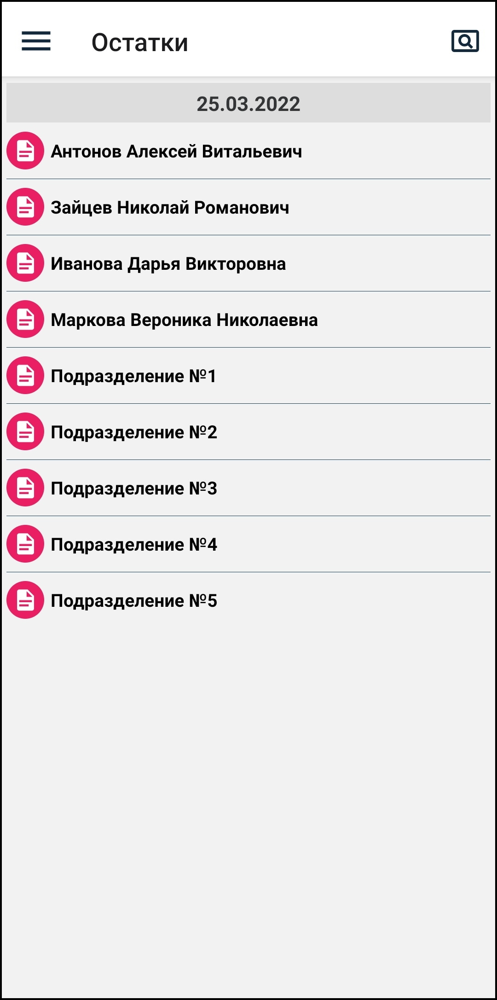  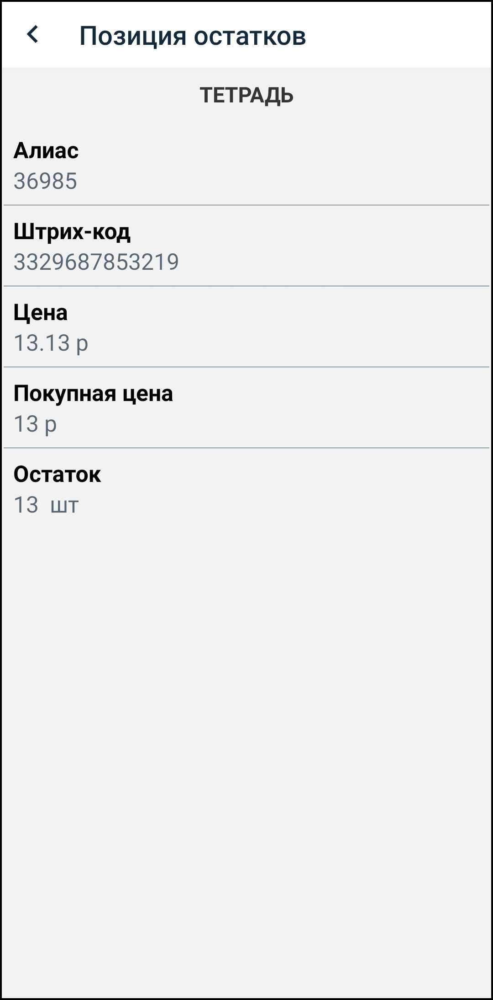

## 6. Документы

### Cоздание документа

По нажатию на иконку **+** в верхнем правом углу переходим на экран добавления документа.

Обязательные поля для заполнения: **Номер**, **Дата**, **Тип** и поля в зависимости от типа документа.

Например, для документа прихода это поля **Откуда**, **Куда**. Для документа инвентаризации - поле **Место**.

  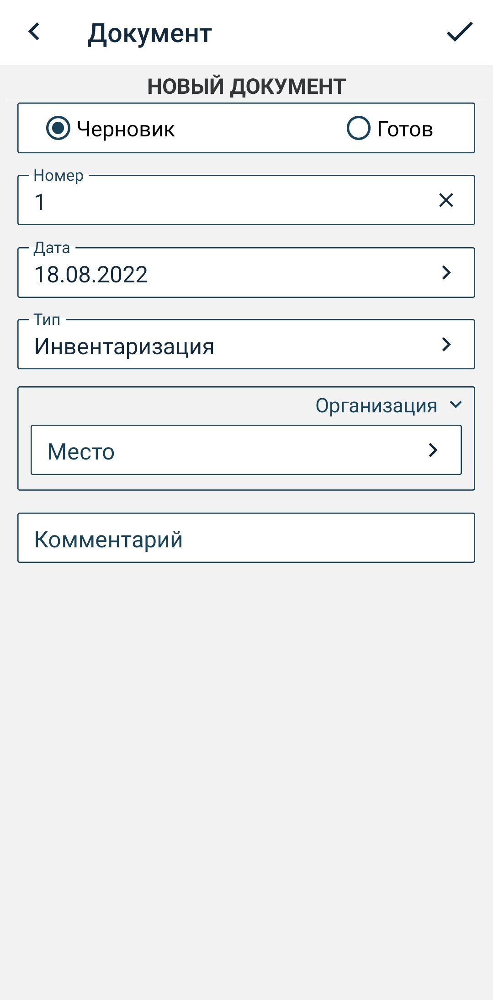

Поля контактов могут быть 3 типов, которые при необходимости можно менять:
- Подразделение
- Организация
- Сотрудник

  

После заполнения данных документ сохраняем, нажав на иконку **✓** в правом верхнем углу.

Отредактировать введенные данные можно, нажав на шапку документа.

 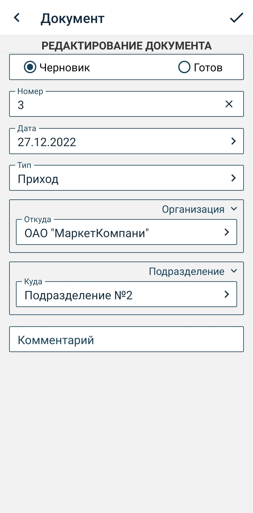

Но есть исключения:
- Нельзя выбрать дату меньше текущей, если выбранный тип документа работает только с остатками (например, документ инвентаризации)
- Нельзя изменить тип документа, если в документ уже добавлены товары
- Нельзя изменить тип и значение контакта, по которому выбираются остатки, если в документ уже добавлены товары

  

### Добавление товара

Добавить новую позицию можно 2 способами:
- сканирование по штрихкоду
- добавление вручную из списка товаров

#### _Сканирование штрихкода_

Уточнение: если вы производите сканирование штрихкодов исключительно с помощью камеры устройства, то в настройках приложения необходимо перевести параметр **Использовать сканер** в отрицательное положение.

Нажимаем на иконку штрихкода  в верхнем правом углу и переходим на экран сканирования товара.

Экран сканирования на ТСД:

 

Экран сканирования на мобильном устройстве:

 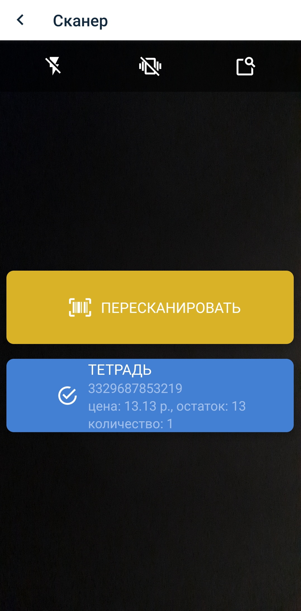

Сканируем штрихкод и переходим на экран позиции документа для ввода количества:

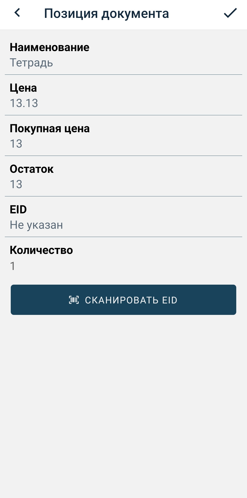

Вводим количество и сохраняем позицию, нажав на иконку **✓**.

Если отсканированный штрихкод не найден в справочнике, и если документ работает не только с остатками товаров (например, документ прихода), то в позицию подставится неизвестный товар:

 

Но если документ работает только с остатками (например, документ инвентаризации), то товар с неизвестным штрихкодом добавить нельзя.

#### _Добавление товара вручную_

В меню документа, расположенном в правом верхнем углу, нажимаем на пункт **Добавить товар**.
Выбираем товар из списка, воспользовавшись строкой поиска (по названию или штрихкоду). Далее вводим количество и сохраняем позицию.

  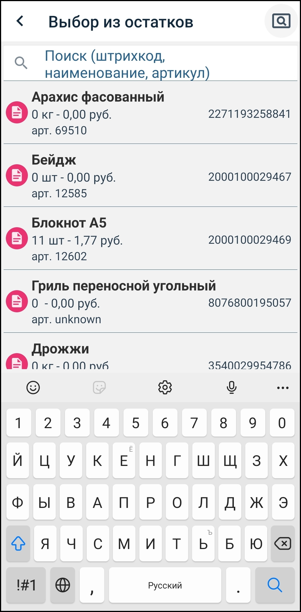

Кроме количества в позиции документа можно заполнить поле EID, которое используется для хранения DataMatrix кода прослеживаемого товара.

Для этого необходимо нажать на кнопку **Сканировать EID** и просканировать DataMatrix код.

 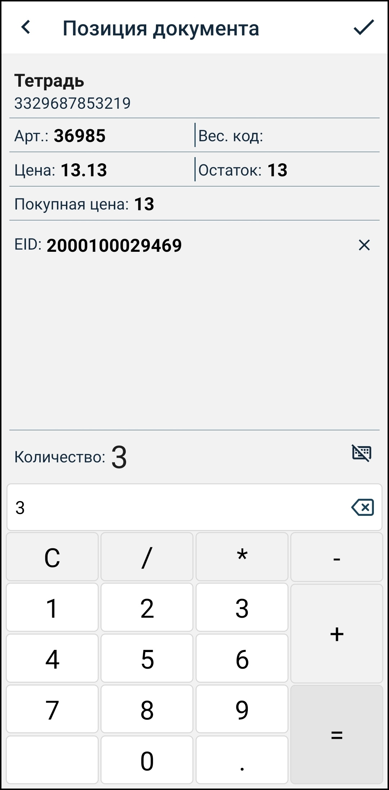 

#### Удаление позиции

Если в экране просмотра документа нажать и удерживать позицию, то там появится зеленая галочка. Далее необходимо нажать на иконку Мусорная корзина, и подтвердить желание удалить данную позицию или позиции документа. 

Позиция или позиции будут удалены.

 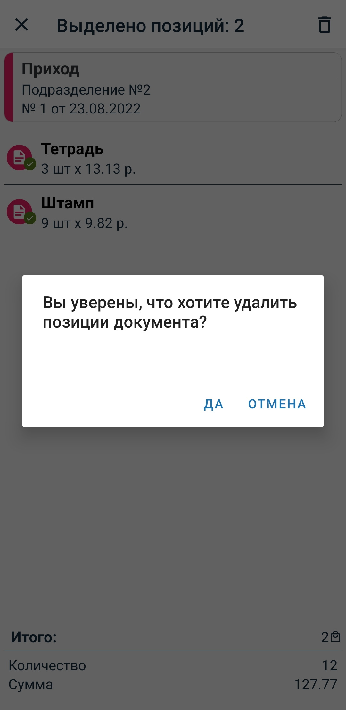

### Статус документа

Цвет иконки или боковой полосы шапки документа означает его статус. При смене статуса меняется и цвет.
Имеется 4 основных статуса:

| Статус | Цвет    | Описание                          |
|------------| ------- | ------------------------------------------ |
|Черновик| Красный | Новый документ, который можно редактировать|
|Готов к отправке| Зеленый | Документ, который можно отправлять на обработку (снят признак **Черновик**). Нельзя редактировать. |
|Отправлен| Желтый  | Документ отправлен, ожидается подтверждение (после нажатия кнопки синхронизации документы со статусом **Готов к отправке** меняют статус на **Отправлен**) |
|Обработан успешно| Синий   | Документ получил подтверждение об успешной обработке на сервере (в случае, если документ обработан с ошибкой, статус меняется на **Черновик**)  |

### Порядок работы

Вернемся на экран просмотра списка документов, выбрав пункт бокового меню **Документы**:

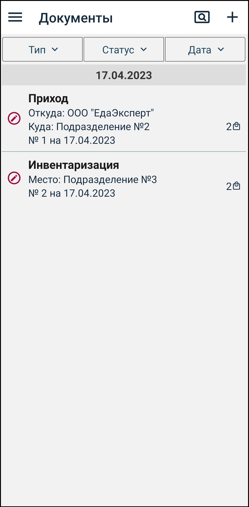

При создании документ имеет статус **Черновик** (красный цвет).

После ввода необходимых данных, чтобы отправить документ на обработку, необходимо снять признак **Черновик** на экране шапки документа.

Документ перейдет в состояние **Готов к отправке** (зеленый цвет) - редактировать данные нельзя.

 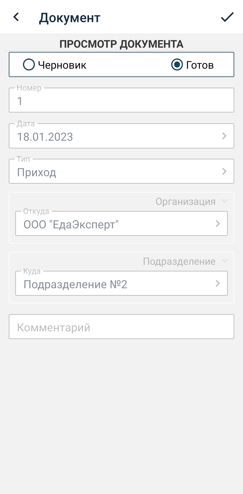 

Пока документ не отправлен, его можно вернуть из статуса **Готов к отправке** в статус **Черновик** и отредактировать данные.

<<<<<<< HEAD
### Отправка документа

Чтобы отправить все документы со статусом **Готов к отправке** на сервер, необходимо нажать на иконку синхронизации  в боковом меню (открыть боковое меню можно нажатием на иконку меню " **≡** ", находящуюся в верхнем углу приложения слева, или смахнув пальцем вправо с левого края устройства). 

Также можно отправить на сервер ОДИН документ, для этого нажать на иконку  , находящуюся над шапкой документа. 
=======
Чтобы отправить документы со статусом **Готов к отправке** на сервер, необходимо нажать на иконку синхронизации.
>>>>>>> 04fc52e44bd77be2b929eca067318d7efbc81d4a

После отправки документ перейдет в статус **Отправлен** (желтый цвет) - редактирование невозможно.

 

Далее необходимо подождать 1-2 минуту и синхронизировать данные снова для получения ответа обработки, цвет станет синим.

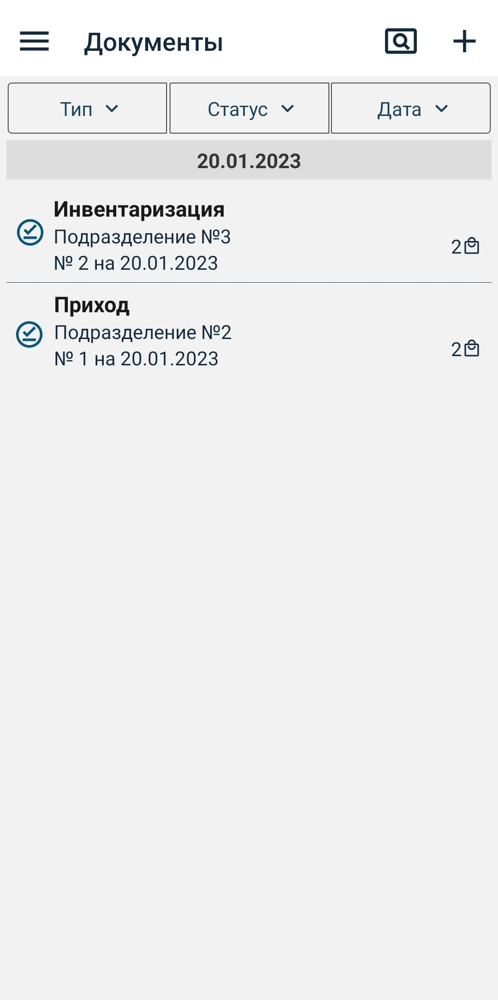

### Удаление документа

Для удаления нужно нажать на необходимый документ и удерживать его, после чего появится зеленая галочка, которая выделит данный документ среди прочих. Далее необходимо нажать иконку Мусорная корзина и подтвердить желание удалить документ, и документ удаляется. 

Используя пункты меню можно:
- перейти на редактирование шапки документа (если статус **Черновик**)
- копировать документ
- удалить документ (если статус **Черновик**)

### Фильтры

Для удобства просмотра на экране документов можно использовать фильтры и сортировку:
- фильтр по типу документа
- фильтр по статусу документа
- сортировка по дате

  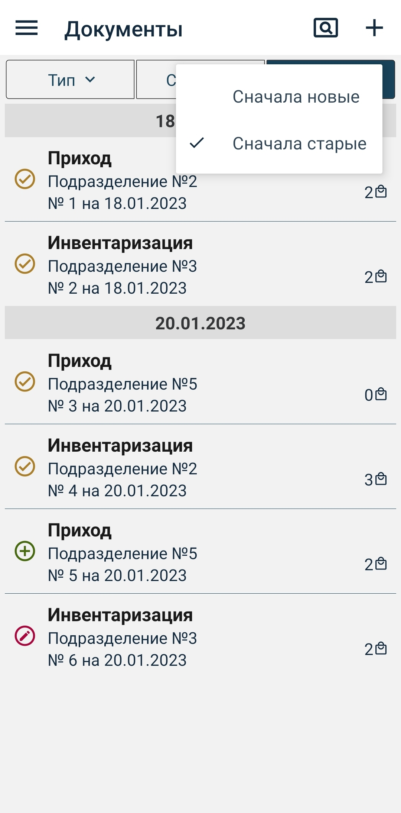

| Фильтр по статусу | Описание                                                                                                                                                                    |
| --------------- | --------------------------------------------------------------------------------------------------------------------------------------------------------------------------- |
| Все             | Все документы                                                                                                                                    |
| Активные        | Все документы, кроме тех, которые уже обработаны на сервере (со статусом **Черновик**, **Готов к отправке**, **Отправлен**).                                                                |
| Черновик           | Документы со статусом **Черновик**|
| Готово           | Документы со статусом **Готов к отправке**|
| Отправлено           | Документы со статусом **Отправлен**|
| Обработано           | Документы со статусом **Обработан успешно**|

## 7. Профиль

Экран **Профиль** содержит информацию о пользователе и об устройстве. Также здесь можно выйти из учетной записи пользователя.

Если вход был произведен в демо режиме, кнопка **Сменить пользователя** меняется на **Выйти из демо режима**.

Также этот экран позволяет удалить все справочники и документы. Для этого необходимо нажать на иконку меню, расположенную в правом верхнем углу, и выбрать пункт **Удалить все справочники и документы**.

  

## 8. Сканирование

<<<<<<< HEAD
Уточнение: **если вы производите сканирование штрихкодов исключительно с помощью камеры мобильного устройства, то в настройках приложения необходимо перевести параметр ***Использовать сканер*** в отрицательное положение.**

На данный момент, с помощью сканера в документах **Сканирование** можно считать **DataMatrix код**. С помощью сканера в документах **Приход**, **Инвентаризация** считываются линейные штрихкоды. Скоро сканер сможет распознавать и линейные штрихккоды, и двухмерные.

Вернемся на экран списка документов сканирования, выбрав пункт бокового меню **Сканирование** (открыть боковое меню можно нажатием на иконку меню " **≡** ", находящуюся в верхнем углу приложения слева, или смахнув пальцем вправо с левого края устройства).

Чтобы найти документ по наименованию можно воспользоваться строкой поиска, нажав на иконку   **Поиск** в правом верхнем углу экрана.

По нажатию иконки " **+** ", в верхнем правом углу, переходим на экран добавления документа. При создании документ имеет статус Черновик. Заполняем необходимые поля - **Номер, Дата, Подразделение, Комментарий** и сохраняем документ, нажав на иконку 
**✓**.

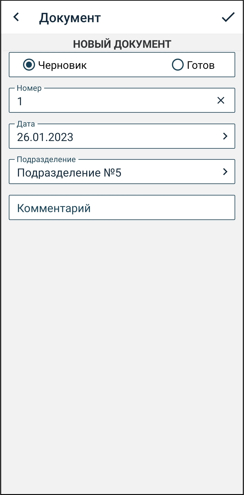

Отредактировать введенные данные можно, нажав на шапку документа или используя пункт меню " **⁝** " **Редактировать данные**.

 

Нажимаем на иконку штрихкода  в верхнем правом углу и переходим на экран сканирования товара.

Для удобства работы во время сканирования можно использовать кнопки **Вспышка**   или **Вибрация**  .

   

После ввода необходимых данных, можно отправить ДАННЫЙ документ на обработку двумя способами:

* в документе необходимо вручную поменять признак **Черновик** на признак **Готов к отправке** с помощью значка  в шапке документа. Шапка документа изменит цвет с красного на зелёный, редактировать данные уже нельзя. Далее нажать на значок   и документ отправится. Шапка документа изменит цвет на жёлтый (статус **Отправлен**).

* нажать на значок , находящийся над шапкой документа, который автоматически переведёт признак с **Черновик** на **Готов к отправке** и отправит документ на обработку.

Чтобы отправить ВСЕ документы со статусом **Готов к отправке** на сервер, нужно выйти на экран документов **Сканирование**, открыть боковое меню нажатием на иконку меню " **≡** ", находящуюся в верхнем углу приложения слева, и нажать на кнопку синхронизации . Но, необходимо отследить, чтобы все нужные документы были в состоянии **Готов к отправке**, то есть значок документа должен быть зелёного цвета.

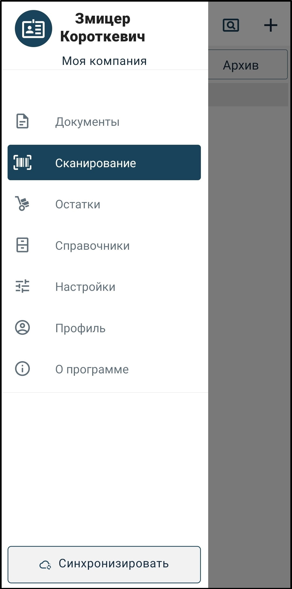 

## 9. Значение иконок
=======
Уточнение: если вы производите сканирование штрихкодов исключительно с помощью камеры устройства, то в настройках приложения необходимо перевести параметр **Использовать сканер** в отрицательное положение.
>>>>>>> 04fc52e44bd77be2b929eca067318d7efbc81d4a

Нажимаем на иконку штрихкода в верхнем правом углу и переходим на экран сканирования товара.
