# Инструкция для мобильного приложения "GDMN. Склад"

## 1. Подключение

Чтобы запустить приложение находим иконку  на рабочем экране мобильного устройства и нажимаем на нее.

При первом запуске приложения откроется стартовый экран, в котором будет предложено выбрать режим подключения:
- Демо режим
- Подключение к серверу

### Демо режим
При нажатии на кнопку **Демо режим** выполняется автоматический вход в приложение под тестовым пользователем.
В данном режиме можно ознакомиться с функционалом приложения offline (без подключения к базе данных) на демо данных.

Загрузка данных и работа в приложении пояснена далее в пунктах 3-9.

Выйти из демо режима можно, открыв боковую панель нажатием на иконку меню **≡**, находящуюся в верхнем углу приложения слева, или смахнув пальцем вправо с левого края устройства.
Затем перейти на экран **Профиль** и нажать на кнопку **Выйти из демо режима**.

### Подключение к серверу
Чтобы подключиться к рабочей базе данных необходимо выбрать **Подключиться к серверу** для перехода на экран настройки подключения:

В этом экране следует указать параметры подключения к серверу.

| Параметр | Описание |
| --------------------- | ------------------------------------------ |
|Адрес сервера | Включает в себя протокол и доменное имя (IP-адрес) сервера. Пример: http://localhost |
| Порт         | Порт сервера. Пример: 3649 |
| ID устройства| ID устройства будет заполнено автоматически после завершения аутентификации |

При нажатии на кнопку **Сохранить** переходим к окну для подключения к серверу:

Нажимаем кнопку **Подключиться**.

После успешного подключения к серверу появится экран **Активация устройства**.

В данном экране необходимо ввести код активации, который пользователь должен получить от администратора системы, и нажать **Отправить**.
При последующих запусках приложения будет происходить автоматический вход в учетную запись пользователя.

 

По нажатию на иконку в правом нижнем углу  можно перейти на экран подключения к серверу.

Если активация устройства прошла успешно, появится экран для входа пользователя.
В соответствующие поля необходимо ввести **Имя пользователя** и **Пароль** и нажать на кнопку **Войти**.

 

При успешной аутентификации пользователя откроется экран -- **Документы**.

## 2. Настройки

Экран **Настройки** содержит информацию о параметрах связи с сервером и настройки приложения.

Настройки приложения:

| Параметр | Описание |
| ------------ | -------- |
|Перезаписывать справочники | Если указан, то при каждой синхронизации справочники будут перезаписываться  |
|Запрашивать справочники|Если указан, то при синхронизации будет отправляться запрос на справочники. Если не указан, то запрос генерироваться не будет, а справочники должны будут выгружаться из Гедымина автоматически|
|Использовать сканер|Если указан, то для сканирования штрихкода будет использован сканер терминала сбора данных. Если не указан, то сканировать штрихкоды необходимо при помощи камеры устройства|
|Время хранения документов в архиве| Количество дней хранения обработанные документы в приложении, отсчитываемое от даты документа|

Настройки весового товара:

| Параметр | Описание |
| ------------ | -------- |
Идентификатор весового товара| Число (обычно это 22 или 23), которое означает, что штрихкод, начинающийся на это число, относится к весовому товару |
|Количество символов для кода товара| Число, которое определяет идентификатор товара в штрихкоде, для поиска в справочнике |
|Количество символов для веса (в гр.)| Число, задающее количество символов в штрихкоде для определения веса товара|

По нажатию на иконку меню, расположенную в правом верхнем углу, можно вернуться к начальным настройкам, выбрав пункт **Установить настройки по умолчанию**.

  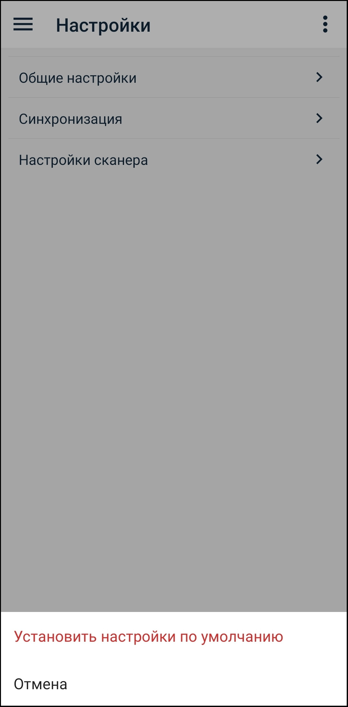

## 3. Загрузка данных

Чтобы загрузить данные, предназначенные для пользователя, следует нажать на иконку синхронизации данных  в нижнем углу бокового меню.

Открыть боковое меню можно нажатием на иконку меню **≡**, находящуюся в верхнем углу приложения слева, или смахнув пальцем вправо с левого края устройства.

  

После загрузки данных в приложении должны появится справочники и все необходимые документы.

Если синхронизация прошла, но данных не появилось, то необходимо повторить синхронизацию через некоторое время.

Рядом с иконкой отображается дата и время последней синхронизации.

## 4. Справочники

На экране **Справочники** можно просмотреть информацию о справочниках, необходимых для работы с приложением.

При нажатии на конкретный справочник переходим на экран просмотра:

По нажатию на позицию из списка можно перейти в окно просмотра позиции:

Пример справочника магазинов:

 

Чтобы найти справочник по наименованию можно воспользоваться окном для поиска в правом верхнем углу экрана.

## 5. Остатки

На экране **Остатки** можно просмотреть информацию об остатках товаров.

"Остатки" представляют собой список товаров с ценами и количеством остатка в разрезе подразделения/организации/сотрудника на текущую дату.

При добавлении товаров в документ, который работает с остатками, список товаров будет ограничен только товарами с остатком по конкретному подразделению/организации/сотруднику.

Выберем подразделение.

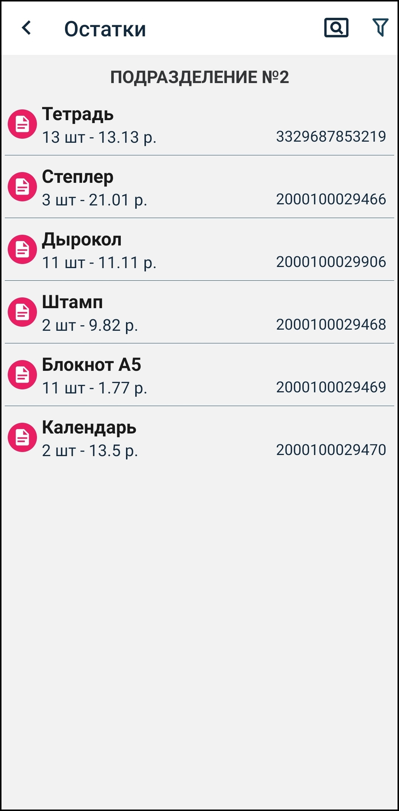

На экране отображены остатки товаров для данного подразделения. По нажатию на конкретный товар можно просмотреть его цены и остаток.

## 6. Документы

### Статус

Цвет иконки или боковой полосы шапки документа означает его статус. При смене статуса меняется и цвет.
Имеется 4 основных статуса:

| Статус | Цвет    | Описание                          |
|------------| ------- | ------------------------------------------ |
|Черновик| Малиновый | Новый документ, который можно редактировать|
|Готов к отправке| Зеленый | Документ, который можно отправлять на обработку (снят признак **Черновик**). Нельзя редактировать. |
|Отправлен| Желтый  | Документ отправлен, ожидается подтверждение (после нажатия кнопки синхронизации документы со статусом **Готов к отправке** меняют статус на **Отправлен**) |
|Обработан успешно| Синий   | Документ получил подтверждение об успешной обработке на сервере (в случае, если документ обработан с ошибкой, статус меняется на **Черновик**)  |

### Cоздание документа

По нажатию на иконку **+** в верхнем правом углу переходим на экран добавления документа.

Обязательные поля для заполнения: **Номер**, **Дата**, **Тип** и поля в зависимости от типа документа.
Например, для документа прихода это поля **Откуда**, **Куда**. Для документа инвентаризации - поле **Место**.

  

Поля контактов могут быть 3 типов, которые при необходимости можно изменять:
- Подразделение
- Организация
- Сотрудник

 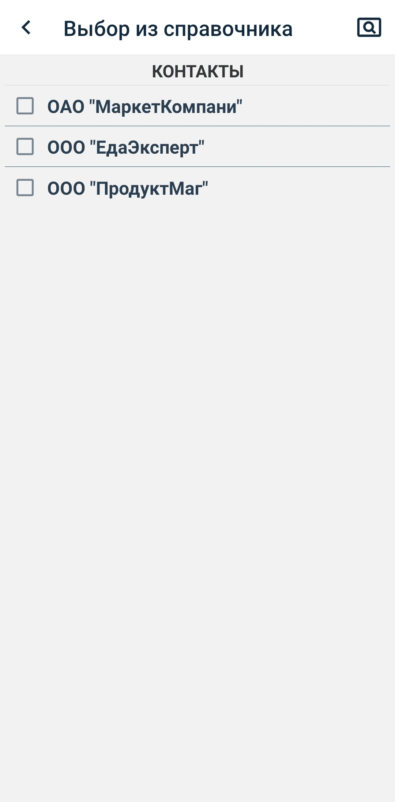 

После заполнения данных документ сохраняем, нажав на иконку **✓** в правом верхнем углу.

Переходим на экран просмотра документа.
Редактировать данные можно, нажав на шапку документа.

По нажатию на кнопку меню, расположенную в правом верхнем углу, доступны следующие операции: **Добавить товар**, **Редактировать данные**, **Удалить документ**.

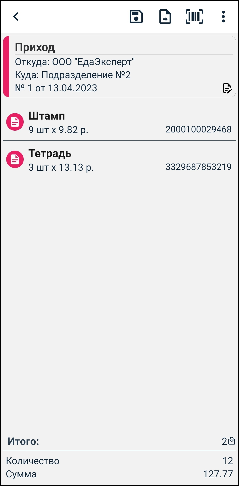 

### Добавление товара

Добавить новую позицию можно 2 способами:
- отсканирование по штрихкоду
- добавить вручную из списка товаров

#### Сканирование штрихкода

Нажимаем на иконку штрихкода в верхнем правом углу и переходим на экран сканирования товара.

Экран сканирования на ТСД:

Экран сканирования на мобильном устройстве:

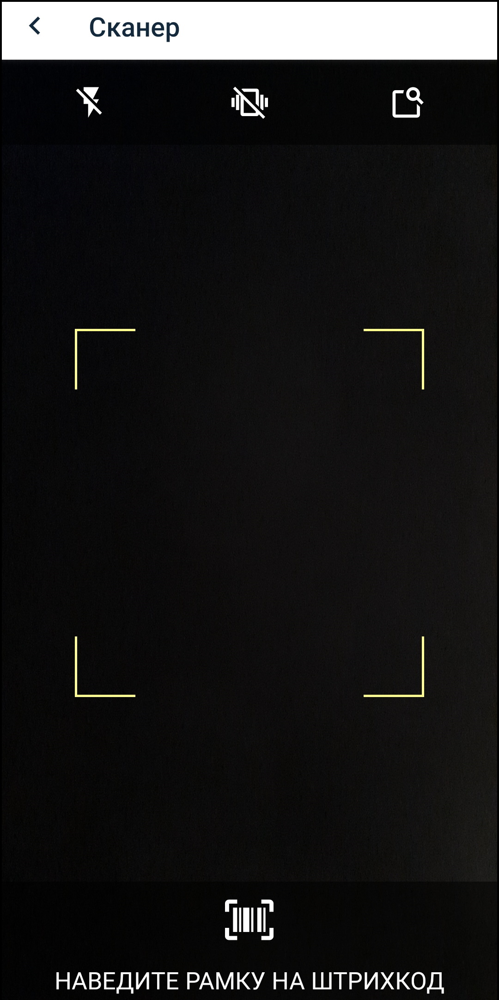

#### Добавление товара вручную

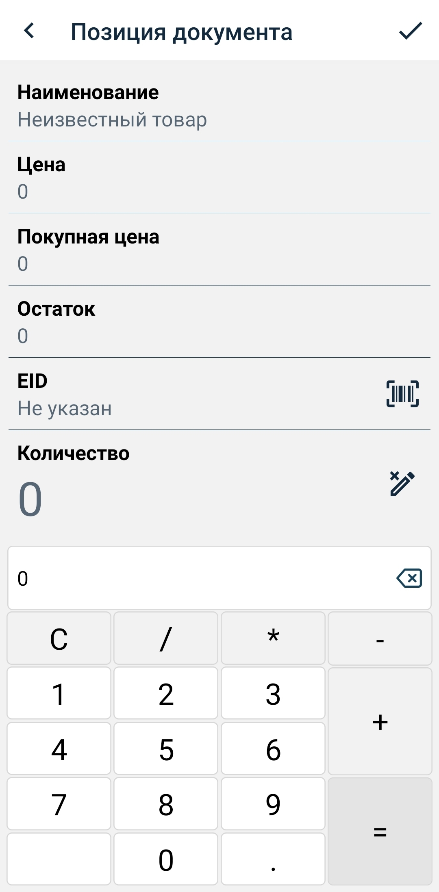

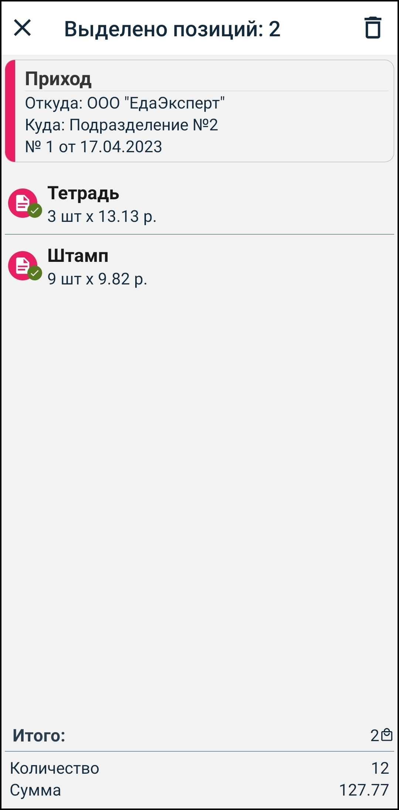

Если смахнуть заявку влево, то появится меню с дополнительными иконками.

Данное меню позволяет редактировать заявку (если она является доступной для редактирования), копировать заявку или удалить.

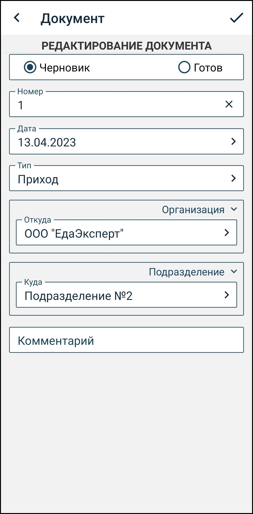

 

После сканирования товара откроется экран позиции документа для ввода количества.

 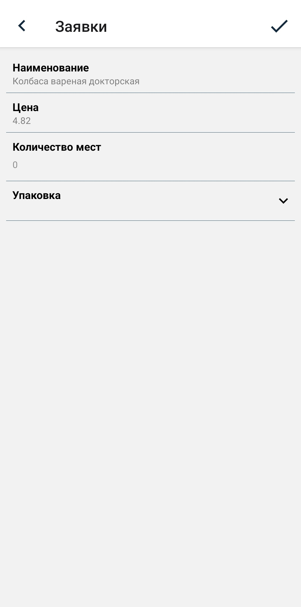 

Просканируем еще один товар:

 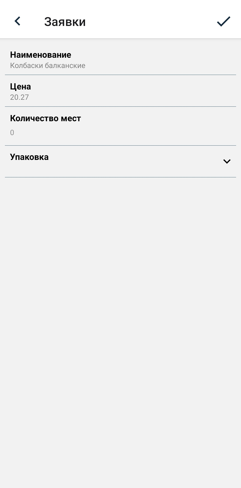 

Вернемся на экран просмотра документа:

При создании документ имеет статус **Черновик** (красный цвет). Его можно редактировать и удалять.

После ввода необходимых данных, чтобы отправить документ на обработку, необходимо снять признак **Черновик** на экране редактирования документа. При изменении статуса документ переходит в состояние **Готов к отправке** (зеленый цвет) - редактировать данные нельзя.

  

Пока документ не отправлен, его можно вернуть из статуса **Готов к отправке** в статус **Черновик** и отредактировать данные.

Чтобы отправить документы со статусом **Готов к отправке** в Гедымин необходимо нажать на иконку синхронизации. После отправки документ перейдет в статус **Отправлен** (желтый цвет) - редактирование невозможно.

Далее необходимо подождать 1-2 минуту и синхронизировать данные снова для получения ответа обработки, цвет становится темно синим.

Вернемся на экран просмотра всех заявок:

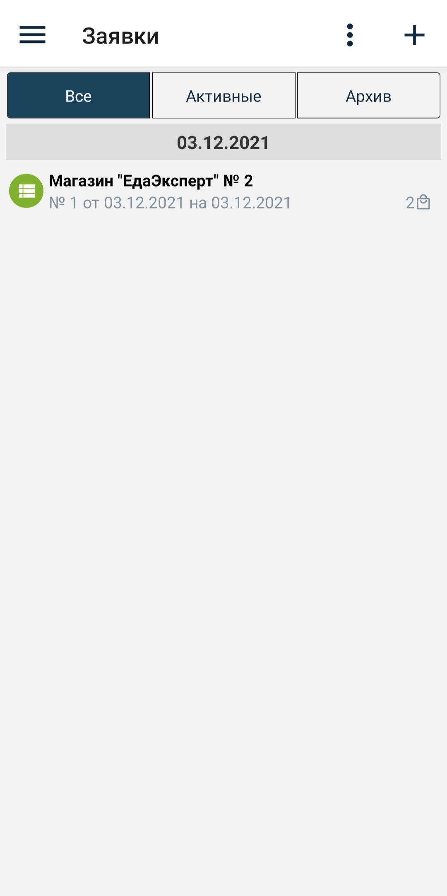

Для отправления заявки необходимо нажать на кнопку синхронизации, расположенную в боковом меню.

При получении подтверждения заявка переходит в архив, цвет становится синим. При наличии ошибки в заявке появится надпись **Отказано** и вид ошибки.

Если смахнуть заявку влево, то появится меню с дополнительными иконками.

Данное меню позволяет редактировать заявку (если она является доступной для редактирования), копировать заявку или удалить.

### Фильтры

Для удобства просмотра на экране документов можно использовать следующие фильтры:
- по типу документа
- по статусу документа

| Фильтр по статусу | Описание                                                                                                                                                                    |
| --------------- | --------------------------------------------------------------------------------------------------------------------------------------------------------------------------- |
| Все             | Все документы                                                                                                                                    |
| Активные        | Все документы, кроме тех, которые уже обработаны на сервере (со статусом **Черновик**, **Готов к отправке**, **Отправлен**).                                                                |
| Черновик           | Документы со статусом **Черновик**|
| Готово           | Документы со статусом **Готов к отправке**|
| Отправлено           | Документы со статусом **Отправлен**|
| Обработано           | Документы со статусом **Обработан успешно**|

А также есть возможность отсортировать все документы по дате:

!!!Вставить картинку с сортировкой

## 10. Профиль

Экран **Профиль** содержит информацию о пользователе и об устройстве. Также здесь можно выйти из учетной записи пользователя. При наличии настроек пользователя, они также будут отображены в данном экране.

 

Если вход был произведен в демо режиме, кнопка **Сменить пользователя** меняется на **Выйти из демо режима**

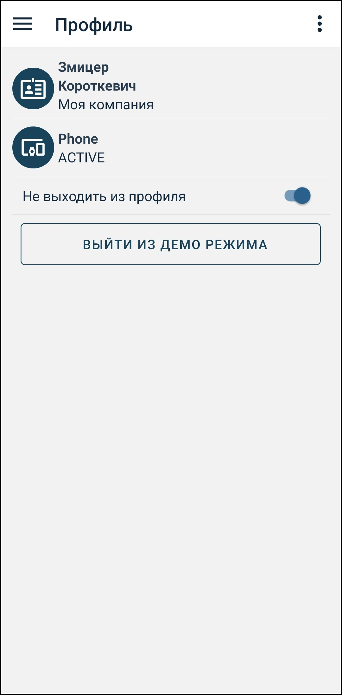

Также этот экран позволяет удалить все справочники и документы. Для этого необходимо нажать на иконку меню, расположенную в правом верхнем углу, и выбрать пункт **Удалить все справочники и документы**.

