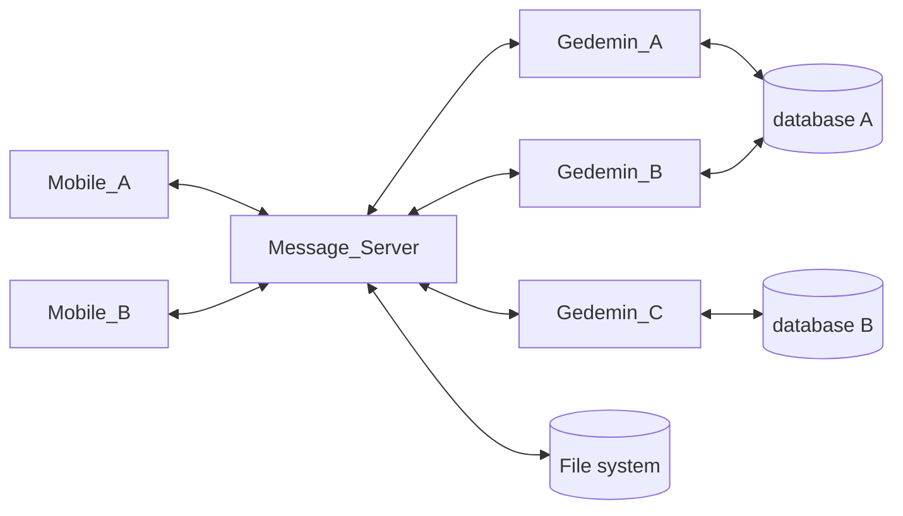
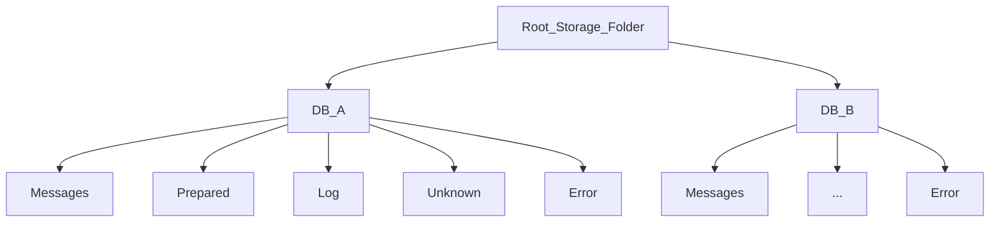
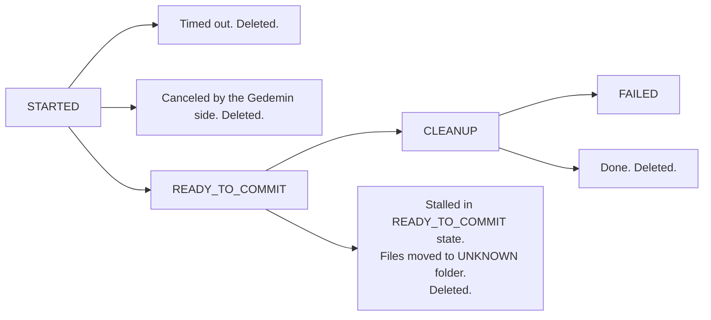

Обобщенная схема взаимодействия компонентов системы выглядит следующим образом:

Мы рассматриваем процесс, при котором:

1. Гедымин запрашивает и получает с сервера сообщений список файлов для обработки.
2. Производит обработку полученных файлов, в том числе изменяет информацию в базе данных, и формирует один или несколько файлов в ответ.
3. Передает файлы серверу сообщений для размещения в очереди. После успешного выполнения, исходные файлы должны быть перемещены в специальную папку `LOG`.

Процесс должен быть устойчив к любым техническим неполадкам на сервере сообщений, Гедымине или в сети: обрыву соединения, невозможности записать данные на диск, зависанию, принудительному завершению, остановке на точке останова и т.п.

Вышеуказанные неполадки не должны привести к:

1. Потере данных.
2. Повторной обработке одних и тех же файлов.
3. Переходу системы в unresponsive состояние, когда для дальнейшей работы потребуется вмешательство оператора, перезагрузка и т.п.

При обработке файлов Гедымином возможны две проблемы:

1. Повторная обработка одних и тех же данных. `Gedemin_A` начал обработку файлов, в это время запустился `Gedemin_B` и тоже начал обработку этих же файлов тем же макросом/автозадачей. 
2. Ошибка при совместном доступе к объектам базы данных при одновременной обработке _разных_ файлов, двумя или более копиями Гедымина, подключенными к одной и той же базе данных.

### Prerequisites

1. Каждый Гедымин является полноценным клиентом системы и имеет свой уникальный идентификатор, который используется при сетевом обмене с сервером сообщений.
2. У каждой базы данных Гедымина есть свой уникальный ИД, который хранится в самой базе данных и используется при обмене с сервером сообщений. ИД базы должен формироваться таким образом, чтобы быть валидным именем файла или его частью.

> Стандартный `DBID` Гедымина не подходит в качестве ИД базы, так как он меняется при восстановлении базы данных из архива. Для хранения ИД базы можно использовать константу, параметр в глобальном хранилище, поле в специальной таблице с настройками подсистемы.

3. На сервере сообщений каждое сообщение записывается в отдельный файл в имени которого указываются идентификаторы от кого и кому направляется сообщение. 
4. Расположение файлов на диске:

В корневой папке создается по вложенной папке для каждой базы данных. Имя папки совпадает с ИД базы данных. Внутри папки базы данных создаются папки:

* Messages -- очередь сообщений, адресованных этой базе данных. 
* Log -- после завершения обработки сюда переносятся файлы сообщений. В папке лога сообщения хранятся ограниченное время, например, 3 месяца. Очистка происходит при запуске сервера сообщений.
* Prepared -- здесь размещаются подготовленные файлы, присланные из Гедымина, до того, как будет получено подтверждение, что прошел комит в базу данных. После этого файлы переносятся в папку Messages.
* Unknown -- сюда переносятся файлы после того, как процесс "завис" в состоянии `READY_TO_COMMIT` (см. ниже).
* Error -- сюда переносятся файлы сообщений, обработка которых в Гедымине завершилась ошибкой.

### Список процессов

1. Список объектов процессов находится в оперативной памяти сервера сообщений.
2. При каждом изменении списка его копия записывается на жесткий диск. Запись в файл со списком процессов асинхронная.
3. При старте сервера сообщений список процессов считывается из дискового файла и производится обработка процессов, находящихся в промежуточном состоянии (см. ниже).
5. Ошибки записи в файл списка процессов обрабатываются и не должны приводить к остановке сервера. Сообщение об ошибке помещается в лог.

### Обработка сообщений

Рассмотрим пошагово процесс обработки сообщений Гедымином. Там, где речь идет об обращении к серверу сообщений по протоколу HTTP/HTTPS мы указываем условное наименование URL end-point:

1. Гедымин посылает на сервер сообщений запрос (`API_1`) на начало процесса обработки сообщений. В запросе передается:
    1. ИД адресата (т.е. свой ИД) 
    2. ИД базы данных
    3. Массив идентификаторов подсистем. Опционально. Если передан, то только сообщения из указанных подсистем будут переданы на Гедымин.
    4. Массив идентификаторов отправителей. Опционально. Если передан, то только сообщения от указанных отправителей будут переданы.
    5. Максимальное количество файлов (сообщений). Опционально.
    6. Максимальный объем (в Мб) передаваемых данных. Опционально.
            
>    Как определяется предельный размер передаваемых данных. На сервере сообщений существуют параметры: максимальное количество передаваемых файлов и максимальный суммарный объем передаваемых данных в Мб. Данные параметры берутся из `PROCESS_ENV` и если они там не установлены то инициализируются разумными константами. Например, 10 файлов, 20 Мб данных. Если в запросе переданы свои ограничения, то сервер ориентируется на меньшие числа. Т.е. если на сервере настроено не более 10 файлов за передачу, а клиент в запросе запросил не более 5, то передаем максимум 5. По размеру аналогично. Сервер при определении списка файлов считывает их размеры и если задано ограничение, то уменьшает список, пока размер не впишется в заданный предел.

2. Сервер проверяет список процессов и находит в нем записи для заданного адресата ИЛИ для заданного ИД базы данных.
3. Если записей нет, то процесс можно начинать:
    1. Присваивается уникальный ИД процессу.
    2. Создается объект процесса, который включает: 
        1. ИД процесса
        2. ИД адресата
        3. ИД базы данных
        4. Дату и время начала процесса
        5. Список файлов, которые будут переданы Гедымину
        6. Список файлов принятых от Гедымина (изначально пустой)
        7. Дату и время перевода процесса в состояние `READY_TO_COMMIT` (изначально не определено)
        7. состояние -- `STARTED`
    3. Объект помещается в список процессов.
    4. Гедымину возвращается объект процесса.
4. Гедымин фиксирует у себя ИД процесса и проверяется полученный список. Если некоторые файлы не могут быть обработаны, то Гедымин вызывает `API_2`, с которым передает список файлов которые он будет обрабатывать. Сервер сообщений получив список отражает его в объекте процесса и возвращает подтверждение `OK`. Только получив подтверждение Гедымин приступает к обработке. Ошибка сети, отсутствие подтверждения приводит к полному прекращению процесса на стороне Гедымине. Если Гедымин готов обработать ВСЕ переданные файлы, то никакого дополнительного обращения к серверу сообщений не требуется.
5. Если уже существует активный процесс для переданного ИД адресата ИЛИ ИД базы данных, то возвращается ответ `BUSY`. Получив данный статус, Гедымин завершает алгоритм обработки, при необходимости информируя пользователя. Через некоторое время попытка может быть повторена начиная с шага 1. Аналогично, процесс завершается и при отсутствии ответа с сервера сообщений (тайм-аут HTTP протокола), и при возникновении сетевых ошибок.
6. Гедымин стартует транзакцию и приступает к последовательной обработке полученных файлов. Все изменения в базе данных должны выполняться на этой транзакции.
7. Гедымин ведет список, где фиксируется имя и результат обработки каждого файла: 
    * PROCESSED 
    * PROCESSED_DEADLOCK
    * PROCESSED_INCORRECT (в этом случае еще записывается и текст сообщения об ошибке, и её числовой код, если он известен. Имеется ввиду числовой код ошибки, возвращаемый сервером файреберд).
8. Перед обработкой файла создается SAVEPOINT. После успешного окончания обработки файла SAVEPOINT удаляется. В случае возникновения ошибки или dead lock происходит откат к SAVEPOINT и процесс обработки списка файлов продолжается.    
9. Периодически, сервер сообщений проверяет список процессов и те из них, которые находятся в состоянии `STARTED` и превысили заданный тайм-аут удаляются, о чем делается запись в логе.
10. Периодически, сервер сообщений проверяет список процессов и те из них, которые находятся в состоянии `READY_TO_COMMIT` дольше чем заданный промежуток времени, обрабатываются так как описано ниже в разделе посвященном старту сервера сообщений.
11. Закончив успешно обработку всех файлов, перед комитом транзакции, Гедымин формирует файлы в ответ и выполняет запрос к серверу сообщений (`API_3`) с передачей:
    1. ИД процесса
    2. Сформированными файлами
    3. Списком обработанных файлов с указанием результата обработки каждого файла. 
12. Сервер сообщений в ответ на запрос к `API_3` ищет процесс в списке процессов и проверяет его статус. Если в списке нет процесса с переданным ИД или его состояние не `STARTED`, то возвращается статус `CANCELLED`. Если процесс есть в списке в состоянии `STARTED`, то: 
    1. Ему присваивается состояние `READY_TO_COMMIT`.
    2. Полученный список обработанных файлов с результатами их обработки фиксируется в объекте процесса.
    3. Полученные файлы записываются _синхронно_ в папку `PREPARED`. После успешной записи файлов их имена фиксируются в объекте процесса. 
    4. Для файлов, при обработке которых возникли ошибки, создаются в папке `PREPARED` соответствующие файлы для передачи на исходное устройство. Ошибки выводятся в лог системы.
    5. Сервер сообщений возвращает в Гедымин состояние `OK`.
10. Получив ответ `CANCELLED` или не получив ответа (тайм-аут), или если произошла сетевая ошибка, Гедымин откатывает транзакцию, на которой произошли изменения в базе данных. На этом процесс завершается на стороне Гедымина и может быть повторен, начиная с шага 1.
11. Получив ответ `OK` Гедымин производит комит транзакции и в случае успеха сообщает об этом серверу сообщений -- `API_4`. В случае, если при комите транзакции произошла ошибка, Гедымин сообщает об этом серверу сообщений -- `API_5`. Вместе с вызовом `API_5` передается сообщение об ошибке, которое может быть помещено в лог системы или передано исходному отправителю для отображения пользователю. В обоих случаях на этом процесс завершается на стороне Гедымина.
12. Получив подтверждение успешного комита в базу данных сервер сообщений: 
    1. Переводит процесс в состояние `CLEANUP`. 
    2. Полученные файлы переносятся из папки `PREPARED` в `MESSAGES`. 
    3. Успешно обработанные файлы переносятся из папки `MESSAGES` в папку `LOG`.
    4. Файлы, при обработке которых возникли ошибки, переносятся из папки `MESSAGES` в папку `ERROR`. 
    5. Файлы, при обработке которых возник dead lock, мы не трогаем. Они будут переданы и обработаны повторно при следующих запросах данных из Гедымина.
    
    По успешному переносу процесс удаляется из списка процессов. Если файлы не удается переместить -- об этом делается запись в логе сервера сообщений. Процесс остается в списке. Его статус меняется на `FAILED`. Такая ситуация требует вмешательства системного администратора. 
> Важно! После перемещения _каждого_ файла делаются соответствующие изменения в списке файлов в объекте процесса, а объект процесса (как было указано выше) сохраняется на диск.
13. Получив сообщение о неуспешном комите в базу данных сервер сообщений удаляет процесс из списка процессов и делает соответствующую запись в логе. Файлы этого процесса, ранее записанные в папку `PREPARED`, удаляются. Ошибки, которые могут возникнуть при удалении файлов, подавляются. Сообщения о них выводятся в лог системы.
14. Разработчик может в любой прервать процесс обработки в Гедымине и сообщить об этом серверу сообщений вызовом `API_6` с передачей дполнительного текстового сообщения, которое будет помещено в лог системы. Сервер сообщений в ответ на `API_6` удаляет объект процесса из списка. Процесс на стороне Гедымина завершается. Транзакция откатывается.

### Обработка списка процессов при старте сервера

При старте сервера загружаем список процессов с диска. Наличие там записей означает, что произошли какие-то ошибки в процессе работы сервера или процесс был принудительно завершен. Список обрабатывется следующим образом:

1. Проводится проверка на тайм-аут записей в состоянии `STARTED`. Устаревшие записи удаляются.
2. Записи в состоянии `CLEANUP` удаляются из списка, а перечисленные в них файлы перемещаются в папки `LOG`, `MESSAGES` и `ERROR` соответственно. Может возникнуть редкая ситуация, когда имя файла будет зафиксировано в списке, а самого файла на диске не окажется. Такое может случиться, так как мы сначала переносим файл, а потом обновляем список файлов в объекте процесса и записываем его на диск. Такую ошибку можно игнорировать.
3. Записи в состоянии `READY_TO_COMMIT` говорят нам о том, что мы не знаем точно прошел ли комит на базе данных. О таких записях надо обязательно информировать системного администратора, а перечисленные в них файлы (как файлы из папки `MESSAGES`, так и файлы из папки `PREPARED`) должны быть перемещены в папку `UNKNOWN`, но не удалены с диска. Файлы, при обработке которых произошла ошибка переносятся в папку `ERROR`. Файлы, при обработке которых произошел dead lock мы оставляем в исходном состоянии. Такая ситуация требует вмешательства системного администратора. Сама запись процесса удаляется из списка.

### Диаграма состояний процесса

### Замечания

1. В ситуации, когда процесс остается в состоянии `READY_TO_COMMIT` или `FAILED` системного администратора следует проинформировать как можно быстрее. Для этого необходимо реализовать механизм рассылки email или sms на адрес системного администратора.
2. Не забываем, что функция, предусматривающее _атомарное_ выполнение операций (в т.ч. включающее операции ввода-вывода) не должна содержать внутри _await_ вызовов. Хотя сама по себе может быть и _async_ функцией.
3. Структуры данных, используемые в обмене между устройствами (клиентами) и сервером сообщений должны включать поле _version_. Так же версионироваться должны пути в API.
4. Учитывая, что мы включаем в имя файла и некоторых папок уникальные идентификаторы, стоит принимать во внимание максимально допустимую длину _полного_ имени файла.
5. Каждое сообщение в системе должно иметь поле со временем его формирования. Список сообщений следует обрабатывать в хронологическом порядке от более старых к более новым.
6. Следует помнить, что операции загрузки содержимого файла в оперативную память и парсинга JSON весьма затратны по процессорному времени и памяти. Там где возможно, мы должны избегать их. Например, получать информацию об источнике и адресате из имени файла. Определять размер файла функцией файловой системы. Сливать файлы в единый список без промежуточного парсинга JSON и т.п.
7. По возможности следует собирать статистику в разрезе устройств/клиентов сервера сообщений: количество переданных сообщений, количество успешно обработанных, количество ошибок dead lock-ов и т.п.
8. Поскольку наш сервер сообщений одновременно является и сервером администраторского веб интерфейса, следует предусмотреть в последнем dash board со статистическими показателями, индикацией текущих процессов, просмотром лога и т.п.
