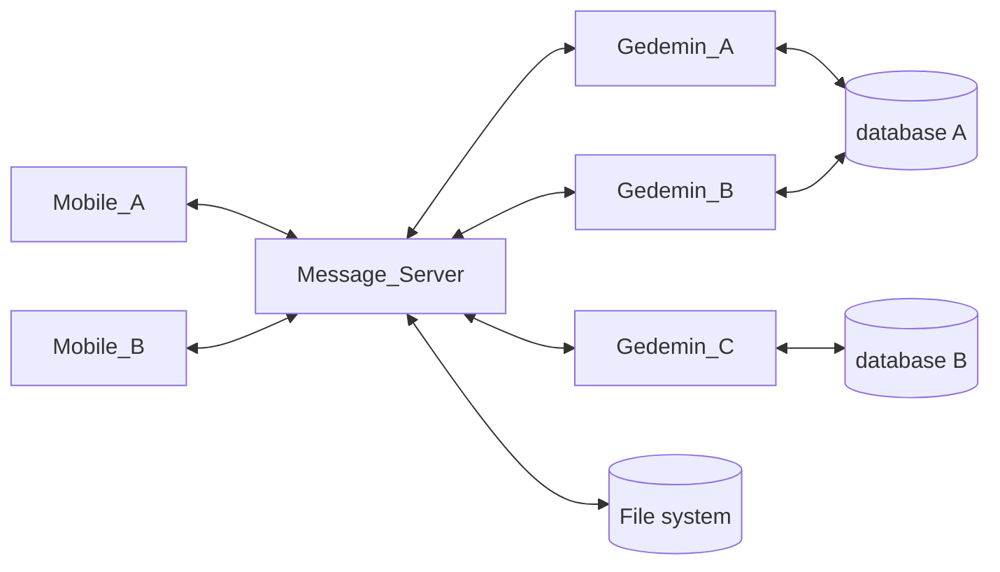

Обобщенная схема взаимодействия компонентов системы выглядит следующим образом:

Мы рассматриваем процесс, при котором:

1. Гедымин запрашивает и получает с сервера сообщений список сообщений для обработки.
2. Производит обработку полученных сообщений и формирует одно или несколько сообщений в ответ.
3. Передает сообщения серверу сообщений для размещения в очереди. После успешного выполнения, исходные сообщения должны быть удалены (или помечены как обработанные).

Процесс должен быть устойчив к любым техническим неполадкам: обрыву соединения, невозможности записать данные на диск, зависанию, зарвешению, остановке Гедымина или сервера сообщений в процессе обработки.

Вышеуказанные неполадки не должны привести:

1. Потере данных (сообщений).
2. Повторной обработке одних и тех же сообщений.
3. Переходу системы в unresponsive состояние, когда для дальнейшей работы потребуется вмешательство оператора.

При обработке сообщений Гедымином возможны две проблемы:

1. Повторная обработка одних и тех же данных. `Gedemin_A` начал обработку сообщений, в это время запустился `Gedemin_B` и тоже начал обработку этих же сообщений тем же макросом/автозадачей. 
2. Ошибка при совместном доступе к объектам базы данных при одновременной обработке _разных_ сообщений, двумя или более копиями Гедымина, подключенными к одной и той же базе данных.

Prerequisites:

1. Каждый Гедымин является клиентом системы и имеет свой уникальный идентификатор, который используется при сетевом обмене с сервером сообщений.
2. У каждой базы данных Гедымина есть свой уникальный ИД, который хранится в самой базе данных и используется при обмене с сервером сообщений. 

> Стандартный `DBID` Гедымина не подходит в качестве ИД базы, так как он меняется при разархивировании.

Рассмотрим пошагово процесс обработки сообщений Гедымином:

1. Гедымин запрашивает на сервере сообщений сообщения по заданному ИД адресата.
2. Если получен список сообщений, проверяется подлежат ли они обработке, и если да, то осуществляется попытка стартовать процесс обработки.
3. Запрос на старт процесса это GET/POST запрос к серверу сообщений с которым передается ИД клиента и ИД базы данных.
4. Если уже существует активный процесс для переданного ИД адресата и ИД базы данных, то возвращается ответ BUSY. Получив данный статус, Гедымин завершает алгоритм обработки, при необходимости информируя пользователя. Через некоторое время попытка может быть повторена начиная с шага 1. Аналогично, процесс завершается и при отсутствии ответа с сервера сообщений (тайм-аут HTTP протокола), и при возникновении сетевых ошибок.
5. На сервере сообщений: если нет активного процесса для переданного ИД адресата и ИД базы данных, то:
    1. Процессу присваивается уникальный ИД.
    2. Создается объект процесса, который включает: ИД процесса, ИД адресата, ИД базы данных, Дату и время начала процесса. Объект помещается в список процессов.
    3. Гедымину возвращается объект процесса.
6. Получив объект процесса Гедымин стартует транзакцию и приступает к обработке сообщений. Все изменения в базе данных должны выполняться на этой транзакции.
7. 

