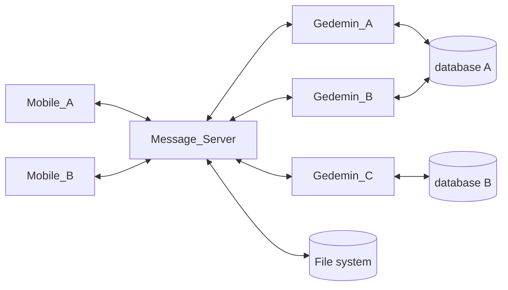

Обобщенная схема взаимодействия компонентов системы выглядит следующим образом:

Мы рассматриваем процесс, при котором:

1. Гедымин запрашивает и получает с сервера сообщений список сообщений для обработки.
2. Производит обработку полученных сообщений и формирует одно или несколько сообщений в ответ.
3. Передает сообщения серверу сообщений для размещения в очереди. После успешного выполнения, исходные сообщения должны быть удалены (или помечены как обработанные).

Процесс должен быть устойчив к любым техническим неполадкам: обрыву соединения, невозможности записать данные на диск, зависанию, зарвешению, остановке Гедымина или сервера сообщений в процессе обработки.

Вышеуказанные неполадки не должны привести:

1. Потере данных (сообщений).
2. Повторной обработке одних и тех же сообщений.
3. Переходу системы в unresponsive состояние, когда для дальнейшей работы потребуется вмешательство оператора.

При обработке сообщений Гедымином возможны две проблемы:

1. Повторная обработка одних и тех же данных. `Gedemin_A` начал обработку сообщений, в это время запустился `Gedemin_B` и тоже начал обработку этих же сообщений тем же макросом/автозадачей. 
2. Ошибка при совместном доступе к объектам базы данных при одновременной обработке _разных_ сообщений, двумя или более копиями Гедымина, подключенными к одной и той же базе данных.

### Prerequisites

1. Каждый Гедымин является клиентом системы и имеет свой уникальный идентификатор, который используется при сетевом обмене с сервером сообщений.
2. У каждой базы данных Гедымина есть свой уникальный ИД, который хранится в самой базе данных и используется при обмене с сервером сообщений. 

> Стандартный `DBID` Гедымина не подходит в качестве ИД базы, так как он меняется при восстановлении базы данных из архива.

### Список процессов

1. Список объектов процессов находится в оперативной памяти сервера сообщений.
2. При каждом изменении списка его копия записывается на жесткий диск.
3. При старте сервера сообщений список процессов считывается из дискового файла и производится обработка процессов, находящихся в промежуточном состоянии (см. ниже).
4. Ошибки записи в файл списка процессов обрабатываются и не должны приводить к остановке сервера. Сообщение об ошибке помещается в лог.

### Обработка сообщений

Рассмотрим пошагово процесс обработки сообщений Гедымином. Там, где речь идет об обращении к серверу сообщений по протоколу HTTP/HTTPS мы указываем условное наименование URL end point:

1. Гедымин запрашивает на сервере сообщений сообщения по заданному ИД адресата и ИД базы данных. API_1. 
2. Если получен список сообщений, проверяется подлежат ли они обработке, и если да, то осуществляется попытка стартовать процесс обработки. Если список пуст или сообщения не могут быть обработаны сервером, то Гедымин ничего не делает и никакого дополнительного запроса на сервер сообщений не посылает. Если в списке несколько сообщений, то Гедымин или готов/может обрабатывать их все, или не будет обрабатывать ни одного. Частичная обработка списка не предусмотрена.
3. Запрос на старт процесса это `POST` запрос к серверу сообщений с которым передается ИД клиента, ИД базы данных и список идентификаторов сообщений, которые будут обрабатываться Гедымином. API_2.
4. Если уже существует активный процесс для переданного ИД адресата и ИД базы данных, то возвращается ответ `BUSY`. Получив данный статус, Гедымин завершает алгоритм обработки, при необходимости информируя пользователя. Через некоторое время попытка может быть повторена начиная с шага 1. Аналогично, процесс завершается и при отсутствии ответа с сервера сообщений (тайм-аут HTTP протокола), и при возникновении сетевых ошибок.
5. На сервере сообщений: если нет активного процесса для переданного ИД адресата и ИД базы данных, то:
    1. Процессу присваивается уникальный ИД.
    2. Создается объект процесса, который включает: 
        1. ИД процесса
        2. ИД адресата
        3. ИД базы данных
        4. Дату и время начала процесса
        5. Список идентификаторов сообщений, которые будет обрабатывать Гедымин
        5. состояние -- `STARTED`
    3. Объект помещается в список процессов.
    4. Гедымину возвращается объект процесса.
6. Получив объект процесса Гедымин стартует транзакцию и приступает к обработке сообщений. Все изменения в базе данных должны выполняться на этой транзакции.
7. Периодически, сервер сообщений проверяет список процессов и те из них, которые находятся в состоянии `STARTED` и превысили заданный тайм-аут, помечаются состоянием `CANCELLED`.
8. Закончив успешно обработку всех сообщений, перед комитом транзакции, Гедымин выполняет запрос к серверу сообщений с указанием ИД процесса. API_3.
9. Сервер сообщений в ответ на запрос к API_3 ищет процесс в списке процессов и проверяет его статус. Если в списке нет процесса с переданным ИД или его состояние не `STARTED`, то возвращается статус `CANCELLED`. Если процесс есть в списке в состоянии `STARTED`, то ему присваивается состояние `READY_TO_COMMIT`. Сервер возвращает состояние `OK`.
10. Получив ответ `CANCELLED` или не получив ответа (тайм-аут), или если произошла сетевая ошибка, Гедымин откатывает транзакцию, на которой произошли изменения в базе данных. На этом процесс завершается на стороне Гедымина и может быть повторен, начиная с шага 1.
11. Получив ответ `OK` Гедымин производит комит транзакции и в случае успеха сообщает об этом серверу сообщений API_4. В случае, если при комите транзакции произошла ошибка, Гедымин сообщает об этом серверу сообщений API_5. В обоих случаях на этом процесс завершается на стороне Гедымина.
12. Получив подтверждение успешного комита в базу данных сервер сообщений переводит процесс в состояние `CLEANUP` и приступает к удалению файлов с сообщениями с диска (или переносу их в специальную папку бэкапа). По успешному удалению процесс удаляется из списка процессов. Если файлы не удается удалить -- об этом делается запись в логе сервера сообщений. Процесс остается в списке.
13. Получив сообщение о неуспешном комите в базу данных сервер сообщений удаляет процесс из списка процессов и делает соответствующую запись в логе.

### Обработка списка процессов при старте сервера

При старте сервера загружаем список процессов с диска. Наличие там записей означает, что произошли какие-то ошибки в процессе работы сервера или процесс был принудительно завершен. Список обрабатывется следующим образом:

1. Записи в состоянии `CANCELLED` удаляются из списка.
2. Записи в состоянии `CLEANUP` удаляются из списка, а перечисленные в них файлы с сообщениями удаляются с диска или перемещаются в папку бэкап.
3. Записи в состоянии `READY_TO_COMMIT` говорят нам о том, что мы не знаем точно прошел ли комит на базе данных. О таких записях надо обязательно информировать системного администратора, а перечисленные в них файлы должны быть перемещены в папку `UNKNOWN`, но не удалены с диска.

