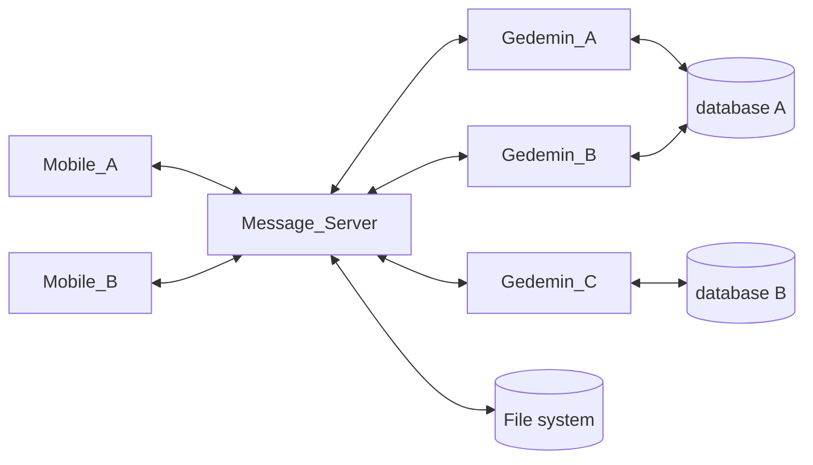
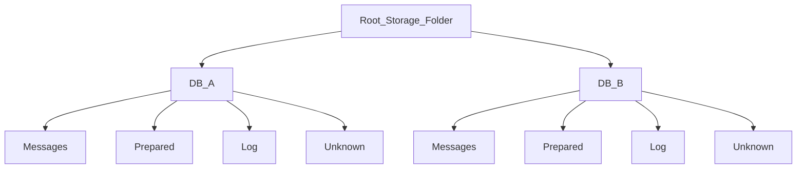
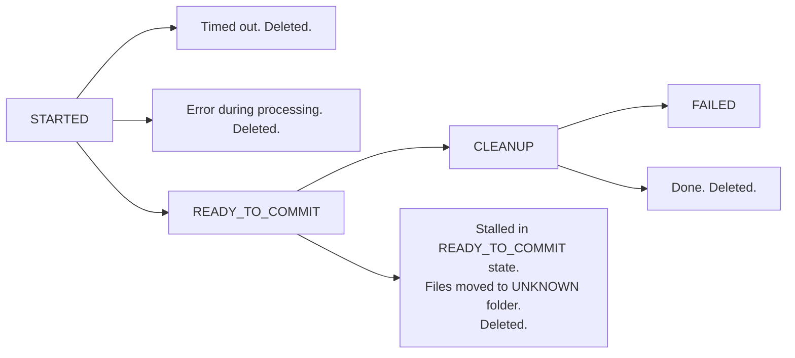

Обобщенная схема взаимодействия компонентов системы выглядит следующим образом:

Мы рассматриваем процесс, при котором:

1. Гедымин запрашивает и получает с сервера сообщений список файлов для обработки.
2. Производит обработку полученных файлов, в том числе изменяет информацию в базе данных, и формирует один или несколько файлов в ответ.
3. Передает файлы серверу сообщений для размещения в очереди. После успешного выполнения, исходные файлы должны быть перемещены в специальную папку `LOG`.

Процесс должен быть устойчив к любым техническим неполадкам на сервере сообщений, Гедымине или в сети: обрыву соединения, невозможности записать данные на диск, зависанию, принудительному завершению, остановке на точке останова и т.п.

Вышеуказанные неполадки не должны привести к:

1. Потере данных.
2. Повторной обработке одних и тех же файлов.
3. Переходу системы в unresponsive состояние, когда для дальнейшей работы потребуется вмешательство оператора, перезагрузка и т.п.

При обработке файлов Гедымином возможны две проблемы:

1. Повторная обработка одних и тех же данных. `Gedemin_A` начал обработку файлов, в это время запустился `Gedemin_B` и тоже начал обработку этих же файлов тем же макросом/автозадачей. 
2. Ошибка при совместном доступе к объектам базы данных при одновременной обработке _разных_ файлов, двумя или более копиями Гедымина, подключенными к одной и той же базе данных.

### Prerequisites

1. Каждый Гедымин является полноценным клиентом системы и имеет свой уникальный идентификатор, который используется при сетевом обмене с сервером сообщений.
2. У каждой базы данных Гедымина есть свой уникальный ИД, который хранится в самой базе данных и используется при обмене с сервером сообщений. ИД базы должен формироваться таким образом, чтобы быть валидным именем файла или его частью.

> Стандартный `DBID` Гедымина не подходит в качестве ИД базы, так как он меняется при восстановлении базы данных из архива. Для хранения ИД базы можно использовать константу, параметр в глобальном хранилище, поле в специальной таблице с настройками подсистемы.

3. На сервере сообщений каждое сообщение или группа сообщений записываются в отдельный файл в имени которого указываются идентификаторы от кого и кому направляется сообщение. 
4. Если в файле записано несколько сообщений, то они обрабатываются как единое целое. Т.е. если при обработке хотя бы одного из них возникнет ошибка, то никакая информация из этого файла не попадет в базу данных.
5. Расположение файлов на диске:

В корневой папке создается по вложенной папке для каждой базы данных. Имя папки совпадает с ИД базы данных. Внутри папки базы данных создаются папки:

* Messages -- очередь сообщений, адресованных этой базе данных. 
>Как определяется очередность сообщений для обработки, если она важна?
* Log -- после завершения обработки сюда переносятся файлы сообщений. В папке лога сообщения хранятся ограниченное время, например, 3 месяца. Очистка происходит при запуске сервера сообщений.
* Prepared -- здесь размещаются подготовленные файлы, присланные из Гедымина, до того, как будет получено подтверждение, что прошел комит в базу данных. После этого файлы переносятся в папку Messages.

### Список процессов

1. Список объектов процессов находится в оперативной памяти сервера сообщений.
2. При каждом изменении списка его копия записывается на жесткий диск. Запись в файл со списком процессов асинхронная.
3. При старте сервера сообщений список процессов считывается из дискового файла и производится обработка процессов, находящихся в промежуточном состоянии (см. ниже).
5. Ошибки записи в файл списка процессов обрабатываются и не должны приводить к остановке сервера. Сообщение об ошибке помещается в лог.

### Обработка сообщений

Рассмотрим пошагово процесс обработки сообщений Гедымином. Там, где речь идет об обращении к серверу сообщений по протоколу HTTP/HTTPS мы указываем условное наименование URL end-point:

1. Гедымин посылает на сервер сообщений запрос на начало процесса обработки сообщений. В запросе передается ИД адресата и ИД базы данных. `API_1`. 
2. Сервер проверяет список процессов и находит в нем записи для заданного адресата ИЛИ для заданного ИД базы данных.
3. Если записей нет, то процесс можно начинать:
    1. Присваивается уникальный ИД процессу.
    2. Создается объект процесса, который включает: 
        1. ИД процесса
        2. ИД адресата
        3. ИД базы данных
        4. Дату и время начала процесса
        5. Список файлов, которые будут переданы Гедымину
        6. Список файлов принятых от Гедымина (изначально пустой)
        7. Дату и время перевода процесса в состояние `READY_TO_COMMIT` (изначально не определено)
        7. состояние -- `STARTED`
    3. Объект помещается в список процессов.
    4. Гедымину возвращается объект процесса.
4. Гедымин фиксирует у себя ИД процесса и проверяется полученный список. Если некоторые файлы не могут быть обработаны, то Гедымин вызывает `API_2`, с которым передает список файлов которые он будет обрабатывать. Сервер сообщений получив список отражает его в объекте процесса и возвращает подтверждение `OK`. Только получив подтверждение Гедымин приступает к обработке. Ошибка сети, отсутствие подтверждения приводит к полному прекращению процесса на стороне Гедымине. Все переданные файлы обрабатываются как единое целое. Даже единственная ошибка приводит к отмене всей обработки. Если Гедымин готов обработать ВСЕ переданные файлы, то никакого дополнительного обращения к серверу сообщений не требуется.
5. Если уже существует активный процесс для переданного ИД адресата ИЛИ ИД базы данных, то возвращается ответ `BUSY`. Получив данный статус, Гедымин завершает алгоритм обработки, при необходимости информируя пользователя. Через некоторое время попытка может быть повторена начиная с шага 1. Аналогично, процесс завершается и при отсутствии ответа с сервера сообщений (тайм-аут HTTP протокола), и при возникновении сетевых ошибок.
6. Гедымин стартует транзакцию и приступает к обработке файлов. Все изменения в базе данных должны выполняться на этой транзакции.
7. Периодически, сервер сообщений проверяет список процессов и те из них, которые находятся в состоянии `STARTED` и превысили заданный тайм-аут удаляются, о чем делается запись в логе.
7. Периодически, сервер сообщений проверяет список процессов и те из них, которые находятся в состоянии `READY_TO_COMMIT` дольше чем заданный промежуток времени, обрабатываются так как описано ниже в разделе посвященном старту сервера сообщений.
8. Закончив успешно обработку всех файлов, перед комитом транзакции, Гедымин формирует файлы в ответ и выполняет запрос к серверу сообщений с указанием ИД процесса и всеми данными файлов. `API_3`.
9. Сервер сообщений в ответ на запрос к `API_3` ищет процесс в списке процессов и проверяет его статус. Если в списке нет процесса с переданным ИД или его состояние не `STARTED`, то возвращается статус `CANCELLED`. Если процесс есть в списке в состоянии `STARTED`, то ему присваивается состояние `READY_TO_COMMIT`. Полученные файлы записываются синхронно в папку `PREPARED`. После успешной записи файлов их имена фиксируются в объекте процесса, а сервер возвращает состояние `OK`.
10. Получив ответ `CANCELLED` или не получив ответа (тайм-аут), или если произошла сетевая ошибка, Гедымин откатывает транзакцию, на которой произошли изменения в базе данных. На этом процесс завершается на стороне Гедымина и может быть повторен, начиная с шага 1.
11. Получив ответ `OK` Гедымин производит комит транзакции и в случае успеха сообщает об этом серверу сообщений `API_4`. В случае, если при комите транзакции произошла ошибка, Гедымин сообщает об этом серверу сообщений `API_5`. Вместе с вызовом `API_5` передается сообщение об ошибке, которое может быть помещено в лог системы или передано исходному отправителю для отображения пользователю. В обоих случаях на этом процесс завершается на стороне Гедымина.
12. Получив подтверждение успешного комита в базу данных сервер сообщений переводит процесс в состояние `CLEANUP` и приступает к переносу обработанных файлов в папку `LOG`, а полученных в -- `MESSAGES`. По успешному переносу процесс удаляется из списка процессов. Если файлы не удается переместить -- об этом делается запись в логе сервера сообщений. Процесс остается в списке. Его статус меняется на `FAILED`. Такая ситуация требует вмешательства системного администратора. 
> Важно! После перемещения _каждого_ файла делаются соответствующие изменения в списке файлов в объекте процесса.
13. Получив сообщение о неуспешном комите в базу данных сервер сообщений удаляет процесс из списка процессов и делает соответствующую запись в логе. Файлы этого процесса, ранее записанные в папку `PREPARED`, удаляются.
14. Если в процессе обработки файлов в Гедымине происходит ошибка, то Гедымин сигнализирует серверу сообщений вызовом `API_6` с передачей сообщения об ошибке, которое может быть помещено в лог системы или передано исходному отправителю для отображения пользователю. Сервер сообщений в ответ на `API_6` удаляет объект процесса из списка. Процесс на стороне Гедымина завершается. Транзакция откатывается.

### Обработка списка процессов при старте сервера

При старте сервера загружаем список процессов с диска. Наличие там записей означает, что произошли какие-то ошибки в процессе работы сервера или процесс был принудительно завершен. Список обрабатывется следующим образом:

1. Записи в состоянии `CLEANUP` удаляются из списка, а перечисленные в них файлы перемещаются в папки `LOG` и `MESSAGES` соответственно.
2. Записи в состоянии `READY_TO_COMMIT` говорят нам о том, что мы не знаем точно прошел ли комит на базе данных. О таких записях надо обязательно информировать системного администратора, а перечисленные в них файлы (как файлы из папки `MESSAGES`, так и файлы из папки `PREPARED`) должны быть перемещены в папку `UNKNOWN`, но не удалены с диска. Такая ситуация требует вмешательства системного администратора. Сама запись процесса удаляется из списка.
3. Проводится проверка на тайм-аут записей в состоянии `STARTED`. Устаревшие записи удаляются.

### Информирование системного администратора

В ситуации, когда процесс остается в состоянии `READY_TO_COMMIT` или `FAILED` системного администратора следует проинформировать как можно быстрее. Для этого необходимо реализовать механизм рассылки email или sms на адрес системнго администратора.

### Диаграма состояний процесса

### Особое напоминание

Не забываем, что функция, предусматривающее _атомарное_ выполнение операций (в т.ч. включающее операции ввода-вывода) не должна содержать внутри _await_ вызовов. Хотя сама по себе может быть и _async_ функцией.
