# Инструкция по системе web-admin

Система web-admin разработана для администрирования пользователей мобильных решений компании **Golden Software of Belarus, Ltd.**

Первоначально для работы в системе web-admin необходимо создать **Суперадминистратора**. Эта учетная запись, которая имеет более высокие административные привилегии: создание/просмотр/редактирование/удаление всех пользователей, компаний и устройств.

Для управления пользователями определенной компании необходимо создать учетную запись для администратора. **Администратор** – пользователь, у которого есть полный доступ только к своей компании. Он может создать только одну компанию и выполнять все действия с пользователями и устройствами данной компании.

## 1. Регистрация пользователя

При первом подключении необходимо пройти регистрацию. Для этого необходимо нажать на **Зарегистрироваться**​.

По нажатию переходим на страницу регистрации.

Для регистрации необходимо заполнить поля **Учетная запись** и **Пароль**, **Повторите Пароль** и нажать на кнопку **Зарегистрироваться**. Поле **Email** является необязательным, его можно будет заполнить при редактировании пользователя.

​

Так как это первая регистрация, то пользователь автоматически становится суперадминистратором.

Далее регистрируем администратора компании.

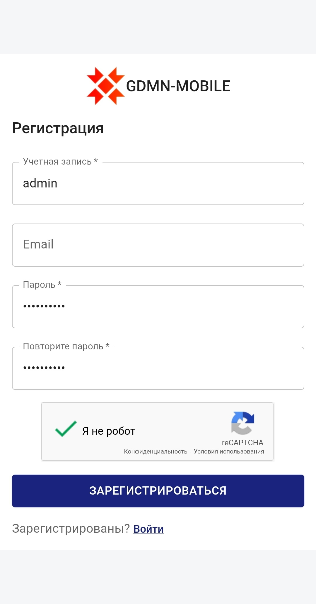​

## 2. Вход в учетную запись

Для входа в систему администрирования вводим имя пользователя и пароль администратора.

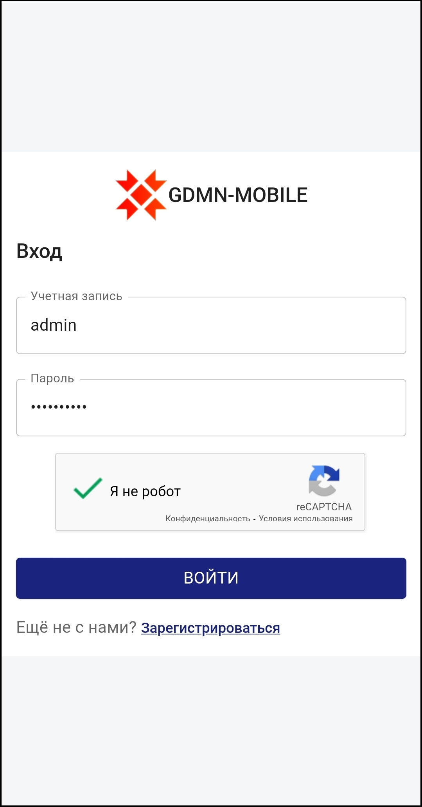​

После нажатия на кнопку **Войти** попадаем на главную страницу.

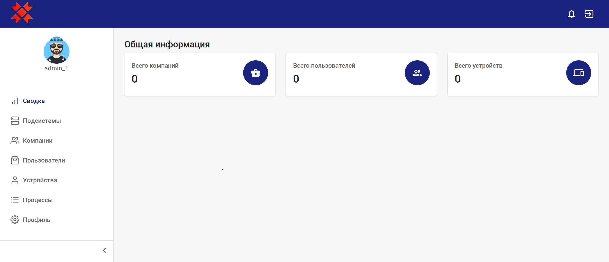​

В центральной части страницы представлена информация о количестве компаний, пользователей и устройств.

​

### 2.1. Панель навигации

В верхней части страницы расположена панель навигации.

​

В левом углу расположен логотип​, по нажатию на который можно вернуться на главную страницу из любого другого.
В правом углу расположены две кнопки. По нажатию на первую кнопку можно посмотреть оповещения. Нажатие на вторую кнопку обеспечивает выход из учетной записи пользователя и возвращение на страницу входа в учетную запись.

### 2.2. Боковая панель

В левой части страницы расположена боковая панель.

​

По нажатию на иконку < можно скрыть боковую панель. Для ее открытия необходимо нажать на иконку >.

При уменьшении окна браузера боковая панель автоматически скрывается. Открыть ее можно по кнопке , которая автоматически появится на панели навигации.

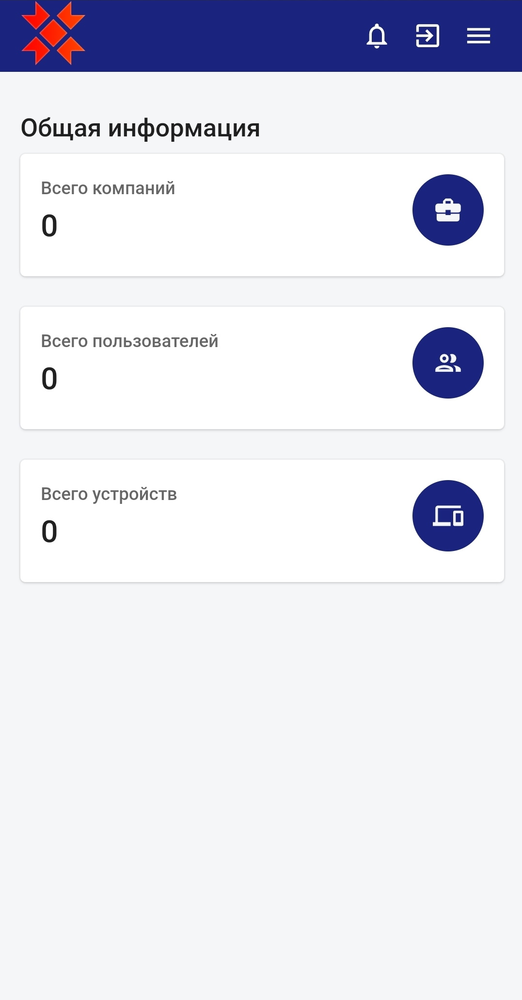

Каждый пункт данной панели ведет в одно из окон:

| Страница     | Описание                                                                                                                                                                           |
| ------------ | ---------------------------------------------------------------------------------------------------------------------------------------------------------------------------------- |
| Сводка       | является главной страницей и содержит краткую информацию                                                                                                                           |
| Подсистемы     | содержит информацию о подсистемах ...                     |
| Компании     | содержит информацию о текущей компании (если вход был произведен администратором) или обо всех компаниях (если вход был произведен суперадминистратором)                           |
| Пользователи | содержит информацию о пользователях текущей компании (если вход был произведен администратором) или о пользователях всех компаниях (если вход был произведен суперадминистратором) |
| Устройства   | содержит информацию об устройствах текущей компании (если вход был произведен администратором) или об устройствах всех компаниях (если вход был произведен суперадминистратором)   |
| Процессы     | содержит информацию о текущих процессах ...                     |
| Профиль      | содержит информацию о пользователе данной учетной записи                                                                                                                           |

## 3. Компании

Рассмотрим подробно каждый пункт бокового меню. Начнем с пункта **Компании**.

В первую очередь администратору необходимо создать компанию, в которую будут входить пользователи мобильных устройств.

Так как компания еще не добавлена, таблица является пустой.

В правом верхнем углу расположены две кнопки, предназначенные для добавления и обновления информации.

В зависимости от размера окна кнопки могут менять вид. При уменьшении окна браузера до среднего сразмера кнопки принимают вид иконок без текста.

При уменьшении окна браузера до маленького размера кнопки исчезают полностью, на их месте появляется иконка меню **⋮**. При нажатии на нее появляются обе кнопки.

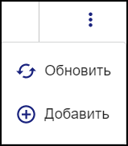

### 3.1. Добавление компании

Нажмем на кнопку **Добавить** для добавления компании.

Поле **Наименование компании** является обязательным для заполнения.

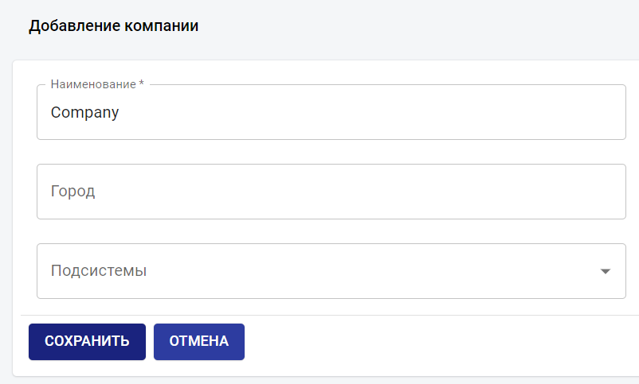

При нажатии на кнопку **Сохранить** данные сохраняются, и компания отображается в таблице.

При нажатии на кнопку **Отмена** происходит возврат на предыдущую страницу без сохранения данных.

После сохранения попадаем на страницу со списком компаний.

Теперь в таблице отображаются данные по компании Company – **Наименование**, **Администратор**, **Дата создания** и **Дата редактирования**.

При повторной попытке создания компании в левом нижнем углу отобразится сообщение об ошибке, так как у администратора может быть только одна компания.

В таблицах предусмотрена сортировка. Подробно она будет рассмотрена на странице **Пользователи**.

Также можно выбрать, сколько строк будет отображено в таблице на странице.

По умолчанию отображается 10 строк.

### 3.2. Просмотр информации о выбранной компании

Перейдем на страницу просмотра данных по компании, щелкнув мышью по наименованию компании.

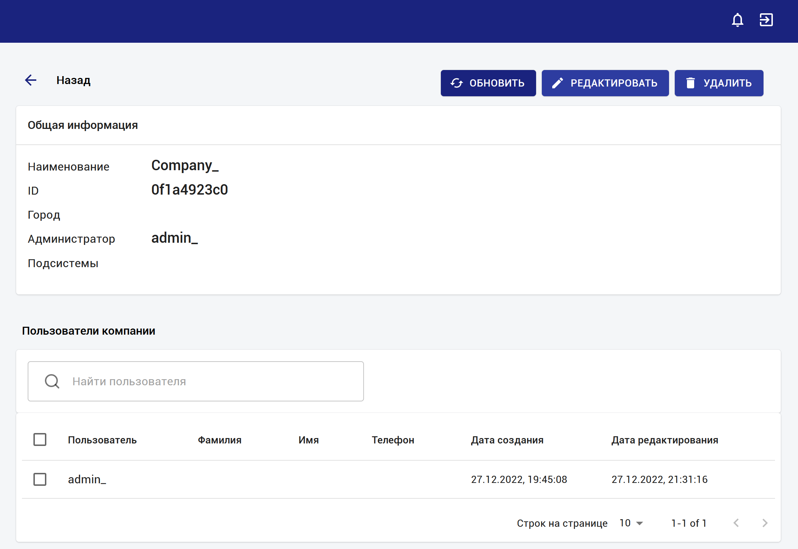

На странице представлена Общая информация о компании, а также информация о пользователях данной компании.

В левом верхнем углу расположена кнопка **←​ Назад**​ для возвращения на предыдущую страницу. Возвращение происходит при нажатии на стрелку.

В правом верхнем углу расположены три кнопки, предназначенные для обновления, редактирования и удаления информации.

### 3.3. Редактирование компании

Для изменения данных компании нажмем на кнопку **Редактировать**.

Так как при добавлении компании мы не указывали город, то поле **Город** является пустым.

Добавим город и сохраним.

Новые данные уже отображены в **Общей информации**.

На странице **Компании** также можно просмотреть всех пользователей данной компании.

На данный момент существует только один пользователь – администратор. При нажатии на имя пользователя попадем на страницу просмотра информации по выбранному пользователю. Данная страница будет подробно рассмотрено при работе с пользователями. Вернуться на страницу компании можно, нажав на стрелку **←​Назад** в левом верхнем углу.

В таблице также предусмотрена сортировка.

### 3.4. Удаление компании

При удалении компании удаляются также все устройства и пользователи компании, кроме администратора.
При нажатии на кнопку **Удалить** появится диалоговое окно с подтверждением удаления.

При нажатии на кнопку **Удалить** в данном диалоговом окне компания, а также все ее пользователи и устройства будут удалены.

## 4. Пользователи

Рассмотрим пункт меню **Пользователи**.

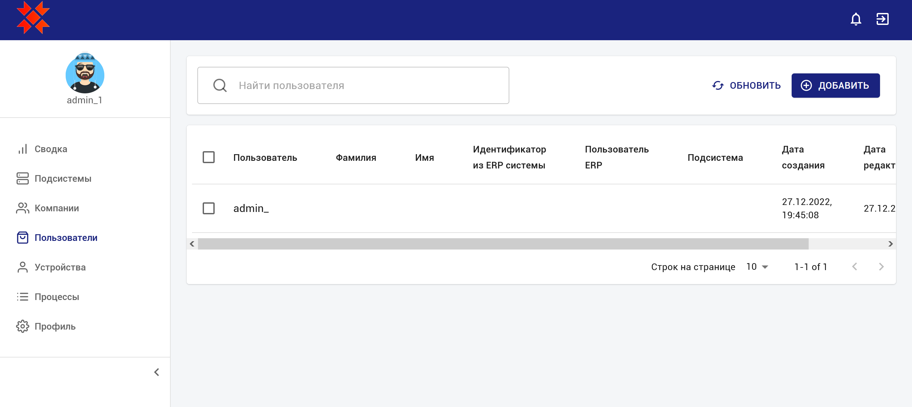

Теперь администратору необходимо создать пользователя.

Существует два типа пользователей: обычный пользователь и пользователь ERP. 

Пользователь ERP создается для каждой подсистемы компании.

<!-- , к которому будет привязано мобильное устройство. -->

 Число обычных пользователей не ограничено.

### 4.1. Добавление пользователя

Перейдем к добавлению пользователя по нажатию на кнопку **Добавить**.

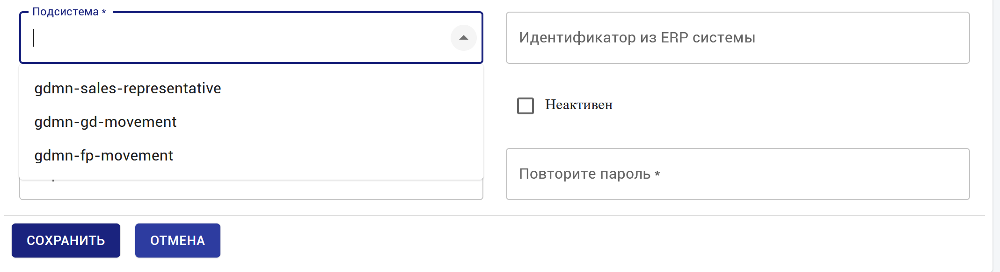

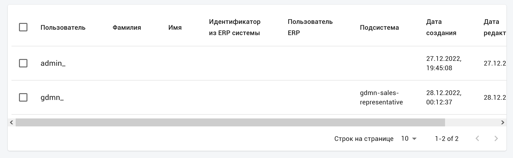

Поля **Пользователь**, **Пароль** и **Повторите Пароль**  и **Пользователь ERP** являются обязательными для заполнения, поля **Имя**, **Фамилия**, **Телефон**, **Email** необязательны.

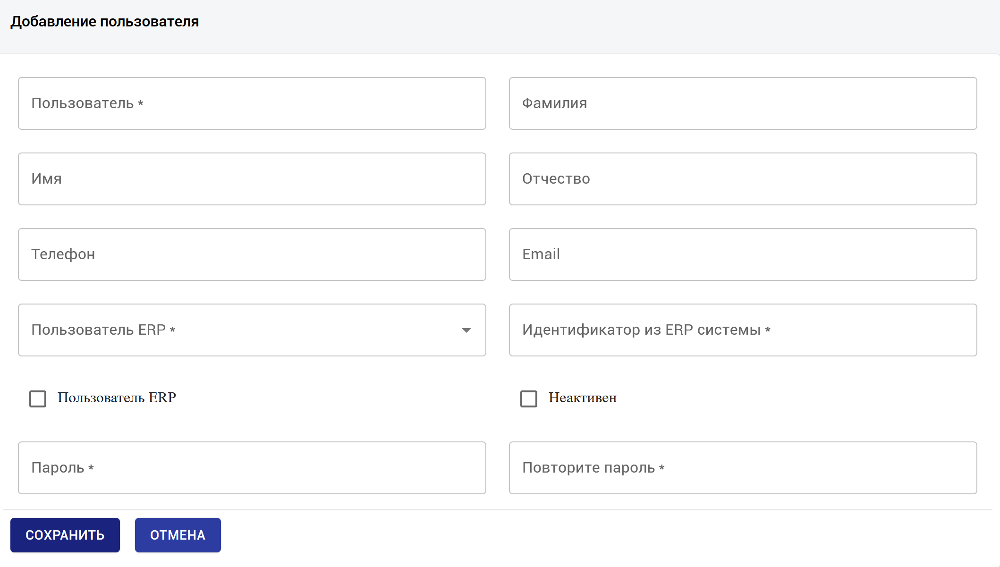

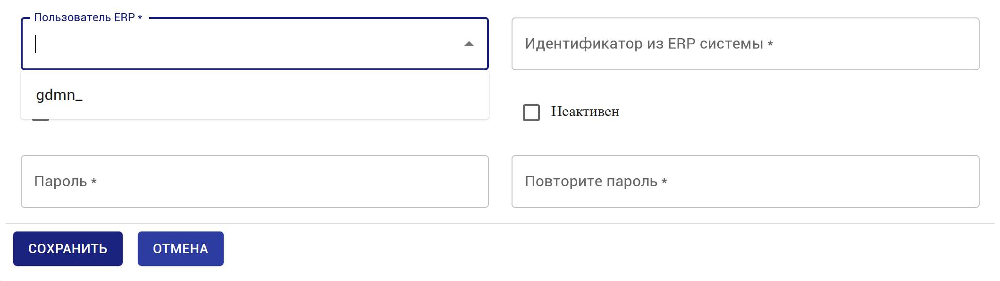

Заполним поля и сохраним.

Новый пользователь отобразиться в таблице.

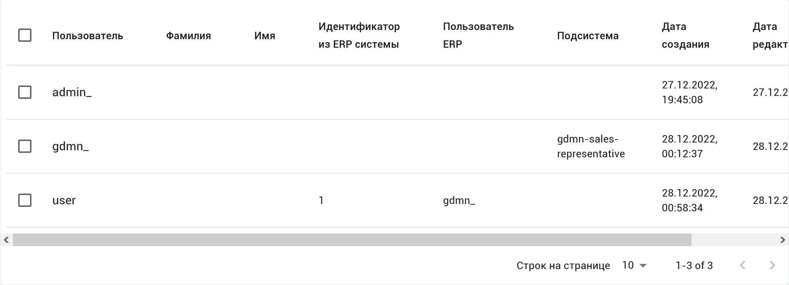

### 4.2. Просмотр информации о пользователе

Перейдем на страницу просмотра информации о пользователе. Для этого нажмем на имя пользователя.

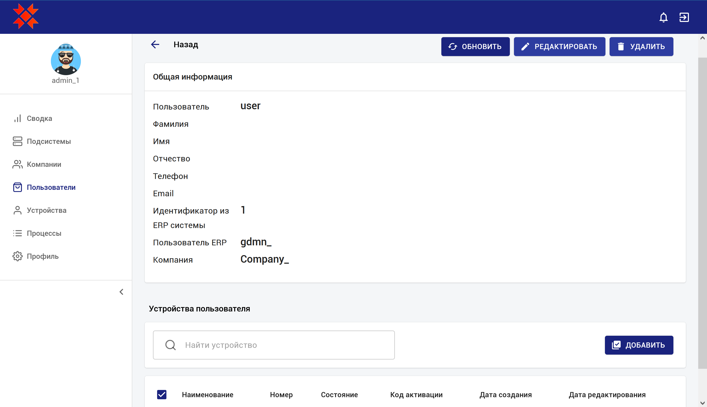

Верхняя панель такая же, как и на странице просмотра компаний.

На странице представлена Общая информация о пользователе, а также информация о привязанных устройствах. Так как в данный момент привязанных устройств не существует, то таблица **Устройства пользователя** пуста.

### 4.3. Редактирование информации

Зайдем на страницу редактирования пользователя.

Для смены пароля необходимо нажать на кнопку **Сменить пароль**. По нажатию появляется поле для ввода пароля. Так как оно является обязательным, то нужно либо ввести новый пароль, либо нажать кнопку **Отмена** и вернуться на страницу просмотра информации о пользователе.

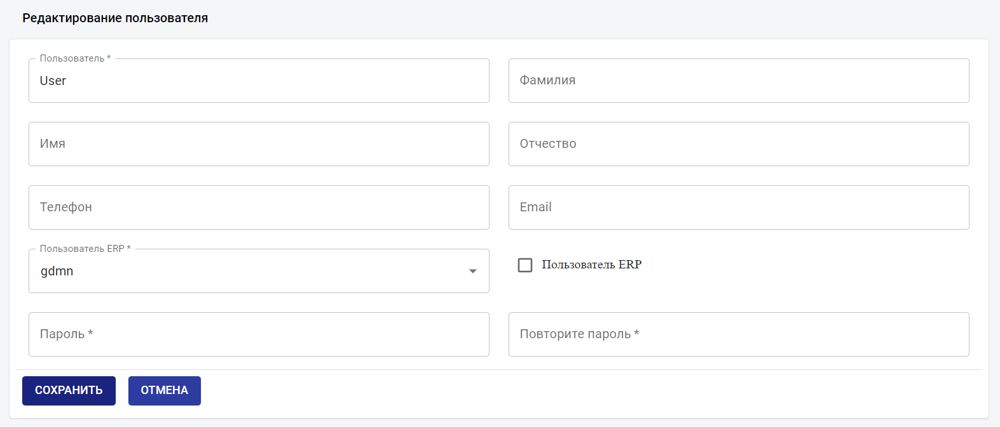

Заполним поля **Имя** и **Фамилия** нажмем **Сохранить**.

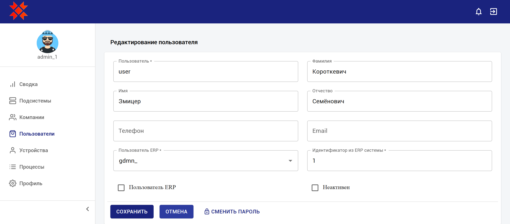

Новые изменения отображены в Общей информации.

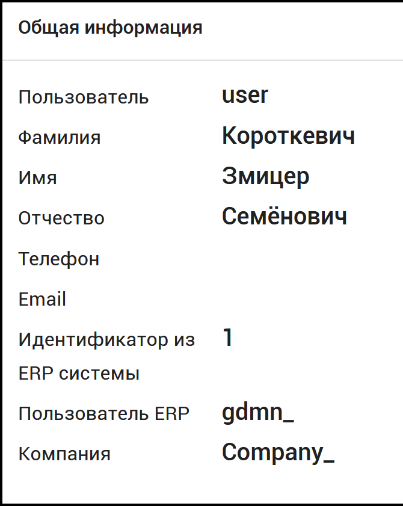

Вернемся на страницу **Пользователи**.

### 4.4. Удаление пользователя

Зайдем снова в пользователя User. При нажатии на кнопку **Удалить** появится диалоговое окно с подтверждением удаления.

При нажатии на кнопку **Удалить** пользователь и привязанные к нему устройства будут удалены.

У администратора нет возможности удалить свою собственную учетную запись, правом на ее удаление обладает Суперадминистратор.

### 4.5. Поиск по пользователям

Рассмотрим поиск по пользователям.

В поле поиска введем текст и нажмем клавишу Enter. В таблице отобразятся записи, если хоть в каком-нибудь из полей найдется совпадение по искомому тексту:

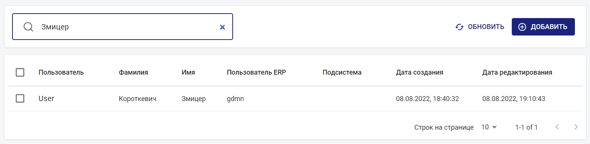

Для очищения поля необходимо нажать на крестик либо клавишу Backspace и подтвердить нажатием клавиши Enter.

### 4.6. Сортировка в таблице

Рассмотрим сортировку в таблицах. По умолчанию производится сортировка по дате добавления – новый пользователь отправляется в конец списка.

Чтобы отсортировать в необходимом порядке, нужно нажать на название колонки, по которой будет происходит сортировка.

Произведем сортировку по колонке **Пользователь**.

При сортировке в алфавитном порядке (по возрастанию) в выбранной колонке появляется ↑, в обратном алфавитном порядке (по убыванию) – ↓.

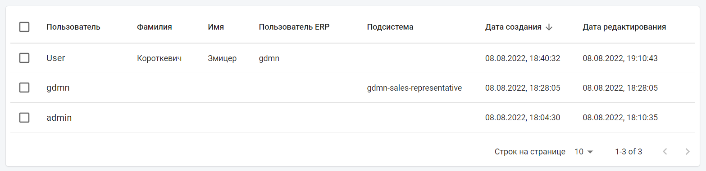

## 5. Устройства

Переходим в пункт меню Устройства.

Теперь администратору необходимо создать мобильное устройство, которое далее будет привязано к пользователю. Число устройств не ограничено.

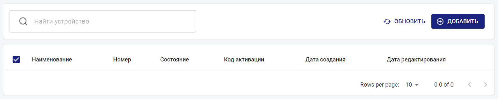

### 5.1. Добавление устройства

Создадим устройство.

Поля **Наименование устройства** и **Статус** являются обязательными для заполнения. Поля **Код активации** и **Номер** будут заполнятся далее.

**Статус** может быть выбран один из четырех предложенных.

<!-- - «Не зарегистрировано» – статус, который устройство получает при создании.

- «Не активно» – статус, который устройство получает после создания кода активации.

- «Активно» – статус, который устройство получает после активации кода в мобильном приложении.

- «Заблокировано» – статус, который используется администратором для блокировки устройства. -->

| Статус              | Описание                                                                      |
| ------------------- | ----------------------------------------------------------------------------- |
| Не зарегистрировано | Устройство получает данный статус при создании                                |
| Не активно          | Устройство получает данный статус после создания кода активации               |
| Активно             | Устройство получает данный статус после активации кода в мобильном приложении |
| Заблокировано       | Администратор использует данный статус для блокировки устройства              |

Добавим устройство, предназначенное для пользователя ERP.

Новое устройство отобразилось в таблице.

Теперь добавим устройство для пользователя0.

Новое устройство отобразилось в таблице.

### 5.2. Просмотр и редактирование информации об устройстве

На странице просмотра устройства представлена Общая информация об устройстве, а также информация о пользователях, к которым привязано данное устройство.

На странице редактирования устройства можно изменить наименование устройства и его статус.

### 5.3. Удаление устройства

При нажатии на кнопку **Удалить** появится диалоговое окно с подтверждением удаления.

При нажатии на кнопку **Удалить** в данном диалоговом окне устройство и связь данного устройства с пользователями (будет рассмотрено ниже) будут удалены.

### 5.4. Привязанное устройство

#### 5.4.1. Создание привязанного устройства

Создадим привязанные устройства к пользователям.

Для этого вернемся в раздел Пользователи и зайдем на страницу просмотра пользователя gdmn. В **Устройствах пользователя** нажмем на кнопку **Добавить**.

Поле **Пользователь** заполняется автоматически, его изменить нельзя. В поле **Устройство** выберем нужное.

По умолчанию статус устройства - **Не зарегистрировано**.

Нажимаем на сохранить.

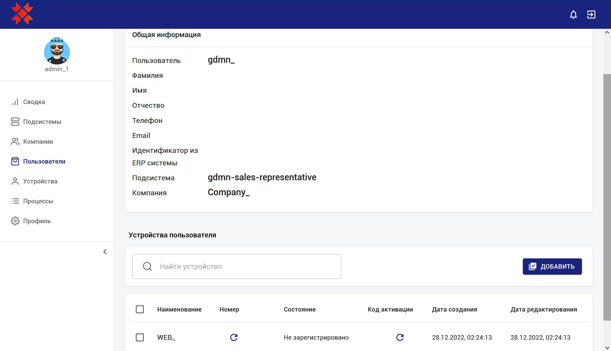

Таким образом создается привязанное устройство.

Теперь создадим устройство для пользователя User. 

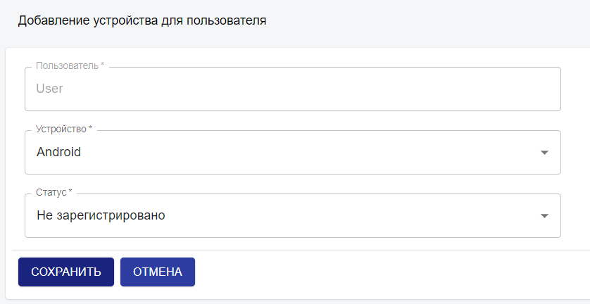

Нажимаем на сохранить.

В данной таблице сортировка возможна по всем полям.

#### 5.4.2. Просмотр привязанного устройства

Зайдем на страницу просмотра данного устройства.

На данной странице отображена общая информация по привязанному устройству.

#### 5.4.3. Редактирование привязанного устройства

Если устройство активируют в мобильном приложении, то статус изменится на **Активно**. Статус можно изменить на **Заблокировано**, в этом случае оно становится заблокированным для привязанного пользователя, и пользователь не имеет доступ к устройству до тех пор, пока не сменится статус.

Зайдем на страницу **Устройства** и выберем устройство Android. В таблице **Пользователи устройства** появился пользователь данного устройства User.

#### 5.4.4. Удаление привязанного устройства

Вернемся на страницу **Пользователи** и зайдем в пользователя User и в его привязанное устройство Android. При нажатии на кнопку **Удалить** появится диалоговое окно с подтверждением удаления.

При нажатии на кнопку **Удалить** в данном диалоговом окне привязанное устройство будет удалено.

#### 5.5. Код активации

Для регистрации мобильного устройства пользователя Администратору необходимо сгенерировать код активации.
Чтобы создать его перейдем на страницу **Устройства**. В таблице в колонке **Код активации** нажмем на иконку **⟳**.

При нажатия генерируется код, а состояние автоматически поменяется с **Не зарегистрировано** на **Не активно**.

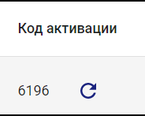

Уникальный номер присваивается устройству во время активации кода в мобильном приложении.

Также есть возможность сгенерировать уникальный номер вручную из web-admin для тестового режима.

Для устройства пользователя нужен код активации (который далее при активации устройства сгенерирует номер), для устройства пользователя ERP нужен номер.

Для создания нажмем на иконку **⟳** в колонке номер.

После нажатия состояние автоматически меняется с **Не активно** на **Активно**.

Номер также отображается в общей информации.

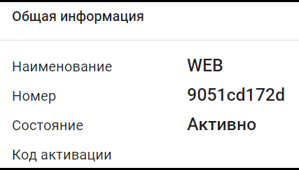

При получении нового кода состояние снова меняется на **Не активно**.

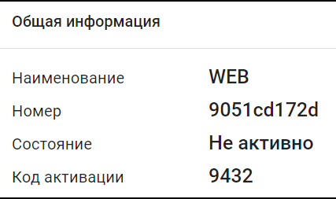

Все данные отображаются в таблице.

## 6. Процессы

Теперь рассмотрим пункт **Процессы**.

<!--  -->

Данная страница содержит информацию по текущим процессам. 

<!-- Здесь можно просмотреть и отредактировать данные Администратора. -->

| Процесс     | Описание                                                                                                                                                                           |
| ------------ | ---------------------------------------------------------------------------------------------------------------------------------------------------------------------------------- |
| STARTED       | ...        |
| READY_TO_COMMIT     |  Записи в состоянии `READY_TO_COMMIT` говорят нам о том, что мы не знаем точно прошел ли комит на базе данных.                 |
| CANCEL | ... |
| CLEANUP     | Записи в состоянии `CLEANUP` удаляются из списка, а перечисленные в них файлы перемещаются в папки `LOG`, `MESSAGES` и `ERROR` соответственно.                    |
| FAILED     | ...                     |

Процесс в определенной подсистеме компании может быть только один. При существующем процессе новый процесс по данной подсистеме не будет запущен. 
 В конфиге указывается период проверки процессов в минутах.

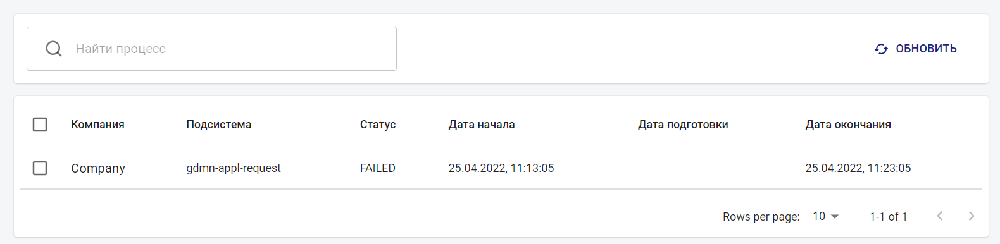

### 6.1. Удаление процесса

Зайдем в текущий процесс. При нажатии на кнопку **Удалить** появится диалоговое окно с подтверждением удаления.

При нажатии на кнопку **Удалить** в данном диалоговом окне процесс будет удален.

## 7. Профиль

Теперь рассмотрим последний пункт – Профиль.

Данная страница содержит информацию по текущей учетной записи. Здесь можно просмотреть и отредактировать данные Администратора.
